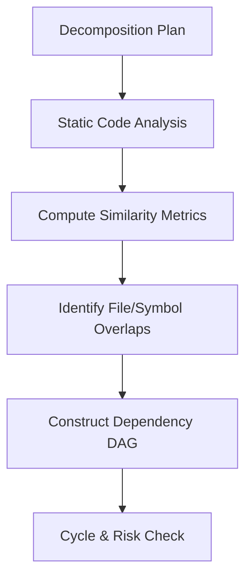
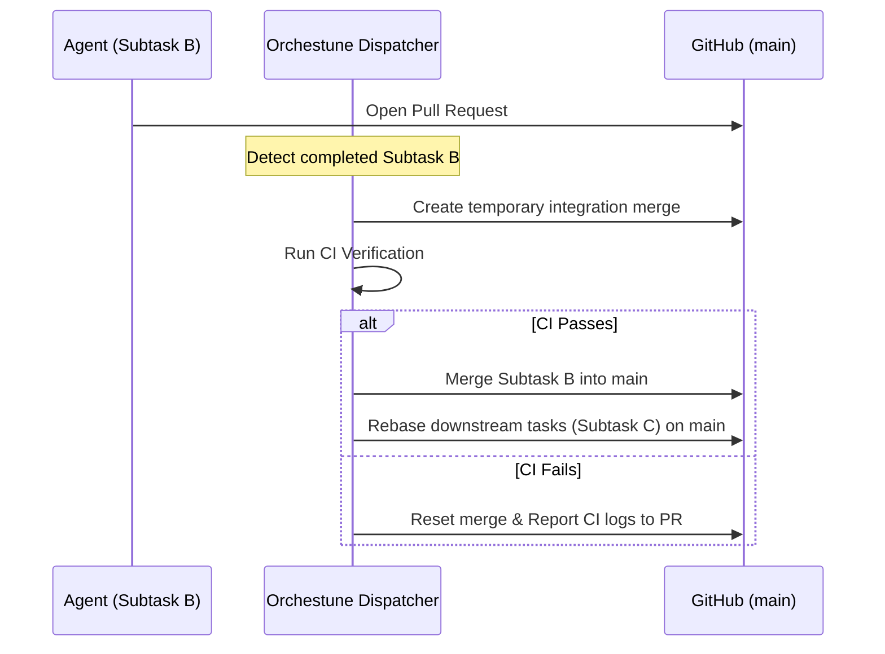

# Architecture & Design

This document explains how Orchestune builds conflict-free parallel tasks, drives agents autonomously, and integrates their changes safely.

---

## 1. DAG Construction & Conflict Prevention

Orchestune analyzes subtask relationships statically using both explicit dependency declarations (`depends_on`) and overlap in target file paths (`footprint`) or code symbols (`symbols`).



### Conflict Prevention Mechanism
* **Overlap Analysis**:
  When multiple tasks attempt to edit the same files or symbols, merge conflicts are inevitable. Orchestune computes similarity metrics across footprints and automatically inserts "implicit dependencies" to sequence conflicting tasks safely.
* **Safe Parallelization**:
  Only completely independent subtasks are allowed to run concurrently. This topological sorting ensures that parallel branches are mergeable with minimal conflict.

---

## 2. Self-healing State Recovery

Orchestune's dispatcher is designed to run in **stateless CI environments (such as GitHub Actions)** where local workspaces are destroyed at the end of each run.

Typically, orchestrator states are tracked in a local state file like `run_state.json`. If this file is lost, Orchestune reconstructs the state using the following **self-healing** flow:

```text
[Dispatcher Start]
       │
       ▼
[Read GitHub Issues & PRs]
       │
       ├─► status:in-progress Issues -> Treated as running
       ├─► status:blocked / status:queued -> Re-evaluated
       └─► Open PR branches -> Progress state reconstructed
       │
       ▼
[Reconstruct DAG State & Resume]
```

* **GitHub as the Source of Truth**:
  By fetching active PR branches and GitHub Issue labels (`status:in-progress`, `status:blocked`, `status:queued`), Orchestune rebuilds the DAG state in memory and resumes the cycle seamlessly from where it left off.

---

## 3. Integration & Auto-Rebase

When multiple agents complete their tasks and open PRs, downstream tasks must integrate those updates. Orchestune's integrator coordinates rebases and merges autonomously.



1. **Pre-merge CI Verification**:
   When a subtask PR is detected, the integrator creates a temporary merge branch and runs the local CI.
2. **Auto-Rebase**:
   Once a preceding task merges, the integrator automatically rebases active downstream branches (that depend on it or touch related files) on `main`, ensuring agents work with fresh code.
3. **Semantic Review**:
   During integration, an LLM reviews the combined changes to check for logical inconsistencies (e.g. interface changes not propagated to downstream modules) before finalization.

---

## 4. Human Approval Points

Orchestune is designed so a human makes a decision at exactly two points in the lifecycle — everything between them runs autonomously.

1. **Decomposition Gate**: Before dispatch begins, a human reviews and approves `decomposition_plan.md` (subtask boundaries, footprints, dependencies).
2. **Acceptance Gate**: After all subtasks are integrated into `main`, a human reviews the final result of the "big rock" and accepts it (closes the parent Issue).

Between these two gates, subtask PR merges, CI verification, rebases, and conflict resolution all proceed without per-task human approval. `risk:flagged` labels surface sensitive subtasks for visibility, but are informational only — they do not add a third blocking gate.

**Why two gates are enough**: every subtask's history (Issue, PR, commits, CI logs) is preserved on GitHub, so human review effort doesn't need to happen inline with every merge — it can be scoped up front (decomposition) and reconciled after the fact (acceptance) without losing traceability.

**CI as the de facto quality gate**: the pre-merge CI verification described in Section 3 substitutes for per-task human review — every subtask PR must pass CI before it is merged into `main`, so mechanical correctness is enforced automatically even though no human looks at each individual diff.

This keeps human review effort concentrated where judgment matters most (scoping and final acceptance), while everything mechanical in between is fully automated.
