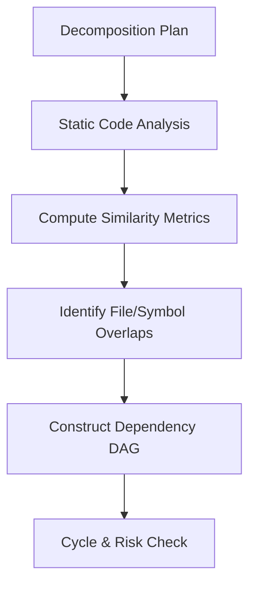
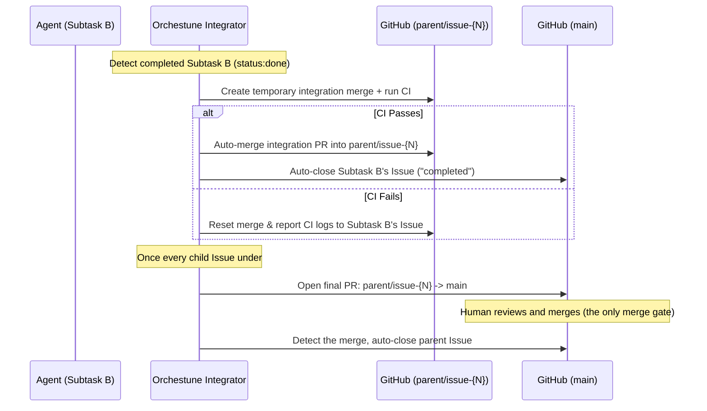

# Architecture & Design

This document explains how Orchestune builds conflict-free parallel tasks, drives agents autonomously, and integrates their changes safely.

---

## 1. DAG Construction & Conflict Prevention

Orchestune analyzes subtask relationships statically using both explicit dependency declarations (`depends_on`) and overlap in target file paths (`footprint`) or code symbols (`symbols`).



### Conflict Prevention Mechanism
* **Overlap Analysis**:
  When multiple tasks attempt to edit the same files or symbols, merge conflicts are inevitable. Orchestune computes similarity metrics across footprints and automatically inserts "implicit dependencies" to sequence conflicting tasks safely.
* **Safe Parallelization**:
  Only completely independent subtasks are allowed to run concurrently. This topological sorting ensures that parallel branches are mergeable with minimal conflict.

---

## 2. Self-healing State Recovery

Orchestune's dispatcher is designed to run in **stateless CI environments (such as GitHub Actions)** where local workspaces are destroyed at the end of each run.

Typically, orchestrator states are tracked in a local state file like `run_state.json`. If this file is lost, Orchestune reconstructs the state using the following **self-healing** flow:

```text
[Dispatcher Start]
       │
       ▼
[Read GitHub Issues & PRs]
       │
       ├─► status:in-progress Issues -> Treated as running
       ├─► status:blocked / status:queued -> Re-evaluated
       └─► Open PR branches -> Progress state reconstructed
       │
       ▼
[Reconstruct DAG State & Resume]
```

* **GitHub as the Source of Truth**:
  By fetching active PR branches and GitHub Issue labels (`status:in-progress`, `status:blocked`, `status:queued`), Orchestune rebuilds the DAG state in memory and resumes the cycle seamlessly from where it left off.

---

## 3. Integration & Auto-Rebase

When multiple agents complete their tasks, downstream tasks must integrate those updates. Orchestune's integrator coordinates this via a **two-tier branch model**, so that human review effort is concentrated on the one merge that actually matters (getting the "big rock" into `main`), while every intermediate child merge runs unattended.



1. **Child branches off the parent branch**: when the dispatcher is run with `--parent-issue <N>`, the parent Issue gets its own long-lived branch (`parent/issue-{N}`, created from `main`), and every child subtask branches off it instead of off `main`.
2. **Pre-merge CI Verification**: when a child Issue reaches `status:done`, the integrator creates a temporary merge branch off `parent/issue-{N}`, merges the child's commits into it, and runs the local CI.
3. **Automatic child merge & close**: once CI passes, the integrator merges that temporary branch's PR into `parent/issue-{N}` **without waiting for a human** and closes the child Issue (`reason: completed`). No per-child review gate exists at this tier — CI is the quality gate (see Section 4).
4. **Final PR, once every child is done**: when all child Issues under a parent are closed, the integrator opens a PR from `parent/issue-{N}` to `main`. This PR is never auto-merged.
5. **Acceptance merge & parent close**: a human reviews and merges that final PR. Once merged, the integrator detects it and closes the parent Issue automatically.
6. **Semantic Review**: alongside each child-level integration, an LLM reviews the combined diff to check for logical inconsistencies (e.g. interface changes not propagated to downstream modules) and leaves comments on the integration PR for the human who will later review the final PR — it never blocks or reverses the automatic child merge.

If the dispatcher is run without `--parent-issue`, Orchestune falls back to the flat, single-tier mode: child branches merge directly toward `main` and, matching the "final merge" semantics above, that merge is always left for a human (the integrator only opens the PR).

---

## 4. Human Approval Points

Orchestune is designed so a human makes a decision at exactly two points in the lifecycle — everything between them runs autonomously.

1. **Decomposition Gate**: Before dispatch begins, a human reviews and approves `decomposition_plan.md` (subtask boundaries, footprints, dependencies).
2. **Acceptance Gate**: The final PR from `parent/issue-{N}` into `main` (see Section 3) is the one merge a human must perform. Once it's merged, Orchestune closes the parent Issue automatically — no separate manual close step is needed.

Between these two gates, child-level integration PRs, CI verification, and the resulting Issue closes all proceed without per-task human approval. `risk:flagged` labels surface sensitive subtasks for visibility, but are informational only — they do not add a third blocking gate.

**Why two gates are enough**: every subtask's history (Issue, PR, commits, CI logs) is preserved on GitHub, so human review effort doesn't need to happen inline with every child merge — it can be scoped up front (decomposition) and reconciled at the very end (the single acceptance merge) without losing traceability.

**CI as the de facto quality gate**: the pre-merge CI verification described in Section 3 substitutes for per-task human review — every child integration PR must pass CI before the integrator merges it into `parent/issue-{N}`, so mechanical correctness is enforced automatically even though no human looks at each individual diff.

This keeps human review effort concentrated where judgment matters most (scoping and the final acceptance merge), while everything mechanical in between — including Issue closing at both tiers — is fully automated.
