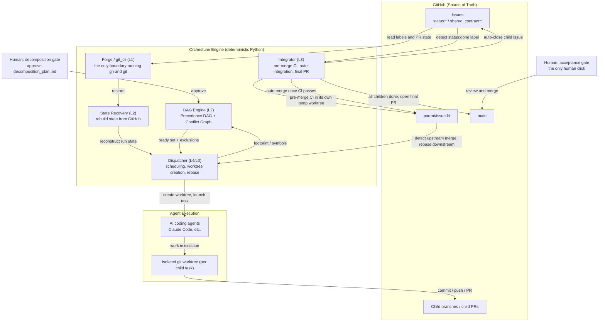
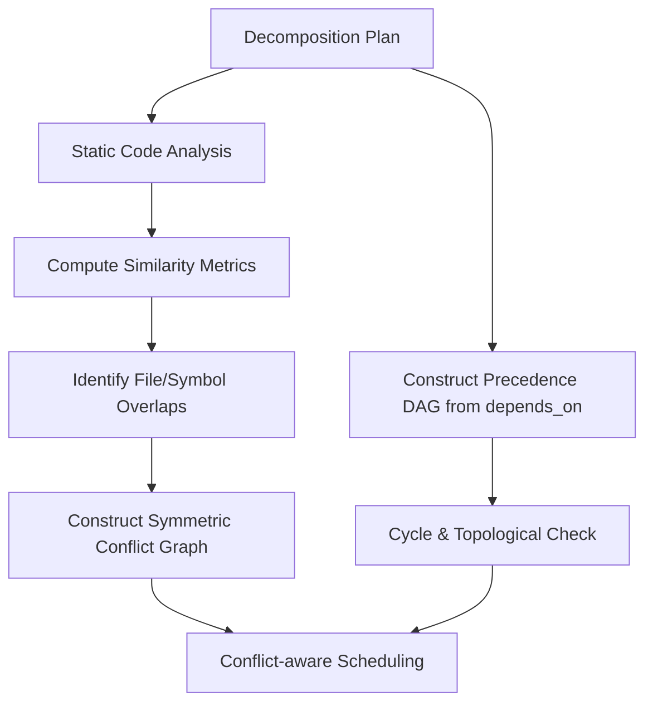
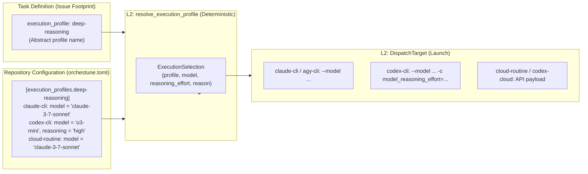
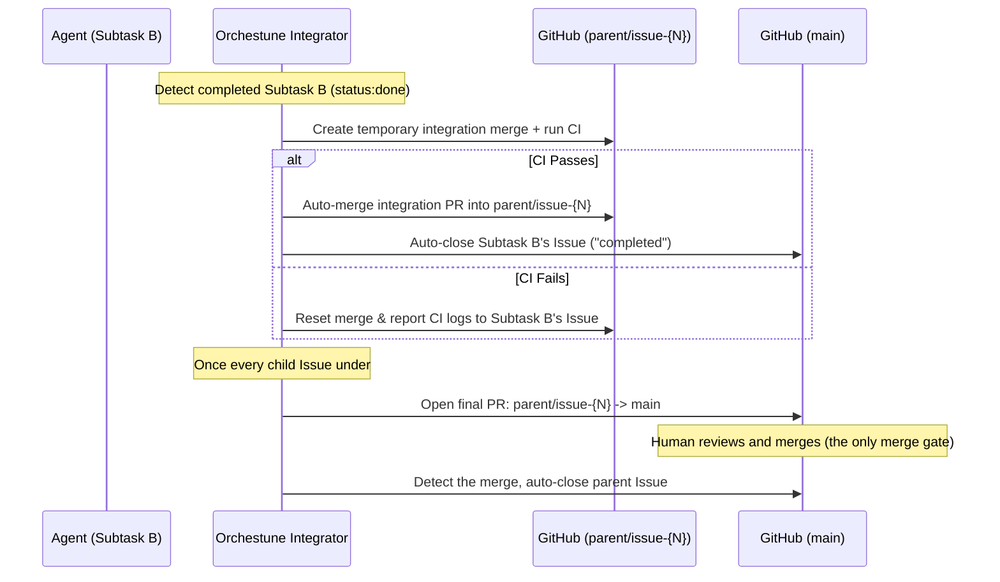

# Architecture & Design

This document explains how Orchestune builds conflict-free parallel tasks, drives agents autonomously, and integrates their changes safely.

---

## System Overview

Orchestune treats GitHub as the single source of truth and puts a deterministic Python control engine in charge of orchestrating LLM implementation agents. A human is involved at exactly two points — the decomposition gate up front and the acceptance gate at the end — and everything in between runs autonomously.


```mermaid
graph TD
    HU1["Human: decomposition gate<br/>approve decomposition_plan.md"]
    HU2["Human: acceptance gate<br/>the only human click"]

    subgraph GH ["GitHub (Source of Truth)"]
        GI["Issues<br/>status:* / shared_contract:*"]
        GP["Child branches / child PRs"]
        PB["parent/issue-N"]
        MB["main"]
    end

    subgraph ENG ["Orchestune Engine (deterministic Python)"]
        L1["Forge / git_cli (L1)<br/>the only boundary running gh and git"]
        REC["State Recovery (L2)<br/>rebuild state from GitHub"]
        DAG["DAG Engine (L2)<br/>Precedence DAG + Conflict Graph"]
        DP["Dispatcher (L4/L3)<br/>scheduling, worktree creation, rebase"]
        IG["Integrator (L3)<br/>pre-merge CI, auto-integration, final PR"]
    end

    subgraph EX ["Agent Execution"]
        WT["Isolated git worktree (per child task)"]
        AG["AI coding agents<br/>Claude Code, etc."]
    end

    HU1 -->|approve| DAG
    GI -->|read labels and PR state| L1
    L1 -->|restore| REC
    REC -->|reconstruct run state| DP
    DAG -->|ready set + exclusions| DP
    DP -->|footprint / symbols| DAG
    DP -->|create worktree, launch task| AG
    AG -->|work in isolation| WT
    WT -->|commit / push / PR| GP
    GI -->|detect status:done label| IG
    IG -->|pre-merge CI in its own temp worktree| PB
    IG -->|auto-merge once CI passes| PB
    IG -->|auto-close child Issue| GI
    PB -->|detect upstream merge, rebase downstream| DP
    IG -->|all children done, open final PR| MB
    HU2 -->|review and merge| MB
```

Every read and write between the engine and GitHub goes through the L1 adapters (`forge` / `git_cli`); that containment is enforced mechanically by CI, as described in [§5.2](#52-invariants-enforced-by-ci). Note also that the Integrator is triggered by a child Issue's `status:done` label rather than by a child PR, and that its pre-merge CI runs in a temporary worktree of its own, separate from the agents' isolated worktrees — the engine never writes into an agent's workspace.

The sections that follow drill into each element of this picture in turn: Section 0 covers the design goal that runs through everything, Section 1 the DAG Engine, Section 2 State Recovery, Section 3 the Integrator and Dispatcher, Section 4 the two human gates, and Section 5 the engine's internal layering.

---

## 0. Design Goal: Quota Efficiency

Orchestune is an orchestrator for individual developers and small teams. The AI usage quota (a subscription's session/weekly allowance) is fixed, and so are the hours a human can be at the desk. Every design decision below follows from a single optimization target — **maximize the finished, mergeable work produced per unit of quota consumed** — and not from minimizing wall-clock time on any individual task. For a small task, prompting one agent directly is both faster and cheaper than decomposition, provisioning, and dispatch.

Three consequences run through the rest of this document:

* **Rework is the main waste.** A merge conflict, a wrongly scoped subtask, or a duplicated implementation costs quota twice. The conflict-prevention analysis and the shared-contract gate (Section 1) trade a small up-front planning cost for avoided rework, and pre-merge CI (Section 3) catches mechanical breakage before it propagates downstream.
* **Parallelism is the mechanism, not the goal.** Independent subtasks let several agents burn quota at once instead of one agent burning it in sequence, so DAG construction (Section 1) exists to find as much *safe* parallelism as the task allows.
* **Unattended operation is what converts parallelism into quota efficiency.** The gains only materialize if runs can proceed while the human is away — overnight, or in a stateless CI runner. That is why state is self-healing from GitHub (Section 2), why child-level integration merges without a human (Section 3), and why human judgment is confined to two gates (Section 4). A design that required a click per subtask would stall the pipeline on human availability.

### 0.1 Determinism: the LLM judges, Python owns the automated shared-state transitions

An LLM call is a scarce operation that consumes quota. Orchestune therefore **spends LLM calls only where judgment cannot be replaced — decomposition, implementation, semantic review of an integration diff, and the `status:not-needed` assessment — and handles everything else in deterministic Python**. Polling labels, recomputing the DAG, rebuilding local state, garbage collection, and escalation could all be delegated to an agent, but each delegation is paid for in quota.

This pays twice: every deterministic step is quota not spent directly, and it also removes the rework that non-deterministic behaviour produces — the main waste named above.

The dividing line is not "what the LLM does not do" but **scope**: whose territory is being written to.

| | Writes to |
|---|---|
| **LLM** | The isolation it was given (its worktree and its own branch), plus the statement of its judgement (Outcome Records, comments, a PR; or verifier verdict labels in the independent not-needed review routine) |
| **Python** | **The shared state that advances automatically** — integration merges from a child PR into the parent branch, whether an Issue lives or dies, routine label transitions, dependency resolution, the quota ledger |
| **Human** | **The acceptance merge** — the final PR from the parent branch into `main`; the "one human click" of Section 4 |

Worker implementation agents never mutate shared GitHub labels directly. When an implementation agent finds a requirement already satisfied, it records an Outcome Record (`<!-- orchestune:outcome -->` with `result: not-needed`) as a comment rather than modifying labels, and it commits, pushes, and opens PRs only within its assigned branch (the only exception is the dedicated independent verification reviewer session in Cloud Routine, which attaches verdict labels as instructed by `integration_coordinator`). **What the agent never decides is whether that work enters shared state.**

#### Premise: both the LLM and the infrastructure will be wrong

Determinism alone is not enough. Because both LLM output and infrastructure can fail, Orchestune **enumerates the deviation points individually and gives each one a deterministic detection and recovery path**.

| Deviation | Detection | Deterministic handling |
|---|---|---|
| Bad decomposition (an unestablished shared extension point) | Shared-contract gate (Section 1) | Warning |
| Stale plan (a declared `symbol` does not exist) | AST symbol verification (Section 1) | Neutral note in the Issue body |
| Bad declaration (a change outside the footprint) | Runtime deviation detection (`dispatch.locks.check_footprint_deviation`) | Conflict Graph recomputation (with exclusion rules and a retry cap) |
| Infrastructure failure (local state lost) | — | Rebuild from GitHub as the source of truth (Section 2) |
| The agent's own report (`result: not-needed`) | Re-verification by an independent session that carries no memory of it (Cloud Routine target only) | Deterministic close from Python, driven by the outcome record and status label |

The detailed behaviour of each mechanism — its exclusion rules, its skip conditions, how it differs per dispatch target — belongs to that mechanism's own section and to the docstring of its implementation. All that matters here is that each one follows from the same principle.

And **loops are bounded, with a terminal state** — though not on every path today. Runtime Conflict Graph recomputation retries, launches per window, and requeues from a zombie/timeout reclaim (`--max-task-reclaims`, 3 by default) are bounded by default, but task timeouts and token caps are **off by default** and must be set explicitly before leaving a long run unattended (see the [Usage & Command Reference](usage.md)). When automation cannot converge, the Issue moves to `status:blocked-human-review` and stops. `tests/test_architecture.py` mechanically checks the finite retry/reclaim/review-timeout settings against their declared terminal behaviour. The check deliberately uses an explicit registry: it rejects new settings that match this recovery-loop naming contract without a terminal mapping, while leaving unrelated bounded controls to their feature-specific tests.

> **Known gaps**: one path currently never reaches a terminal state.
> - **Token usage is not observable.** `max_tokens_per_window` never fires on the cloud dispatch targets (`ClaudeCodeCloudRoutineDispatchTarget`, `CodexCloudDispatchTarget`): the default `collect_usage` returns `None` and neither target overrides it, because no polling API is published for a cloud session's consumption — even `is_complete` falls back to PR creation as a proxy signal. So **the token cap is inert on the primary unattended path**. This is upstream of persistence (the data is never produced in the first place) and is revisited when such an API becomes available. `recompute_count`/`forced_serial` (child Issue body) and `launch_history` (parent Issue body) are persisted and outside this gap.

What Orchestune **aims for** is not that everything resolves automatically, but that **it either converges or halts in a state a human can act on**. As above, that is a design goal rather than a property every path already satisfies.

---

## 1. DAG Construction & Conflict Prevention

Orchestune analyzes subtask relationships as two independent models. `depends_on` is a causal relationship—its predecessor must complete first—and belongs to the **Precedence DAG**. Overlap in `footprint`, `symbols`, or shared-contract metadata is a symmetric “must not run together” relationship and belongs to the **Conflict Graph**.


```mermaid
graph TD
    A[Decomposition Plan] --> B[Static Code Analysis]
    B --> C[Compute Similarity Metrics]
    C --> D[Identify File/Symbol Overlaps]
    A --> E[Construct Precedence DAG from depends_on]
    D --> F[Construct Symmetric Conflict Graph]
    E --> G[Cycle & Topological Check]
    F --> H[Conflict-aware Scheduling]
    G --> H
```

> **Reference**: the similarity-based task partitioning in this section derives from the Co-Coder paper (Xu Yang, Lunyiu Nie, Ethan Chandra, Stanislav Gannutin, Fangru Lin, Swarat Chaudhuri. "When Parallelism Pays Off: Cohesion-Aware Task Partitioning for Multi-Agent Coding." arXiv:2606.00953, 2026).
>
> That paper builds a symbol-sharing graph from a repository's static interface and runs Infomap community detection to assign files to agents, optimizing for critical-path length plus communication cost.
>
> Orchestune adapts this for an operational tool: the objective changes from cohesion/cost optimization to conflict avoidance, the graph's source changes from existing repository files to a decomposition plan's declared `footprint`/`symbols`, and it uses IDF-weighted Otsuka-Ochiai similarity. See the docstring in `orchestune/dag/similarity.py` for details.

### Conflict Prevention Mechanism

* **Overlap Analysis**:
  When multiple tasks attempt to edit the same files or symbols, merge conflicts are likely. Orchestune computes similarity metrics and stores the result as a symmetric `ConflictEdge`, including its score, reason, and resources. Priority and task IDs never turn that exclusion into an arbitrary directed dependency.
* **Safe Parallelization**:
  The dispatcher obtains the dependency-ready set from the Precedence DAG, then uses a deterministic priority-ordered greedy selection. A candidate is selected only when it is not adjacent in the Conflict Graph to an active task or a task already selected in the same cycle. A conflict-only task can therefore be reconsidered after its neighbor finishes, without receiving a permanent artificial order.

Cycle detection and topological sorting inspect only the Precedence DAG. The undirected Conflict Graph has no cycle error, and conflict information is never discarded when the same pair also has an explicit dependency. `orchestune-dag --json` exposes `precedence_edges` and `conflict_edges` separately; the backward-compatible `edges` key now aliases precedence edges only.

### Scheduling: Critical Path and Resource Constraints

Which member of the ready set to launch is treated as maximizing "finished, mergeable work per unit of AI quota" rather than as minimizing wall-clock time (#660). The dispatcher scores every candidate and selects greedily in descending order (ties broken by ascending issue number).

```text
score = base priority
      + aging
      + critical path bonus
      + successor release bonus
      + partial progress bonus
      - estimated token penalty
      - rework risk penalty
```

* **Critical path / successor release bonus**: the **bottom level** derived from the Precedence DAG (a task's own estimated duration plus the longest chain of successors) and the number of reachable successors, each normalized to `[0, 1]` across the candidate set (`orchestune/dispatch/critical_path.py`). Bottom levels and direct successor counts walk every edge once, so they are computed in `O(V + E)` and are exact for any acyclic graph, regardless of size. Reachable successor counts are a transitive closure and therefore `O(V * E)` in the worst case, so above `MAX_TRANSITIVE_CLOSURE_NODES` (512) nodes the closure is abandoned and degrades deterministically to direct successor counts. Hand-edited `depends_on` cycles never raise, but no reverse topological order exists for them, so a single pass understates the ranks. On a cycle, bottom levels are therefore neutralized to zero, reachable successor counts fall back to direct successors, and both the critical-path and successor-release bonuses are disabled so inexact values cannot reorder candidates. `PrecedenceRanks.exact_bottom_level` and `exact_downstream` distinguish this cyclic fallback from a large acyclic graph, where the bottom level remains exact and the direct-successor fallback remains useful. A safe, observable degradation beats carrying exact reachability machinery for metadata that should never have been corrupt.
* **Cost estimates**: duration, token consumption and rework risk are estimated from the medians of the completion history the dispatcher already keeps for KPI aggregation (`RunState.completed_worktrees`, see `orchestune/dispatch/cost_model.py`). The estimate degrades in three steps: the task's own history, then fleet-wide history, then a deterministic default. Tokens alone stay `None` when unknown — estimating 0 would make the task look free, and inventing a default would drive the quota check from a number with no evidence behind it. Rework risk maps "attempted `n` times and still queued" to `n / (n + 1)`: monotonic, but never reaching 1.
* **Relationship to priority**: the critical-path and successor-release bonuses plus the token and rework penalties sum (`QUALITY_SPAN`) to less than the smallest gap between adjacent priority levels (`MIN_PRIORITY_GAP` = `1.0`). What has to be bounded is the spread **between** two candidates, not the bonuses one candidate can collect: a lower-priority task can take the full bonus at the same time as a higher-priority one takes the full penalty, so capping only the bonus side still leaves `bonus + penalty` of room to invert a priority step (raised in PR#665 review). Bounding all four terms means a task's position on the critical path never overrides a `priority:*` label when waits are equal; it decides between tasks of equal priority. The invariant is checked mechanically in `tests/test_dispatch_scheduling.py`. The partial-progress bonus (`1.0`) is deliberately outside this bound — resuming interrupted work has outranked one priority step since before #660.

**Resource constraints**: the concurrency (`--max-concurrent`) and launch-rate (`--max-launches-per-window`) ceilings are still enforced by `quota_available`. When `--max-tokens-per-window` is set, a candidate whose estimated token cost would push the batch's projected spend past the window's remaining budget is additionally skipped. The first selection of a batch is exempt from that check: otherwise a queue whose only candidates each estimate above the remaining budget would never progress (a path with no terminal). Because `remaining_token_budget` counts only the measured usage of *completed* worktrees (the pre-existing #438 semantics), the estimated cost of still-running launches is additionally reserved against the budget, and the exemption is withheld while any reservation stands — minting a fresh exemption per invocation would let a re-run inside the same window project past the ceiling (raised in PR#665 review). Each reservation is captured in `ActiveWorktree` at launch time, so a later completion cannot move the fleet median and retroactively shrink an in-flight reservation; old state files without the field fall back to the current estimate for compatibility. When something is already in flight, its completion is what guarantees progress, so no exemption is needed. The window ceiling itself is held by `quota_available`'s hard gate, and a candidate stopped by that gate is reported as `token-budget`, not the generic `quota-exhausted`. Candidates whose token cost is unknown (`None`) are excluded from budget filtering rather than guessed at. Combinations that cannot run concurrently are still excluded from the same batch by the Conflict Graph.

**Starvation freedom**: the aging term measures how many launch windows separate a candidate's wait from the shortest wait in the candidate set, and is unbounded. Every other component spans a finite range (`BOUNDED_SCORE_SPAN`), so as long as resources keep being supplied, a continuously eligible task eventually outscores every other candidate. That is the terminal guarantee against "critical-path-first starves low-rank tasks".

**Observability and rollback**: every candidate — selected or not — contributes its score breakdown, bottom level, release counts, cost estimates, rank-exactness flags and skip reason (`conflict` / `quota-exhausted` / `token-budget` / `launch-failed`, plus `yaml-error` / `external-lock` / `blocked-recompute` / `already-active` for candidates dropped before scoring) to the cycle report, the `--json` output and `events.jsonl`. Candidates dropped before scoring (invalid YAML, external lock, recompute-blocked, already running) are kept as unselected decisions with their own reason and real raw rank/cost metadata — an invalid-YAML task in particular is still processed in apply mode (it is moved to `status:blocked-*`), so dropping it or filling its diagnostics with placeholder zeroes would hide useful evidence. Scheduling selection and actual launch are likewise distinct: a task whose launch slot could not be reserved, or whose `create_worktree_and_launch` failed, is downgraded to `launch-failed` by `reconcile_decisions_with_launches`, so the report never disagrees with `CycleReport.selected`. `--scheduling-mode legacy` restores the pre-#660 scoring while retaining these diagnostics.

### Execution Profiles & Model Resolution

To decouple a subtask's execution characteristics (e.g., "requires deep reasoning," "routine fast code generation," "standard balanced") from concrete LLM vendor models and runtime target environments (Claude 3.7 Sonnet, GPT-4o, o3-mini, etc.), Orchestune adopts an abstract **Execution Profiles** mechanism (#663 / #668 / #669 / #670).


```mermaid
graph LR
    subgraph Plan ["Task Definition (Issue Footprint)"]
        EP["execution_profile: deep-reasoning<br/>(Abstract profile name)"]
    end

    subgraph Config ["Repository Configuration (orchestune.toml)"]
        CFG["[execution_profiles.deep-reasoning]<br/>claude-cli: model = 'claude-3-7-sonnet'<br/>codex-cli: model = 'o3-mini', reasoning = 'high'<br/>cloud-routine: model = 'claude-3-7-sonnet'"]
    end

    subgraph Resolver ["L2: resolve_execution_profile (Deterministic)"]
        RES["ExecutionSelection<br/>(profile, model, reasoning_effort, reason)"]
    end

    subgraph Target ["L2: DispatchTarget (Launch)"]
        T1["claude-cli / agy-cli: --model ..."]
        T2["codex-cli: --model ... -c model_reasoning_effort=..."]
        T3["cloud-routine / codex-cloud: API payload"]
    end

    EP --> Resolver
    CFG --> Resolver
    Resolver --> RES
    RES --> Target
```

* **Design Philosophy (Separation of Concerns & Portability)**:
  `decomposition_plan.md` and child issue Footprint YAML blocks specify abstract profile names such as `execution_profile: "deep-reasoning"` or `execution_profile: "fast-code"` rather than vendor-specific model strings (e.g., `claude-3-7-sonnet-20250219`) or target CLI flags. When running locally with `claude-cli` or `codex-cli`, or dispatching on CI via `cloud-routine` or `codex-cloud`, the abstract profile maps deterministically to target-appropriate models without rewriting issues or plan files.
* **Target Capability Mapping**:
  `orchestune/dispatch/execution_profiles.py`'s `resolve_execution_profile` is a pure deterministic function that resolves models and reasoning effort based on `[tool.orchestune.execution_profiles]` (or `[execution_profiles]`):
  * `claude-cli` / `agy-cli`: Attaches `--model <model>` to CLI invocations. If `reasoning_effort` is configured, logs a warning and safely skips the unsupported setting.
  * `codex-cli`: Attaches `--model <model>` and `-c model_reasoning_effort=<effort>`.
  * `cloud-routine`: Sets `model` in the API fire payload.
  * `codex-cloud`: Configures Codex Cloud task parameters.
  Unsupported target options degrade safely (warning logged, parameter omitted) without aborting the dispatch cycle.
* **Responsibility Boundary with the #660 Scheduler**:
  * **#660 Scheduling Engine**: Decides **"WHEN" and "WHICH"** candidate tasks to launch based on DAG topology, Precedence DAG bottom level (critical path), downstream release count, token cost estimation, rework risk, concurrency limits, and token window budgets.
  * **Execution Profiles**: Decides **"HOW"** the selected tasks execute by deterministically resolving the abstract profile into concrete model and reasoning effort parameters for the target.
  * The scheduler operates without knowledge of model strings or reasoning tiers, and the profile resolver does not influence candidate ranking or quota gating.
* **Fallback & Degradation Guarantees**:
  * Unspecified or `null` execution profiles resolve to `default_execution_profile` (default: `balanced`).
  * Unknown profile names log a warning and deterministically fall back to `default_execution_profile`.
  * When no execution profile configuration is present, resolves to `default_execution_profile` with `None` (delegating to the target's built-in default).
  * Selected profile, model, reasoning effort, and resolution reasons are persisted in `ActiveWorktree` and `CompletedWorktree` (`run_state.json`), and recorded in CycleReports, GitHub Step Summaries, event logs (`events.jsonl`), and parent issue comments.

### Ordinary Footprint Overlap vs. the Shared-Contract Gate

The overlap analysis above (`dag/similarity.py`) adds a similarity conflict edge only when subtasks' **declared** `footprint`/`symbols` strings actually match (or score above the weighted cosine-similarity threshold). That works well for the common case of multiple tasks editing an already-existing file, but greenfield decomposition plans have a different failure mode.

Consider several subtasks that each need to establish or edit a **shared extension point that does not exist yet** — a format registry, a CLI wiring module — with each assuming a different plausible path for it. Since none of their declared footprints share a literal string, the existing overlap detection has nothing to match on and cannot catch the case.

To address this, Stage 1 of the `orchestune` skill asks the planner to explicitly identify such shared extension points (registries, CLI wiring, dependency manifests, public API index files) up front, create a dedicated `shared-contract` / `integration-scaffold` subtask that owns them, and tag every subtask involved — owner and dependents alike — with a matching `shared_contract: <id>` value. This is the most reliable signal, since it does not rely on literal string matching at all.

`orchestune/dag/contracts.py`'s `find_unowned_shared_contract_hotspots` backs this up in two tiers:

1. **Subtasks sharing the same `shared_contract` tag.**
2. ***Every* subtask regardless of tagging**, grouped where the `footprint` falls into the same category *and* the same directory (scoping by directory keeps unrelated sibling packages — `packages/auth/__init__.py` vs. `packages/payments/__init__.py` — from being flagged as the same hotspot).

Writer pairs in either tier become exclusion constraints in the Conflict Graph. In addition, a non-blocking `Warnings:` entry appears in `orchestune-dag`'s output when the group contains a pair that is not reachable from the other in the Precedence DAG.

What matters here is that the check is **reachability**, not connectivity: a warning fires when some pair in the group cannot reach the other via explicit `depends_on` edges in either direction. Two subtasks that merely share a common ancestor — both `depends_on` the same `shared-contract` task, as in `shared -> csv` and `shared -> yaml` — are not ordered relative to *each other* and can still run in parallel. The gate therefore keeps warning about such pairs even though both declare a dependency on the owner.

Tier 2 deliberately does not skip tagged subtasks. If only one of two subtasks writing to the same file remembered to set `shared_contract` (a plausible authoring mistake), tier 1 alone would never compare them — each would sit alone in its own group — and the exact race this gate exists to catch would slip through. Pairs already flagged by tier 1 are tracked and not re-flagged by tier 2.

The directory scoping does mean the tier-2 heuristic cannot catch cases where the shared file is guessed at entirely different paths in different directories (the original registry-naming scenario). That is what the explicit tier-1 `shared_contract` tag is for.

**Writers vs. consumers**:
The `shared_contract` tag only means "participates in this contract," not "writes to the shared file." A dependent subtask that merely `depends_on` the owner and never touches the shared file in its own `footprint` — a pure consumer, reading or importing it — can carry the same tag.

`find_unowned_shared_contract_hotspots` therefore only compares subtasks judged to be actual *writers*: either their `footprint` contains a path matching one of the shared-extension-point categories, or they explicitly set `writes_shared_contract: true`. Pure consumers, and any writer/consumer or consumer/consumer pairing, are never flagged, since there is no write race to warn about.

### Reconciling the decomposition plan against the codebase (staleness detection)

Where the two subsections above both deal with conflicts **between subtasks**, this one reconciles the **decomposition plan against the current repository**. It is a different axis.

A plan written before a refactor (files split, functions moved or renamed) can point at a code snapshot that no longer exists. At Issue-creation time, `orchestune/symbol_verification.py` uses the AST to check whether the declared `symbols` can be found in the Python files listed in `footprint` (`provisioning.py` calls `find_missing_symbols`).

Whether the `footprint` paths themselves exist is checked separately, by `find_missing_footprint_paths` against the filesystem, when `orchestune-dag` runs with a repository root — not through the AST, and not at Issue-creation time.

Symbol collection combines **two walks with different purposes**:

1. **The full set of defined names (`_collect_all_names`)**:
   Walks the entire tree with `ast.walk`. It deliberately includes class names, `Class.method` qualified names, and nested functions (closure helpers and the like), so a plan may name a bare method and still match.
2. **The module-scope-only candidate set (`_collect_top_level_names`)**:
   Used to loosely match module-qualified notation (`db.get_connection`) on its final segment. This one is **restricted to module scope**, because `ast.walk` loses scope information: used here it would mistake a function-local variable, or a bare method name, for a module-level definition.

The restricted walk follows Python's scoping rules. `if` / `try` / `with` / loops / `match` bind what they contain into the *enclosing* scope, so their bodies are flattened into it (a conditionally defined top-level function, or a conditional assignment, are the typical cases). Function and class definitions open a new scope of their own and are not recursed into. A conditionally defined *method* is therefore not picked up here, but by the first, whole-tree walk, which flattens each class body separately.

**When the check is skipped**:
Two conditions skip verification entirely. Both return an empty result and leave no note, because declaring a symbol "missing" without the material to judge would be a false positive.

* The `footprint` contains no existing `.py` file at all.
* Any `.py` file in the `footprint` cannot be parsed (a syntax error, say).

Note, though, that **right after a refactor splits or renames files, the `footprint` paths may be exactly the ones that no longer exist**. The check tends to go quiet in precisely the situation it is meant for.

Only definitions (`class` / `def`) and assignments (`x = ...`, `x: T = ...`) are collected — **bindings introduced by `import` are not**. A name that exists only via an import, as in `try: import fast as impl except ImportError: import slow as impl`, will be reported as missing if a plan declares it in `symbols`. The note is neutral and non-blocking so the practical cost is small, but it is a known limit of this check.

**This check does not block.** A symbol that isn't found may mean "the plan went stale in a refactor" or "this subtask is about to create it", so Orchestune does not decide: it leaves a neutral note in the Issue body and lets the implementing agent and the human judge — one application of [0.1](#01-determinism-the-llm-judges-python-owns-the-automated-shared-state-transitions)'s "the LLM judges, Python owns the automated shared-state transitions".

---

## 2. Self-healing State Recovery

Orchestune's dispatcher is designed to run in **stateless CI environments (such as GitHub Actions)** where local workspaces are destroyed at the end of each run.

Typically, orchestrator states are tracked in a local state file like `run_state.json`. If this file is lost, Orchestune reconstructs the state using the following **self-healing** flow:

```text
[Dispatcher Start]
       │
       ▼
[Read GitHub Issues & PRs]
       │
       ├─► status:in-progress Issues -> Treated as running
       ├─► status:blocked / status:queued -> Re-evaluated
       └─► Open PR branches -> Progress state reconstructed
       │
       ▼
[Reconstruct DAG State & Resume]
```

* **GitHub as the Source of Truth**:
  By fetching active PR branches and GitHub Issue labels (`status:in-progress`, `status:blocked`, `status:queued`), Orchestune rebuilds the DAG state in memory and resumes the cycle seamlessly from where it left off.
* **Reclaim counts (#512)**:
  The zombie/timeout reclaim counts (the `task_reclaim_counts` ledger behind `--max-task-reclaims`) live only in `run_state.json`, so losing that file resets them to zero. A task that already exceeded the limit stays stopped even so, because its `status:blocked-human-review` label on GitHub is the source of truth — only tasks still below the limit start their count over.

---

## 3. Integration & Auto-Rebase

When multiple agents complete their tasks, downstream tasks must integrate those updates. Orchestune's integrator coordinates this via a **two-tier branch model**, so that human review effort is concentrated on the one merge that actually matters (getting the "big rock" into `main`), while every intermediate child merge runs unattended.


```mermaid
sequenceDiagram
    participant AG as Agent (Subtask B)
    participant DP as Orchestune Integrator
    participant PB as GitHub (parent/issue-{N})
    participant GH as GitHub (main)

    Note over DP: Detect completed Subtask B (status:done)
    DP->>PB: Create temporary integration merge + run CI
    alt CI Passes
        DP->>PB: Auto-merge integration PR into parent/issue-{N}
        DP->>GH: Auto-close Subtask B's Issue ("completed")
    else CI Fails
        DP->>PB: Reset merge & report CI logs to Subtask B's Issue
    end
    Note over DP: Once every child Issue under #N is closed
    DP->>GH: Open final PR: parent/issue-{N} -> main
    Note over GH: Human reviews and merges (the only merge gate)
    DP->>GH: Detect the merge, auto-close parent Issue #N ("completed")
```

1. **Child branches off the parent branch**: when the dispatcher is run with `--parent-issue <N>`, the parent Issue gets its own long-lived branch (`parent/issue-{N}`, created from `main`), and every child subtask branches off it instead of off `main`.
2. **Pre-merge CI Verification**: when a child Issue reaches `status:done`, the integrator creates a temporary merge branch off `parent/issue-{N}`, merges the child's commits into it, and runs the local CI.
3. **Automatic child merge & close**: once CI passes, the integrator merges that temporary branch's PR into `parent/issue-{N}` **without waiting for a human** and closes the child Issue (`reason: completed`). No per-child review gate exists at this tier — CI is the quality gate (see Section 4).
4. **Final PR, once every child is done**: when all child Issues under a parent are closed, the integrator opens a PR from `parent/issue-{N}` to `main`. This PR is never auto-merged.
5. **Acceptance merge & parent close**: a human reviews and merges that final PR. Once merged, the integrator detects it and closes the parent Issue automatically.
6. **Semantic Review**: alongside each child-level integration, an LLM reviews the combined diff to check for logical inconsistencies (e.g. interface changes not propagated to downstream modules) and leaves comments on the integration PR — it never blocks or reverses the automatic child merge, and Python does not track its result either.
   **Whether the acceptance reviewer sees those findings depends on the mode**: in flat mode the integration PR *is* the acceptance PR a human merges, so they sit on the same PR; under this two-tier model they land on the *child* integration PR and are neither copied nor linked onto the acceptance PR (parent branch → `main`). An asynchronous finding can even land after the child PR is closed, so reading them means going to each child PR by hand.

If the dispatcher is run without `--parent-issue`, Orchestune falls back to the flat, single-tier mode: child branches merge directly toward `main` and, matching the "final merge" semantics above, that merge is always left for a human (the integrator only opens the PR).

> **Design assumption (#377)**: writes to the integrator's temporary integration branch (including `git push --force`) are serialized only by a same-machine file lock (`file_lock` in `orchestune/integrator/worktree.py`). That lock is a process-level lock and provides no protection across multiple CI runners/machines. The integrator assumes it always runs serially on a single runner; running it concurrently against the same `temp_branch` from multiple runners (e.g. a parallel build matrix) is not supported.
>
> The recommended mitigation for this constraint is a `concurrency` group when running `orchestune dispatch` on a GitHub Actions schedule (see [Setup Guide §6](setup.md#6-scheduled-runs-on-github-actions-and-cross-runner-serialization) for an example). A `concurrency` group is a preventive measure that requires no code changes; independently of it, per-run temp branch names and a compare-and-swap on the parent branch update (#435) ensure that, even under this constraint, a collision is never a silent data race — it is always surfaced as a push failure (defense in depth).

---

## 4. Human Approval Points

Orchestune is designed so a human makes a decision at exactly two points in the lifecycle — everything between them runs autonomously.

1. **Decomposition Gate**: Before dispatch begins, a human reviews and approves `decomposition_plan.md` (subtask boundaries, footprints, dependencies).
2. **Acceptance Gate**: The final PR from `parent/issue-{N}` into `main` (see Section 3) is the one merge a human must perform. Once it's merged, Orchestune closes the parent Issue automatically — no separate manual close step is needed.

Between these two gates, child-level integration PRs, CI verification, and the resulting Issue closes all proceed without per-task human approval. `risk:flagged` labels surface sensitive subtasks for visibility, but are informational only — they do not add a third blocking gate.

**Why two gates are enough**: every subtask's history (Issue, PR, commits, CI logs) is preserved on GitHub, so human review effort doesn't need to happen inline with every child merge — it can be scoped up front (decomposition) and reconciled at the very end (the single acceptance merge) without losing traceability.

**CI as the de facto quality gate**: the pre-merge CI verification described in Section 3 substitutes for per-task human review — every child integration PR must pass CI before the integrator merges it into `parent/issue-{N}`, so mechanical correctness is enforced automatically even though no human looks at each individual diff.

**Traceability backstop: dispatch cycle reports on the parent Issue**:
`orchestune-dispatch`'s per-run event log (`events.jsonl`) is `.gitignore`d and does not survive between CI runs, so it cannot serve as durable history on its own. To keep dispatch-cycle decisions traceable without depending on that ephemeral log, each *applied* dispatch cycle posts a `## 🤖 Orchestune Dispatch Cycle Report` comment to the configured parent Issue (`--parent-issue`, #396). `--no-apply` skips this along with the rest of the post-cycle block.

The comment summarizes that cycle's selected tasks, noteworthy `footprint`-deviation events, completions, and promotions. Deviation events that merely re-report an unchanged steady state (a worktree that is already force-serialized, say) are excluded from both the skip check and the comment body, so the parent Issue is not flooded with an identical comment every cycle. A cycle with nothing to report, or with no parent Issue configured, posts nothing.

Failure handling matches the other post-cycle phases: posting does not raise, and the cycle itself always runs to completion. A failure does still surface as a nonzero `orchestune-dispatch` exit status, failing a typical CI step — an ordinary posting exception (a transient network error, say) is logged as a warning and maps to exit code 2, while a GitHub authentication failure is logged as an error and maps to exit code 1.

This keeps human review effort concentrated where judgment matters most (scoping and the final acceptance merge), while everything mechanical in between — including Issue closing at both tiers — is fully automated.

---

## 5. Module Layers & Package Boundary

`orchestune/__init__.py` declares the package's public API in `__all__`. Anything
not listed there is internal: it exists to serve the layers below and may be
renamed or removed without a deprecation cycle.

### 5.1 The five layers

Every module in `orchestune/` belongs to exactly one layer. A module may import
from its own layer or from any layer below it, never from a layer above.

| Layer | Role | Modules |
| --- | --- | --- |
| **L4** | **Entrypoints**<br/>the modules that expose a `main()` | `bootstrap`, `cli`, `dag.cli`, `dispatch.dispatcher`, `monitor`, `provisioning.cli` |
| **L3** | **Workflows**<br/>dispatch cycle and integration pipelines | `dispatch.cycle`, `dispatch.cycle_context`, `dispatch.cycle_report`, `dispatch.phase_gc`, `dispatch.phase_reconciliation`, `dispatch.phase_rebase`, `dispatch.phase_scheduling`, `dispatch.postcycle`, `dispatch.report`, `integrator`, `integrator.coordinator`, `integrator.parent_completion`, `integrator.steps`, `integrator.types`, `provisioning.flow` |
| **L2** | **Domain**<br/>DAG construction, scoring, dispatch mechanics | `dag.contracts`, `dag.graph`, `dag.parsing`, `dag.similarity`, `dispatch.actor_verification`, `dispatch.config`, `dispatch.conflicts`, `dispatch.cost_model`, `dispatch.critical_path`, `dispatch.escalation`, `dispatch.execution_profiles`, `dispatch.filters`, `dispatch.gc`, `dispatch.gc.completion`, `dispatch.gc.git`, `dispatch.gc.zombies`, `dispatch.labels`, `dispatch.launch`, `dispatch.locks`, `dispatch.rebase`, `dispatch.reconciliation`, `dispatch.recovery`, `dispatch.rules`, `dispatch.scoring`, `dispatch.state`, `dispatch.targets`, `dispatch.worktree`, `infra.not_needed_review_state`, `integrator.git_ops`, `integrator.pr`, `integrator.tasks`, `integrator.worktree`, `issue_parsing`, `provisioning.parent`, `provisioning.plan`, `provisioning.rendering`, `provisioning.subtasks`, `status_snapshot`, `symbol_verification` |
| **L1** | **Adapters**<br/>the only modules that run `git` or `gh` | `forge`, `forge.admin`, `forge.issues`, `forge.prs`, `infra.git_cli` |
| **L0** | **Infra**<br/>pure DTOs and dependency-free helpers | `bounded_limit`, `dag`, `dag.models`, `dispatch`, `dispatch.result`, `infra`, `infra.json_state`, `infra.process_utils`, `models`, `outcome_record`, `plan_writer`, `provisioning`, `setup_skills`, `validation`, `version` |

Pure data-transfer modules (`models`, `dag.models`, `dispatch.result`) sit at
**L0**, below the adapters, because `GitHubForge` returns `IssueRecord` and
`PrRecord`. Putting the DTOs above the adapter that produces them would make
that dependency point upward.

L4 is defined by "has a `main()`, and nothing but `cli` imports it", not by
"contains only argparse wiring". `cli` is the exception because it dispatches to
the other five; the guard encodes that as `ALLOWED_L4_DEPENDENTS`.

All code that predated this boundary has since been resolved. Three modules used to carry such code:

* `dag`: a compatibility facade re-exporting the whole `dag_*` package. Callers now import the concrete `dag_*` module directly, and `dag.cli` — the module that actually owns `main()` — is the real L4 entrypoint.
* `dispatcher`: held the dispatch cycle's best-effort post-cycle orchestration directly. That has moved to `dispatch.postcycle` (L3), leaving only argument parsing, config loading, and `main()`.
* `monitor`: built its own status snapshots (`MonitorState`/`build_status_snapshot`/`format_status_report` and friends) directly. That has moved to `status_snapshot` (L2), leaving only argument parsing, the `--watch` loop, and `main()`.

This is not a licence to skip the layering going forward. New code still belongs in the layer that owns the behaviour, and this section and `tests/test_architecture.py` keep enforcing it mechanically.

### 5.2 Invariants enforced by CI

`tests/test_architecture.py` checks all of the following on every run, so the
table above cannot silently drift from the code:

1. **Dependencies point downward.** No module imports a module in a strictly
   higher layer. In particular nothing imports an L4 entrypoint except `cli`,
   which composes them.
2. **`git` and `gh` are confined to L1.** `subprocess` invocations naming
   either command are partitioned exactly as follows — no other module may
   grow one.

   | Command | Module allowed to run it |
   | --- | --- |
   | `gh` | `forge.admin` |
   | `git` | `infra.git_cli` |

   are deliberately outside it and are not guarded: `dispatch.targets` launches
   the agent CLIs, and `dispatch.rebase` and `integrator.git_ops` shell out to
   the CI script and to `poetry`. Those are one-off process launches rather
   than a client that callers need to fake, so they stay where they are used.

   **Scope of the check**:
   The guard reads the command out of the source, so it sees a literal list — passed inline, or through a variable that some assignment in scope binds to one. It models Python's scoping rules well enough to be trusted on ordinary code: it follows branches and loops, keeps class bodies out of their methods, honours `global`/`nonlocal`, and reads the `args=` keyword as well as the first positional argument.

   It does not evaluate anything, however. A command assembled at runtime, read from configuration, or handed in by another module escapes it entirely.

   That boundary is deliberate. This invariant exists to catch the accident — someone reaching for `subprocess` in an L2 module instead of `run_git` — not to prevent a determined bypass. Anyone who wants to run `git` outside `git_cli` can do so, and no static check in a test file will stop them; the thing standing in their way is code review. So write `git`/`gh` argv as a literal, and treat a failure here as "this belongs in L1", not as a puzzle to route around.

3. **No import cycles**, and no internal import hidden inside a function body
   (which would evade the cycle check). `cli` is exempt from the second rule
   because it defers entrypoint imports to keep startup fast.
4. **The table is exhaustive.** Every `.py` file under `orchestune/` appears in
   exactly one layer, in both the English and Japanese documents — with one
   deliberate exception: `orchestune/__init__.py` itself. The package root
   *declares* the boundary rather than living inside it, so it has no layer and
   is not subject to rule 1. What it may import is checked separately: a
   dedicated test asserts it pulls in no L4 entrypoint, which is the property
   that would otherwise be lost.

### 5.3 Why `Forge` is a protocol, not a class

The L1 boundary is expressed as three `Protocol` classes rather than one
concrete client, so callers depend only on the slice of GitHub they actually
use:

- `IssueForge` — reading and labelling issues
- `PullRequestForge` — listing, creating and merging pull requests
- `RepoAdminForge` — auth checks and label bootstrapping

`Forge` is their union, and `GitHubForge` is the single `gh`-backed
implementation. A caller that only needs to bootstrap labels (`run_bootstrap`)
takes a `RepoAdminForge`, so it cannot reach for PR APIs by accident and its
tests need a double with two methods rather than twenty.

Because the abstraction is a protocol, a test can inject a fake instead of
patching module attributes: `IntegratorConfig(forge=...)` and
`DispatcherConfig(forge=...)` accept any object satisfying it, and the shared
`fake_forge` fixture supplies one.

That migration is complete for test modules. Tests inject `fake_forge` (or a
purpose-built in-memory forge) through the configuration or function boundary;
they no longer patch methods on the concrete `GitHubForge` class. The
`test_tests_do_not_patch_github_forge` architecture invariant parses every
Python module under `tests/`, including shared fixtures and support modules,
except `test_forge.py`. It reports the file and line of any direct
`unittest.mock.patch` or `patch.object` regression. `test_forge.py` is the
explicit exception because it owns the concrete adapter contract.
