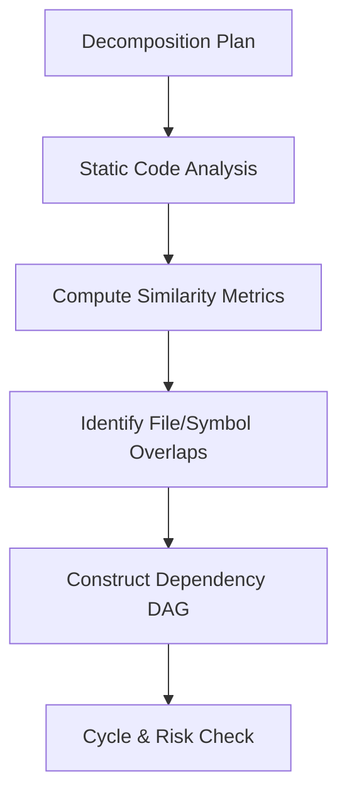
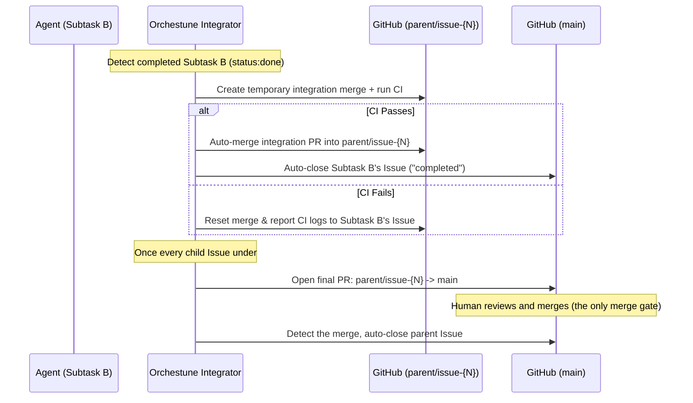

# Architecture & Design

This document explains how Orchestune builds conflict-free parallel tasks, drives agents autonomously, and integrates their changes safely.

---

## 0. Design Goal: Quota Efficiency

Orchestune is an orchestrator for individual developers and small teams. The AI usage quota (a subscription's session/weekly allowance) is fixed, and so are the hours a human can be at the desk. Every design decision below follows from a single optimization target — **maximize the finished, mergeable work produced per unit of quota consumed** — and not from minimizing wall-clock time on any individual task. For a small task, prompting one agent directly is both faster and cheaper than decomposition, provisioning, and dispatch.

Three consequences run through the rest of this document:

* **Rework is the main waste.** A merge conflict, a wrongly scoped subtask, or a duplicated implementation costs quota twice. The conflict-prevention analysis and the shared-contract gate (Section 1) trade a small up-front planning cost for avoided rework, and pre-merge CI (Section 3) catches mechanical breakage before it propagates downstream.
* **Parallelism is the mechanism, not the goal.** Independent subtasks let several agents burn quota at once instead of one agent burning it in sequence, so DAG construction (Section 1) exists to find as much *safe* parallelism as the task allows.
* **Unattended operation is what converts parallelism into quota efficiency.** The gains only materialize if runs can proceed while the human is away — overnight, or in a stateless CI runner. That is why state is self-healing from GitHub (Section 2), why child-level integration merges without a human (Section 3), and why human judgment is confined to two gates (Section 4). A design that required a click per subtask would stall the pipeline on human availability.

---

## 1. DAG Construction & Conflict Prevention

Orchestune analyzes subtask relationships statically using both explicit dependency declarations (`depends_on`) and overlap in target file paths (`footprint`) or code symbols (`symbols`).


```mermaid
graph TD
    A[Decomposition Plan] --> B[Static Code Analysis]
    B --> C[Compute Similarity Metrics]
    C --> D[Identify File/Symbol Overlaps]
    D --> E[Construct Dependency DAG]
    E --> F[Cycle & Risk Check]
```

> The similarity-based task partitioning in this section derives from the
> Co-Coder paper (Xu Yang, Lunyiu Nie, Ethan Chandra, Stanislav Gannutin,
> Fangru Lin, Swarat Chaudhuri. "When Parallelism Pays Off: Cohesion-Aware
> Task Partitioning for Multi-Agent Coding." arXiv:2606.00953, 2026). That
> paper builds a symbol-sharing graph from a repository's static interface
> and runs Infomap community detection to assign files to agents, optimizing
> for critical-path length plus communication cost. Orchestune adapts this
> for an operational tool: the objective changes from cohesion/cost
> optimization to conflict avoidance, the graph's source changes from
> existing repository files to a decomposition plan's declared
> footprint/symbols, and it uses IDF-weighted Otsuka-Ochiai similarity. See
> the docstring in `orchestune/dag_similarity.py` for details.

### Conflict Prevention Mechanism
* **Overlap Analysis**:
  When multiple tasks attempt to edit the same files or symbols, merge conflicts are inevitable. Orchestune computes similarity metrics across footprints and automatically inserts "implicit dependencies" to sequence conflicting tasks safely.
* **Safe Parallelization**:
  Only completely independent subtasks are allowed to run concurrently. This topological sorting ensures that parallel branches are mergeable with minimal conflict.

### Ordinary Footprint Overlap vs. the Shared-Contract Gate

The overlap analysis above (`dag_similarity.py`) only inserts an implicit
dependency edge when subtasks' **declared** footprint/symbol strings actually
match (or score above the weighted cosine-similarity threshold). That works
well for the common case of multiple tasks editing an already-existing file,
but greenfield decomposition plans have a different failure mode: several
subtasks may implicitly need to establish or edit a shared extension point
that doesn't exist yet — e.g. a format registry or a CLI wiring module — each
assuming a different plausible path for it. Since none of their declared
footprints share a literal string, the existing overlap detection has nothing
to match on and cannot catch this case.

To address this, Stage 1 of the `orchestune` skill asks the planner to
explicitly identify such shared extension points (registries, CLI wiring,
dependency manifests, public API index files) up front, create a dedicated
`shared-contract` / `integration-scaffold` subtask that owns them, and tag
every subtask involved (owner and dependents alike) with a matching
`shared_contract: <id>` value — the most reliable signal, since it doesn't
rely on literal string matching at all.

`orchestune/dag_contracts.py`'s `find_unowned_shared_contract_hotspots`
backs this up in two tiers, flagging results as a non-blocking `Warnings:`
entry in `orchestune-dag`'s output: (1) subtasks sharing the same
`shared_contract` tag, and (2) *every* subtask regardless of tagging, whose
footprint falls into the same category *and* the same directory (scoping by
directory keeps unrelated sibling packages — e.g. `packages/auth/__init__.py`
vs. `packages/payments/__init__.py` — from being flagged as the same
hotspot). Tier 2 deliberately doesn't skip tagged subtasks: if only one of
two subtasks writing to the same file remembered to set `shared_contract`
(a plausible authoring mistake), tier 1 alone would never compare them —
each would sit alone in its own group — and the exact race this gate exists
to catch would slip through. Pairs already flagged by tier 1 are tracked and
not re-flagged by tier 2. In both tiers, the check is **reachability**, not
connectivity: a warning fires when some pair in the group is not reachable
from the other via `depends_on`/inferred edges in either direction. This
matters because two subtasks that merely share a common ancestor (e.g. both
`depends_on` the same `shared-contract` task, as in `shared -> csv` and
`shared -> yaml`) are not ordered relative to *each other* and can still run
in parallel — the gate keeps warning about such pairs even though both
declare a dependency on the owner.

The directory-scoped heuristic (tier 2) still can't catch cases where the
shared file is guessed at entirely different paths in different directories
(the original registry-naming scenario) — that's what the explicit
`shared_contract` tag (tier 1) is for.

**Writers vs. consumers**: the `shared_contract` tag only means "participates
in this contract," not "writes to the shared file." A dependent subtask that
merely `depends_on` the owner and never touches the shared file in its own
`footprint` (a pure consumer, reading/importing it) can carry the same tag.
`find_unowned_shared_contract_hotspots` only compares subtasks that are
actually judged to be *writers* — either their `footprint` contains a path
matching one of the shared-extension-point categories, or they explicitly set
`writes_shared_contract: true`. Pure consumers, and any writer/consumer or
consumer/consumer pairing, are never flagged, since there's no write race to
warn about.

---

## 2. Self-healing State Recovery

Orchestune's dispatcher is designed to run in **stateless CI environments (such as GitHub Actions)** where local workspaces are destroyed at the end of each run.

Typically, orchestrator states are tracked in a local state file like `run_state.json`. If this file is lost, Orchestune reconstructs the state using the following **self-healing** flow:

```text
[Dispatcher Start]
       │
       ▼
[Read GitHub Issues & PRs]
       │
       ├─► status:in-progress Issues -> Treated as running
       ├─► status:blocked / status:queued -> Re-evaluated
       └─► Open PR branches -> Progress state reconstructed
       │
       ▼
[Reconstruct DAG State & Resume]
```

* **GitHub as the Source of Truth**:
  By fetching active PR branches and GitHub Issue labels (`status:in-progress`, `status:blocked`, `status:queued`), Orchestune rebuilds the DAG state in memory and resumes the cycle seamlessly from where it left off.

---

## 3. Integration & Auto-Rebase

When multiple agents complete their tasks, downstream tasks must integrate those updates. Orchestune's integrator coordinates this via a **two-tier branch model**, so that human review effort is concentrated on the one merge that actually matters (getting the "big rock" into `main`), while every intermediate child merge runs unattended.


```mermaid
sequenceDiagram
    participant AG as Agent (Subtask B)
    participant DP as Orchestune Integrator
    participant PB as GitHub (parent/issue-{N})
    participant GH as GitHub (main)

    Note over DP: Detect completed Subtask B (status:done)
    DP->>PB: Create temporary integration merge + run CI
    alt CI Passes
        DP->>PB: Auto-merge integration PR into parent/issue-{N}
        DP->>GH: Auto-close Subtask B's Issue ("completed")
    else CI Fails
        DP->>PB: Reset merge & report CI logs to Subtask B's Issue
    end
    Note over DP: Once every child Issue under #N is closed
    DP->>GH: Open final PR: parent/issue-{N} -> main
    Note over GH: Human reviews and merges (the only merge gate)
    DP->>GH: Detect the merge, auto-close parent Issue #N ("completed")
```

1. **Child branches off the parent branch**: when the dispatcher is run with `--parent-issue <N>`, the parent Issue gets its own long-lived branch (`parent/issue-{N}`, created from `main`), and every child subtask branches off it instead of off `main`.
2. **Pre-merge CI Verification**: when a child Issue reaches `status:done`, the integrator creates a temporary merge branch off `parent/issue-{N}`, merges the child's commits into it, and runs the local CI.
3. **Automatic child merge & close**: once CI passes, the integrator merges that temporary branch's PR into `parent/issue-{N}` **without waiting for a human** and closes the child Issue (`reason: completed`). No per-child review gate exists at this tier — CI is the quality gate (see Section 4).
4. **Final PR, once every child is done**: when all child Issues under a parent are closed, the integrator opens a PR from `parent/issue-{N}` to `main`. This PR is never auto-merged.
5. **Acceptance merge & parent close**: a human reviews and merges that final PR. Once merged, the integrator detects it and closes the parent Issue automatically.
6. **Semantic Review**: alongside each child-level integration, an LLM reviews the combined diff to check for logical inconsistencies (e.g. interface changes not propagated to downstream modules) and leaves comments on the integration PR for the human who will later review the final PR — it never blocks or reverses the automatic child merge.

If the dispatcher is run without `--parent-issue`, Orchestune falls back to the flat, single-tier mode: child branches merge directly toward `main` and, matching the "final merge" semantics above, that merge is always left for a human (the integrator only opens the PR).

> **Design assumption (#377)**: writes to the integrator's temporary integration branch (including `git push --force`) are serialized only by a same-machine file lock (`file_lock` in `orchestune/integrator_worktree.py`). That lock is a process-level lock and provides no protection across multiple CI runners/machines. The integrator assumes it always runs serially on a single runner; running it concurrently against the same `temp_branch` from multiple runners (e.g. a parallel build matrix) is not supported.
>
> The recommended mitigation for this constraint is a `concurrency` group when running `orchestune dispatch` on a GitHub Actions schedule (see [Setup Guide §6](setup.md#6-scheduled-runs-on-github-actions-and-cross-runner-serialization) for an example). A `concurrency` group is a preventive measure that requires no code changes; independently of it, per-run temp branch names and a compare-and-swap on the parent branch update (#435) ensure that, even under this constraint, a collision is never a silent data race — it is always surfaced as a push failure (defense in depth).

---

## 4. Human Approval Points

Orchestune is designed so a human makes a decision at exactly two points in the lifecycle — everything between them runs autonomously.

1. **Decomposition Gate**: Before dispatch begins, a human reviews and approves `decomposition_plan.md` (subtask boundaries, footprints, dependencies).
2. **Acceptance Gate**: The final PR from `parent/issue-{N}` into `main` (see Section 3) is the one merge a human must perform. Once it's merged, Orchestune closes the parent Issue automatically — no separate manual close step is needed.

Between these two gates, child-level integration PRs, CI verification, and the resulting Issue closes all proceed without per-task human approval. `risk:flagged` labels surface sensitive subtasks for visibility, but are informational only — they do not add a third blocking gate.

**Why two gates are enough**: every subtask's history (Issue, PR, commits, CI logs) is preserved on GitHub, so human review effort doesn't need to happen inline with every child merge — it can be scoped up front (decomposition) and reconciled at the very end (the single acceptance merge) without losing traceability.

**CI as the de facto quality gate**: the pre-merge CI verification described in Section 3 substitutes for per-task human review — every child integration PR must pass CI before the integrator merges it into `parent/issue-{N}`, so mechanical correctness is enforced automatically even though no human looks at each individual diff.

**Traceability backstop: dispatch cycle reports on the parent Issue**: `orchestune-dispatch`'s per-run event log (`events.jsonl`) is `.gitignore`d and does not survive between CI runs, so it cannot serve as durable history on its own. To keep dispatch-cycle decisions traceable without depending on that ephemeral log, each *applied* dispatch cycle (`--no-apply` skips this along with the rest of the post-cycle block) posts a `## 🤖 Orchestune Dispatch Cycle Report` comment to the configured parent Issue (`--parent-issue`, #396) summarizing that cycle's selected tasks, noteworthy footprint-deviation events, completions, and promotions. Deviation events that merely re-report an unchanged steady state (e.g. a worktree that is already force-serialized) are excluded from both the skip check and the comment body, so the parent Issue isn't flooded with an identical comment every cycle; a cycle with nothing to report, or with no parent Issue configured, posts nothing. Like the other post-cycle phases, posting doesn't raise on failure — the cycle itself always runs to completion — but a failure still surfaces as a nonzero `orchestune-dispatch` exit status (failing a typical CI step): an ordinary posting exception (e.g. a transient network error) is logged as a warning and maps to exit code 2, while a GitHub authentication failure is logged as an error and maps to exit code 1.

This keeps human review effort concentrated where judgment matters most (scoping and the final acceptance merge), while everything mechanical in between — including Issue closing at both tiers — is fully automated.

---

## 5. Module Layers & Package Boundary

`orchestune/__init__.py` declares the package's public API in `__all__`. Anything
not listed there is internal: it exists to serve the layers below and may be
renamed or removed without a deprecation cycle.

### 5.1 The five layers

Every module in `orchestune/` belongs to exactly one layer. A module may import
from its own layer or from any layer below it, never from a layer above.

| Layer | Modules |
| --- | --- |
| **L4** entrypoints — the modules that expose a `main()` | `bootstrap`, `cli`, `dag_cli`, `dispatcher`, `monitor`, `provisioning` |
| **L3** workflows — dispatch cycle and integration pipelines | `dispatch_cycle`, `dispatch_postcycle`, `dispatch_report`, `integration_coordinator`, `integrator`, `integrator_steps`, `integrator_types`, `parent_completion` |
| **L2** domain — DAG construction, scoring, dispatch mechanics | `dag_contracts`, `dag_graph`, `dag_parsing`, `dag_similarity`, `dispatch_actor_verification`, `dispatch_config`, `dispatch_escalation`, `dispatch_filters`, `dispatch_gc`, `dispatch_gc_completion`, `dispatch_gc_git`, `dispatch_gc_zombies`, `dispatch_labels`, `dispatch_launch`, `dispatch_locks`, `dispatch_rebase`, `dispatch_reconciliation`, `dispatch_recovery`, `dispatch_rules`, `dispatch_scoring`, `dispatch_state`, `dispatch_targets`, `dispatch_worktree`, `integrator_git_ops`, `integrator_pr`, `integrator_tasks`, `integrator_worktree`, `issue_parsing`, `not_needed_review_state`, `status_snapshot`, `symbol_verification` |
| **L1** adapters — the only modules that run `git` or `gh` | `forge`, `forge_admin`, `forge_issues`, `forge_prs`, `git_cli` |
| **L0** infra — pure DTOs and dependency-free helpers | `dag_models`, `dispatch_result`, `json_state`, `models`, `plan_writer`, `process_utils`, `setup_skills`, `validation`, `version` |

Pure data-transfer modules (`models`, `dag_models`, `dispatch_result`) sit at
**L0**, below the adapters, because `GitHubForge` returns `IssueRecord` and
`PrRecord`. Putting the DTOs above the adapter that produces them would make
that dependency point upward.

L4 is defined by "has a `main()`, and nothing but `cli` imports it", not by
"contains only argparse wiring". `cli` is the exception because it dispatches to
the other four; the guard encodes that as `ALLOWED_L4_DEPENDENTS`. All code
that predated this boundary has since been resolved. Three modules — `dag`,
`dispatcher`, and `monitor` — used to carry such code. `dag` was a
compatibility facade re-exporting the whole `dag_*` package; callers now
import the concrete `dag_*` module directly, and `dag_cli` (the module that
actually owns `main()`) is the real L4 entrypoint. `dispatcher` held the
dispatch cycle's best-effort post-cycle orchestration directly; that has
moved to `dispatch_postcycle` (L3), leaving `dispatcher` with only argument
parsing, config loading, and `main()`. `monitor` built its own status
snapshots (`MonitorState`/`build_status_snapshot`/`format_status_report` and
friends) directly; that has moved to `status_snapshot` (L2), leaving
`monitor` with only argument parsing, the `--watch` loop, and `main()`. This
is not a licence to skip the layering going forward — new code still belongs
in the layer that owns the behaviour, and this section and
`tests/test_architecture.py` keep enforcing it mechanically.

### 5.2 Invariants enforced by CI

`tests/test_architecture.py` checks all of the following on every run, so the
table above cannot silently drift from the code:

1. **Dependencies point downward.** No module imports a module in a strictly
   higher layer. In particular nothing imports an L4 entrypoint except `cli`,
   which composes them.
2. **`git` and `gh` are confined to L1.** `subprocess` invocations naming
   either command are partitioned exactly as follows — no other module may
   grow one.

   | Command | Module allowed to run it |
   | --- | --- |
   | `gh` | `forge_admin` |
   | `git` | `git_cli` |

   This covers the VCS and GitHub client surface only. Other external processes
   are deliberately outside it and are not guarded: `dispatch_targets` launches
   the agent CLIs, and `dispatch_rebase` and `integrator_git_ops` shell out to
   the CI script and to `poetry`. Those are one-off process launches rather
   than a client that callers need to fake, so they stay where they are used.

   **Scope of the check.** The guard reads the command out of the source, so it
   sees a literal list — passed inline, or through a variable that some
   assignment in scope binds to one. It models Python's scoping rules well
   enough to be trusted on ordinary code: it follows branches and loops, keeps
   class bodies out of their methods, honours `global`/`nonlocal`, and reads the
   `args=` keyword as well as the first positional argument. It does not
   evaluate anything. A command assembled at runtime, read from configuration,
   or handed in by another module escapes it entirely.

   That boundary is deliberate. This invariant exists to catch the accident —
   someone reaching for `subprocess` in an L2 module instead of `run_git` — not
   to prevent a determined bypass. Anyone who wants to run `git` outside
   `git_cli` can do so, and no static check in a test file will stop them; the
   thing standing in their way is code review. So write `git`/`gh` argv as a
   literal, and treat a failure here as "this belongs in L1", not as a puzzle
   to route around.

3. **No import cycles**, and no internal import hidden inside a function body
   (which would evade the cycle check). `cli` is exempt from the second rule
   because it defers entrypoint imports to keep startup fast.
4. **The table is exhaustive.** Every `.py` file under `orchestune/` appears in
   exactly one layer, in both the English and Japanese documents — with one
   deliberate exception: `orchestune/__init__.py` itself. The package root
   *declares* the boundary rather than living inside it, so it has no layer and
   is not subject to rule 1. What it may import is checked separately: a
   dedicated test asserts it pulls in no L4 entrypoint, which is the property
   that would otherwise be lost.

### 5.3 Why `Forge` is a protocol, not a class

The L1 boundary is expressed as three `Protocol` classes rather than one
concrete client, so callers depend only on the slice of GitHub they actually
use:

- `IssueForge` — reading and labelling issues
- `PullRequestForge` — listing, creating and merging pull requests
- `RepoAdminForge` — auth checks and label bootstrapping

`Forge` is their union, and `GitHubForge` is the single `gh`-backed
implementation. A caller that only needs to bootstrap labels (`run_bootstrap`)
takes a `RepoAdminForge`, so it cannot reach for PR APIs by accident and its
tests need a double with two methods rather than twenty.

Because the abstraction is a protocol, a test can inject a fake instead of
patching module attributes: `IntegratorConfig(forge=...)` and
`DispatcherConfig(forge=...)` accept any object satisfying it, and the shared
`fake_forge` fixture supplies one.

That migration is partial. Roughly 500 call sites still reach for
`patch("orchestune.forge.GitHubForge.<method>")` — heaviest in
`test_dispatch_cycle.py`, `test_dispatch_gc.py` and `test_parent_completion.py`
— because those suites predate the protocol. Both styles stop `gh` from running,
which is the invariant that matters; injection is the direction of travel for
new tests, not a description of the whole suite today.
