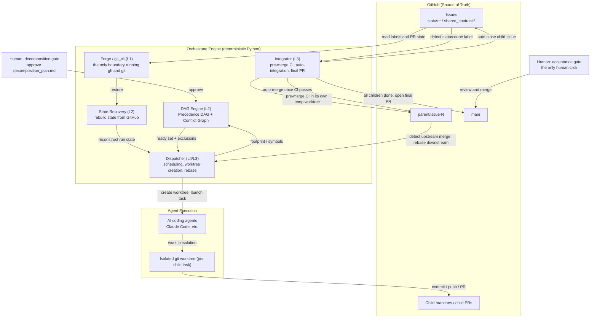

# Architecture & Design

This document explains how Orchestune builds conflict-free parallel tasks, drives agents autonomously, and integrates their changes safely.

---

## 1. System Overview

Orchestune treats GitHub as the single source of truth and puts a deterministic Python control engine in charge of orchestrating LLM implementation agents. A human is involved at exactly two points — the decomposition gate up front and the acceptance gate at the end — and everything in between runs autonomously.

```mermaid
graph TD
    HU1["Human: decomposition gate<br/>approve decomposition_plan.md"]
    HU2["Human: acceptance gate<br/>the only human click"]

    subgraph GH ["GitHub (Source of Truth)"]
        GI["Issues<br/>status:* / shared_contract:*"]
        GP["Child branches / child PRs"]
        PB["parent/issue-N"]
        MB["main"]
    end

    subgraph ENG ["Orchestune Engine (deterministic Python)"]
        L1["Forge / git_cli (L1)<br/>the only boundary running gh and git"]
        REC["State Recovery (L2)<br/>rebuild state from GitHub"]
        DAG["DAG Engine (L2)<br/>Precedence DAG + Conflict Graph"]
        DP["Dispatcher (L4/L3)<br/>scheduling, worktree creation, rebase"]
        IG["Integrator (L3)<br/>pre-merge CI, auto-integration, final PR"]
    end

    subgraph EX ["Agent Execution"]
        WT["Isolated git worktree (per child task)"]
        AG["AI coding agents<br/>Claude Code, etc."]
    end

    HU1 -->|approve| DAG
    GI -->|read labels and PR state| L1
    L1 -->|restore| REC
    REC -->|reconstruct run state| DP
    DAG -->|ready set + exclusions| DP
    DP -->|footprint / symbols| DAG
    DP -->|create worktree, launch task| AG
    AG -->|work in isolation| WT
    WT -->|commit / push / PR| GP
    GI -->|detect status:done label| IG
    IG -->|pre-merge CI in its own temp worktree| PB
    IG -->|auto-merge once CI passes| PB
    IG -->|auto-close child Issue| GI
    PB -->|detect upstream merge, rebase downstream| DP
    IG -->|all children done, open final PR| MB
    HU2 -->|review and merge| MB
```

Every read and write between the engine and GitHub goes through the L1 adapters (`forge` / `git_cli`); that containment is enforced mechanically by CI, as described in [§4.2](#42-invariants-enforced-by-ci). Note also that the Integrator is triggered by a child Issue's `status:done` label rather than by a child PR, and that its pre-merge CI runs in a temporary worktree of its own, separate from the agents' isolated worktrees — the engine never writes into an agent's workspace.

---

## 2. Core Design Principles

### 0. Design Goal: Quota Efficiency

Orchestune is an orchestrator for individual developers and small teams. The AI usage quota (a subscription's session/weekly allowance) is fixed, and so are the hours a human can be at the desk. Every design decision below follows from a single optimization target — **maximize the finished, mergeable work produced per unit of quota consumed** — and not from minimizing wall-clock time on any individual task. For a small task, prompting one agent directly is both faster and cheaper than decomposition, provisioning, and dispatch.

Three consequences run through the rest of this document:

* **Rework is the main waste.** A merge conflict, a wrongly scoped subtask, or a duplicated implementation costs quota twice. The conflict-prevention analysis and the shared-contract gate trade a small up-front planning cost for avoided rework, and pre-merge CI catches mechanical breakage before it propagates downstream.
* **Parallelism is the mechanism, not the goal.** Independent subtasks let several agents burn quota at once instead of one agent burning it in sequence, so DAG construction exists to find as much *safe* parallelism as the task allows.
* **Unattended operation is what converts parallelism into quota efficiency.** The gains only materialize if runs can proceed while the human is away — overnight, or in a stateless CI runner. That is why state is self-healing from GitHub, why child-level integration merges without a human, and why human judgment is confined to two gates. A design that required a click per subtask would stall the pipeline on human availability.

### 0.1 Determinism: the LLM judges, Python owns the automated shared-state transitions

An LLM call is a scarce operation that consumes quota. Orchestune therefore **spends LLM calls only where judgment cannot be replaced — decomposition, implementation, semantic review of an integration diff, and the `status:not-needed` assessment — and handles everything else in deterministic Python**. Polling labels, recomputing the DAG, rebuilding local state, garbage collection, and escalation could all be delegated to an agent, but each delegation is paid for in quota.

This pays twice: every deterministic step is quota not spent directly, and it also removes the rework that non-deterministic behaviour produces — the main waste named above.

The dividing line is not "what the LLM does not do" but **scope**: whose territory is being written to.

| | Writes to |
|---|---|
| **LLM** | The isolation it was given (its worktree and its own branch), plus the statement of its judgement (Outcome Records, comments, a PR; or verifier verdict labels in the independent not-needed review routine) |
| **Python** | **The shared state that advances automatically** — integration merges from a child PR into the parent branch, whether an Issue lives or dies, routine label transitions, dependency resolution, the quota ledger |
| **Human** | **The acceptance merge** — the final PR from the parent branch into `main`; the "one human click" |

Worker implementation agents never mutate shared GitHub labels directly. When an implementation agent finds a requirement already satisfied, it records an Outcome Record (`<!-- orchestune:outcome -->` with `result: not-needed`) as a comment rather than modifying labels, and it commits, pushes, and opens PRs only within its assigned branch (the only exception is the dedicated independent verification reviewer session in Cloud Routine, which attaches verdict labels as instructed by `integration_coordinator`). **What the agent never decides is whether that work enters shared state.**

#### Premise: both the LLM and the infrastructure will be wrong

Determinism alone is not enough. Because both LLM output and infrastructure can fail, Orchestune **enumerates the deviation points individually and gives each one a deterministic detection and recovery path**.

| Deviation | Detection | Deterministic handling |
|---|---|---|
| Bad decomposition (an unestablished shared extension point) | [Shared-contract gate (dag-and-scheduling.md)](architecture/dag-and-scheduling.md#5-ordinary-footprint-overlap-vs-the-shared-contract-gate) | Warning |
| Stale plan (a declared `symbol` does not exist) | [AST symbol verification (dag-and-scheduling.md)](architecture/dag-and-scheduling.md#6-reconciling-the-decomposition-plan-against-the-codebase-staleness-detection) | Neutral note in the Issue body |
| Bad declaration (a change outside the footprint) | Runtime deviation detection (`dispatch.locks.check_footprint_deviation`) | Conflict Graph recomputation (with exclusion rules and a retry cap) |
| Infrastructure failure (local state lost) | — | [Rebuild from GitHub as the source of truth (state-recovery.md)](architecture/state-recovery.md#2-github-as-the-source-of-truth) |
| The agent's own report (`result: not-needed`) | Re-verification by an independent session that carries no memory of it (Cloud Routine target only) | Deterministic close from Python, driven by the outcome record and status label |

And **loops are bounded, with a terminal state** — though not on every path today. Runtime Conflict Graph recomputation retries, launches per window, and requeues from a zombie/timeout reclaim (`--max-task-reclaims`, 3 by default) are bounded by default, but task timeouts and token caps are **off by default** and must be set explicitly before leaving a long run unattended (see the [Usage & Command Reference](usage.md)). When automation cannot converge, the Issue moves to `status:blocked-human-review` and stops. `tests/test_architecture.py` mechanically checks the finite retry/reclaim/review-timeout settings against their declared terminal behaviour. The check deliberately uses an explicit registry: it rejects new settings that match this recovery-loop naming contract without a terminal mapping, while leaving unrelated bounded controls to their feature-specific tests.

> **Known gaps**: one path currently never reaches a terminal state.
> - **Token usage is not observable.** `max_tokens_per_window` never fires on the cloud dispatch targets (`ClaudeCodeCloudRoutineDispatchTarget`, `CodexCloudDispatchTarget`): the default `collect_usage` returns `None` and neither target overrides it, because no polling API is published for a cloud session's consumption — even `is_complete` falls back to PR creation as a proxy signal. So **the token cap is inert on the primary unattended path**. This is upstream of persistence (the data is never produced in the first place) and is revisited when such an API becomes available. `recompute_count`/`forced_serial` (child Issue body) and `launch_history` (parent Issue body) are persisted and outside this gap.

What Orchestune **aims for** is not that everything resolves automatically, but that **it either converges or halts in a state a human can act on**. As above, that is a design goal rather than a property every path already satisfies.

### 0.2 Human Approval Points

Orchestune is designed so a human makes a decision at exactly two points in the lifecycle — everything between them runs autonomously.

1. **Decomposition Gate**: Before dispatch begins, a human reviews and approves `decomposition_plan.md` (subtask boundaries, footprints, dependencies).
2. **Acceptance Gate**: The final PR from `parent/issue-{N}` into `main` is the one merge a human must perform. Once it's merged, Orchestune closes the parent Issue automatically — no separate manual close step is needed.

Between these two gates, child-level integration PRs, CI verification, and the resulting Issue closes all proceed without per-task human approval. `risk:flagged` labels surface sensitive subtasks for visibility, but are informational only — they do not add a third blocking gate.

**Why two gates are enough**: every subtask's history (Issue, PR, commits, CI logs) is preserved on GitHub, so human review effort doesn't need to happen inline with every child merge — it can be scoped up front (decomposition) and reconciled at the very end (the single acceptance merge) without losing traceability.

**CI as the de facto quality gate**: the pre-merge CI verification described in the integration pipeline substitutes for per-task human review — every child integration PR must pass CI before the integrator merges it into `parent/issue-{N}`, so mechanical correctness is enforced automatically even though no human looks at each individual diff.

**Traceability backstop: dispatch cycle reports on the parent Issue**:
`orchestune-dispatch`'s per-run event log (`events.jsonl`) is `.gitignore`d and does not survive between CI runs, so it cannot serve as durable history on its own. To keep dispatch-cycle decisions traceable without depending on that ephemeral log, each *applied* dispatch cycle posts a `## 🤖 Orchestune Dispatch Cycle Report` comment to the configured parent Issue (`--parent-issue`, #396). `--no-apply` skips this along with the rest of the post-cycle block.

The comment summarizes that cycle's selected tasks, noteworthy `footprint`-deviation events, completions, and promotions. Deviation events that merely re-report an unchanged steady state (a worktree that is already force-serialized, say) are excluded from both the skip check and the comment body, so the parent Issue is not flooded with an identical comment every cycle. A cycle with nothing to report, or with no parent Issue configured, posts nothing.

Failure handling matches the other post-cycle phases: posting does not raise, and the cycle itself always runs to completion. A failure does still surface as a nonzero `orchestune-dispatch` exit status, failing a typical CI step — an ordinary posting exception (a transient network error, say) is logged as a warning and maps to exit code 2, while a GitHub authentication failure is logged as an error and maps to exit code 1.

This keeps human review effort concentrated where judgment matters most (scoping and the final acceptance merge), while everything mechanical in between — including Issue closing at both tiers — is fully automated.

---

## 3. Major Subsystems Overview

Detailed specifications, mathematical models, and control flows are modularized into the following dedicated subdocuments:

### 3.1 DAG Construction, Scheduling & Conflict Prevention
Details: [DAG Construction, Scheduling & Conflict Prevention (dag-and-scheduling.md)](architecture/dag-and-scheduling.md)

* **Dual-Graph Model**: Decouples causal dependencies (`depends_on`) in the **Precedence DAG** from symmetric mutual exclusions (`footprint`/`symbols`/`shared_contract` overlaps) in the **Conflict Graph**.
* **Similarity & Conflict Analysis**: IDF-weighted Otsuka-Ochiai similarity metric for overlap calculation (adapted from the Co-Coder paper).
* **Scheduling Algorithm (#660)**: Multi-factor greedy scoring based on Precedence DAG critical path (bottom level), successor release count, historical cost and rework risk estimates, token window budgets, and aging for starvation freedom.
* **Execution Profiles & Model Resolution (#670)**: Abstract execution profiles (`deep-reasoning`, `fast-code`, etc.) mapped deterministically to target-specific LLM models and reasoning tiers (`resolve_execution_profile` / `ExecutionSelection`). Clear responsibility boundary between the #660 scheduler ("WHEN and WHICH tasks to launch") and Execution Profiles ("HOW selected tasks execute").
* **Shared-Contract Gates & AST Symbol Verification**: Proactive hotspot detection for unestablished shared extension points and non-blocking staleness detection between plans and codebases.

### 3.2 Stateless CI & Self-Healing State Recovery
Details: [Stateless CI & Self-Healing State Recovery (state-recovery.md)](architecture/state-recovery.md)

* **Stateless Execution Model**: Designed for ephemeral CI environments (such as GitHub Actions) where state is reconstructed directly from GitHub issue labels and PR branches.
* **GitHub as Single Source of Truth**: Rebuilding active and queued states from GitHub `status:*` labels and protecting zombie/timeout recovery with terminal caps (`task_reclaim_counts`, #512).
* **Repository Consistency Control Loop**: `ConsistencySupervisor` is the single owner of repair decisions, ordering, bounded retries, authoritative re-observation, and aggregated outcomes. Typed executors keep Forge, Git, process, worktree, and `run_state.json` mutations behind live preconditions. The off/shadow/repair setting stages only the additional repository-wide loop; the established safe status, recovery, and GC self-healing boundaries remain enabled by default. See [Stateless CI & Self-Healing State Recovery](architecture/state-recovery.md#3-repository-consistency-control-loop).

### 3.3 Integration Pipeline, Two-Tier Branch Model & Auto-Rebase
Details: [Integration Pipeline, Two-Tier Branch Model & Auto-Rebase (integration.md)](architecture/integration.md)

* **Two-Tier Branch Model**: Long-lived `parent/issue-{N}` branches isolate child merges; child PRs are verified with pre-merge CI and merged/closed automatically.
* **Auto-Rebase**: Dispatcher detects upstream merges into `parent/issue-{N}` and automatically rebases downstream in-flight worktrees.
* **Acceptance Gate**: Final PR from `parent/issue-{N}` to `main` reviewed and merged by a human (the only human click).
* **Concurrency Control**: Same-machine file lock assumptions (#377), recommended `concurrency` group configurations for GitHub Actions, and CAS defense-in-depth (#435).

---

## 4. Module Layers & Package Boundary

`orchestune/__init__.py` declares the package's public API in `__all__`. Anything
not listed there is internal: it exists to serve the layers below and may be
renamed or removed without a deprecation cycle.

### 4.1 The five layers

Every module in `orchestune/` belongs to exactly one layer. A module may import
from its own layer or from any layer below it, never from a layer above.

| Layer | Role | Modules |
| --- | --- | --- |
| **L4** | **Entrypoints** the modules that expose a `main()` | `bootstrap`, `cli`, `dag.cli`, `dispatch.dispatcher`, `monitor`, `provisioning.cli`, `replan.cli` |
| **L3** | **Workflows** dispatch cycle and integration pipelines | `dispatch.cycle`, `dispatch.cycle_context`, `dispatch.cycle_report`, `dispatch.phase_gc`, `dispatch.phase_reconciliation`, `dispatch.phase_rebase`, `dispatch.phase_scheduling`, `dispatch.postcycle`, `dispatch.report`, `integrator`, `integrator.coordinator`, `integrator.parent_completion`, `integrator.steps`, `integrator.types`, `provisioning.flow`, `replan.apply` |
| **L2** | **Domain** DAG construction, scoring, dispatch mechanics | `consistency`, `consistency.desired`, `consistency.engine`, `consistency.invariants`, `consistency.invariants.execution`, `consistency.invariants.status`, `consistency.intents`, `consistency.observation`, `consistency.repairs`, `consistency.repairs.execution`, `consistency.repairs.status`, `consistency.supervisor`, `dag.contracts`, `dag.graph`, `dag.parsing`, `dag.similarity`, `dispatch.actor_verification`, `dispatch.config`, `dispatch.conflicts`, `dispatch.cost_model`, `dispatch.critical_path`, `dispatch.escalation`, `dispatch.execution_profiles`, `dispatch.execution_repair`, `dispatch.filters`, `dispatch.gc`, `dispatch.gc.completion`, `dispatch.gc.git`, `dispatch.gc.outcome_decision`, `dispatch.gc.prior_merge`, `dispatch.gc.zombies`, `dispatch.labels`, `dispatch.launch`, `dispatch.locks`, `dispatch.rebase`, `dispatch.reconciliation`, `dispatch.recovery`, `dispatch.prior_parent_merge`, `dispatch.reviewer`, `dispatch.rules`, `dispatch.scoring`, `dispatch.state`, `dispatch.status_repair`, `dispatch.summary`, `dispatch.targets`, `dispatch.worktree`, `infra.not_needed_review_state`, `integrator.final_pr_body`, `integrator.git_ops`, `integrator.pr`, `integrator.tasks`, `integrator.worktree`, `issue_notice`, `issue_parsing`, `pr_link_notice`, `provisioning.parent`, `provisioning.plan`, `provisioning.plan_loading`, `provisioning.rendering`, `provisioning.subtasks`, `replan.audit`, `replan.operations`, `replan.plan`, `replan.preview`, `replan.snapshot`, `status_snapshot`, `symbol_verification` |
| **L1** | **Adapters** the only modules that run `git` or `gh` | `forge`, `forge.admin`, `forge.issues`, `forge.prs`, `infra.git_cli` |
| **L0** | **Infra** pure DTOs and dependency-free helpers | `bounded_limit`, `branch_naming`, `consistency.contracts`, `consistency.models`, `consistency.vocabulary`, `dag`, `dag.models`, `dispatch`, `dispatch.result`, `infra`, `infra.json_state`, `infra.process_utils`, `labels`, `models`, `outcome_record`, `plan_writer`, `provisioning`, `replan`, `replan.models`, `setup_skills`, `validation`, `version` |

Pure data-transfer modules (`models`, `dag.models`, `dispatch.result`) sit at
**L0**, below the adapters, because `GitHubForge` returns `IssueRecord` and
`PrRecord`. Putting the DTOs above the adapter that produces them would make
that dependency point upward.

L4 is defined by "has a `main()`, and nothing but `cli` imports it", not by
"contains only argparse wiring". `cli` is the exception because it dispatches to
the other five; the guard encodes that as `ALLOWED_L4_DEPENDENTS`.

New code belongs in the layer that owns the behaviour, and this section and `tests/test_architecture.py` keep enforcing it mechanically.

### 4.2 Invariants enforced by CI

`tests/test_architecture.py` checks all of the following on every run, so the
table above cannot silently drift from the code:

1. **Dependencies point downward.** No module imports a module in a strictly
   higher layer. In particular nothing imports an L4 entrypoint except `cli`,
   which composes them.
2. **`git` and `gh` are confined to L1.** `subprocess` invocations naming
   either command are partitioned exactly as follows — no other module may
   grow one.

   | Command | Module allowed to run it |
   | --- | --- |
   | `gh` | `forge.admin` |
   | `git` | `infra.git_cli` |

   Target is VCS and GitHub client surface only. Other external process launches
   are deliberately outside it and are not guarded: `dispatch.targets` launches
   the agent CLIs, and `dispatch.rebase` and `integrator.git_ops` shell out to
   the CI script and to `poetry`. Those are one-off process launches rather
   than a client that callers need to fake, so they stay where they are used.

   **Scope of the check**:
   The guard reads the command out of the source, so it sees a literal list — passed inline, or through a variable that some assignment in scope binds to one. It models Python's scoping rules well enough to be trusted on ordinary code: it follows branches and loops, keeps class bodies out of their methods, honours `global`/`nonlocal`, and reads the `args=` keyword as well as the first positional argument.

   It does not evaluate anything, however. A command assembled at runtime, read from configuration, or handed in by another module escapes it entirely.

   That boundary is deliberate. This invariant exists to catch the accident — someone reaching for `subprocess` in an L2 module instead of `run_git` — not to prevent a determined bypass. Anyone who wants to run `git` outside `git_cli` can do so, and no static check in a test file will stop them; the thing standing in their way is code review. So write `git`/`gh` argv as a literal, and treat a failure here as "this belongs in L1", not as a puzzle to route around.

3. **No import cycles**, and no internal import hidden inside a function body
   (which would evade the cycle check). `cli` is exempt from the second rule
   because it defers entrypoint imports to keep startup fast.
4. **The table is exhaustive.** Every `.py` file under `orchestune/` appears in
   exactly one layer, in both the English and Japanese documents — with one
   deliberate exception: `orchestune/__init__.py` itself. The package root
   *declares* the boundary rather than living inside it, so it has no layer and
   is not subject to rule 1. What it may import is checked separately: a
   dedicated test asserts it pulls in no L4 entrypoint, which is the property
   that would otherwise be lost.

### 4.3 Why `Forge` is a protocol, not a class

The L1 boundary is expressed as three `Protocol` classes rather than one
concrete client, so callers depend only on the slice of GitHub they actually
use:

- `IssueForge` — reading and labelling issues
- `PullRequestForge` — listing, creating and merging pull requests
- `RepoAdminForge` — auth checks and label bootstrapping

`Forge` is their union, and `GitHubForge` is the single `gh`-backed
implementation. A caller that only needs to bootstrap labels (`run_bootstrap`)
takes a `RepoAdminForge`, so it cannot reach for PR APIs by accident and its
tests need a double with two methods rather than twenty.

Because the abstraction is a protocol, a test can inject a fake instead of
patching module attributes: `IntegratorConfig(forge=...)` and
`DispatcherConfig(forge=...)` accept any object satisfying it, and the shared
`fake_forge` fixture supplies one.
