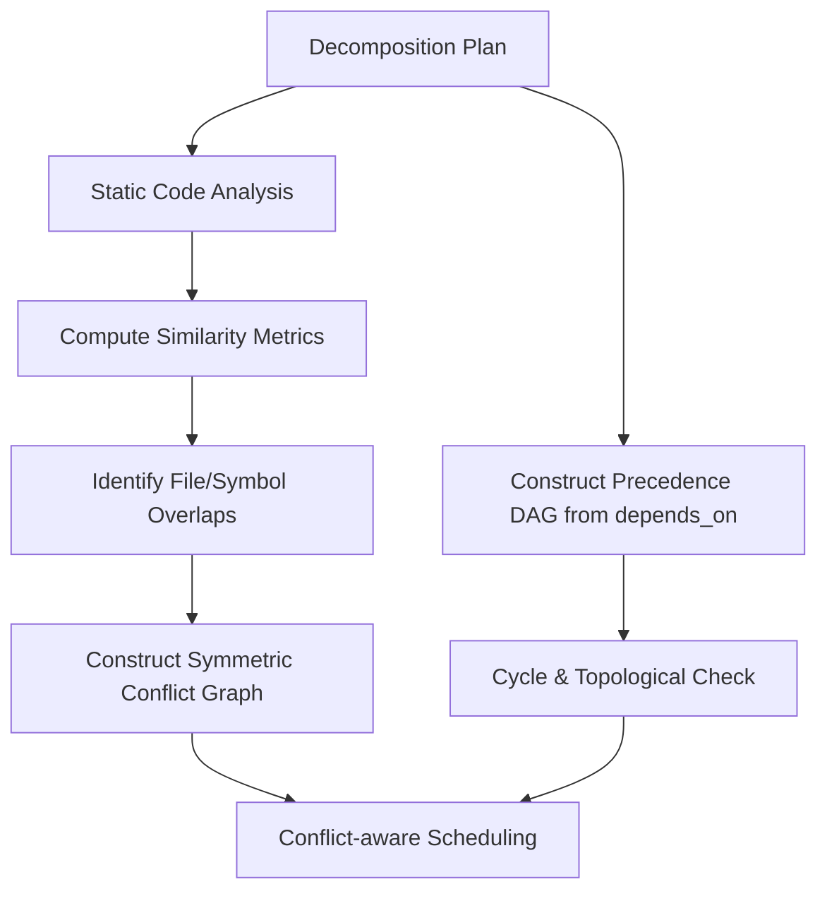
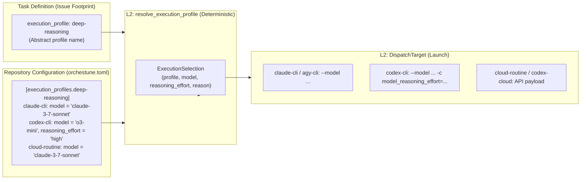

# DAG Construction, Scheduling & Conflict Prevention

This document provides detailed specifications for Orchestune's dual-graph model (Precedence DAG and Conflict Graph), similarity-based conflict prevention, critical-path scheduling algorithm, abstract Execution Profiles for model resolution, shared-contract gates, and AST symbol verification. For the high-level system overview and core design principles, see [Architecture & Design](../architecture.md).

---

## 1. Dual-Graph Model (Precedence DAG & Conflict Graph)

Orchestune analyzes subtask relationships as two independent models. `depends_on` is a causal relationship—its predecessor must complete first—and belongs to the **Precedence DAG**. Overlap in `footprint`, `symbols`, or shared-contract metadata is a symmetric “must not run together” relationship and belongs to the **Conflict Graph**.



> **Reference**: the similarity-based task partitioning in this section derives from the Co-Coder paper (Xu Yang, Lunyiu Nie, Ethan Chandra, Stanislav Gannutin, Fangru Lin, Swarat Chaudhuri. "When Parallelism Pays Off: Cohesion-Aware Task Partitioning for Multi-Agent Coding." arXiv:2606.00953, 2026).
>
> That paper builds a symbol-sharing graph from a repository's static interface and runs Infomap community detection to assign files to agents, optimizing for critical-path length plus communication cost.
>
> Orchestune adapts this for an operational tool: the objective changes from cohesion/cost optimization to conflict avoidance, the graph's source changes from existing repository files to a decomposition plan's declared `footprint`/`symbols`, and it uses IDF-weighted Otsuka-Ochiai similarity. See the docstring in `orchestune/dag/similarity.py` for details.

---

## 2. Conflict Prevention Mechanism

* **Overlap Analysis**:
  When multiple tasks attempt to edit the same files or symbols, merge conflicts are likely. Orchestune computes similarity metrics and stores the result as a symmetric `ConflictEdge`, including its score, reason, and resources. Priority and task IDs never turn that exclusion into an arbitrary directed dependency.
* **Safe Parallelization**:
  The dispatcher obtains the dependency-ready set from the Precedence DAG, then uses a deterministic priority-ordered greedy selection. A candidate is selected only when it is not adjacent in the Conflict Graph to an active task or a task already selected in the same cycle. A conflict-only task can therefore be reconsidered after its neighbor finishes, without receiving a permanent artificial order.

Cycle detection and topological sorting inspect only the Precedence DAG. The undirected Conflict Graph has no cycle error, and conflict information is never discarded when the same pair also has an explicit dependency. `orchestune-dag --json` exposes `precedence_edges` and `conflict_edges` separately; the backward-compatible `edges` key now aliases precedence edges only.

---

## 3. Scheduling: Critical Path and Resource Constraints

Which member of the ready set to launch is treated as maximizing "finished, mergeable work per unit of AI quota" rather than as minimizing wall-clock time (#660). The dispatcher scores every candidate and selects greedily in descending order (ties broken by ascending issue number).

```text
score = base priority
      + aging
      + critical path bonus
      + successor release bonus
      + partial progress bonus
      - estimated token penalty
      - rework risk penalty
```

* **Critical path / successor release bonus**: the **bottom level** derived from the Precedence DAG (a task's own estimated duration plus the longest chain of successors) and the number of reachable successors, each normalized to `[0, 1]` across the candidate set (`orchestune/dispatch/critical_path.py`). Bottom levels and direct successor counts walk every edge once, so they are computed in `O(V + E)` and are exact for any acyclic graph, regardless of size. Reachable successor counts are a transitive closure and therefore `O(V * E)` in the worst case, so above `MAX_TRANSITIVE_CLOSURE_NODES` (512) nodes the closure is abandoned and degrades deterministically to direct successor counts. Hand-edited `depends_on` cycles never raise, but no reverse topological order exists for them, so a single pass understates the ranks. On a cycle, bottom levels are therefore neutralized to zero, reachable successor counts fall back to direct successors, and both the critical-path and successor-release bonuses are disabled so inexact values cannot reorder candidates. `PrecedenceRanks.exact_bottom_level` and `exact_downstream` distinguish this cyclic fallback from a large acyclic graph, where the bottom level remains exact and the direct-successor fallback remains useful. A safe, observable degradation beats carrying exact reachability machinery for metadata that should never have been corrupt.
* **Cost estimates**: duration, token consumption and rework risk are estimated from the medians of the completion history the dispatcher already keeps for KPI aggregation (`RunState.completed_worktrees`, see `orchestune/dispatch/cost_model.py`). The estimate degrades in three steps: the task's own history, then fleet-wide history, then a deterministic default. Tokens alone stay `None` when unknown — estimating 0 would make the task look free, and inventing a default would drive the quota check from a number with no evidence behind it. Rework risk maps "attempted `n` times and still queued" to `n / (n + 1)`: monotonic, but never reaching 1.
* **Relationship to priority**: the critical-path and successor-release bonuses plus the token and rework penalties sum (`QUALITY_SPAN`) to less than the smallest gap between adjacent priority levels (`MIN_PRIORITY_GAP` = `1.0`). What has to be bounded is the spread **between** two candidates, not the bonuses one candidate can collect: a lower-priority task can take the full bonus at the same time as a higher-priority one takes the full penalty, so capping only the bonus side still leaves `bonus + penalty` of room to invert a priority step (raised in PR#665 review). Bounding all four terms means a task's position on the critical path never overrides a `priority:*` label when waits are equal; it decides between tasks of equal priority. The invariant is checked mechanically in `tests/test_dispatch_scheduling.py`. The partial-progress bonus (`1.0`) is deliberately outside this bound — resuming interrupted work has outranked one priority step since before #660.

### Resource Constraints
The concurrency (`--max-concurrent`) and launch-rate (`--max-launches-per-window`) ceilings are still enforced by `quota_available`. When `--max-tokens-per-window` is set, a candidate whose estimated token cost would push the batch's projected spend past the window's remaining budget is additionally skipped. The first selection of a batch is exempt from that check: otherwise a queue whose only candidates each estimate above the remaining budget would never progress (a path with no terminal). Because `remaining_token_budget` counts only the measured usage of *completed* worktrees (the pre-existing #438 semantics), the estimated cost of still-running launches is additionally reserved against the budget, and the exemption is withheld while any reservation stands — minting a fresh exemption per invocation would let a re-run inside the same window project past the ceiling (raised in PR#665 review). Each reservation is captured in `ActiveWorktree` at launch time, so a later completion cannot move the fleet median and retroactively shrink an in-flight reservation; old state files without the field fall back to the current estimate for compatibility. When something is already in flight, its completion is what guarantees progress, so no exemption is needed. The window ceiling itself is held by `quota_available`'s hard gate, and a candidate stopped by that gate is reported as `token-budget`, not the generic `quota-exhausted`. Candidates whose token cost is unknown (`None`) are excluded from budget filtering rather than guessed at. Combinations that cannot run concurrently are still excluded from the same batch by the Conflict Graph.

### Starvation Freedom
The aging term measures how many launch windows separate a candidate's wait from the shortest wait in the candidate set, and is unbounded. Every other component spans a finite range (`BOUNDED_SCORE_SPAN`), so as long as resources keep being supplied, a continuously eligible task eventually outscores every other candidate. That is the terminal guarantee against "critical-path-first starves low-rank tasks".

### Observability and Rollback
Every candidate — selected or not — contributes its score breakdown, bottom level, release counts, cost estimates, rank-exactness flags and skip reason (`conflict` / `quota-exhausted` / `token-budget` / `launch-failed`, plus `yaml-error` / `external-lock` / `blocked-recompute` / `already-active` for candidates dropped before scoring) to the cycle report, the `--json` output and `events.jsonl`. Candidates dropped before scoring (invalid YAML, external lock, recompute-blocked, already running) are kept as unselected decisions with their own reason and real raw rank/cost metadata — an invalid-YAML task in particular is still processed in apply mode (it is moved to `status:blocked-*`), so dropping it or filling its diagnostics with placeholder zeroes would hide useful evidence. Scheduling selection and actual launch are likewise distinct: a task whose launch slot could not be reserved, or whose `create_worktree_and_launch` failed, is downgraded to `launch-failed` by `reconcile_decisions_with_launches`, so the report never disagrees with `CycleReport.selected`. `--scheduling-mode legacy` restores the pre-#660 scoring while retaining these diagnostics.

---

## 4. Execution Profiles & Model Resolution

To decouple a subtask's execution characteristics (e.g., "requires deep reasoning," "routine fast code generation," "standard balanced") from concrete LLM vendor models and runtime target environments (Claude 3.7 Sonnet, GPT-4o, o3-mini, etc.), Orchestune adopts an abstract **Execution Profiles** mechanism (#663 / #668 / #669 / #670).



* **Design Philosophy (Separation of Concerns & Portability)**:
  `decomposition_plan.md` and child issue Footprint YAML blocks specify abstract profile names such as `execution_profile: "deep-reasoning"` or `execution_profile: "fast-code"` rather than vendor-specific model strings (e.g., `claude-3-7-sonnet-20250219`) or target CLI flags. When running locally with `claude-cli` or `codex-cli`, or dispatching on CI via `cloud-routine` or `codex-cloud`, the abstract profile maps deterministically to target-appropriate models without rewriting issues or plan files.
* **Target Capability Mapping**:
  `orchestune/dispatch/execution_profiles.py`'s `resolve_execution_profile` is a pure deterministic function that resolves models and reasoning effort based on `[tool.orchestune.execution_profiles]` (or `[execution_profiles]`):
  * `claude-cli` / `agy-cli`: Attaches `--model <model>` to CLI invocations. If `reasoning_effort` is configured, logs a warning and safely skips the unsupported setting.
  * `codex-cli`: Attaches `--model <model>` and `-c model_reasoning_effort=<effort>`.
  * `cloud-routine`: Sets `model` in the API fire payload.
  * `codex-cloud`: Configures Codex Cloud task parameters.
  Unsupported target options degrade safely (warning logged, parameter omitted) without aborting the dispatch cycle.
* **Responsibility Boundary with the #660 Scheduler**:
  * **#660 Scheduling Engine**: Decides **"WHEN" and "WHICH"** candidate tasks to launch based on DAG topology, Precedence DAG bottom level (critical path), downstream release count, token cost estimation, rework risk, concurrency limits, and token window budgets.
  * **Execution Profiles**: Decides **"HOW"** the selected tasks execute by deterministically resolving the abstract profile into concrete model and reasoning effort parameters for the target.
  * The scheduler operates without knowledge of model strings or reasoning tiers, and the profile resolver does not influence candidate ranking or quota gating.
* **Fallback & Degradation Guarantees**:
  * Unspecified or `null` execution profiles resolve to `default_execution_profile` (default: `balanced`).
  * Unknown profile names log a warning and deterministically fall back to `default_execution_profile`.
  * When no execution profile configuration is present, resolves to `default_execution_profile` with `None` (delegating to the target's built-in default).
  * Selected profile, model, reasoning effort, and resolution reasons are persisted in `ActiveWorktree` and `CompletedWorktree` (`run_state.json`), and recorded in CycleReports, GitHub Step Summaries, event logs (`events.jsonl`), and parent issue comments.

---

## 5. Ordinary Footprint Overlap vs. the Shared-Contract Gate

The overlap analysis above (`dag/similarity.py`) adds a similarity conflict edge only when subtasks' **declared** `footprint`/`symbols` strings actually match (or score above the weighted cosine-similarity threshold). That works well for the common case of multiple tasks editing an already-existing file, but greenfield decomposition plans have a different failure mode.

Consider several subtasks that each need to establish or edit a **shared extension point that does not exist yet** — a format registry, a CLI wiring module — with each assuming a different plausible path for it. Since none of their declared footprints share a literal string, the existing overlap detection has nothing to match on and cannot catch the case.

To address this, Stage 1 of the `orchestune` skill asks the planner to explicitly identify such shared extension points (registries, CLI wiring, dependency manifests, public API index files) up front, create a dedicated `shared-contract` / `integration-scaffold` subtask that owns them, and tag every subtask involved — owner and dependents alike — with a matching `shared_contract: <id>` value. This is the most reliable signal, since it does not rely on literal string matching at all.

`orchestune/dag/contracts.py`'s `find_unowned_shared_contract_hotspots` backs this up in two tiers:

1. **Subtasks sharing the same `shared_contract` tag.**
2. ***Every* subtask regardless of tagging**, grouped where the `footprint` falls into the same category *and* the same directory (scoping by directory keeps unrelated sibling packages — `packages/auth/__init__.py` vs. `packages/payments/__init__.py` — from being flagged as the same hotspot).

Writer pairs in either tier become exclusion constraints in the Conflict Graph. In addition, a non-blocking `Warnings:` entry appears in `orchestune-dag`'s output when the group contains a pair that is not reachable from the other in the Precedence DAG.

What matters here is that the check is **reachability**, not connectivity: a warning fires when some pair in the group cannot reach the other via explicit `depends_on` edges in either direction. Two subtasks that merely share a common ancestor — both `depends_on` the same `shared-contract` task, as in `shared -> csv` and `shared -> yaml` — are not ordered relative to *each other* and can still run in parallel. The gate therefore keeps warning about such pairs even though both declare a dependency on the owner.

Tier 2 deliberately does not skip tagged subtasks. If only one of two subtasks writing to the same file remembered to set `shared_contract` (a plausible authoring mistake), tier 1 alone would never compare them — each would sit alone in its own group — and the exact race this gate exists to catch would slip through. Pairs already flagged by tier 1 are tracked and not re-flagged by tier 2.

The directory scoping does mean the tier-2 heuristic cannot catch cases where the shared file is guessed at entirely different paths in different directories (the original registry-naming scenario). That is what the explicit tier-1 `shared_contract` tag is for.

**Writers vs. consumers**:
The `shared_contract` tag only means "participates in this contract," not "writes to the shared file." A dependent subtask that merely `depends_on` the owner and never touches the shared file in its own `footprint` — a pure consumer, reading or importing it — can carry the same tag.

`find_unowned_shared_contract_hotspots` therefore only compares subtasks judged to be actual *writers*: either their `footprint` contains a path matching one of the shared-extension-point categories, or they explicitly set `writes_shared_contract: true`. Pure consumers, and any writer/consumer or consumer/consumer pairing, are never flagged, since there is no write race to warn about.

---

## 6. Reconciling the Decomposition Plan against the Codebase (Staleness Detection)

Where the two subsections above both deal with conflicts **between subtasks**, this one reconciles the **decomposition plan against the current repository**. It is a different axis.

A plan written before a refactor (files split, functions moved or renamed) can point at a code snapshot that no longer exists. At Issue-creation time, `orchestune/symbol_verification.py` uses the AST to check whether the declared `symbols` can be found in the Python files listed in `footprint` (`provisioning.py` calls `find_missing_symbols`).

Whether the `footprint` paths themselves exist is checked separately, by `find_missing_footprint_paths` against the filesystem, when `orchestune-dag` runs with a repository root — not through the AST, and not at Issue-creation time.

Symbol collection combines **two walks with different purposes**:

1. **The full set of defined names (`_collect_all_names`)**:
   Walks the entire tree with `ast.walk`. It deliberately includes class names, `Class.method` qualified names, and nested functions (closure helpers and the like), so a plan may name a bare method and still match.
2. **The module-scope-only candidate set (`_collect_top_level_names`)**:
   Used to loosely match module-qualified notation (`db.get_connection`) on its final segment. This one is **restricted to module scope**, because `ast.walk` loses scope information: used here it would mistake a function-local variable, or a bare method name, for a module-level definition.

The restricted walk follows Python's scoping rules. `if` / `try` / `with` / loops / `match` bind what they contain into the *enclosing* scope, so their bodies are flattened into it (a conditionally defined top-level function, or a conditional assignment, are the typical cases). Function and class definitions open a new scope of their own and are not recursed into. A conditionally defined *method* is therefore not picked up here, but by the first, whole-tree walk, which flattens each class body separately.

**When the check is skipped**:
Two conditions skip verification entirely. Both return an empty result and leave no note, because declaring a symbol "missing" without the material to judge would be a false positive.

* The `footprint` contains no existing `.py` file at all.
* Any `.py` file in the `footprint` cannot be parsed (a syntax error, say).

Note, though, that **right after a refactor splits or renames files, the `footprint` paths may be exactly the ones that no longer exist**. The check tends to go quiet in precisely the situation it is meant for.

Only definitions (`class` / `def`) and assignments (`x = ...`, `x: T = ...`) are collected — **bindings introduced by `import` are not**. A name that exists only via an import, as in `try: import fast as impl except ImportError: import slow as impl`, will be reported as missing if a plan declares it in `symbols`. The note is neutral and non-blocking so the practical cost is small, but it is a known limit of this check.

**This check does not block.** A symbol that isn't found may mean "the plan went stale in a refactor" or "this subtask is about to create it", so Orchestune does not decide: it leaves a neutral note in the Issue body and lets the implementing agent and the human judge — one application of [0.1 Determinism](../architecture.md#01-determinism-the-llm-judges-python-owns-the-automated-shared-state-transitions)'s "the LLM judges, Python owns the automated shared-state transitions".
