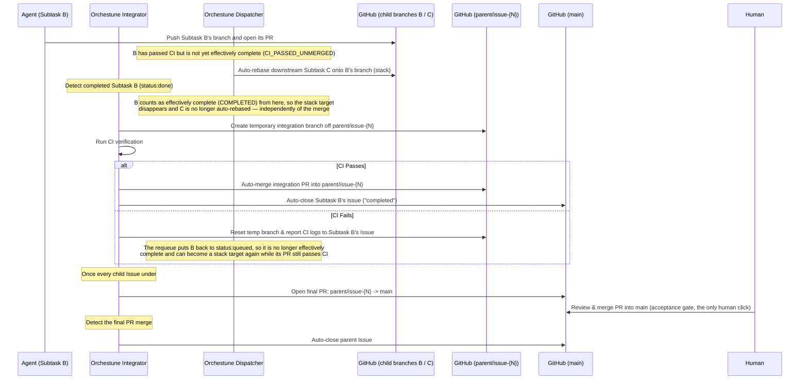

# Integration Pipeline, Two-Tier Branch Model & Auto-Rebase

This document provides detailed specifications for Orchestune's two-tier branch model (`parent/issue-{N}`), pre-merge CI verification, automatic child merge and close, auto-rebase of downstream branches, final acceptance PR creation, semantic review, and concurrency control and locking constraints. For the high-level system overview and core design principles, see [Architecture & Design](../architecture.md).

---

## 1. Two-Tier Branch Model with Parent Branch

When multiple agents complete their tasks, downstream tasks must integrate those updates. Orchestune's integrator coordinates this via a **two-tier branch model**, so that human review effort is concentrated on the one merge that actually matters (getting the "big rock" into `main`), while every intermediate child merge runs unattended.

---

## 2. Integration Pipeline Phases

1. **Child branches off the parent branch**: when the dispatcher is run with `--parent-issue <N>`, the parent Issue gets its own long-lived branch (`parent/issue-{N}`, created from `main`), and every child subtask branches off it instead of off `main`.
2. **Pre-merge CI Verification**: when a child Issue reaches `status:done`, the integrator creates a temporary merge branch off `parent/issue-{N}`, merges the child's commits into it, and runs the local CI.
3. **Automatic child merge & close**: once CI passes, the integrator merges that temporary branch's PR into `parent/issue-{N}` **without waiting for a human** and closes the child Issue (`reason: completed`). No per-child review gate exists at this tier — CI is the quality gate (see [Architecture & Design §0.2](../architecture.md#02-human-approval-points)).
4. **Auto-rebase (the dispatcher's job, on a separate track from this pipeline)**: this phase is not part of the integrator's merge sequence, and a merge into `parent/issue-{N}` is not what triggers it. On every cycle the dispatcher asks the [shared stack-target policy](#dependency-target-fallback) for a target, but only for an active worktree whose process is still alive *and* which the preceding active-worktree rules (`status:not-needed` detection, stale-entry hold, completion detection, `CHANGES_REQUESTED` escalation) did not already terminate; only when that policy returns **the branch of a single dependency that has passed CI but is not yet effectively complete** does `orchestune/dispatch/rebase.py` `git rebase` the downstream in-flight branch onto that target (it never merges instead). When no target comes back — the dependency has not passed CI yet (`WAITING`), several CI-passed, not-yet-complete dependencies exist, the dependency's own dependencies are not all complete, its branch name is unknown, or the dependency is effectively complete and therefore `COMPLETED` — the auto-rebase is skipped. A dependency *classified* as `CHANGES_REQUESTED` never reaches this query at all (classification short-circuits with `COMPLETED` first, so a dependency that is effectively complete — `status:done`, say — stays `COMPLETED` even when its PR carries a changes-requested review, takes this query instead, and is rejected as `no-stack-dependency`): the earlier `_rule_changes_requested` (`orchestune/dispatch/escalation.py`) escalates that worktree to human review and terminates the chain, so what applies there is the escalation, not a skipped rebase. Effective completion here covers `status:done` (unless it still carries `status:queued`), `status:not-needed`, and completion confirmed within the cycle; it does not require an actual merge into `parent/issue-{N}`. So the stack target disappears the moment the child Issue reaches `status:done`, and it stays gone while the integration is merely delayed (still `status:done`, not yet merged). A *failed* integration is different: when the temporary-merge CI fails, the integrator adds `status:queued` and removes `status:done` (`handle_merge_failure` in `orchestune/integrator/pr.py`), so that dependency stops being effectively complete and — as long as its own PR still passes CI — can be classified `CI_PASSED_UNMERGED` again and become a stack target on a later cycle. After a rebase the dispatcher runs the local CI in that worktree and, on success, relaunches the agent with the target as its base branch; a conflict or a CI failure moves the Issue to `status:manual-merge-required` and hands it to a human.
   Picking up a dependency's work *after* it has been merged into `parent/issue-{N}` is not this auto-rebase but **base selection at launch time**. That base is the `parent/issue-{N}` branch of phase 1 (or `origin/main` with no parent Issue) only when the shared policy returns no target. When it does return one, the launch base is that dependency's branch instead (`_decide_task_launch_plan` in `orchestune/dispatch/launch.py`), so whether work already merged into `parent/issue-{N}` comes along depends on whether the stacked branch contains it. If C depends on a merged B and on a CI-passed, not-yet-complete D, C launches from D rather than from `parent/issue-{N}`; if D branched before B was merged and does not itself depend on B, C does not pick up B's work. [§4's shared stack-target policy](#dependency-target-fallback) is canonical for that split.
5. **Final PR, once every child is done**: when all child Issues under a parent are closed, the integrator opens a PR from `parent/issue-{N}` to `main`. This PR is never auto-merged.
6. **Acceptance merge & parent close**: a human reviews and merges that final PR. Once merged, the integrator detects it and closes the parent Issue automatically.
7. **Semantic Review**: alongside each child-level integration, an LLM reviews the combined diff to check for logical inconsistencies (e.g. interface changes not propagated to downstream modules) and leaves comments on the integration PR — it never blocks or reverses the automatic child merge, and Python does not track its result either.
   **Whether the acceptance reviewer sees those findings depends on the mode**: in flat mode the integration PR *is* the acceptance PR a human merges, so they sit on the same PR; under this two-tier model they land on the *child* integration PR and are neither copied nor linked onto the acceptance PR (parent branch → `main`). An asynchronous finding can even land after the child PR is closed, so reading them means going to each child PR by hand.

### Flat Mode (Fallback)
If the dispatcher is run without `--parent-issue`, Orchestune falls back to the flat, single-tier mode: child branches merge directly toward `main` and, matching the "final merge" semantics above, that merge is always left for a human (the integrator only opens the PR).

---

## 3. Concurrency Control & Design Assumptions

> **Design assumption (#377)**: writes to the integrator's temporary integration branch (including `git push --force`) are serialized only by a same-machine file lock (`file_lock` in `orchestune/infra/process_utils.py`). That lock is a process-level lock and provides no protection across multiple CI runners/machines. The integrator assumes it always runs serially on a single runner; running it concurrently against the same `temp_branch` from multiple runners (e.g. a parallel build matrix) is not supported.
>
> The recommended mitigation for this constraint is a `concurrency` group when running `orchestune dispatch` on a GitHub Actions schedule (see [Setup Guide §6](../setup.md#6-scheduled-runs-on-github-actions-and-cross-runner-serialization) for an example). A `concurrency` group is a preventive measure that requires no code changes; independently of it, per-run temp branch names and a compare-and-swap on the parent branch update (#435) ensure that, even under this constraint, a collision is never a silent data race — it is always surfaced as a push failure (defense in depth).

---

## 4. Shared stack-target policy and fallback

Launch, auto-rebase, and base-branch-red recovery all pass the same
`DependencyAssessment` view to `dependency_policy.decide_stack_target`. They use
the dependency's canonical branch only when the shared policy returns a safe
target. This table is the canonical per-consumer behavior when no target exists.

| Stable ID | Path | Meaning when there is no target |
| --- | --- | --- |
| `dependency-fallback-launch` | launch | **no stack launch**: do not stack on a dependency branch; this does not authorize launching a dependency-waiting task from a fallback base |
| `dependency-fallback-rebase` | rebase | **no stack rebase**: skip auto-rebase |
| `dependency-fallback-base` | base selection | fall back to `parent/issue-{N}` when configured, otherwise `origin/main` |

Base-selection fallback is not launch authorization or proof that dependencies are
satisfied. Candidate admission still requires a separate Assessment and Use-case
Policy decision. A canonical branch name is also a semantic identifier held by the
context, not proof that a local or remote Git ref exists. The Git-operation boundary
checks it with `resolve_local_or_remote_branch` or an equivalent probe and fails
closed when the ref is absent or unknown.
