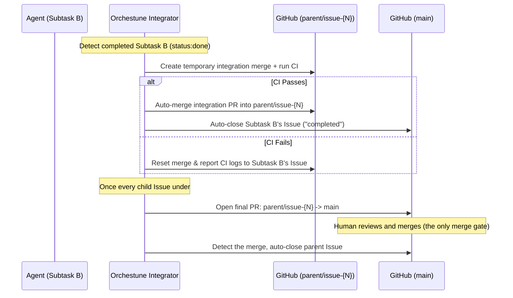

# Integration Pipeline, Two-Tier Branch Model & Auto-Rebase

This document provides detailed specifications for Orchestune's two-tier branch model (`parent/issue-{N}`), pre-merge CI verification, automatic child merge and close, auto-rebase of downstream branches, final acceptance PR creation, semantic review, and concurrency control and locking constraints. For the high-level system overview and core design principles, see [Architecture & Design](../architecture.md).

---

## 1. Two-Tier Branch Model with Parent Branch

When multiple agents complete their tasks, downstream tasks must integrate those updates. Orchestune's integrator coordinates this via a **two-tier branch model**, so that human review effort is concentrated on the one merge that actually matters (getting the "big rock" into `main`), while every intermediate child merge runs unattended.

---

## 2. Integration Pipeline Phases

1. **Child branches off the parent branch**: when the dispatcher is run with `--parent-issue <N>`, the parent Issue gets its own long-lived branch (`parent/issue-{N}`, created from `main`), and every child subtask branches off it instead of off `main`.
2. **Pre-merge CI Verification**: when a child Issue reaches `status:done`, the integrator creates a temporary merge branch off `parent/issue-{N}`, merges the child's commits into it, and runs the local CI.
3. **Automatic child merge & close**: once CI passes, the integrator merges that temporary branch's PR into `parent/issue-{N}` **without waiting for a human** and closes the child Issue (`reason: completed`). No per-child review gate exists at this tier — CI is the quality gate (see [Architecture & Design §2.4](../architecture.md#24-human-approval-points)).
4. **Final PR, once every child is done**: when all child Issues under a parent are closed, the integrator opens a PR from `parent/issue-{N}` to `main`. This PR is never auto-merged.
5. **Acceptance merge & parent close**: a human reviews and merges that final PR. Once merged, the integrator detects it and closes the parent Issue automatically.
6. **Semantic Review**: alongside each child-level integration, an LLM reviews the combined diff to check for logical inconsistencies (e.g. interface changes not propagated to downstream modules) and leaves comments on the integration PR — it never blocks or reverses the automatic child merge, and Python does not track its result either.
   **Whether the acceptance reviewer sees those findings depends on the mode**: in flat mode the integration PR *is* the acceptance PR a human merges, so they sit on the same PR; under this two-tier model they land on the *child* integration PR and are neither copied nor linked onto the acceptance PR (parent branch → `main`). An asynchronous finding can even land after the child PR is closed, so reading them means going to each child PR by hand.

### Flat Mode (Fallback)
If the dispatcher is run without `--parent-issue`, Orchestune falls back to the flat, single-tier mode: child branches merge directly toward `main` and, matching the "final merge" semantics above, that merge is always left for a human (the integrator only opens the PR).

---

## 3. Concurrency Control & Design Assumptions

> **Design assumption (#377)**: writes to the integrator's temporary integration branch (including `git push --force`) are serialized only by a same-machine file lock (`file_lock` in `orchestune/integrator/worktree.py`). That lock is a process-level lock and provides no protection across multiple CI runners/machines. The integrator assumes it always runs serially on a single runner; running it concurrently against the same `temp_branch` from multiple runners (e.g. a parallel build matrix) is not supported.
>
> The recommended mitigation for this constraint is a `concurrency` group when running `orchestune dispatch` on a GitHub Actions schedule (see [Setup Guide §6](../setup.md#6-scheduled-runs-on-github-actions-and-cross-runner-serialization) for an example). A `concurrency` group is a preventive measure that requires no code changes; independently of it, per-run temp branch names and a compare-and-swap on the parent branch update (#435) ensure that, even under this constraint, a collision is never a silent data race — it is always surfaced as a push failure (defense in depth).
