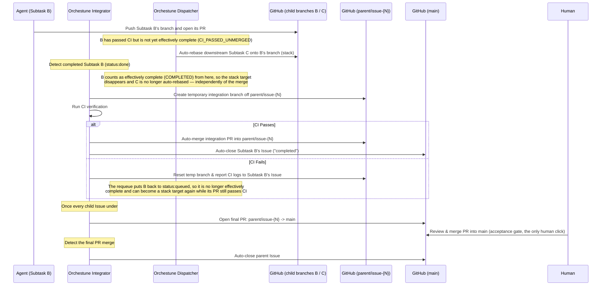

# Integration Pipeline, Two-Tier Branch Model & Auto-Rebase

This document provides detailed specifications for Orchestune's two-tier branch model (`parent/issue-{N}`), pre-merge CI verification, automatic child merge and close, auto-rebase of downstream branches, final acceptance PR creation, semantic review, and concurrency control and locking constraints. For the high-level system overview and core design principles, see [Architecture & Design](../architecture.md).

---

## 1. Two-Tier Branch Model with Parent Branch

When multiple agents complete their tasks, downstream tasks must integrate those updates. Orchestune's integrator coordinates this via a **two-tier branch model**, so that human review effort is concentrated on the one merge that actually matters (getting the "big rock" into `main`), while every intermediate child merge runs unattended.

```mermaid
sequenceDiagram
    participant AG as Agent (Subtask B)
    participant IG as Orchestune Integrator
    participant DP as Orchestune Dispatcher
    participant CB as GitHub (child branches B / C)
    participant PB as GitHub (parent/issue-{N})
    participant GH as GitHub (main)
    participant HU as Human

    AG->>CB: Push Subtask B's branch and open its PR
    Note over DP: B has passed CI but is not yet effectively complete (CI_PASSED_UNMERGED)
    DP->>CB: Auto-rebase downstream Subtask C onto B's branch (stack)
    Note over IG: Detect completed Subtask B (status:done)
    Note over DP: B counts as effectively complete (COMPLETED) from here, so the stack target<br/>disappears and C is no longer auto-rebased — independently of the merge
    IG->>PB: Create temporary integration branch off parent/issue-{N}
    IG->>IG: Run CI verification
    alt CI Passes
        IG->>PB: Auto-merge integration PR into parent/issue-{N}
        IG->>GH: Auto-close Subtask B's Issue ("completed")
    else CI Fails
        IG->>PB: Reset temp branch & report CI logs to Subtask B's Issue
        Note over DP: The requeue puts B back to status:queued, so it is no longer effectively<br/>complete and can become a stack target again while its PR still passes CI
    end
    Note over IG: Once every child Issue under #N is closed
    IG->>GH: Open final PR: parent/issue-{N} -> main
    HU->>GH: Review & merge PR into main (acceptance gate, the only human click)
    Note over IG: Detect the final PR merge
    IG->>GH: Auto-close parent Issue #N ("completed")
```

---

## 2. Integration Pipeline Phases

1. **Child branches off the parent branch**: the required `--parent-issue <N>` gives the parent Issue its own long-lived branch (`parent/issue-{N}`, created from `main`), and every child subtask branches off it.
2. **Pre-merge CI Verification**: when a child Issue reaches `status:done`, the integrator creates a temporary merge branch off `parent/issue-{N}`, merges the child's commits into it, and runs the local CI.
3. **Automatic child merge & close**: once CI passes, the integrator merges that temporary branch's PR into `parent/issue-{N}` **without waiting for a human** and closes the child Issue (`reason: completed`). No per-child *human* review gate exists at this tier — CI and the child review-evidence gate (item 7) are the quality gates, and with the default `required` setting the parent branch is updated only after that gate passes (see [Architecture & Design §0.2](../architecture.md#02-human-approval-points)).
4. **Auto-rebase (the dispatcher's job, on a separate track from this pipeline)**: this phase is not part of the integrator's merge sequence, and a merge into `parent/issue-{N}` is not what triggers it. On every cycle the dispatcher asks the [shared stack-target policy](#dependency-target-fallback) for a target, but only for an active worktree whose process is still alive *and* which the preceding active-worktree rules (`status:not-needed` detection, stale-entry hold, completion detection, `CHANGES_REQUESTED` escalation) did not already terminate; only when that policy returns **the branch of a single dependency that has passed CI but is not yet effectively complete** does `orchestune/dispatch/rebase.py` `git rebase` the downstream in-flight branch onto that target (it never merges instead). When no target comes back — the dependency has not passed CI yet (`WAITING`), several CI-passed, not-yet-complete dependencies exist, the dependency's own dependencies are not all complete, its branch name is unknown, or the dependency is effectively complete and therefore `COMPLETED` — the auto-rebase is skipped. A dependency *classified* as `CHANGES_REQUESTED` never reaches this query at all (classification short-circuits with `COMPLETED` first, so a dependency that is effectively complete — `status:done`, say — stays `COMPLETED` even when its PR carries a changes-requested review, takes this query instead, and is rejected as `no-stack-dependency`): the earlier `_rule_changes_requested` (`orchestune/dispatch/escalation.py`) escalates that worktree to human review and terminates the chain, so what applies there is the escalation, not a skipped rebase. Effective completion here covers `status:done` (unless it still carries `status:queued`), `status:not-needed`, and completion confirmed within the cycle; it does not require an actual merge into `parent/issue-{N}`. So the stack target disappears the moment the child Issue reaches `status:done`, and it stays gone while the integration is merely delayed (still `status:done`, not yet merged). A *failed* integration is different: when the temporary-merge CI fails, the integrator adds `status:queued` and removes `status:done` (`handle_merge_failure` in `orchestune/integrator/pr.py`), so that dependency stops being effectively complete and — as long as its own PR still passes CI — can be classified `CI_PASSED_UNMERGED` again and become a stack target on a later cycle. After a rebase the dispatcher runs the local CI in that worktree and, on success, relaunches the agent with the target as its base branch; a conflict or a CI failure moves the Issue to `status:manual-merge-required` and hands it to a human.
   Picking up a dependency's work *after* it has been merged into `parent/issue-{N}` is not this auto-rebase but **base selection at launch time**. That base is the `parent/issue-{N}` branch of phase 1 only when the shared policy returns no target. When it does return one, the launch base is that dependency's branch instead (`_decide_task_launch_plan` in `orchestune/dispatch/launch.py`), so whether work already merged into `parent/issue-{N}` comes along depends on whether the stacked branch contains it. If C depends on a merged B and on a CI-passed, not-yet-complete D, C launches from D rather than from `parent/issue-{N}`; if D branched before B was merged and does not itself depend on B, C does not pick up B's work. [§4's shared stack-target policy](#dependency-target-fallback) is canonical for that split.
5. **Final PR, once every child is done**: when all child Issues under a parent are closed, the integrator opens a PR from `parent/issue-{N}` to `main`. This PR is never auto-merged.
6. **Acceptance merge & parent close**: a human reviews and merges that final PR. Once merged, the integrator detects it and closes the parent Issue automatically.
7. **Child review-evidence gate (layer 1, required) and Semantic Review (layer 2, advisory)**: reviewing a child is not part of the integration step; the integrator only checks that the review happened.
   - **Layer 1 — child review-evidence gate (default `required`)**: the development skill's review loop (`skills/local-ci-developer/references/review-loop.md`, Step 11) runs on the child PR, and the LLM records a judgment for every finding. `orchestune complete --result done` re-acquires the PR's review state, verifies the judgment table and the reviewed SHA, and saves the result as review evidence in the done Outcome Record; when verification fails it rejects the completion and posts nothing. Before updating `parent/issue-{N}`, the integrator only **verifies that evidence** for every child in the merge. A child passes only when its latest Outcome Record is `result=done` with `verdict=pass`, and both the recorded head and the reviewed head equal the commit being merged. If any child fails, the integrator fails closed: it does not update the parent branch, closes no child Issue and deletes no child branch, and it escalates the **parent Issue** to `status:blocked-human-review` with one comment per distinct failure set (reasons: `legacy`, `skipped`, `not_pass`, `sha_mismatch`, `absent`, `lookup_unknown`, `integration_evidence_missing`). Resume and migration steps are in [Usage §4.5](../usage.md#45-child-review-evidence-gate).
   - **Layer 2 — Semantic Review (advisory)**: alongside each child-level integration, an LLM reviews the combined diff to check for logical inconsistencies (e.g. interface changes not propagated to downstream modules) and leaves comments on the integration PR. It never blocks or reverses the automatic child merge, and Python does not track its result. Making this layer a required gate is the scope of the follow-up Epic #1033.
   Layer-2 findings land on the *child* integration PR and are neither copied nor linked onto the acceptance PR (parent branch → `main`). An asynchronous finding can even land after the child PR is closed, so reading them means going to each child PR by hand.

---

## 3. Concurrency Control & Design Assumptions

> **Design assumption (#377)**: writes to the integrator's temporary integration branch (including `git push --force`) are serialized only by a same-machine file lock (`file_lock` in `orchestune/infra/process_utils.py`). That lock is a process-level lock and provides no protection across multiple CI runners/machines. The integrator assumes it always runs serially on a single runner; running it concurrently against the same `temp_branch` from multiple runners (e.g. a parallel build matrix) is not supported.
>
> The recommended mitigation for this constraint is a `concurrency` group when running `orchestune dispatch` on a GitHub Actions schedule (see [Setup Guide §6](../setup.md#6-scheduled-runs-on-github-actions-and-cross-runner-serialization) for an example). A `concurrency` group is a preventive measure that requires no code changes; independently of it, per-run temp branch names and a compare-and-swap on the parent branch update (#435) ensure that, even under this constraint, a collision is never a silent data race — it is always surfaced as a push failure (defense in depth).

---

## 4. Shared stack-target policy and fallback

Launch, auto-rebase, and base-branch-red recovery all pass the same
`DependencyAssessment` view to `dependencies.policy.decide_stack_target`. They use
the dependency's canonical branch only when the shared policy returns a safe
target. This table is the canonical per-consumer behavior when no target exists.

| Stable ID | Path | Meaning when there is no target | Condition → target (stable form) |
| --- | --- | --- | --- |
| `dependency-fallback-launch` | launch | **no stack launch**: do not stack on a dependency branch; this does not authorize launching a dependency-waiting task from a fallback base | `no-stack-launch` |
| `dependency-fallback-rebase` | rebase | **no stack rebase**: skip auto-rebase | `no-stack-rebase` |
| `dependency-fallback-base` | base selection | fall back to `parent/issue-{N}` when configured, otherwise `origin/main` | `parent-configured=parent/issue-{N}; no-parent=origin/main` |

Base-selection fallback is not launch authorization or proof that dependencies are
satisfied. Candidate admission still requires a separate Assessment and Use-case
Policy decision. A canonical branch name is also a semantic identifier held by the
context, not proof that a local or remote Git ref exists. The Git-operation boundary
checks it with `resolve_local_or_remote_branch` or an equivalent probe and fails
closed when the ref is absent or unknown.

---

## 5. Bounded execution and the termination guarantee (#820)

Every wait in the integrator is bounded and every timeout ends in a state a human or the next cycle can act on. The pieces live in separate modules so OS-specific code stays apart from policy:

| Module | Owns |
| --- | --- |
| `infra.execution_deadline` | The per-parent `ExecutionScope`: one monotonic deadline, one independent cleanup budget, the per-call limit for auxiliary `git`/`gh`, and the `ExecutionInterrupt` signals |
| `infra.managed_process` (+ `_posix`, `_windows`) | Starts a command in a process group the runner owns, reads output into bounded tails, stops and confirms the group, and returns a typed result (`SUCCESS`, `NONZERO_EXIT`, `TIMED_OUT`, `START_FAILED`, `STOP_UNCONFIRMED`) |
| `infra.python_env`, `integrator.ci_execution` | Run `uv sync` and the CI command once each under `min(stage limit, remaining cycle time)`; the legacy `(ok, output)` text is derived from the typed result |
| `integrator.timeout_retry` | The retry budget as canonical events on the parent Issue, rebuilt from every comment page |
| `integrator.execution` | Per-parent state: attempt reservation, parent execution lock, holds, escalation, failure records |
| `integrator.timeout_policy` | The seven settings, their defaults and validation, and the failure vocabulary |

**Scope propagation.** `run_git` and `GitHubForge` read the active scope and add `timeout=min(per-call limit, remaining cycle time)`; after the deadline they refuse to start a call, and during cleanup they draw only on the cleanup budget. An injected Forge must declare `supports_bounded_execution = True`; otherwise the integrator does not apply. Execution signals derive from `BaseException`, so the many best-effort `except Exception` clauses in the steps cannot absorb a deadline: it reaches the pipeline, which stops, cleans up and records the cause.

**Stop sequence on a timeout.** (1) stop the process group and confirm it is empty; (2) only then roll back to the SHA saved before the temporary merge and confirm `HEAD`; (3) abandon the rest of the parent's integration — nothing already CI-passed in this cycle is pushed; (4) record the outcome and decide whether a retry remains; (5) if the stop, the rollback, `HEAD` or the cleanup budget cannot be confirmed, hold the worktree, write a hold record (`worktrees/.holds/`), refuse new CI and send the parent to human review. A timeout is never folded into `handle_merge_failure`, so the worker is not re-queued for a hang. A push or other write that times out leaves `side_effect_state=unknown`: nothing is retried, completed or rolled back remotely until a human reconciles it.

**Budget.** `reserved` is written and read back before dependency preparation starts, `finished` records the result and the confirmations, and `terminal` marks the last allowed timeout. A reservation without a result blocks automatic re-runs, because it cannot prove the processes stopped. Only the authenticated executing identity's events count (a reset may also come from a user with write access); the parent, generation and attempt must agree, and any unreadable, conflicting or invalid history starts nothing. See [state-recovery.md](state-recovery.md#2-github-as-the-source-of-truth) and the operator procedure in [Usage §4.6](../usage.md#46-bounded-integration-execution-and-timeout-recovery).

**What is not guaranteed.** The operating system's process-creation API and uninterruptible kernel I/O can still block, so a strict wall-clock limit is not promised. Auxiliary `git`/`gh` calls run with the direct child's timeout rather than process-group ownership, so descendants of a `git` hook or SSH helper are not stopped. A POSIX process that leaves the managed session/process group (for example with `setsid`) is outside the guarantee; CI commands must keep their descendants inside it, and a cgroup/sandbox is out of scope. On Windows a command that cannot be assigned to the Job Object is not run. Concurrent applies against one parent from different hosts are unsupported because GitHub comments have no atomic compare-and-swap. The worker's `task-timeout-seconds` and reclaim policy are separate and do not make the integrator bounded; and a stop that the OS refuses, or a write whose result cannot be reconciled, is held as undetermined rather than declared stopped.
