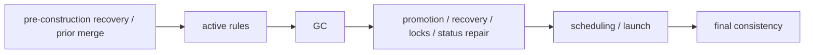

# Stateless CI & Self-Healing State Recovery

This document provides detailed specifications for Orchestune's stateless execution model, self-healing state recovery from GitHub as the single source of truth, reclaim count management, and the repository consistency control loop. For the high-level system overview and core design principles, see [Architecture & Design](../architecture.md).

---

## 1. Stateless CI Execution Model & Self-Healing

Orchestune's dispatcher is designed to run in **stateless CI environments (such as GitHub Actions)** where local workspaces are destroyed at the end of each run.

Typically, orchestrator states are tracked in a local state file like `run_state.json`. If this file is lost, Orchestune reconstructs the state using the following **self-healing** flow:

```text
[Dispatcher Start]
       │
       ▼
[Read GitHub Issues & PRs]
       │
       ├─► status:in-progress Issues -> Treated as running
       ├─► status:blocked / status:queued -> Re-evaluated
       └─► Open PR branches -> Progress state reconstructed
       │
       ▼
[Reconstruct DAG State & Resume]
```

---

## 2. GitHub as the Source of Truth

* **GitHub as the Source of Truth**:
  By fetching active PR branches and GitHub Issue labels (`status:in-progress`, `status:blocked`, `status:queued`), Orchestune rebuilds the DAG state in memory and resumes the cycle seamlessly from where it left off.
* **Reclaim counts (#512)**:
  The zombie/timeout reclaim counts (the `task_reclaim_counts` ledger behind `--max-task-reclaims`) live only in `run_state.json`, so losing that file resets them to zero. A task that already exceeded the limit stays stopped even so, because its `status:blocked-human-review` label on GitHub is the source of truth — only tasks still below the limit start their count over.

---

## 3. Repository Consistency Control Loop

State recovery is complemented by a repository-wide consistency kernel. Observers normalize facts from GitHub, Git, worktrees, processes, external executions, and `run_state.json` into an immutable `ObservedRepositoryState`. A pure derivation builds `DesiredRepositoryState` from task lifecycle, dependencies, dispatch policy, and the pending `TransitionIntent` journal. Pure invariants compare the two models and emit stable, evidence-bearing findings; planners may translate only known, automatic findings into typed `RepairCommand` values. `ConsistencySupervisor` is the only owner of repair decisions, ordering, bounded retries, authoritative re-observation, and result aggregation. Typed executors route commands to the existing low-level Forge, filesystem, process, and state-file operations only after their live preconditions have been revalidated.

The supervisor runs an authoritative full scan at cycle start and end, with targeted scans for process-local `StateChanged` events. The end scan therefore catches out-of-process changes that emitted no event. Modes are deliberately staged:

| Mode | Semantics |
|---|---|
| `off` | Do not run the additional repository-wide start/end control loop. The built-in safe Supervisor repair boundaries remain enabled for backward compatibility. |
| `shadow` | Run the additional repository-wide observe/derive/evaluate/plan loop without adding mutations. Built-in safe repairs still follow `--apply` as they do in `off`. |
| `repair` | In addition to the built-in safe repairs, execute finding or command codes explicitly named in the user repair allowlist. An empty user allowlist leaves the additional loop report-only. |

The backward-compatible built-in allowlist consists of the status findings `status.blocked-with-resolved-dependencies` and `status.primary-status-conflict`, plus the typed execution commands `execution.requeue`, `execution.update-bookkeeping`, and `execution.reclaim`. It is intentionally separate from `--consistency-repair-code`: an empty or limited user allowlist cannot disable these established repairs. Only codes that reached a built-in repair pass are removed from the later optional loop, so an attempted command is not retried in the same cycle while unattempted planner candidates remain eligible for explicit opt-in. When an execution command reaches that optional loop, it reuses the same guarded GC or recovery handler as its built-in boundary; it is not routed to an unbound placeholder.

With `--apply`, built-in boundaries may mutate and `repair` mode may also execute user-allowlisted codes. With `--no-apply`, no external or durable repair side effect is made: candidates are reported as deferred, GC events are previews, and recovery bookkeeping may update only the ephemeral in-memory preview used by that cycle. This gives the migration path `off` (established behavior) → `shadow` (inspect the additional reports) → `repair` with an empty allowlist (same mutations, explicit repair outcomes) → `repair` with a limited allowlist.

Repair mode executes at most the configured number of passes (1–5). Each pass rechecks live preconditions, records an Intent before a non-atomic status transition, executes an idempotent command key at most once per cycle, and performs a fresh full observation afterward. Unknown or stale observations, ambiguous ownership, manual/non-repairable findings, and non-allowlisted findings remain report-only. A command whose typed handler is unexpectedly absent fails closed; it is never delegated through a phase-owned `SKIPPED` fallback. Boundary and final-loop reports are merged into the final cycle JSON and `events.jsonl`, which distinguish `resolved`, `unresolved`, `deferred`, `failed`, and `observation-unknown`. A failed attempt remains visible after aggregation, and a failed authoritative re-observation is `observation-unknown`, not `resolved`; task- or parent-scoped unknown facts affect only outcomes with the same scope and subject, while a repository-scoped failure conservatively affects every outcome. Every pass also includes command status and diagnostics. New observers, invariants, planners, or executors extend their Protocol boundary rather than adding callbacks to the immutable state models.

---

<a id="dependency-record-postconditions"></a>

## 4. Cycle order and successful postconditions for record APIs

Dependency-related phases run in the following order. A later phase can re-query
the same `CycleContext` and observe the confirmed facts that an earlier phase
reflected through `CycleContext.record_*`.



| Operation | When it may be recorded | When it is not recorded |
| --- | --- | --- |
| completion (`record_completion`) | After required Forge work and persistence succeed and GC emits a `CompletionReceipt` for normal completion or a verified prior merge | Dry run, dirty hold, Forge error, token-limit escalation, or another non-completion exit |
| launch (`record_launch`) | After the process / external execution starts and the first `RunState` save succeeds | Reservation only, unknown outcome, launch failure, or save failure |
| transition (`record_transition`) | After live verification of the expected primary state, required `TransitionIntent` journal settlement, and an authoritative execution-state observation | `SKIPPED`, `FAILED`, verification mismatch, or unknown execution state |

`RecordResult.status` is `APPLIED` for a new confirmed change, `NOOP` for an
identical retry, and `CONFLICT` for an unknown Issue, stale premise,
contradiction, or attempted rollback of completion. Record APIs update only
in-memory confirmed changes; they perform no external I/O, distributed
transaction, or automatic rollback. If the Issue-label update fails after a
launch and its first `RunState` save, the persisted launch is retained as recovery
evidence. Likewise, a record `CONFLICT` after an external action does not pretend
that the external action was rolled back.

<a id="dependency-fresh-validation"></a>

## 5. The status-repair pre-execution validation exception

Fresh status-repair pre-execution validation is an intentional exception to the
single-`CycleContext`-port rule. Immediately before a non-atomic Forge mutation,
`evaluate_fresh_dependencies` re-fetches the subject Issue and dependency labels,
then evaluates preconditions with the same Identity Resolution, Lifecycle
Assessment, and Use-case Policy as the normal path. A dependency missing from the
fresh population or failing re-resolution never becomes an empty dependency set;
it remains unresolved and fails closed. The check also distinguishes an initially
observed `DONE` label from confirmed completion evidence created by a successful
same-cycle action or verified prior merge. Only live verification and journal
settlement bridge the result to `record_transition`; unknown execution liveness
holds the record instead of guessing.
