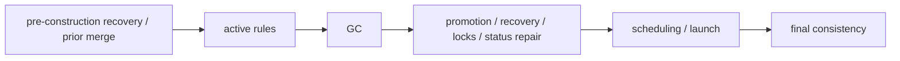

# Stateless CI & Self-Healing State Recovery

This document provides detailed specifications for Orchestune's stateless execution model, self-healing state recovery from GitHub as the single source of truth, reclaim count management, and the repository consistency control loop. For the high-level system overview and core design principles, see [Architecture & Design](../architecture.md).

---

## 1. Stateless CI Execution Model & Self-Healing

Orchestune's dispatcher is designed to run in **stateless CI environments (such as GitHub Actions)** where local workspaces are destroyed at the end of each run.

Typically, orchestrator states are tracked in a local state file like `run_state.json`. If this file is lost, Orchestune reconstructs the state using the following **self-healing** flow:

```text
[Dispatcher Start]
       │
       ▼
[Read GitHub Issues & PRs]
       │
       ├─► status:in-progress Issues -> Treated as running
       ├─► status:blocked / status:queued -> Re-evaluated
       └─► Open PR branches -> Progress state reconstructed
       │
       ▼
[Reconstruct DAG State & Resume]
```

---

## 2. GitHub as the Source of Truth

* **GitHub as the Source of Truth**:
  By fetching active PR branches and GitHub Issue labels (`status:in-progress`, `status:blocked`, `status:queued`), Orchestune rebuilds the DAG state in memory and resumes the cycle seamlessly from where it left off.
* **Reclaim counts (#512)**:
  The zombie/timeout reclaim counts (the `task_reclaim_counts` ledger behind `--max-task-reclaims`) live only in `run_state.json`, so losing that file resets them to zero. A task that already exceeded the limit stays stopped even so, because its `status:blocked-human-review` label on GitHub is the source of truth — only tasks still below the limit start their count over.
* **Integration timeout budget (#820)**:
  Unlike the reclaim counts above, the integrator's timeout count is *not* kept in `run_state.json`. Each attempt writes canonical `reserved` / `finished` / `terminal` (and operator `reset`) event comments on the parent Issue, and the budget is rebuilt from every comment page, so a new runner, run ID or context cannot lose it. An unreadable, conflicting or unresolved history starts nothing; a `reserved` attempt with no result is held for a human instead of being re-run. A held worktree additionally leaves a local record under `worktrees/.holds/`, which reclaim and the temporary-branch GC honor. See [integration.md](integration.md#bounded-execution).

---

## 3. Repository Consistency Control Loop

State recovery is complemented by a repository-wide consistency kernel. Observers normalize facts from GitHub, Git, worktrees, processes, external executions, and `run_state.json` into an immutable `ObservedRepositoryState`. A pure derivation builds `DesiredRepositoryState` from task lifecycle, dependencies, dispatch policy, and the pending `TransitionIntent` journal. Pure invariants compare the two models and emit stable, evidence-bearing findings; planners may translate only known, automatic findings into typed `RepairCommand` values. `ConsistencySupervisor` is the only owner of repair decisions, ordering, bounded retries, authoritative re-observation, and result aggregation. Typed executors route commands to the existing low-level Forge, filesystem, process, and state-file operations only after their live preconditions have been revalidated.

The supervisor runs an authoritative full scan at cycle start and end, with targeted scans for process-local `StateChanged` events. The end scan therefore catches out-of-process changes that emitted no event. Modes are deliberately staged:

| Mode | Semantics |
|---|---|
| `off` | Do not run the additional repository-wide start/end control loop. The built-in safe Supervisor repair boundaries remain enabled for backward compatibility. |
| `shadow` | Run the additional repository-wide observe/derive/evaluate/plan loop without adding mutations. Built-in safe repairs still follow `--apply` as they do in `off`. |
| `repair` | In addition to the built-in safe repairs, execute finding or command codes explicitly named in the user repair allowlist. An empty user allowlist leaves the additional loop report-only. |

The backward-compatible built-in allowlist consists of the status findings `status.blocked-with-resolved-dependencies` and `status.primary-status-conflict`, plus the typed execution commands `execution.requeue`, `execution.update-bookkeeping`, and `execution.reclaim`. It is intentionally separate from `--consistency-repair-code`: an empty or limited user allowlist cannot disable these established repairs. Only codes that reached a built-in repair pass are removed from the later optional loop, so an attempted command is not retried in the same cycle while unattempted planner candidates remain eligible for explicit opt-in. When an execution command reaches that optional loop, it reuses the same guarded GC or recovery handler as its built-in boundary; it is not routed to an unbound placeholder.

With `--apply`, built-in boundaries may mutate and `repair` mode may also execute user-allowlisted codes. With `--no-apply`, no external or durable repair side effect is made: candidates are reported as deferred, GC events are previews, and recovery bookkeeping may update only the ephemeral in-memory preview used by that cycle. This gives the migration path `off` (established behavior) → `shadow` (inspect the additional reports) → `repair` with an empty allowlist (same mutations, explicit repair outcomes) → `repair` with a limited allowlist.

Repair mode executes at most the configured number of passes (1–5). Each pass rechecks live preconditions, records an Intent before a non-atomic status transition, executes an idempotent command key at most once per cycle, and performs a fresh full observation afterward. Unknown or stale observations, ambiguous ownership, manual/non-repairable findings, and non-allowlisted findings remain report-only. A command whose typed handler is unexpectedly absent fails closed; it is never delegated through a phase-owned `SKIPPED` fallback. Boundary and final-loop reports are merged into the final cycle JSON and `events.jsonl`, which distinguish `resolved`, `unresolved`, `deferred`, `failed`, and `observation-unknown`. A failed attempt remains visible after aggregation, and a failed authoritative re-observation is `observation-unknown`, not `resolved`; task- or parent-scoped unknown facts affect only outcomes with the same scope and subject, while a repository-scoped failure conservatively affects every outcome. Every pass also includes command status and diagnostics. New observers, invariants, planners, or executors extend their Protocol boundary rather than adding callbacks to the immutable state models.

---

<a id="dependency-record-postconditions"></a>

## 4. Cycle order and successful postconditions for record APIs

Dependency-related phases run in the following order. A later phase can re-query
the same `CycleContext` and observe the confirmed facts that an earlier phase
reflected through `CycleContext.record_*`.


```mermaid
flowchart LR
    A[pre-construction recovery / prior merge] --> B[active rules]
    B --> C[GC]
    C --> D[promotion / recovery / locks / status repair]
    D --> E[scheduling / launch]
    E --> F[final consistency]
```

| Operation | When it may be recorded | When it is not recorded |
| --- | --- | --- |
| completion (`record_completion`) | After required Forge work and persistence succeed and GC emits a `CompletionReceipt` for normal completion or a verified prior merge | Dry run, dirty hold, Forge error, token-limit escalation, or another non-completion exit |
| launch (`record_launch`) | After the process / external execution starts and the first `RunState` save succeeds | Reservation only, unknown outcome, launch failure, or save failure |
| transition (`record_transition`) | After live verification of the expected primary state, required `TransitionIntent` journal settlement, and an authoritative execution-state observation | `SKIPPED`, `FAILED`, verification mismatch, or unknown execution state |

`RecordResult.status` is `APPLIED` for a new confirmed change, `NOOP` for an
identical retry, and `CONFLICT` for an unknown Issue, stale premise,
contradiction, or attempted rollback of completion. Record APIs update only
in-memory confirmed changes; they perform no external I/O, distributed
transaction, or automatic rollback. If the Issue-label update fails after a
launch and its first `RunState` save, the persisted launch is retained as recovery
evidence. Likewise, a record `CONFLICT` after an external action does not pretend
that the external action was rolled back.

<a id="dependency-fresh-validation"></a>

## 5. The status-repair pre-execution validation exception

Fresh status-repair pre-execution validation is an intentional exception to the
single-`CycleContext`-port rule. Immediately before a non-atomic Forge mutation,
`evaluate_fresh_dependencies` re-fetches the subject Issue and dependency labels,
then evaluates preconditions with the same Identity Resolution, Lifecycle
Assessment, and Use-case Policy as the normal path. A dependency missing from the
fresh population or failing re-resolution never becomes an empty dependency set;
it remains unresolved and fails closed. The check also distinguishes an initially
observed `DONE` label from confirmed completion evidence created by a successful
same-cycle action or verified prior merge. Only live verification and journal
settlement bridge the result to `record_transition`; unknown execution liveness
holds the record instead of guessing.

---

## Local claim recovery (`orchestune recover`)

Local claim resumption, footprint amendment, and completion do not read or write owner token files.
Instead, they verify the generation, Git common directory, registered worktree, and currently checked-out branch recorded in the caller's claim marker.
Any surviving legacy token files do no harm. Old state or journal records retaining `owner_token_digest` are read as compatibility metadata, so neither a wholesale migration nor wiping the state file is required. Routine API authentication remains unchanged.

Run diagnostics from the primary checkout. The default mode is a preview with no side effects:

```bash
orchestune recover --issue <N>
orchestune recover --issue <N> --claim-id <ID> --reason "worker process stopped" --apply
# Repair a missing marker and resume uncompleted completion:
orchestune recover --issue <N> --claim-id <ID> --reason "missing marker" --restore-marker --apply
```

Specify the claim ID discovered in diagnostics. When applying, the command re-evaluates preconditions under shared state and worktree locks.
Active workers, ambiguous or external launches, generation mismatches, different repositories, and pending completion publication are held rather than touched.
If execution status is uncertain, verify via Dispatcher. If publication is midway, restore the marker and resume completion with the original completion ID. Both interactive and dispatch claims are supported after confirming process termination.
Use `--state <path>` to target the same ledger file as the Dispatcher.

Release removes only the targeted active reservation, saving the generation and reason into a recovery receipt.
Dirty changes, commits, worktrees, branches, other claims, reclaim counts, transition intents, and completion evidence are strictly preserved.
GitHub Issue labels and state are not modified. Requeuing, completion, and closing follow existing engine/Outcome paths.
The Dispatcher never resurrects an explicitly released generation. Re-executing the same release is idempotent.
There is no need to delete `run_state.json`.

Merged PRs can also be completed retroactively through the standard complete command. It verifies the Issue number, claim timestamp, head branch, target base branch, repository identity, merge commit reachability, and Issue reopen timestamp. Merges into parent branches are also eligible.
CI verification and Outcome publication requirements remain enforced; missing evidence results in a hold.

---

<a id="active-worktree-lifecycle"></a>

## 6. Execution Ledger Model, Lifecycle, and Ownership Contracts (ActiveWorktree & Lifecycle)

Orchestune's execution ledger (`ledger`) is the L2 foundation responsible for immutably and safely managing task worktrees, execution states, ownership boundaries, and completion records. In #1106, the legacy flat structure of 35 mixed fields (in a 36-field schema including optional `completion_policy_config`) was redesigned into explicit owner subrecords and a deterministic candidate lifecycle derivation model.

### 6.1 Subrecords Architecture and Immutability

`ActiveWorktree` is composed of `core: ActiveWorktreeCore` holding common identity fields, and three frozen dataclass subrecords segregated by concern and owner: `launch: LaunchInfo`, `claim: ClaimInfo`, and `completion: ActiveCompletionJournal`.

- **Only in-memory source of truth**: `core`, `launch`, `claim`, and `completion` constitute the **only in-memory source of truth**. Legacy flat attribute compatibility properties have been completely removed. `ActiveWorktree` defines `slots=True`, so attempting to read or assign to an unmapped flat attribute fails immediately with `AttributeError`.
- **Deep immutability and immutable payload**: `completion.completion_payload` and `completion.completion_policy_config` are recursively converted by `_freeze_json` into `MappingProxyType` and nested tuples. Mutating dictionary operations (`update`, `pop`, `clear`, `setdefault`) on `completion_payload` are rejected at runtime.
- **Immutable update boundaries**: All subrecords are frozen. Their fields cannot be mutated. Owner copy APIs (`with_claim`, `with_launch`, `with_completion`, `with_core`) replace whole records. When observers retain the active object's identity, `dispatch.launch_state.update_launch` and `ActiveWorktree.update_core` apply updates in place through the owning boundary. Recovery identity materialization belongs to `ActiveWorktree.materialize_claim_for_persistence`.

### 6.2 Flat JSON Invariance and Backward Compatibility

While in-memory representations use nested subrecords, disk persistence strictly maintains backward compatibility.

- **Flat JSON invariance**: The JSON format persisted to `run_state.json` preserves the post-#1122 main baseline pinned by `tests/fixtures/active_worktree_compat` (the frozen 36-field `_ACTIVE_FIELD_NAMES` ordering, with `completion_policy_config` omitted when null, producing 35 keys by default). T01's original inventory and subsequent baseline/cutover corrections are retained in the [migration contract](../../active-worktree-migration-contract.md).
- **No schema_version introduced**: Neither a `schema_version` nor nested JSON is introduced, preventing file corruption or version incompatibility with existing Orchestune installations, and ensuring seamless rollback safety.
- **Canonical construction versus legacy decoding**: New `LaunchInfo`, `ClaimInfo`, and `ActiveCompletionJournal` validate types, enum values, finite timestamps, and completion progress requiring an ID. `ActiveWorktree.from_records` revalidates all owner records. The codec alone enables the private `_legacy` construction mode for already validated persistence data, preserving prior valid states and defaults. This mode survives replacements of loaded records, is absent from dataclass fields/JSON, and is cleared by canonical construction. Existing dispatch-plus-claim and live-PID-plus-completion states remain valid.
- **Explicit codec**: `ledger.active_codec` (`decode_active_worktree` / `encode_active_worktree`) exclusively owns bidirectional translation between in-memory nested structures and persisted flat JSON records.
- **Concurrency control and lock protection**: Preconditions requiring `run_state_lock` before saving and CAS defense-in-depth remain invariant.

### 6.3 Candidate Lifecycle Priority Table (ActiveWorktreeLifecycle)

`ledger.active_lifecycle.lifecycle(active)` derives the highest-priority **candidate phase** for a task from its persisted fields using the following strict order of precedence (evaluated top-down):

| Candidate phase (`ActiveWorktreeLifecycle`) | Condition, checked in order |
| --- | --- |
| `HANDOFF_READY` | `completion.completion_handoff_ready == True` or `completion.completion_stage in ("handed_off_to_gc", "handed_off")` |
| `COMPLETING` | `completion.completion_id is not None` |
| `RUNNING` | `launch.pid is not None`, `launch.external_id is not None`, or `launch.launch_phase == "launched"` |
| `LAUNCHING` | `launch.started_at is not None`, `launch.launch_attempt_id is not None`, or another `launch.launch_phase` is present |
| `RECOVERY_REQUIRED` | `claim.claim_id` starts with `"recovered-"`, or `claim.owner_token_digest` matches the sentinel `sha256("recovered-unverifiable:...".encode()).hexdigest()` |
| `CLAIMED` | `claim.owner_kind == "interactive"`, `claim.claim_stage is not None`, and `claim.claim_stage != "reserved"` |
| `RESERVED` | Initial reservation fallback when none of the above conditions match (including in-memory records where `claim_stage` is omitted; persisted records require `claim_stage`) |

### 6.4 Handoff Candidates vs Verified Completion Receipts

- **Distinction between candidate and verified evidence**: The `HANDOFF_READY` returned by `lifecycle(active)` is only a **candidate phase** derived from local ledger flags and stages. It does not establish that completion evidence has been authoritatively verified.
- **GC and authoritative verification**: `dispatch.gc.handoff` checks matching ledger/journal generations, repository identity, and the GitHub Issue comment (Outcome Record). For `done`, it additionally verifies PR merged state (`MERGED`), head/base identity, merge commit reachability, and recorded prepublication policy evidence. Worktree removal checks ownership, current/running worktree protection, dirty state, and the recorded done head. A verified `blocked` or `not-needed` outcome may release its reservation while retaining a dirty worktree; these outcomes do not require a merged PR. Parent integration has its own policy checks.
- **CompletionReceipt emission**: A **verified** `CompletionReceipt` is emitted only for a successfully collected `done` outcome and recorded through `CycleContext.record_completion`. Releasing a `blocked` or `not-needed` reservation does not emit this receipt. Incomplete or mismatched verification produces a `hold`, preventing deletion or premature completion.

`ledger.active_lifecycle.has_completion_reservation(active)` combines the candidate phase with a non-null journal ID. A historical handoff marker without an ID is a candidate, not a reservation. Claim, complete, and GC callers use this central predicate rather than direct `completion_id` None checks. Identity comparisons, assertions, and evidence/receipt verification retain their separate meanings.

### 6.5 Consistency Projection

- **Decoupled consistency kernel**: The repository-wide `consistency` kernel does not depend directly on the internal structure of `ActiveWorktree`.
- **Projection to ExecutionRecord**: `_DispatchConsistencyAdapter._executions()` (`orchestune.dispatch.cycle`) and `execution_repair.py` (`execution_record_from_active`) extract minimal fields (`issue_number`, `branch`, `worktree_path`, `pid`, `external_id`, `started_at`, `kind`, `owner_kind`, `claim_id`, `claim_stage`, `launch_phase`) from `ActiveWorktree` and map them into an immutable `ExecutionRecord` **projection**.
- **Boundary preservation**: Consistency observation (`ObservationCollector`) interacts exclusively with projected records, inspecting facts and planning repairs without encroaching on ledger subrecord ownership boundaries.

### 6.6 Owner Boundaries and AST Guards

- **Strict owner modules**: Constructing `ActiveWorktree` and updating subrecord boundaries is restricted to designated owner modules:
  - `claim`: `orchestune.claim.ownership`, `orchestune.claim.service`, `orchestune.claim.amend` (`build_claim_info`, `with_claim`)
  - `launch`: `orchestune.dispatch.launch_state` (`build_launch_record`, `with_launch`, `with_launch_phase`)
  - `completion`: `orchestune.complete.journal` (`active_completion_from_record`, `with_completion`)
  - `core` and persistence recovery identity: `orchestune.ledger.active_records` (`ActiveWorktree.from_records`, `with_core`, `update_core`, `materialize_claim_for_persistence`)
  - codec and model construction: `orchestune.ledger.active_codec` (`decode_active_worktree`), `orchestune.ledger.active_records` (`ActiveWorktree`)
- **Mechanical enforcement via AST guards**: Architecture tests (`tests/test_active_worktree_ownership_architecture.py`) statically inspect source ASTs to enforce:
  1. No assignment to subrecord fields or replacement of whole records outside their owner modules; in-place owner APIs preserve active identity without caller exemptions
  2. No unauthorized replacement via `dataclasses.replace` or import aliases; recovered PR adoption uses the core and launch owner APIs
  3. No construction of `ActiveWorktree` / `ActiveWorktree.from_records` outside `ALLOWED_CONSTRUCTOR_MODULES` (the claim owner modules, `dispatch.launch_state`, `ledger.active_records`, and `ledger.active_codec`; `complete.journal` owns completion updates, not full-record construction)
  4. No mutating method calls (`update`, `pop`, `clear`, `setdefault`) on frozen payloads
  5. No raw `completion_id is (not) None` stage checks outside the central `lifecycle` and `has_completion_reservation` definitions
  6. No `_legacy` validation bypass outside the model/codec boundary

### 6.7 Epic #1106 Acceptance Criteria and Evidence Mapping

The table maps parent Epic #1106 to T01–T14 and the acceptance follow-up #1170. That follow-up removes caller reservation-check and owner-write exemptions, adds canonical subrecord validation without tightening legacy load, and synchronizes this evidence. Consistency continues to use the independent `ExecutionRecord` projection boundary; introducing a dependency on ledger internals is outside this refactoring.

| #1106 Acceptance Criteria | Implemented Subtasks | Verification Evidence & Test Suites |
| :--- | :--- | :--- |
| `ActiveWorktreeLifecycle` and `lifecycle()` exist, and stage checks across GC (`dispatch.gc.completion`, `dispatch.gc.zombies`) and claim (`claim.ownership`) route through it (consistency uses the projected `ExecutionRecord` boundary, and complete uses dedicated owner APIs). Callers use the central reservation predicate; no caller exemption for direct `completion_id` None stage checks remains. | T02 (#1124), T04 (#1126), T05 (#1129), T07 (#1131), T08 (#1132), T09 (#1133), T10 (#1127), T13 (#1135) | `tests/test_active_worktree_records.py`, `tests/test_active_worktree_ownership_architecture.py`, `tests/test_dispatch_consistency_e2e.py` |
| `ActiveWorktree` is composed of core fields (`ActiveWorktreeCore`) and `LaunchInfo` / `ClaimInfo` / `ActiveCompletionJournal` frozen subrecords, with typed structure (`slots=True`) and owner update boundaries enforced per subrecord (new records validate their invariants; legacy JSON retains its established persistence validation). | T03 (#1125), T04 (#1126), T05 (#1129), T06 (#1130), T12 (#1134) | `tests/test_active_worktree_records.py`, `tests/test_active_worktree_codec.py`, `tests/test_claim_ownership.py` |
| Architecture tests reject non-owner subrecord field updates without caller exemptions, demonstrated with synthetic violation and valid cases. | T13 (#1135) | `tests/test_active_worktree_ownership_architecture.py`, `tests/test_architecture.py` |
| Valid `run_state.json` files from prior main (representative examples: dispatch launch, interactive claim, completion journal in progress, handoff ready) load successfully, and saved canonical byte representations match golden. | T01 (#1123), T03 (#1125), T12 (#1134) | `tests/test_active_worktree_compat_baseline.py`, `tests/test_active_worktree_codec.py` |
| Persistence rejection without holding locks and existing mutual exclusion guarantees are preserved. | T01 (#1123), T03 (#1125), T12 (#1134) | `tests/test_ledger_run_state.py`, `tests/test_active_worktree_codec.py` |
| Bilingual state-recovery architecture documents are updated and synchronized. | T14 (#1136, this task) | `docs/ja/architecture/state-recovery.md`, `docs/en/architecture/state-recovery.md`, `tests/test_dependency_architecture_docs.py` |
| Local CI passes cleanly for the operating system (Linux/macOS: `./scripts/local-ci.sh`, Windows: `.\scripts\local-ci.ps1`). | T01–T14 all PRs | Clean pass on `./scripts/local-ci.sh` (Linux CI) |
| Reference enumeration across all 35 fields (and 36 in full schema) with classified rationale, including the subsequently documented cutover enumeration misses. | T01 (#1123) and subtasks | [T01 inventory and appended T12 corrections](../../active-worktree-migration-contract.md), Walkthrough / Impact Scope tables in each PR |
