# Lifecycle of `status:*` labels

Orchestune keeps each subtask's progress as the Source of Truth in the
`status:*` labels on its GitHub Issue (as described in the "Self-Healing"
section of [Architecture](./architecture.md): even if `run_state.json` is
lost, state can be reconstructed from these labels and open PRs). This
document lists, for each of the nine `status:*` labels, when it is applied,
removed, or transitioned, by which code, and under what condition.

The canonical list of labels is `REQUIRED_LABELS` in `orchestune/forge.py`
(automatically created on GitHub when `orchestune bootstrap` runs).

## Label overview

| Label | Meaning |
|---|---|
| `status:queued` | Ready to be picked up by the dispatcher |
| `status:blocked` | Blocked on unresolved dependencies |
| `status:in-progress` | An agent has been launched and is working on it |
| `status:done` | Subtask work is complete |
| `status:not-needed` | Determined to be unnecessary (already implemented on main, etc.) |
| `status:blocked-human-review` | Paused pending human review |
| `status:blocked-recompute` | Blocked as a side effect of DAG recomputation triggered by a footprint deviation |
| `status:force-serial` | Forced to run serially after DAG-recompute retries are exhausted |
| `status:manual-merge-required` | Automatic rebase failed; a human needs to merge manually |

## State diagram

```mermaid
stateDiagram-v2
    [*] --> queued: Issue creation\n(no deps / already resolved)
    [*] --> blocked: Issue creation\n(unresolved deps)

    blocked --> queued: Dependency resolved\n(_promote_blocked_tasks)
    blocked --> blocked_recompute: DAG recompute from footprint deviation\n(notify_recompute)

    queued --> in_progress: Launch succeeded\n(_apply_task_launches)
    queued --> blocked: YAML parse error\n(_apply_yaml_error_blocking)
    queued --> blocked_human_review: Duplicate launch detected\n(_apply_duplicate_skip)
    blocked --> blocked_human_review: Duplicate launch detected\n(_apply_duplicate_skip)

    in_progress --> done: Process exited with new commits\n(_finalize_completed_worktree)
    in_progress --> blocked_human_review: Process exited with no new commits\n(_finalize_completed_worktree)
    in_progress --> blocked_human_review: Upstream PR got CHANGES_REQUESTED\n(_apply_changes_requested_escalation)
    in_progress --> manual_merge_required: Automatic rebase failed\n(_apply_auto_rebase)
    in_progress --> queued: Zombie/timeout reclaimed by GC\n(_collect_zombies_and_timeouts)
    in_progress --> not_needed: status:not-needed label detected\n(closed, or pending review)
    in_progress --> blocked: Stale bookkeeping entry discarded\n(_apply_stale_active_entry_discard;\nthe label itself was already changed externally)

    done --> queued: Rolled back after Integrator's provisional-merge CI failed\n(handle_merge_failure)

    note right of blocked_recompute
        Not a standalone terminal state: it is added
        to a dependent Issue alongside the existing
        status:blocked label.
    end note
```

`status:external-lock` is a cross-cutting state applied and removed
independently of the lifecycle above (see "External lock" below).

## Transition details

### 1. Initial assignment: `status:queued` / `status:blocked`
- Source: `skills/orchestune-dispatch/SKILL.md` (at Issue creation time, `gh issue create`)
- Condition: `status:blocked` if the task has unresolved upstream dependencies
  (`depends_on`); `status:queued` if there are none or all are already resolved.

### 2. `status:blocked` → `status:queued` (promotion on dependency resolution)
- Source: `_promote_blocked_tasks` in `orchestune/dispatch_cycle.py`
  (`_decide_blocked_promotions` / `_apply_blocked_promotions`)
- Condition: every entry in `depends_on` is resolved, i.e. `status:done` or
  `status:not-needed` (subtasks completed earlier in the same cycle are also
  counted via `completed_subtask_ids`).

### 3. `status:queued` / `status:blocked` → `status:in-progress` (launch)
- Source: `_apply_task_launches` in `orchestune/dispatch_launch.py`
- Condition: the task was selected within quota and
  `create_worktree_and_launch` (worktree creation + agent launch) succeeded.

### 4. `status:in-progress` → `status:done` (completion)
- Source: `_finalize_completed_worktree` in `orchestune/dispatch_gc.py`
- Condition: the agent process exited, the worktree has no uncommitted
  changes, and there is at least one real commit ahead of `base_branch`.

### 5. `status:in-progress` → `status:blocked-human-review` (empty-commit completion)
- Source: `_finalize_completed_worktree` in `orchestune/dispatch_gc.py`
- Condition: the process exited and the worktree is clean, but there are zero
  new commits against `base_branch` (likely nothing was actually implemented,
  e.g. due to a permission denial), so automatic completion and dependent
  promotion are withheld.

### 6. `status:in-progress` → `status:blocked-human-review` (duplicate launch detected)
- Source: `_apply_duplicate_skip` in `orchestune/dispatch_launch.py`
- Condition: an open PR already exists for the candidate's expected branch,
  and it has been updated to a commit different from the last recorded
  completion (likely human intervention). The same transition can also occur
  from `status:queued` / `status:blocked`.

### 7. `status:in-progress` → `status:blocked-human-review` (CHANGES_REQUESTED)
- Source: `_apply_changes_requested_escalation` in `orchestune/dispatch_cycle.py`
- Condition: an upstream PR received a CHANGES_REQUESTED review on GitHub,
  pausing the stacked task.

### 8. `status:in-progress` → `status:manual-merge-required` (automatic rebase failed)
- Source: `_apply_auto_rebase` in `orchestune/dispatch_rebase.py`
- Condition: an automatic rebase was attempted after detecting that an
  upstream dependency's PR passed CI, but it hit a conflict or the local CI
  run after rebasing failed.

### 9. `status:in-progress` → `status:queued` (GC reclaim)
- Source: `_collect_zombies_and_timeouts` in `orchestune/dispatch_gc.py`
- Condition: the process disappeared while uncommitted changes remain
  (zombie), or the task timed out. Uncommitted work is stashed as a WIP
  commit before requeuing.

### 10. `status:in-progress` → closed, or pending `not-needed-review:*`
- Source: `_finalize_not_needed_worktree` in `orchestune/dispatch_gc.py`
- Condition: the session applied the `status:not-needed` label. If a cloud
  routine is available, the Issue is not closed immediately; an independent
  verification review is dispatched (`orchestune/integration_coordinator.py`)
  and the Issue is closed in a later cycle based on the review outcome.
  In local environments it is closed immediately as before.

### 11. `status:done` → `status:queued` (rollback on provisional-merge CI failure)
- Source: `handle_merge_failure` in `orchestune/integrator_pr.py`
- Condition: the Integrator's post-merge local CI run failed, so the merge is
  reverted and the task is sent back to the queue.

### 12. DAG recompute from footprint deviation (`status:blocked-recompute` / `status:force-serial`)
- Source: `_apply_footprint_deviation_outcome` in `orchestune/dispatch_rebase.py`
  (`notify_recompute` / `notify_force_serial`)
- Condition: an active worktree's actual changed files deviated from its
  declared `footprint`, triggering a DAG recompute; any dependent Issue with a
  detected conflict gets `status:blocked-recompute`. If recompute retries hit
  `max_recompute_retries`, the task itself gets `status:force-serial` and
  subsequent cycles zero out the launch quota to fall back to serial
  execution for that single task (see
  [#92](https://github.com/Saltmu/orchestune/issues/92) for the known issue
  that this also blocks unrelated tasks from launching).

### 13. External lock (`status:external-lock`)
- Source: `_apply_external_lock_sync` in `orchestune/dispatch_cycle.py`
  (decided by `scan_external_locks` in `orchestune/dispatch_locks.py`)
- Applied when: a task's footprint overlaps with the changed files of a
  remote branch or PR that Orchestune does not manage (tasks already
  `status:done` are excluded).
- Removed when: the overlap is gone. If a task reached `status:done` while
  still locked, the lock is removed as well; on removal, a task that is not
  yet `status:done` is put back to `status:queued`.
- This is a cross-cutting state that can be applied/removed at any point,
  independently of the rest of the lifecycle.

## Related labels (not `status:*`, but closely related)

- `not-needed-review:passed` / `not-needed-review:failed`: outcome of the
  independent verification review for `status:not-needed`
  (`orchestune/integration_coordinator.py`). Used only to decide whether to
  close a verified Issue; not part of the `status:*` transitions.
- `priority:high` / `priority:medium` / `priority:low`: used for launch
  ordering, but do not participate in lifecycle transitions.
- `risk:flagged` / `progress:partial`: visualization-only labels; they do not
  act as additional approval gates (see
  [Architecture](./architecture.md#4-human-approval-points)).
