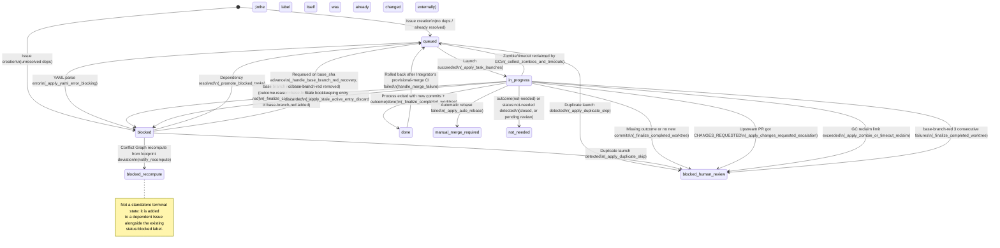

# Lifecycle of `status:*` labels

Orchestune keeps each subtask's progress as the Source of Truth in the
`status:*` labels on its GitHub Issue (as described in the "Self-Healing"
section of [Architecture](./architecture.md): even if `run_state.json` is
lost, state can be reconstructed from these labels and open PRs). This
document lists, for each of the nine `status:*` labels, when it is applied,
removed, or transitioned, by which code, and under what condition.

The canonical list of labels is `REQUIRED_LABELS` in `orchestune/forge.py`
(automatically created on GitHub when `orchestune bootstrap` runs).

## Label overview

| Label | Meaning |
|---|---|
| `status:queued` | Ready to be picked up by the dispatcher |
| `status:blocked` | Blocked on unresolved dependencies |
| `status:in-progress` | An agent has been launched and is working on it |
| `status:done` | Subtask work is complete |
| `status:not-needed` | Determined to be unnecessary (already implemented on main, etc.) |
| `status:blocked-human-review` | Paused pending human review |
| `status:blocked-recompute` | Blocked as a side effect of Conflict Graph recomputation triggered by a footprint deviation |
| `status:force-serial` | Forced to run serially after DAG-recompute retries are exhausted |
| `status:manual-merge-required` | Automatic rebase failed; a human needs to merge manually |

## State diagram

```mermaid
stateDiagram-v2
    [*] --> queued: Issue creation\n(no deps / already resolved)
    [*] --> blocked: Issue creation\n(unresolved deps)

    blocked --> queued: Dependency resolved\n(_promote_blocked_tasks)
    blocked --> blocked_recompute: Conflict Graph recompute from footprint deviation\n(notify_recompute)

    queued --> in_progress: Launch succeeded\n(_apply_task_launches)
    queued --> blocked: YAML parse error\n(_apply_yaml_error_blocking)
    queued --> blocked_human_review: Duplicate launch detected\n(_apply_duplicate_skip)
    blocked --> blocked_human_review: Duplicate launch detected\n(_apply_duplicate_skip)

    in_progress --> done: Process exited with new commits + outcome(done)\n(_finalize_completed_worktree)
    in_progress --> blocked_human_review: Missing outcome or no new commits\n(_finalize_completed_worktree)
    in_progress --> blocked_human_review: Upstream PR got CHANGES_REQUESTED\n(_apply_changes_requested_escalation)
    in_progress --> manual_merge_required: Automatic rebase failed\n(_apply_auto_rebase)
    in_progress --> queued: Zombie/timeout reclaimed by GC\n(_collect_zombies_and_timeouts)
    in_progress --> blocked_human_review: GC reclaim limit exceeded\n(_apply_zombie_or_timeout_reclaim)
    in_progress --> not_needed: outcome(not-needed) or status:not-needed detected\n(closed, or pending review)
    in_progress --> blocked: base branch red detected (outcome.reason=base-branch-red)\n(_finalize_completed_worktree, ci:base-branch-red added)
    blocked --> queued: Requeued on base_sha advance\n(_handle_base_branch_red_recovery, ci:base-branch-red removed)
    in_progress --> blocked_human_review: base-branch-red 3 consecutive failures\n(_finalize_completed_worktree)
    in_progress --> blocked: Stale bookkeeping entry discarded\n(_apply_stale_active_entry_discard;\nthe label itself was already changed externally)

    done --> queued: Rolled back after Integrator's provisional-merge CI failed\n(handle_merge_failure)

    note right of blocked_recompute
        Not a standalone terminal state: it is added
        to a dependent Issue alongside the existing
        status:blocked label.
    end note
```

`status:external-lock` is a cross-cutting state applied and removed
independently of the lifecycle above (see "External lock" below).

## Transition details

### 1. Initial assignment: `status:queued` / `status:blocked`
- Source: `skills/orchestune-provision/SKILL.md` (at Issue creation time, `gh issue create` / `orchestune provision`)
- Condition: `status:blocked` if the task has unresolved upstream dependencies
  (`depends_on`); `status:queued` if there are none or all are already resolved.

### 2. `status:blocked` → `status:queued` (promotion on dependency resolution)
- Source: `_promote_blocked_tasks` in `orchestune/dispatch/cycle.py`
  (`_decide_blocked_promotions` / `_apply_blocked_promotions`)
- Condition: every entry in `depends_on` is resolved, i.e. `status:done` or
  `status:not-needed` (subtasks completed earlier in the same cycle are also
  counted via `completed_subtask_ids`).

### 3. `status:queued` / `status:blocked` → `status:in-progress` (launch)
- Source: `_apply_task_launches` in `orchestune/dispatch/launch.py`
- Condition: the task was selected within quota and
  `create_worktree_and_launch` (worktree creation + agent launch) succeeded.

### 4. `status:in-progress` → `status:done` (completion)
- Source: `_finalize_completed_worktree` in `orchestune/dispatch/gc/__init__.py`
- Condition: the agent process exited, the worktree has no uncommitted
  changes, there is at least one real commit ahead of `base_branch`, and
  a valid outcome record (`orchestune:outcome` with `result: done`) was
  confirmed on the PR or Issue comments.

### 5. `status:in-progress` → `status:blocked-human-review` (empty-commit completion or missing outcome)
- Source: `_finalize_completed_worktree` in `orchestune/dispatch/gc/__init__.py`
- Condition: the process exited and the worktree is clean, but either there are zero
  new commits against `base_branch` (empty-commit completion, likely nothing was actually implemented,
  e.g. due to a permission denial), or new commits exist but no valid outcome record
  (`orchestune:outcome`) was found (missing outcome completion, review cycle incomplete or exited prematurely).
  In either case, automatic completion and dependent promotion are withheld, and the task fail-closes to `status:blocked-human-review`.

### 6. `status:in-progress` → `status:blocked-human-review` (duplicate launch detected)
- Source: `_apply_duplicate_skip` in `orchestune/dispatch/launch.py`
- Condition: an open PR already exists for the candidate's expected branch,
  and it has been updated to a commit different from the last recorded
  completion (likely human intervention). The same transition can also occur
  from `status:queued` / `status:blocked`.

### 7. `status:in-progress` → `status:blocked-human-review` (CHANGES_REQUESTED)
- Source: `_apply_changes_requested_escalation` in `orchestune/dispatch/cycle.py`
- Condition: an upstream PR received a CHANGES_REQUESTED review on GitHub,
  pausing the stacked task.

> **Note (#109)**: transitions 5-7 above all delegate to
> `apply_human_review_escalation` in `orchestune/dispatch/escalation.py` (the
> shared logic: remove the current `status:*` label, add
> `status:blocked-human-review`, then post the reason as a comment). Each
> caller (`_finalize_completed_worktree` / `_apply_duplicate_skip` /
> `_apply_changes_requested_escalation`) is now a thin layer that only decides
> *why* to escalate before calling this shared function.

### 8. `status:in-progress` → `status:manual-merge-required` (automatic rebase failed)
- Source: `_apply_auto_rebase` in `orchestune/dispatch/rebase.py`
- Condition: an automatic rebase was attempted after detecting that an
  upstream dependency's PR passed CI, but it hit a conflict or the local CI
  run after rebasing failed.

### 9. `status:in-progress` → `status:queued` (GC reclaim)
- Source: `_collect_zombies_and_timeouts` in `orchestune/dispatch/gc/__init__.py`
- Condition: the process disappeared while uncommitted changes remain
  (zombie), or the task timed out. Uncommitted work is stashed as a WIP
  commit before requeuing.
- Retry bound ([#512](https://github.com/Saltmu/orchestune/issues/512)): the same
  task may be requeued at most `max_task_reclaims` times (`--max-task-reclaims`,
  3 by default); beyond that it takes transition 9-b below. The count lives in
  the `task_reclaim_counts` ledger in `run_state.json` and is persisted *before*
  the label transition (exposing `status:queued` first and stopping before the
  save would let a relaunch happen without counting the reclaim). The record is
  discarded when a dispatch cycle observes on GitHub that the Issue is **closed**
  (`discard_reclaim_counts_for_closed_issues` in `dispatch.cycle_context`).
  Neither `status:done` (the worker finished) nor dispatching the independent
  `status:not-needed` review clears it: the former can still be returned to
  `status:queued` by an Integrator provisional-merge CI failure, the latter by a
  rejected review. A closed Issue is never relaunched automatically, and because
  the rule is re-derived from GitHub every cycle, the discard does not need to be
  persisted immediately. Note that if an Issue is closed and reopened before any
  cycle observes the closure, the previous count is inherited — the reopened task
  can therefore reach human-review escalation sooner than a fresh one (the error
  is on the safe side: it stops earlier rather than looping).

### 9-b. `status:in-progress` → `status:blocked-human-review` (GC reclaim limit exceeded)
- Source: `_apply_zombie_or_timeout_reclaim` in `orchestune/dispatch/gc/zombies.py`
- Condition: the cumulative number of zombie/timeout reclaims for a task exceeds
  `max_task_reclaims`. Instead of returning it to `status:queued`, the task stops
  for human review with the reclaim count and the last reason posted as a
  comment — so a task that structurally always times out cannot be relaunched
  forever. Like transitions 5-7, it goes through `apply_human_review_escalation`.
- The same limit also applies to the two paths where the GC repeatedly fails to
  finish a task on its own: when the WIP backup commit cannot be created
  (`_apply_backup_failure`), and when completion is held back because the worktree
  still has uncommitted changes (`_apply_dirty_worktree_hold`, the hold introduced
  by #212). In both cases the worktree is deliberately left in place to preserve
  the uncommitted work, and its path is named in the comment.

### 10. `status:in-progress` → closed, or pending `not-needed-review:*`
- Source: `_finalize_not_needed_worktree` / `_rule_not_needed` in `orchestune/dispatch/gc/__init__.py`
- Condition: the session produced an outcome record (`orchestune:outcome` with `result: not-needed`) or the `status:not-needed` label was set by external automation (workers themselves must not modify labels directly). If a cloud
  routine is available, the Issue is not closed immediately; an independent
  verification review is dispatched (`orchestune/integration_coordinator.py`)
  and the Issue is closed in a later cycle based on the review outcome.
  In local environments it is closed immediately as before.

### 10-b. `status:in-progress` → `status:blocked` + `ci:base-branch-red` (CI failed due to base branch) / Requeued on base_sha advance (#555)
- Source: `_finalize_completed_worktree` in `orchestune/dispatch/gc/__init__.py` (holding), `_handle_base_branch_red_recovery` in `orchestune/dispatch/reconciliation.py` (requeue)
- Condition:
  - **Hold**: When an agent session completes with an outcome record declaring `result: blocked` and `reason: base-branch-red`, the task transitions to `status:blocked` and receives the marker label `ci:base-branch-red` to be held without being promoted by normal dependency resolution (`_decide_blocked_promotions`).
  - **Requeue**: When the base branch commit (`base_sha`) advances, the `ci:base-branch-red` marker is removed, and if dependencies are satisfied, the task is moved back to `status:queued`.
  - **Escalation**: If `base-branch-red` occurs 3 consecutive times on the same task (`attempt >= 3`), automatic requeuing stops and the task escalates to `status:blocked-human-review` via `apply_human_review_escalation`.

### 11. `status:done` → `status:queued` (rollback on provisional-merge CI failure)
- Source: `handle_merge_failure` in `orchestune/integrator/pr.py`
- Condition: the Integrator's post-merge local CI run failed, so the merge is
  reverted and the task is sent back to the queue.

### 12. Conflict Graph recompute from footprint deviation (`status:blocked-recompute` / `status:force-serial`)
- Source: `_apply_footprint_deviation_outcome` in `orchestune/dispatch/rebase.py`
  (`notify_recompute` / `notify_force_serial`)
- Condition: an active worktree's actual changed files deviated from its
  declared `footprint`, triggering a Conflict Graph recompute; any Issue with a
  detected conflict gets `status:blocked-recompute`. If recompute retries hit
  `max_recompute_retries`, the task itself gets `status:force-serial` and
  subsequent cycles zero out the launch quota to fall back to serial
  execution for that single task (see
  [#92](https://github.com/Saltmu/orchestune/issues/92) for the known issue
  that this also blocks unrelated tasks from launching).

### 13. External lock (`status:external-lock`)
- Source: `_apply_external_lock_sync` in `orchestune/dispatch/cycle.py`
  (decided by `scan_external_locks` in `orchestune/dispatch/locks.py`)
- Applied when: a task's footprint overlaps with the changed files of a
  remote branch or PR that Orchestune does not manage (tasks already
  `status:done` are excluded).
- Removed when: the overlap is gone. If a task reached `status:done` while
  still locked, the lock is removed as well; on removal, a task that is not
  yet `status:done` is put back to `status:queued`.
- This is a cross-cutting state that can be applied/removed at any point,
  independently of the rest of the lifecycle.

## Issue closing (child and parent)

The transitions above cover `status:*` label changes on an *open* Issue. This
section covers the two places where Orchestune actually closes an Issue for
a normally-completed (non-`not-needed`) subtask, both added in
[#170](https://github.com/Saltmu/orchestune/issues/170) and both gated on the
dispatcher having been run with `--parent-issue <N>` (see
[Architecture §3](./architecture.md#3-integration--auto-rebase)).

### Child Issue: `status:done` (still open) → closed (`completed`)
- Source: `AutoMergeChildIntegrationStep` in `orchestune/integrator/`
- Condition: the child's integration PR (temp branch → `parent/issue-{N}`)
  passed CI and was auto-merged by the Integrator. The child Issue is closed
  immediately afterward with `reason=completed`, with no human involved. If
  the auto-merge itself fails (e.g. a conflict the temp-branch CI run didn't
  catch), the PR is left open and the Issue is **not** closed.
- Does not apply when the dispatcher runs without `--parent-issue`: in that
  flat/single-tier mode the integration PR still targets `main` directly, and
  per the "final merge is always by a human" rule, `AutoMergeChildIntegrationStep`
  is a no-op.

### Parent Issue: open → closed (`completed`)
- Source: `process_parent_completion` in `orchestune/integrator/parent_completion.py`,
  called once per apply-mode dispatch cycle when `--parent-issue` is set.
- Condition: `parent/issue-{N}` has been merged into `main` (checked via
  `github.is_branch_merged_into`) — i.e. a human merged the final PR that
  `ensure_parent_final_pr` (in `orchestune/integrator/pr.py`) opened once every
  child Issue under the parent was closed. The parent Issue is closed with
  `reason=completed`; already-closed parent Issues are left alone (checked via
  `github.get_issue_state`) to avoid a redundant close call.
- Two independent close paths (#681): `orchestune/integrator/final_pr_body.py`
  puts `Closes #{N}` on the first line of the final PR body. Because that PR
  targets the default branch (`main`), GitHub itself closes the parent Issue the
  moment a human merges it, and links the parent into the Issue's "Development"
  sidebar. The merge-detection close above is idempotent, so whichever path
  fires first, the outcome is the same.
- The same body carries an auto-generated table of every child Issue number and
  title, its merged subtask PR number, and its review result (the Outcome Record
  when present, otherwise the PR's `reviewDecision`). It gives the final reviewer
  a trail into each subtask's changes and AI review; if collection fails, only
  the table is dropped — opening the final PR still proceeds.

## Related labels (not `status:*`, but closely related)

- `not-needed-review:passed` / `not-needed-review:failed`: outcome of the
  independent verification review for `status:not-needed`
  (`orchestune/integrator/coordinator.py`). Used only to decide whether to
  close a verified Issue; not part of the `status:*` transitions.
- `integration:parent-branch-stale`: marker label the integrator sets on the
  parent Issue when a push to the parent branch is rejected as
  non-fast-forward (a CAS rejection, `orchestune/integrator/steps.py`).
  Living on a GitHub label rather than a local state file means the
  detection survives across cycles even when each cycle runs on a fresh
  runner (e.g. a scheduled GitHub Actions workflow, #437). It is cleared as
  soon as a later push succeeds. If staleness is detected again while the
  label is still set (i.e. two cycles in a row), that's treated as a likely
  configuration/operational anomaly: the affected child Issues are escalated
  to `status:blocked-human-review` and the label is cleared.
- `ci:base-branch-red`: marker label attached when a task encounters a CI failure
  caused by the base branch (`outcome.result=blocked` / `reason=base-branch-red`) (#555).
  Prevents erroneous dependency promotion (livelocks) while holding the task in
  `status:blocked`, and automatically unmarks and requeues (`status:queued`) the task
  once the base branch commit (`base_sha`) advances. If 3 consecutive failures occur,
  the task escalates to `status:blocked-human-review`.
- `priority:high` / `priority:medium` / `priority:low`: used for launch
  ordering, but do not participate in lifecycle transitions.
- `risk:flagged` / `progress:partial`: visualization-only labels; they do not
  act as additional approval gates (see
  [Architecture](./architecture.md#4-human-approval-points)).
