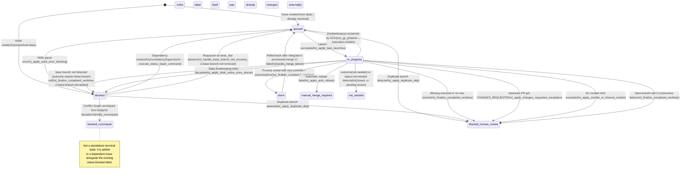

# Lifecycle of `status:*` labels

Orchestune keeps each subtask's progress as the Source of Truth in the
`status:*` labels on its GitHub Issue (as described in the "Self-Healing"
section of [Architecture](./architecture.md): even if `run_state.json` is
lost, state can be reconstructed from these labels and open PRs). This
document lists, for each of the ten `status:*` labels, when it is applied,
removed, or transitioned, by which code, and under what condition.

The canonical list of labels is `StatusLabel` in `orchestune/labels.py`
(and `REQUIRED_LABELS` in `orchestune/forge/admin.py`, automatically created on GitHub when `orchestune bootstrap` runs).

## Label overview

| Label | Meaning |
|---|---|
| `status:queued` | Ready to be picked up by the dispatcher |
| `status:blocked` | Blocked on unresolved dependencies |
| `status:in-progress` | An agent has been launched and is working on it |
| `status:done` | Subtask work is complete |
| `status:not-needed` | Determined to be unnecessary (already implemented on main, etc.) |
| `status:blocked-human-review` | Paused pending human review |
| `status:blocked-recompute` | Blocked as a side effect of Conflict Graph recomputation triggered by a footprint deviation |
| `status:force-serial` | Forced to run serially after DAG-recompute retries are exhausted |
| `status:manual-merge-required` | Automatic rebase failed; a human needs to merge manually |

## Roles and the normal transition table

`orchestune/ledger/status_machine.py` is a pure, Forge-independent module holding the
`status:*` role table, the normal lifecycle transitions, and the add/remove plan derived
from a label snapshot (it reads or writes no labels and runs no callbacks).
`transition_status_label` (`orchestune/ledger/status_labels.py`), which actually
re-labels an Issue, applies that plan in the order "add, then the ledger-commit callback,
then enumerate the old labels one at a time and remove each". Externally visible behaviour
(call history, lazy evaluation of the iterable, partial application on an exception) is unchanged.

### Roles (`LABEL_ROLES`)

| Role | Labels | Treatment |
|---|---|---|
| ACTIVE | `queued` / `blocked` / `in-progress` | Lifecycle; an Issue holds exactly one |
| ESCALATION | `blocked-human-review` / `manual-merge-required` | Lifecycle; needs a human |
| FINAL | `done` / `not-needed` | Lifecycle; terminal |
| AUXILIARY | `blocked-recompute` / `force-serial` / `external-lock` | Auxiliary; may coexist with a lifecycle label |

Uniqueness is checked over the seven lifecycle labels: ACTIVE, ESCALATION and FINAL together
(`LIFECYCLE_ROLES`). `PRIMARY_STATUS_LABELS` in `orchestune/ledger/status_labels.py` (the three
ACTIVE labels, ordered `in-progress` / `queued` / `blocked`) and `TERMINAL_ESCALATION_LABELS`
(the two ESCALATION labels) are derived from this role table using their existing explicit
order; their public names, types, values and order are unchanged. The same-named
`PRIMARY_STATUS_LABELS` in `consistency` is a different contract (the seven lifecycle labels)
and was not merged.

### Normal transition table (`ALLOWED_TRANSITIONS`)

**`ALLOWED_TRANSITIONS` is the source of truth** for normal lifecycle transitions. The table
below and the diagram follow it, and `tests/test_status_machine.py` checks them against it
mechanically. Every lifecycle label also has an explicit **self-transition** (for example
`blocked` → `blocked`) for re-running the same operation. The table is a policy and **production
does not reject an invalid transition** (protection of human-review labels stays with the
existing callers' decisions).

| source | target | Typical path |
|---|---|---|
| `status:queued` | `status:in-progress` | Launch success, claim, `reconcile_attempt` |
| `status:blocked` | `status:in-progress` | Stacked launch on the dependency's branch |
| `status:blocked` | `status:queued` | Dependency resolved, `blocked-recompute` cleared, requeue after the base SHA advanced |
| `status:queued` | `status:blocked` | YAML parse error, demotion for unresolved dependencies, launch failure, footprint-deviation recompute |
| `status:in-progress` | `status:queued` | GC reclaim, recovery requeue, reclaim of an abandoned cloud task |
| `status:in-progress` | `status:blocked` | Launch failure after a claim, completion hold, base branch red |
| `status:queued` | `status:blocked-human-review` | Escalation: invalid footprint, duplicate launch, insufficient actor permission |
| `status:blocked` | `status:blocked-human-review` | Escalation: duplicate launch, failed launch validation |
| `status:in-progress` | `status:blocked-human-review` | Escalation: missing outcome, CHANGES_REQUESTED, reclaim limit exceeded |
| `status:not-needed` | `status:blocked-human-review` | Timeout of the not-needed verification review (#511) |
| `status:in-progress` | `status:manual-merge-required` | Automatic rebase failure |
| `status:queued` | `status:done` | Completion confirmed (repair, `complete`) |
| `status:blocked` | `status:done` | Completion confirmed (repair, `complete`) |
| `status:in-progress` | `status:done` | Completion (GC done cleanup, `complete`, verified prior-merge repair) |
| `status:queued` | `status:not-needed` | Not-needed decision (replan, `complete`) |
| `status:blocked` | `status:not-needed` | Not-needed decision (replan, `complete`) |
| `status:in-progress` | `status:not-needed` | Not-needed decision (`complete`) |

### Classifying a transition

The source is the lifecycle label the Issue **actually holds**, not an element of `old_labels`
(which may include labels that are not present).

| Case | Definition | Verification |
|---|---|---|
| Normal | Exactly one lifecycle label held, and the pair is in `ALLOWED_TRANSITIONS` | Executed test per call site |
| Self / re-run | The held lifecycle label already equals the target | Label-state idempotency (callbacks are not guaranteed exactly-once) |
| Initialisation | Adding from a state with no lifecycle label | A separate source-less case; it does not meet the discoverability precondition |
| Repair | Several lifecycle labels held; the held set and removal candidates are explicit | Verified as a repair case; the normal table is not widened to admit it |
| Auxiliary | Adding or removing an auxiliary label | Not mixed into the lifecycle table; verified as coexistence/removal |

The call-site inventory, actual label sets and classification live in
`tests/test_status_transition_callsites.py`, which fails when a new call site is unregistered.
Paths that do not use the common adapter (the separate adapter in `complete/status_labels.py`,
`reconcile_labels` in `dispatch/gc/policy_effects.py`, `replan/operations.py`, the Integrator
rollback, and so on) are recorded in the same file but are outside this guarantee.

### Relation to the state diagram

Three kinds of edges in the diagram below differ from the table; none is a normal lifecycle transition:

- Initial assignment from `[*]`: an initialisation case with no source.
- `blocked` → `blocked_recompute`: adding an auxiliary label (the original `status:blocked` stays).
- `done` → `queued`: rollback after the Integrator's provisional-merge CI failed. `handle_merge_failure`
  adds and removes directly on the Forge, going through neither the common adapter nor the normal table.

### Invariants and the assumptions behind them

`tests/test_status_machine_stateful.py` checks the adapter's local safety with a failure-injecting
fake Forge and a Hypothesis `RuleBasedStateMachine`.

**A. Safety and retry without external changes** (one unrecovered operation at a time; no new
transition starts meanwhile):

- The Issue holds at least one lifecycle label before and after every operation of this system,
  and after a stop caused by a failure.
- An operation with a complete removal list that finishes normally leaves only the target.
- After a partial failure, with no external change, **one complete retry** (add, callback and
  every remove all succeed) converges to the target alone. Re-running the same operation then
  leaves the label set unchanged (the callback count may grow).
- Normal rules never choose ESCALATION → ACTIVE. **The common adapter itself is not guaranteed
  to refuse it.**

**B. Arbitrary external changes**: `external_relabel` may delete every lifecycle label, add
several, or add an ESCALATION label, so "at least one" / "exactly one after success" is not
required unconditionally right after it. The model bumps an epoch, drops the old pending retry from
the automatic rules, and resumes the A checks from a new snapshot that meets A's preconditions
(a test boundary, not a production generation counter). Repair and replanning after external
changes belong to #1218; scheduler-wide liveness to #1219.

Not guaranteed: endlessly repeating failures or external changes, system-wide liveness, other
adapters and direct Forge paths, and convergence when `old_labels` is incomplete (for example, with
`queued` and `done` held, removing only `queued` leaves `done`; this current behaviour is pinned by
the compatibility tests).

**Running and reproducing**:

- `uv run pytest tests/test_status_machine_stateful.py` (about 1.4 seconds on its own). The CI
  profile is `ci` registered in `tests/hypothesis_profiles.py` (loaded via `pytest_plugins` in `tests/conftest.py`) (`max_examples=100`, `stateful_step_count=30`,
  `deadline=None`, `print_blob=True`); a test checks that it is applied to the stateful
  `TestCase`. Another profile can be chosen with the `HYPOTHESIS_PROFILE` environment variable.
  `deadline=None` is not an upper bound on total run time.
- On failure Hypothesis prints a minimal counter-example as a `state.<rule>(...)` sequence. Run
  `uv run pytest tests/test_status_machine_stateful.py --hypothesis-seed=<N>` to reproduce the same
  counter-example (running the same seed twice gave an identical counter-example on Hypothesis 6.168.3).
- `print_blob=True` also prints an `@reproduce_failure` blob, but attaching it to the state machine's
  `TestCase` or `runTest` does not replay the blob (it starts a new search), so the seed is the
  reproduction path.
- `.hypothesis/` is the example database and is not tracked by Git; earlier failures are replayed on the next run.

## Event model (#1264)

`orchestune/ledger/status_events.py` is the pure, side-effect-free Event model representing task state transitions via `apply_event` (design #1219 §1).
All production Forge label mutations, completion determinations, GC reclaims, retry reservations, and escalations are abstracted as Events,
mapped to their production call sites (`CALL_SITES` / `OUT_OF_SCOPE_PATHS` / label-invariant completion paths / label-invariant budget paths).
`COMPLETION` is the `orchestune complete` label reconciliation: it rejects, before any mutation, a state holding a `status:*` label (auxiliary or unknown) other than the primary labels, the target and `status:force-serial`.
`AWAIT_REVIEW` hands a cloud not-needed decision to the independent review: it ends the execution, but is not a completion until the review decides.
`REVIEW_PASSED` is the passed independent review: it closes the issue and marks the `not-needed-review` policy applied without changing labels, and only then do dependents treat the task as complete.

### Event correspondence table

| Event | Sources | Target | Source |
|---|---|---|---|
| `LAUNCH` (`CLAIM`) | `status:blocked`, `status:queued` | `status:in-progress` | `claim/service.py::_apply_status_label` |
| `COMPLETE` (`COMPLETION`) | `status:blocked`, `status:in-progress`, `status:queued` | `status:done` | `complete/status_labels.py::_completion_mutate` |
| `NOT_NEEDED` (`COMPLETION`) | `status:blocked`, `status:in-progress`, `status:queued` | `status:not-needed` | `complete/status_labels.py::_completion_mutate` |
| `BLOCK` (`COMPLETION`) | `status:in-progress`, `status:queued` | `status:blocked` | `complete/status_labels.py::_completion_mutate` |
| `COMPLETE_WITHOUT_LABEL` (`CYCLE`) | `status:blocked`, `status:blocked-human-review`, `status:done`, `status:in-progress`, `status:manual-merge-required`, `status:not-needed`, `status:queued` | - | `dispatch/cycle_context_state.py::_CycleState.record_completion` |
| `COMPLETE_WITHOUT_LABEL` (`NOT_NEEDED_OUTCOME`) | `status:in-progress` | - | `dispatch/gc/__init__.py::_rule_not_needed` |
| `AWAIT_REVIEW` (`PLAIN`) | `status:in-progress` | - | `dispatch/gc/__init__.py::_rule_not_needed` |
| `RECLAIM` (`PLAIN`) | `status:blocked`, `status:in-progress` | `status:queued` | `dispatch/gc/cloud_completion.py::_handle_abandoned_cloud_reclaim` |
| `BLOCK` (`PLAIN`) | `status:in-progress`, `status:queued` | `status:blocked` | `dispatch/gc/completion.py::_apply_blocked_hold` |
| `BLOCK` (`RECOMPUTE`) | `status:in-progress`, `status:queued` | `status:blocked` | `dispatch/gc/completion.py::_apply_blocked_hold` |
| `COMPLETE` (`PLAIN`) | `status:blocked`, `status:in-progress`, `status:queued` | `status:done` | `dispatch/gc/completion.py::_apply_done_worktree_cleanup` |
| `BLOCK` (`BASE_BRANCH_RED`) | `status:blocked`, `status:in-progress`, `status:queued` | `status:blocked` | `dispatch/gc/completion.py::_apply_escalated_base_branch_red` |
| `NOT_NEEDED` (`PLAIN`) | `status:blocked`, `status:in-progress`, `status:queued` | `status:not-needed` | `dispatch/gc/completion.py::_finalize_not_needed_worktree` |
| `COMPLETE_WITHOUT_LABEL` (`NOT_NEEDED_OUTCOME`) | `status:in-progress` | - | `dispatch/gc/completion.py::_finalize_not_needed_worktree` |
| `AWAIT_REVIEW` (`PLAIN`) | `status:in-progress` | - | `dispatch/gc/completion.py::_finalize_not_needed_worktree` |
| `REQUEUE` (`EARLY_DEATH`) | `status:blocked`, `status:in-progress` | `status:queued` | `dispatch/gc/completion.py::_publish_requeue` |
| `REQUEUE` (`REVIEW_TIMEOUT`) | `status:blocked`, `status:in-progress` | `status:queued` | `dispatch/gc/completion.py::_publish_requeue` |
| `REQUEUE` (`REVIEW_TIMEOUT`) | `status:blocked`, `status:in-progress` | `status:queued` | `dispatch/gc/policy_effects.py::reconcile_labels` |
| `BLOCK` (`BASE_BRANCH_RED`) | `status:blocked`, `status:in-progress`, `status:queued` | `status:blocked` | `dispatch/gc/policy_effects.py::reconcile_labels` |
| `REVIEW_REJECT` (`PLAIN`) | `status:not-needed` | `status:queued` | `dispatch/gc/policy_effects.py::reconcile_labels` |
| `ESCALATE` (`PLAIN`) | `status:blocked`, `status:in-progress`, `status:not-needed`, `status:queued` | `status:blocked-human-review` | `dispatch/gc/policy_effects.py::reconcile_labels` |
| `COMPLETE_WITHOUT_LABEL` (`REVIEW_PASSED`) | `status:not-needed` | - | `dispatch/gc/policy_review.py::reconcile_review` |
| `RECLAIM` (`PLAIN`) | `status:blocked`, `status:in-progress` | `status:queued` | `dispatch/gc/zombies.py::_notify_requeued_reclaim` |
| `ESCALATE` (`PLAIN`) | `status:blocked`, `status:in-progress`, `status:not-needed`, `status:queued` | `status:blocked-human-review` | `dispatch/launch.py::_apply_invalid_footprint_blocking` |
| `BLOCK` (`PLAIN`) | `status:in-progress`, `status:queued` | `status:blocked` | `dispatch/launch.py::_apply_yaml_error_blocking` |
| `BLOCK` (`PLAIN`) | `status:in-progress`, `status:queued` | `status:blocked` | `dispatch/launch.py::_handle_launch_failure` |
| `ESCALATE` (`PLAIN`) | `status:blocked`, `status:in-progress`, `status:not-needed`, `status:queued` | `status:blocked-human-review` | `dispatch/launch.py::_handle_launch_failure` |
| `LAUNCH` (`PLAIN`) | `status:blocked`, `status:queued` | `status:in-progress` | `dispatch/launch.py::_record_successful_launch` |
| `LAUNCH` (`RECOVERY`) | `status:blocked`, `status:queued` | `status:in-progress` | `dispatch/launch_attempts.py::reconcile_attempt` |
| `HOLD` (`EXTERNAL_LOCK`) | `status:blocked`, `status:in-progress`, `status:queued` | - | `dispatch/phase_rebase.py::_apply_external_lock_sync` |
| `QUEUE` (`EXTERNAL_LOCK`) | - | `status:queued` | `dispatch/phase_rebase.py::_apply_external_lock_sync` |
| `RELEASE_HOLD` (`EXTERNAL_LOCK`) | `status:blocked`, `status:blocked-human-review`, `status:done`, `status:in-progress`, `status:manual-merge-required`, `status:not-needed`, `status:queued` | - | `dispatch/phase_rebase.py::_apply_external_lock_sync` |
| `COMPLETE` (`PLAIN`) | `status:blocked`, `status:in-progress`, `status:queued` | `status:done` | `dispatch/prior_parent_merge.py::_apply_verified_repair` |
| `COMPLETE` (`PLAIN`) | `status:blocked`, `status:in-progress`, `status:queued` | `status:done` | `dispatch/prior_parent_merge.py::_normalize_closed_issue_label` |
| `NOT_NEEDED` (`PLAIN`) | `status:blocked`, `status:in-progress`, `status:queued` | `status:not-needed` | `dispatch/prior_parent_merge.py::_normalize_closed_issue_label` |
| `COMPLETE_WITHOUT_LABEL` (`PRIOR_MERGE`) | `status:blocked`, `status:blocked-human-review`, `status:done`, `status:in-progress`, `status:manual-merge-required`, `status:not-needed`, `status:queued` | - | `dispatch/prior_parent_merge.py::reconcile_prior_parent_merges` |
| `RECOMPUTE` (`PLAIN`) | `status:in-progress` | - | `dispatch/rebase.py::_apply_forced_serial_event` |
| `RECOMPUTE` (`PLAIN`) | `status:in-progress` | - | `dispatch/rebase.py::_apply_recomputed_event` |
| `ESCALATE` (`MANUAL_MERGE`) | `status:in-progress` | `status:manual-merge-required` | `dispatch/rebase.py::_handle_rebase_failure` |
| `ESCALATE` (`MANUAL_MERGE`) | `status:in-progress` | `status:manual-merge-required` | `dispatch/rebase.py::_prepare_wip_backup_for_rebase` |
| `BLOCK` (`RECOMPUTE`) | `status:in-progress`, `status:queued` | `status:blocked` | `dispatch/rebase.py::notify_recompute` |
| `BLOCK` (`BASE_BRANCH_RED`) | `status:blocked`, `status:in-progress`, `status:queued` | `status:blocked` | `dispatch/reconciliation.py::_apply_base_branch_red_escalate` |
| `QUEUE` (`BASE_BRANCH_RED`) | `status:blocked` | `status:queued` | `dispatch/reconciliation.py::_apply_base_branch_red_requeue` |
| `RELEASE_HOLD` (`BASE_BRANCH_RED`) | `status:blocked`, `status:blocked-human-review`, `status:done`, `status:in-progress`, `status:manual-merge-required`, `status:not-needed`, `status:queued` | - | `dispatch/reconciliation.py::_apply_base_branch_red_unmark` |
| `QUEUE` (`RECOMPUTE`) | `status:blocked` | `status:queued` | `dispatch/reconciliation.py::_resolve_one_blocked_recompute_issue` |
| `RELEASE_HOLD` (`RECOMPUTE`) | `status:blocked`, `status:blocked-human-review`, `status:done`, `status:in-progress`, `status:manual-merge-required`, `status:not-needed`, `status:queued` | - | `dispatch/reconciliation.py::_release_recompute_for_promotion` |
| `REQUEUE` (`RECOVERY`) | `status:blocked`, `status:in-progress` | `status:queued` | `dispatch/recovery.py::execute_recovery_requeue_command` |
| `QUEUE` (`PLAIN`) | `status:blocked` | `status:queued` | `dispatch/status_repair.py::_apply_command` |
| `BLOCK` (`PLAIN`) | `status:in-progress`, `status:queued` | `status:blocked` | `dispatch/status_repair.py::_apply_command` |
| `MERGE_REVERT` (`PLAIN`) | `status:done` | `status:queued` | `dispatch/status_repair.py::_apply_command` |
| `COMPLETE` (`PLAIN`) | `status:blocked`, `status:in-progress`, `status:queued` | `status:done` | `dispatch/status_repair.py::_apply_command` |
| `REQUEUE` (`RECOVERY`) | `status:blocked`, `status:in-progress` | `status:queued` | `dispatch/status_repair.py::_apply_command` |
| `MERGE_REVERT` (`PLAIN`) | `status:done` | `status:queued` | `integrator/pr.py::handle_merge_failure` |
| `ESCALATE` (`PLAIN`) | `status:blocked`, `status:in-progress`, `status:not-needed`, `status:queued` | `status:blocked-human-review` | `integrator/steps.py::AutoMergeChildIntegrationStep._restore_blocked_label` |
| `ESCALATE` (`PLAIN`) | `status:blocked`, `status:in-progress`, `status:not-needed`, `status:queued` | `status:blocked-human-review` | `ledger/escalation.py::apply_human_review_escalation` |
| `RECLAIM` (`PLAIN`) | `status:blocked`, `status:in-progress` | `status:queued` | `ledger/escalation.py::apply_human_review_escalation` |
| `REQUEUE` (`EARLY_DEATH`) | `status:blocked`, `status:in-progress` | `status:queued` | `ledger/escalation.py::apply_human_review_escalation` |
| `NOT_NEEDED` (`REPLAN`) | `status:blocked`, `status:blocked-human-review`, `status:in-progress`, `status:manual-merge-required`, `status:queued` | `status:not-needed` | `replan/operations.py::_transition_to_not_needed` |

## Termination of budgeted loops (#1266)

<!-- budget-termination -->

`tests/test_status_events_stateful.py` checks that budgeted loops terminate on the Event model, and `tests/test_status_event_retry_resume.py` stops and resumes the production retry paths (design #1219 §3). Expectations come from tables written from the #1219 budget table and the production docstrings, never from the return values of `plan_retry` / `exceeds_limit` / `_resolve_reclaim_count`.

### Invariants

`BudgetTerminationMachine` (a Hypothesis `RuleBasedStateMachine`) generates every (Event, Kind), re-delivery of the last event, events of a retired launch or of no launch (ABA sequences), stops at `Stage.RESERVED` / `Stage.LABEL_ADDED` and their resume, `restart(ledger_loss)`, time advancing across backoffs, and external relabelling. After an external relabel the reference points of invariants 4 and 5 restart from the new labels, as in Phase 1.

1. **Loop measure**: an application that goes from in-progress, done or not-needed back to queued (or in-progress), or out of a `status:blocked` entered from in-progress, consumes one slot of its budget (resuming or re-delivering a reserved operation consumes none), or is listed with a reason below.
2. **Bounded within a ledger epoch**: within one ledger epoch, new logical retries never exceed the bounds below. `restart(ledger_loss=True)` resets only the local budgets (reclaim, early death, review timeout) and keeps the persistent ones (recompute, base-branch-red). A test keeps the reset set equal to the `task_reclaim_counts` row of "Local state lost on the runner" in [Setup](setup.md).
3. **One active launch**: a launch is not applied while another launch is active, and a re-delivered launch is not applied again.
4. **No relaunch after completion**: a completed task is not launched unless a completion withdrawal (`MERGE_REVERT` / `REVIEW_REJECT`) or an external relabel intervened.
5. **ESCALATION is irreversible**: no automatic event adds an ACTIVE label to an escalated task. Humans act through external relabelling.

| Budget | New retries per ledger epoch (defaults) | Beyond the bound |
|---|---|---|
| GC reclaim | 3 (the 4th escalates) | `status:blocked-human-review` |
| Early death | 2 | `status:blocked-human-review` |
| AI review timeout | 1 (`max_review_timeout_retries` counts attempts: 2 attempts = 1 requeue) | `status:blocked-human-review` |
| Base-branch-red | 2 holds (the 3rd attempt escalates) | `status:blocked-human-review` |
| Footprint-deviation recompute | 2 | `status:force-serial` |

### Unbudgeted loops (`UNBUDGETED_LOOPS`)

Among the production routes (`EVENT_BY_SOURCE`), those that go from an executed label back to queued / in-progress, or from in-progress into `status:blocked` (the first step of a two-step loop: once every dependency is complete the next cycle promotes the task again), and consume no budget are limited to this table. A route missing from it fails the tests. The design fixed `MERGE_REVERT` and `REQUEUE` (`RECOVERY`); #1266 found the others.

| Event / Kind | Why no budget | Follow-up |
|---|---|---|
| `MERGE_REVERT` / `PLAIN` | Integrator rollback after a failed trial-merge CI (done -> queued); the count is not recorded | budget it (#1219 out-of-scope candidate) |
| `REQUEUE` / `RECOVERY` | requeue of an execution lost by a restart; bounded by the number of restarts, not by a budget | none |
| `REVIEW_REJECT` / `PLAIN` | an independent review rejected a not-needed completion (not-needed -> queued, added by #1264); every round needs one more independent review | consider a budget |
| `BLOCK` / `PLAIN` | launch failure or a blocked outcome hold (in-progress -> blocked); with every dependency complete the next cycle promotes it again | consider budgeting repeated launch failures |
| `BLOCK` / `COMPLETION` | `orchestune complete --result blocked` (in-progress -> blocked); promoted again like any blocked task | same as above |
| `BLOCK` / `RECOMPUTE` | blocked by another task's footprint deviation; bounded by that task's recompute budget, which the single-task model cannot see (its reset on relaunch is #1280) | #1280 |

### Stopping and resuming the production retry paths

`tests/status_event_retry_harness.py` stops a run keeping only `run_state.json` (on disk) and the Forge, and resumes by rebuilding everything else (the in-memory `RunState`, the reclaim or completion context). The stop is a `BaseException`, so production `except Exception` handlers cannot swallow it. Stop points: before/after the reservation save, before/after adding the target label (after = before the settle callback), before/after the settle save, and before/after removing the old label.

- **GC reclaim** (`_refresh_reclaim` -> `_reclaim_external_or_local`; reserved by `_record_reclaim`, settled by `_settle_reclaim`): from every stop point the count grows exactly once and `pending` is cleared; an over-budget reclaim escalates exactly once. When the stop comes after `status:blocked-human-review` was added, the resumed GC sees the task as already escalated and only settles; the remaining `status:in-progress` is left to status repair (#1218), as the model's `restart` predicts.
- **Early death and review timeout** (GC completion `_publish_requeue`, settled by `_settle_completion_requeue`): after the reservation reached disk, a resumed run consumes no new slot and keeps the first `retry_at`; a stop before that save loses the reservation and the resumed run plans again at its own clock. After the settle save the ledger no longer holds the execution, so a remaining `status:in-progress` is left to status repair.
- **Review-timeout completion policy** (`_prepare` -> `_apply_policy`): the per-operation reservation is reused and the requeue comment is posted once.
- **Footprint-deviation recompute**: the count and `forced_serial` persist in the Issue body's Footprint fence and are restored from it when `run_state.json` is lost; a stop after the body write consumes nothing twice.
- **Base-branch-red**: attempts are counted from the Outcome Records in Issue comments, a resend of the same `(claim_id, head_sha)` reuses its attempt, and the 3rd attempt escalates.

Production defects found by the harness are split out, with their counterexamples pinned as strict xfails (expectations are not weakened):

- #1279: GC reclaim, abandoned-cloud reclaim and dirty holds rebuild `TaskReclaimRecord` and reset the early-death and review-timeout counts to 0
- #1280: a normal launch starts `recompute_count` at 0 and overwrites the Issue-body count and `forced_serial`

### Run time and reproduction

Standalone runs of `uv run pytest -q -n0 --no-cov <file> --hypothesis-profile ci` (2026-10-07, Linux) take about 1.0 s for `tests/test_status_events_stateful.py` and about 0.7 s for `tests/test_status_event_retry_resume.py`. Random sequences under the ci profile (100 examples, 30 steps) find a lowered budget bound or a missing allowlist entry only probabilistically (70-80 % per mutation in trials), so each budget bound is also checked by deterministic tests (`TestBudgetBounds`) and the allowlist by a static comparison with the correspondence table (`TestLoopRegistry`). Reproduce with the seed (`--hypothesis-seed`) and pin useful counterexamples as deterministic tests.

## Bounded liveness of dependency resolution (#1265)

<!-- dependency-liveness -->

A `status:blocked` task T whose dependencies are all complete must be promoted to queued (in a dry run: appear in a `PromotionEvent`) within a bounded number of cycles. This is checked on production code, not on the model (design #1219 §4, `tests/dependency_liveness_test_support.py` and `tests/test_dependency_liveness_stateful.py`). One cycle builds the production `CycleContext` with `_build_cycle_context`, completes a dependency D through the case's path, calls the production `_run_pre_scheduling_reconciliation` and observes T's labels and `PromotionEvent`s. Only git, worktree and process effects and the post-promotion scheduling are stubbed; the planner, executor and `CycleContext` are real. The expected completion and promotion start are computed from the fixture's completion evidence (kind, subject, validity, entry time, revocation), never from `is_effectively_done` / `is_completion_blocked` / planner results.

**Fairness assumptions** (liveness is required only while they hold):

- T declares at least one dependency, every D has fixture-valid completion evidence, and the completion reservation is released
- T has no promotion hold (`ci:base-branch-red` / `status:blocked-recompute`), T is OPEN, and the Forge and task observations are KNOWN
- the above holds both at cycle start and at the promotion decision, with no error or injected fault (a stale-snapshot callback that changes nothing does not reset the interval)

The guaranteed bound is N=1 cycle. What is checked is not the bound but agreement with the per-case expectation below (cycle 0 is the cycle in which the valid evidence first becomes available to the production path).

| Case | How D completes | Expected (cycles) | Notes |
|---|---|---|---|
| `label` | `status:done` on D between cycles | 0 |  |
| `record_completion` | an active worktree's completion confirmed by `record_completion` in the same cycle | 0 |  |
| `dry_run` | label completion with `apply=False` | 0 (T in `PromotionEvent`, labels unchanged) |  |
| `dry_run_record_completion` | same-cycle `record_completion` with `apply=False` | - (never previewed) | #882: a same-cycle completion is confirmed only after `save_run_state` succeeds, which a dry run never does; #873 removed the unsaved overlay |
| `outcome_not_needed` | an Outcome record only, no label | 0 (expected; strict xfail for production defect #1269) |  |
| `prior_merge` | a verified prior parent merge (`prior_parent_merge_completed_issue_numbers`) only | 0 |  |
| `status_repair` | `record_completion` while the executor's reads still return D as in progress | 0 | `execute_repair` uses the same `CycleContext` (#902 Round 5) |
| `recompute_release` | T holds `status:blocked-recompute` | 0 | `reconcile_recovery` promotes from the bound context (#902 Round 4) |
| `multiple_dependencies` | D1 by label and D2 by `record_completion`, in different cycles | 0 (from the later cycle) |  |

Random sequences (`complete_dependency`, `cycle`, `restart`, `fail_next`, `toggle_hold`, `stale_snapshot`, `duplicate_completion`) check liveness (T is promoted once the fairness assumptions persist) and safety (no new promotion in a cycle without valid evidence or with a hold or reservation). Test-only faults equivalent to the #902 Round 4/5 miswiring (an empty completion set, a throwaway context) must make the assertions fail.

Production defects split out are pinned as strict xfails: #1267 (the dry-run preview ignores unreleased reservations), #1268 (the recompute release ignores a base-branch-red hold and revoked evidence), #1269 (an outcome-derived not-needed never reaches promotion). A dry-run preview of an intermediate node is excused as #1267 too when an unreleased reservation is the only reason. Another rare counterexample of the random sequences (after apply cycles with faults, T depending on prior-merge evidence is not previewed in a dry run) is tracked in #1281.

Standalone runs took about 8.4 s in PR #1273 and 2.7-6.3 s in the #1266 environment (fresh example database, `-n0 --no-cov`, ci profile).

## Status reconciliation safety and convergence (#1218)

The status machine owns roles, normal-transition permission and pure one-operation
plans. The consistency kernel owns observation → desired → findings → typed repair;
uncertainty defers repair. The dispatch executor rechecks fresh state, persists Intent
before mutation, applies commands and verifies live state. RuleChain / GC / rebase /
Integrator select policy transitions; scheduler-wide liveness is outside this guarantee.

FINAL/ESCALATION labels are protected in invariant, planner and fresh executor.
A retained protected target may remove excess ACTIVE labels. Multiple FINAL labels
and removal of human gates require manual resolution. Reinsertion requires a person
to arrange the label state. Completion overrides and dependency completion are unchanged.

The sole FINAL → ACTIVE repair exception is exact lifecycle
`{status:done, status:queued}`, desired queued: remove done and retain queued.
See [rollback](#11-statusdone--statusqueued-rollback-on-provisional-merge-ci-failure).
Integrator adds queued before removing done (#254); repair finishes a failed remove.
Auxiliary labels do not widen this exception; done+queued+blocked is manual.
A fresh transition or unrelated removal with newly added done is skipped before
Intent creation/mutation, including pending Intent resume. The cost is that an
external tool accidentally adding queued to done also reinserts the task.
Requiring a rollback Intent is future policy work.

Promotion holds (`ci:base-branch-red`, `status:blocked-recompute`) prevent queued
initialization and queued-retaining conflict removal, including rollback, as well
as blocked → queued. Findings remain manual/informational; old commands skip.
Undeclared-dependency blocked still has an automatic finding/candidate, but skips
each cycle on dependencies-declared and is outside convergence guarantees.

A cycle verifies pending Intents, performs a fresh full scan, runs one Supervisor
pass and observes again. Multiple distinct commands can apply within a pass; the
same idempotency key is never retried in that repair call. FAILED/SKIPPED needs a
fresh next cycle. With complete KNOWN facts, observable OPEN tasks, stable
dependency/completion/execution evidence, enabled apply and all three commands
allowed, no holds/reservations/conflicting Intents/manual execution findings, and
successful journal/API/verification, repairable cases converge in exactly one
recovery cycle (upper bound k=3). Matching interrupted Intents resume that cycle.
Two further cycles preserve labels, empty plans, mutation history and Intent set.
Except initially missing or externally deleted labels, every system mutation
leaves at least one lifecycle label.

Unknown Forge facts defer all tasks; unknown/missing/duplicated/malformed task
facts defer only that task. Ambiguous execution correspondence is observed as
unknown (the certainty enum is KNOWN/UNKNOWN/STALE). Manual/info findings can remain
with empty plans. Closed/absent Issues, apply=False, allowlist restrictions,
completion reservations and conflicting Intents are separate deferred intervals.
External epoch changes can make a same-target Intent non-resumable, e.g. a transition
Intent followed by external deletion needing add; convergence waits for resolution
of that reservation. No atomicity/liveness is promised under unending failures or
external writes. Auxiliary, ordinary and unknown status labels are preserved;
forced-serial findings belong to another policy.

Logger `orchestune.dispatch.status_repair` emits WARNING code
`status.repair-illegal-transition` for transition commands from exactly one known
lifecycle to another outside the normal table. It includes issue, command, source
and target, uses already fetched labels and runs before guards, including skipped
commands. Logging itself does not reject. Initialization, multi-label repair,
auxiliary operations and valid/self transitions are excluded. This tripwire covers
only status repair, not every transition path.

Reproduce: `uv --cache-dir .orchestune/uv-cache run pytest -n0 tests/test_status_reconciliation_stateful.py --hypothesis-seed=1218`.
The CI profile uses 100 examples, 30 steps, deadline=None and print_blob=True.
Save the shrunk rule sequence as a deterministic regression. Printed blobs require
a supported Hypothesis replay wrapper, not a TestCase method. deadline=None is not
a total runtime limit. Deterministic tests cover API before/after failures, journal
boundaries, verification stop and persisted restart state.

## State diagram

```mermaid
stateDiagram-v2
    [*] --> queued: Issue creation\n(no deps / already resolved)
    [*] --> blocked: Issue creation\n(unresolved deps)

    blocked --> queued: Dependency resolved\n(ConsistencySupervisor\n→ execute_status_repair_command)
    blocked --> blocked_recompute: Conflict Graph recompute from footprint deviation\n(notify_recompute)

    queued --> in_progress: Launch succeeded\n(_apply_task_launches)
    queued --> blocked: YAML parse error\n(_apply_yaml_error_blocking)
    queued --> blocked_human_review: Duplicate launch detected\n(_apply_duplicate_skip)
    blocked --> blocked_human_review: Duplicate launch detected\n(_apply_duplicate_skip)

    in_progress --> done: Process exited with new commits + outcome(done)\n(_finalize_completed_worktree)
    in_progress --> blocked_human_review: Missing outcome or no new commits\n(_finalize_completed_worktree)
    in_progress --> blocked_human_review: Upstream PR got CHANGES_REQUESTED\n(_apply_changes_requested_escalation)
    in_progress --> manual_merge_required: Automatic rebase failed\n(_apply_auto_rebase)
    in_progress --> queued: Zombie/timeout reclaimed by GC\n(run_gc_phase\n→ execution.reclaim)
    in_progress --> blocked_human_review: GC reclaim limit exceeded\n(_apply_zombie_or_timeout_reclaim)
    in_progress --> not_needed: outcome(not-needed) or status:not-needed detected\n(closed, or pending review)
    in_progress --> blocked: base branch red detected (outcome.reason=base-branch-red)\n(_finalize_completed_worktree, ci:base-branch-red added)
    blocked --> queued: Requeued on base_sha advance\n(_handle_base_branch_red_recovery, ci:base-branch-red removed)
    in_progress --> blocked_human_review: base-branch-red 3 consecutive failures\n(_finalize_completed_worktree)
    in_progress --> blocked: Stale bookkeeping entry discarded\n(_apply_stale_active_entry_discard;\nthe label itself was already changed externally)

    done --> queued: Rolled back after Integrator's provisional-merge CI failed\n(handle_merge_failure)

    note right of blocked_recompute
        Not a standalone terminal state: it is added
        to a dependent Issue alongside the existing
        status:blocked label.
    end note
```

`status:external-lock` is a cross-cutting state applied and removed
independently of the lifecycle above (see "External lock" below).

## Transition details

### 1. Initial assignment: `status:queued` / `status:blocked`
- Source: `skills/orchestune-provision/SKILL.md` (at Issue creation time, `gh issue create` / `orchestune provision`)
- Condition: `status:blocked` if the task has unresolved upstream dependencies
  (`depends_on`); `status:queued` if there are none or all are already resolved.

### 2. `status:blocked` → `status:queued` (promotion on dependency resolution)
- Source: the repository-wide `ConsistencySupervisor` boundary in
  `orchestune/dispatch/cycle.py`; it plans a typed `status.transition-label`
  command and applies it through `execute_status_repair_command` in
  `orchestune/dispatch/status_repair.py`.
- Condition: every entry in `depends_on` is resolved, i.e. `status:done` or
  `status:not-needed` (subtasks completed earlier in the same cycle are also
  counted via `completed_subtask_ids`).

### 3. `status:queued` / `status:blocked` → `status:in-progress` (launch)
- Source: `_apply_task_launches` in `orchestune/dispatch/launch.py`
- Condition: the task was selected within quota and
  `create_worktree_and_launch` (worktree creation + agent launch) succeeded.

### 4. `status:in-progress` → `status:done` (completion)
- Source: `_finalize_completed_worktree` in `orchestune/dispatch/gc/__init__.py`
- Condition: the agent process exited, the worktree has no uncommitted
  changes, there is at least one real commit ahead of `base_branch`, and
  a valid outcome record (`orchestune:outcome` with `result: done`) was
  confirmed on the PR or Issue comments.

### 5. `status:in-progress` → `status:blocked-human-review` (empty-commit completion or missing outcome)
- Source: `_finalize_completed_worktree` in `orchestune/dispatch/gc/__init__.py`
- Condition: the process exited and the worktree is clean, but either there are zero
  new commits against `base_branch` (empty-commit completion, likely nothing was actually implemented,
  e.g. due to a permission denial), or new commits exist but no valid outcome record
  (`orchestune:outcome`) was found (missing outcome completion, review cycle incomplete or exited prematurely).
  In either case, automatic completion and dependent promotion are withheld, and the task fail-closes to `status:blocked-human-review`.

### 6. `status:in-progress` → `status:blocked-human-review` (duplicate launch detected)
- Source: `_apply_duplicate_skip` in `orchestune/dispatch/launch.py`
- Condition: an open PR already exists for the candidate's expected branch,
  and it has been updated to a commit different from the last recorded
  completion (likely human intervention). The same transition can also occur
  from `status:queued` / `status:blocked`.

### 7. `status:in-progress` → `status:blocked-human-review` (CHANGES_REQUESTED)
- Source: `_apply_changes_requested_escalation` in `orchestune/dispatch/cycle.py`
- Condition: an upstream PR received a CHANGES_REQUESTED review on GitHub,
  pausing the stacked task.

> **Note (#109)**: transitions 5-7 above all delegate to
> `apply_human_review_escalation` in `orchestune/ledger/escalation.py` (the
> shared logic: add `status:blocked-human-review` first, then remove the
> current `status:*` label, then post the reason as a comment). Each
> caller (`_finalize_completed_worktree` / `_apply_duplicate_skip` /
> `_apply_changes_requested_escalation`) is now a thin layer that only decides
> *why* to escalate before calling this shared function.

### 8. `status:in-progress` → `status:manual-merge-required` (automatic rebase failed)
- Source: `_apply_auto_rebase` in `orchestune/dispatch/rebase.py`
- Condition: an automatic rebase was attempted after detecting that an
  upstream dependency's PR passed CI, but it hit a conflict or the local CI
  run after rebasing failed.

### 9. `status:in-progress` → `status:queued` (GC reclaim)
- Source: `run_gc_phase` in `orchestune/dispatch/phase_gc.py`; it plans a typed
  `execution.reclaim` command and applies it through
  `execute_reclaim_repair_command` in `orchestune/dispatch/gc/zombies.py`.
- Condition: the process disappeared while uncommitted changes remain
  (zombie), or the task timed out. Uncommitted work is stashed as a WIP
  commit before requeuing.
- Retry bound ([#512](https://github.com/Saltmu/orchestune/issues/512)): the same
  task may be requeued at most `max_task_reclaims` times (`--max-task-reclaims`,
  3 by default); beyond that it takes transition 9-b below. The count lives in
  the `task_reclaim_counts` ledger in `run_state.json` and is persisted *before*
  the label transition (exposing `status:queued` first and stopping before the
  save would let a relaunch happen without counting the reclaim). The record is
  discarded when a dispatch cycle observes on GitHub that the Issue is **closed**
  (`discard_reclaim_counts_for_closed_issues` in `dispatch.cycle_context`).
  Neither `status:done` (the worker finished) nor dispatching the independent
  `status:not-needed` review clears it: the former can still be returned to
  `status:queued` by an Integrator provisional-merge CI failure, the latter by a
  rejected review. A closed Issue is never relaunched automatically, and because
  the rule is re-derived from GitHub every cycle, the discard does not need to be
  persisted immediately. Note that if an Issue is closed and reopened before any
  cycle observes the closure, the previous count is inherited — the reopened task
  can therefore reach human-review escalation sooner than a fresh one (the error
  is on the safe side: it stops earlier rather than looping).

### 9-b. `status:in-progress` → `status:blocked-human-review` (GC reclaim limit exceeded)
- Source: `_apply_zombie_or_timeout_reclaim` in `orchestune/dispatch/gc/zombies.py`
- Condition: the cumulative number of zombie/timeout reclaims for a task exceeds
  `max_task_reclaims`. Instead of returning it to `status:queued`, the task stops
  for human review with the reclaim count and the last reason posted as a
  comment — so a task that structurally always times out cannot be relaunched
  forever. Like transitions 5-7, it goes through `apply_human_review_escalation`.
- The same limit also applies to the two paths where the GC repeatedly fails to
  finish a task on its own: when the WIP backup commit cannot be created
  (`_apply_backup_failure`), and when completion is held back because the worktree
  still has uncommitted changes (`_apply_dirty_worktree_hold`, the hold introduced
  by #212). In both cases the worktree is deliberately left in place to preserve
  the uncommitted work, and its path is named in the comment.

### 10. `status:in-progress` → closed, or pending `not-needed-review:*`
- Source: `_finalize_not_needed_worktree` / `_rule_not_needed` in `orchestune/dispatch/gc/__init__.py`
- Condition: the session produced an outcome record (`orchestune:outcome` with `result: not-needed`) or the `status:not-needed` label was set by external automation (workers themselves must not modify labels directly). If a cloud
  routine is available, the Issue is not closed immediately; an independent
  verification review is dispatched (`orchestune/integration_coordinator.py`)
  and the Issue is closed in a later cycle based on the review outcome.
  In local environments it is closed immediately as before.

### 10-b. `status:in-progress` → `status:blocked` + `ci:base-branch-red` (CI failed due to base branch) / Requeued on base_sha advance (#555)
- Source: `_finalize_completed_worktree` in `orchestune/dispatch/gc/__init__.py` (holding), `_handle_base_branch_red_recovery` in `orchestune/dispatch/reconciliation.py` (requeue)
- Condition:
  - **Hold**: When an agent session completes with an outcome record declaring `result: blocked` and `reason: base-branch-red`, the task transitions to `status:blocked` and receives the marker label `ci:base-branch-red` to be held without being promoted by normal dependency resolution (`_decide_blocked_promotions`).
  - **Requeue**: When the base branch commit (`base_sha`) advances, the `ci:base-branch-red` marker is removed, and if dependencies are satisfied, the task is moved back to `status:queued`.
  - **Escalation**: If `base-branch-red` occurs 3 consecutive times on the same task (`attempt >= 3`), automatic requeuing stops and the task escalates to `status:blocked-human-review` via `apply_human_review_escalation`.

### 11. `status:done` → `status:queued` (rollback on provisional-merge CI failure)

An interrupted add-queued/remove-done sequence is the exact done+queued exception
to [automatic FINAL protection](#status-reconciliation-safety-and-convergence-1218).
Repair removes done only when queued is retained and no promotion hold is present.
An accidental external queued label also reinserts a done task; other protected
conflicts require manual resolution.
- Source: `handle_merge_failure` in `orchestune/integrator/pr.py`
- Condition: the Integrator's post-merge local CI run failed, so the merge is
  reverted and the task is sent back to the queue.

### 12. Conflict Graph recompute from footprint deviation (`status:blocked-recompute` / `status:force-serial`)
- Source: `_apply_footprint_deviation_outcome` in `orchestune/dispatch/rebase.py`
  (`notify_recompute` / `notify_force_serial`)
- Condition: an active worktree's actual changed files deviated from its
  declared `footprint`, triggering a Conflict Graph recompute; any Issue with a
  detected conflict gets `status:blocked-recompute`. If recompute retries hit
  `max_recompute_retries`, the task itself gets `status:force-serial` and
  subsequent cycles zero out the launch quota to fall back to serial
  execution for that single task (see
  [#92](https://github.com/Saltmu/orchestune/issues/92) for the known issue
  that this also blocks unrelated tasks from launching).

### 13. External lock (`status:external-lock`)
- Source: `_apply_external_lock_sync` in `orchestune/dispatch/cycle.py`
  (decided by `scan_external_locks` in `orchestune/dispatch/locks.py`)
- Applied when: a task's footprint overlaps with the changed files of a
  remote branch or PR that Orchestune does not manage (tasks already
  `status:done` are excluded).
  - Exception: for a task that is currently **`status:blocked`**, an
    overlap with the verified operational branch of its own direct
    `depends_on` entry does not count. That branch is either the canonical
    branch or the upstream PR head selected by the single resolver after
    confirmed canonical absence
    ([#796](https://github.com/Saltmu/orchestune/issues/796)) — this
    is the same branch name `_build_pr_mappings()`'s `subtask_branch_map`
    and stacked launches actually use. The exemption does not apply to a
    `status:queued` task: stacking (`_get_stack_eligible_tasks`) only ever
    assigns a base branch to `status:blocked` tasks, and while a queued
    task is normally expected to have every dependency already resolved,
    it can transiently end up `status:queued` with an unresolved
    dependency — the exact anomaly
    `QUEUED_WITH_UNRESOLVED_DEPENDENCIES` detects and repairs. Scheduling also
    rechecks each queued candidate's dependency assessment and reports it as
    dependency-waiting instead of launching when the assessment is missing or
    unresolved. Stacked launches
    (`_get_stack_eligible_tasks` in `orchestune/dispatch/launch.py`) build
    on top of the dependency's branch, so that overlap is not an
    "Orchestune-unmanaged conflict." The lock exemption does not walk further
    up the dependency chain. Stack selection itself uses the shared policy to
    assess the dependency's own dependencies and fails closed when that
    assessment is incomplete or unavailable. A
    branch that merely looks like `issue-{N}-{subtask_id}` under a
    different prefix (e.g. one a human or another agent created) is not
    exempted, even though it has the same shape. The exemption also stops
    once the dependency itself reaches `status:done` or
    `status:not-needed`: `_is_task_stack_eligible()` never picks a `done`
    dependency as the stack base, so once it's done this task can launch
    straight from the normal parent/main base — and if the Integrator
    hasn't merged the dependency's PR yet, an overlap with it is a genuine
    external conflict. For PRs, the exemption
    only applies when the head branch name matches the dependency's exact
    canonical branch *and*
    the PR is confirmed same-repository (not a fork) — a `#N` mention in
    the title/body or a `Closes` reference alone does not qualify. A PR
    whose head doesn't match, or whose origin is a fork or unknown, is
    still treated as a conflict (fail closed).
- Removed when: the overlap is gone. If a task reached `status:done` while
  still locked, the lock is removed as well; on removal, a task that is not
  yet `status:done` is put back to `status:queued`.
- This is a cross-cutting state that can be applied/removed at any point,
  independently of the rest of the lifecycle.

### 14. Parent Issue → `status:blocked-human-review` (child review gate stop)
- Source: `AutoMergeChildIntegrationStep._handle_review_gate_block` in `orchestune/integrator/steps.py`
- Target: the **parent Issue** (`--parent-issue`), not the child Issue.
- Condition: with `child-review-gate` set to `required` (the default), at least one child in the merge lacks passing review evidence for the commit being merged (reasons `legacy`, `skipped`, `not_pass`, `sha_mismatch`, `absent`, `lookup_unknown`, `integration_evidence_missing`). The parent branch is not updated and no child Issue is closed.
- Mechanism: delegates to `apply_human_review_escalation` (add `status:blocked-human-review` first so the Issue never has no status if the process fails midway, then remove the current `status:*` label, then post a comment carrying the marker `<!-- orchestune:child-review-gate digest=… -->`). It is idempotent: a comment with the same digest is not posted again, and if only the label is missing it is restored.
- Not cleared by the gate: this step never removes the label itself, even after the evidence is fixed and a later cycle integrates the child. Resume and migration steps: [Usage §4.5](./usage.md#45-child-review-evidence-gate).

## Issue closing (child and parent)

The transitions above cover `status:*` label changes on an *open* Issue. This
section covers the two places where Orchestune actually closes an Issue for
a normally-completed (non-`not-needed`) subtask. The required dispatcher
`--parent-issue <N>` selects the parent branch (see
[Integration Pipeline (architecture/integration.md)](./architecture/integration.md)).

### Child Issue: `status:done` (still open) → closed (`completed`)
- Source: `AutoMergeChildIntegrationStep` in `orchestune/integrator/`
- Condition: the child's integration PR (temp branch → `parent/issue-{N}`)
  passed CI, every child in the merge passed the child review-evidence gate
  (with the default `required`; see transition 14), and the PR was auto-merged
  by the Integrator. The child Issue is closed
  immediately afterward with `reason=completed`, with no human involved. If
  the auto-merge itself fails (e.g. a conflict the temp-branch CI run didn't
  catch), the PR is left open and the Issue is **not** closed.

### Parent Issue: open → closed (`completed`)
- Source: `process_parent_completion` in `orchestune/integrator/parent_completion.py`,
  called once per apply-mode dispatch cycle when `--parent-issue` is set.
- Condition: `parent/issue-{N}` has been merged into `main` (checked via
  `github.is_branch_merged_into`) — i.e. a human merged the final PR that
  `ensure_parent_final_pr` (in `orchestune/integrator/pr.py`) opened once every
  child Issue under the parent was closed. The parent Issue is closed with
  `reason=completed`; already-closed parent Issues are left alone (checked via
  `github.get_issue_state`) to avoid a redundant close call.
- Single close owner (#699): the final PR body retains the non-closing parent
  reference `Parent issue: #{N}`, but contains no closing keyword that lets
  GitHub auto-close the parent on merge. `process_parent_completion` is therefore
  the only parent-close owner. When any child Issue remains open, it does not
  close the parent even if an older final PR has already merged. It also migrates
  the first-line `Closes #{N}` reference of legacy open final PRs to the
  non-closing reference.
- The same body carries an auto-generated table of every child Issue number and
  title, its merged subtask PR number, and its review result (the Outcome Record
  when present, otherwise the PR's `reviewDecision`). It gives the final reviewer
  a trail into each subtask's changes and AI review; if collection fails, only
  the table is dropped — opening the final PR still proceeds.

## Related labels (not `status:*`, but closely related)

- `not-needed-review:passed` / `not-needed-review:failed`: outcome of the
  independent verification review for `status:not-needed`
  (`orchestune/integrator/coordinator.py`). Used only to decide whether to
  close a verified Issue; not part of the `status:*` transitions.
- `integration:parent-branch-stale`: marker label the integrator sets on the
  parent Issue when a push to the parent branch is rejected as
  non-fast-forward (a CAS rejection, `orchestune/integrator/steps.py`).
  Living on a GitHub label rather than a local state file means the
  detection survives across cycles even when each cycle runs on a fresh
  runner (e.g. a scheduled GitHub Actions workflow, #437). It is cleared as
  soon as a later push succeeds. If staleness is detected again while the
  label is still set (i.e. two cycles in a row), that's treated as a likely
  configuration/operational anomaly: the affected child Issues are escalated
  to `status:blocked-human-review` and the label is cleared.
- `integration:finalization-blocked`: auxiliary label the integrator sets on a
  **child Issue** when the remote keeps refusing to delete its finalized
  branch by policy (a ruleset, branch protection, a pre-receive hook, and so
  on; `orchestune/integrator/finalization_retry.py`, #827). Refusals are
  counted once per integration run and stored in comments on the child Issue,
  so the count survives a new runner. The third refusal sets this label and
  comments on the parent and child Issues. `status:*` labels are left
  unchanged: a second lifecycle label beside `status:done` is reported as a
  conflict by the consistency kernel, and removing `status:done` would affect
  dependency resolution. Once set, deletion is no longer retried; the branch is
  only read. If someone deletes the branch the child is finalized and the
  label cleared, and if its tip moved the child goes back to integration.
  After relaxing the ruleset, an operator removes the label to resume deletion
  attempts (the count restarts at zero).
- `ci:base-branch-red`: marker label attached when a task encounters a CI failure
  caused by the base branch (`outcome.result=blocked` / `reason=base-branch-red`) (#555).
  Prevents erroneous dependency promotion (livelocks) while holding the task in
  `status:blocked`, and automatically unmarks and requeues (`status:queued`) the task
  once the base branch commit (`base_sha`) advances. If 3 consecutive failures occur,
  the task escalates to `status:blocked-human-review`.
- `priority:high` / `priority:medium` / `priority:low`: used for launch
  ordering, but do not participate in lifecycle transitions.
- `risk:flagged` / `progress:partial`: visualization-only labels; they do not
  act as additional approval gates (see
  [Architecture §0.2](./architecture.md#02-human-approval-points)).

### Replan generation replacement

`orchestune replan` only retires an old child Issue that is open and has exactly
`status:queued` or `status:blocked`. It records the retirement marker and moves
the Issue to `status:not-needed`, preserving it as history. Any active, done,
closed, conflicting, or merged-result Issue is surfaced for manual review
instead of being replaced.

## Manual label changes and `in-progress` (guidelines)

| Operation | Dispatch reaction | Assessment |
| :--- | :--- | :--- |
| Swap between `queued` and `blocked` | Re-evaluated next cycle from dependencies and promotion holds: a `blocked` Issue with resolved dependencies returns to `queued`, an unresolved `queued` may return to `blocked`. | Do not use manual swaps as a durable state or a stop mechanism. |
| Remove `in-progress` from a dispatch-launched running task (including moving it back to `queued`) | The next apply cycle treats the ledger entry as stale. Local executions: after a successful WIP backup, the PID is stopped and the worktree removed; on backup failure the cleanup is skipped. External executions whose stop is unconfirmed keep their slot and handle and are sent to `status:blocked-human-review`. | Can forcibly abort a local run. Immediate stop or success is not guaranteed. |
| Remove `in-progress` from a task under an interactive claim | Interactive claims are excluded from automatic reclaim, so the `active_worktrees` entry and its slot remain. | Label and ledger disagree. |
| Add `in-progress` to an Issue with no claim or launch | Excluded from launch candidates. The consistency check reports `status.in-progress-without-execution` but does not repair it. | Leaves the Issue in limbo. |

Recommended operations:

- Stop a dispatch-launched task: removing `in-progress` on a local run makes the next apply
  cycle attempt a WIP backup, then stop and removal. This does not guarantee an immediate stop
  or success, so check the execution state and diagnostics. For cloud runs, stop them on the
  cloud side and confirm; removing the label does not stop an external execution, and a slot
  whose stop is unconfirmed is kept.
- Abandon an interactive claim: leave the label alone and use `orchestune recover` (preview by
  default). Finish completed work with `orchestune complete`.
- Update labels without launching: set `max-launches-per-window = 0`.
- Timeout and external executions: with `task-timeout-seconds` (default 7200) enabled, a
  dispatch-launched external execution that cannot be confirmed stopped is sent to
  `status:blocked-human-review` with its slot kept. After checking the cloud-side run and
  artifacts and confirming it stopped, run `recover --confirm-external-stopped` from
  the primary checkout with exact claim/external IDs, the attempt ID when recorded,
  and a nonblank reason. Preview first, then add `--apply`; it does not stop the run
  or change labels. Fresh running refuses, stopped uses provider evidence, and
  unknown uses the saved operator confirmation for that execution generation.
  Pending/handed-off completion keeps active for completion resume/GC; invalid
  completion refuses. Replays preserve the first record and distinguish released,
  retained and already-absent active entries (see [usage](./usage.md#operator-confirmed-external-stop)).
- Finished but unconfirmed external executions: when the PR/Outcome shows the work is
  complete but the run cannot be confirmed stopped (for example Cloud Routine), the slot
  stays occupied and the labels are left as they are; the reason is posted once as an
  Issue comment. If new launches stop because `max-concurrent` is full, look for these
  comments first.
