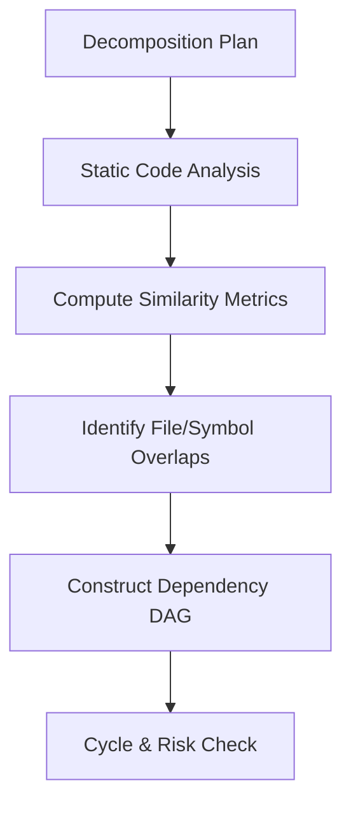
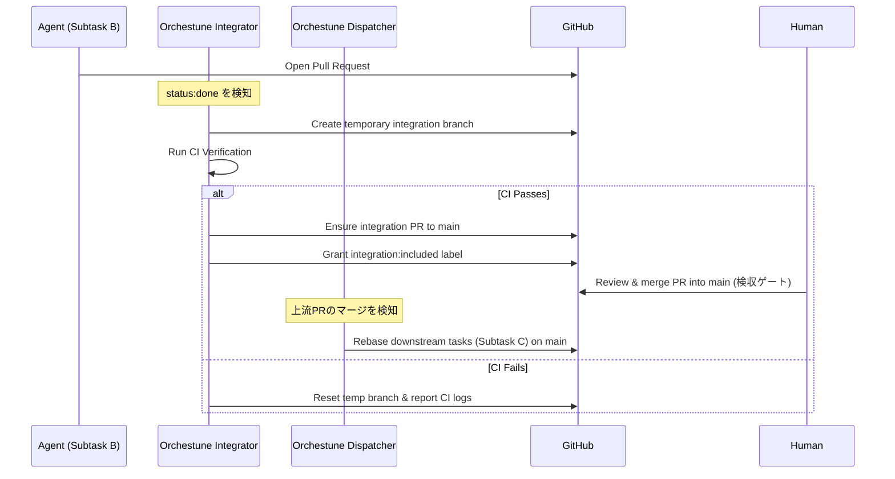

# アーキテクチャと設計思想

Orchestuneがどのように並列開発タスクを競合なく構築し、エージェントを自律駆動させ、最終的に安全にマージするのか、その内部設計とアーキテクチャについて説明します。

---

## 1. DAG構築とコンフリクト回避（DAG Construction & Conflict Prevention）

Orchestuneは、各サブタスク間の依存関係を単なる宣言（`depends_on`）だけでなく、変更を加える予定のファイルパス（`footprint`）やコードシンボル（`symbols`）の情報を元に静的に分析します。



### コンフリクト回避の仕組み
* **メタデータの重複分析**:
  複数のタスクが同じファイルやクラスを同時に変更しようとすると、コンフリクト（競合）が発生します。Orchestuneは、類似度メトリクスを用いてフットプリント間の重複を計算し、競合する可能性のあるタスク間に「暗黙の依存関係」を追加して実行順序を整理します。
* **安全な並列実行**:
  これにより、競合のない独立したタスクだけが同時に実行され、マージ時のコンフリクトを最小限に抑えるトポロジカルソートされたDAGが構築されます。

---

## 2. 自己修復（ステートリカバリ）機能

Orchestuneのディスパッチャーは、GitHub Actionsなどの**「実行が終わるとディスク状態が完全に消去されるステートレスなCI環境」**で定期的に起動されることを前提に設計されています。

通常、開発プロセス全体の進行状況は `run_state.json` などのローカル状態ファイルに記録されますが、これが消失した場合でも以下の手順で状態を**自己修復（セルフヒーリング）**します。

```text
[Dispatcher Start]
       │
       ▼
[Read GitHub Issues & PRs]
       │
       ├─► status:in-progress の Issue は実行中と判断
       ├─► status:blocked / status:queued を再判定
       └─► オープンな PR ブランチから現在の進捗を復元
       │
       ▼
[Reconstruct DAG State & Resume]
```

* **GitHub Source of Truth**:
  現在のブランチやPR、およびGitHub Issueのラベル（`status:in-progress`, `status:blocked`, `status:queued` など）の状態を直接読み取ることで、メモリ上で全体の実行状態を復元し、途中からシームレスに処理を再開します。

---

## 3. 統合（Integration）と自動リベース

複数のエージェントが開発を進めてPRを作成すると、下流のタスクは上流の成果物を取り込む必要があります。この工程は**Integrator**と**Dispatcher**という2つの異なる責務に分かれており、`orchestune dispatch`コマンドの1回の呼び出し内で、Dispatcherサイクルの後にIntegratorが順次実行されます（別プロセスではありません）。



1. **マージ前CI検証（Integratorの責務）**:
   `status:done`のタスクを検知すると、`orchestune/integrator.py`が単にマージするのではなく一時統合ブランチを作成してローカルCIを走らせ、成功したタスクには`integration:included`ラベルを付与します。Integratorの仕事はここまでで、**mainへの最終マージは常に人間が行います**（後述「4. 人間の承認ポイント」の検収ゲート）。
2. **自動リベース（Dispatcherの責務）**:
   先行タスクのPRがmainへマージされると、その成果物に依存している（または関連ファイルに触れる）下流の仕掛かり中ブランチに対し、`orchestune/dispatch_rebase.py`が自動的に`git rebase`またはマージを行い、最新の`main`ブランチの変更を取り込ませます。これによって、個々のエージェントがコンフリクトに悩まされることなく開発を続けられます。
3. **セマンティックレビュー（Integratorの責務）**:
   統合PR作成時にAIが自動で変更点の整合性をレビューし、不整合（例えばインターフェースの変更が反映されていないなど）をPRへのコメントとして検出・報告します（自動マージは行いません）。

---

## 4. 人間の承認ポイント

Orchestuneは、人間が**内容を判断・レビューする**地点を「分解点」と「検収（最終受け入れ）」の2点のみに限定する設計思想を採っています。ただし、Integratorが作成する統合PRをmainへ反映させる操作（`gh pr merge`）自体は、この2つの判断ゲートとは別に、常に人間の手（クリック）を介して実行されます（[3. 統合と自動リベース](#3-統合integrationと自動リベース)参照）。これはCI検証・AIセマンティックレビューが既に検証済みの内容をmainへ反映するだけの機械的な確認操作であり、個々のサブタスク差分を人間が精査する「レビュー」ではありません。

1. **分解ゲート**: ディスパッチ開始前に、人間が `decomposition_plan.md`（サブタスクの粒度、footprint、依存関係）をレビューし承認します。
2. **統合PRマージ（機械的確認、判断ゲートではない）**: Integratorが作成した統合PRがCI検証とAIセマンティックレビューを通過したら、人間が内容を精査することなく`main`へマージします。マージは自動化されておらず、統合サイクルごとに繰り返し発生します。
3. **検収ゲート**: 全サブタスクがこの統合PRマージを経て`main`に取り込まれた後、人間が「大きな石」全体の最終成果をレビューし受け入れます（親Issueをクローズ）。

分解ゲートと検収ゲートの間では、CI検証、リベース、コンフリクト解消といった機械的な処理は人間の判断を介さずに進行しますが、上記の通りmainへのマージ操作自体は常に人間が実行します。`risk:flagged` ラベルはリスクのあるサブタスクを可視化するためのものであり、追加の承認ゲートとしては機能しません。

**なぜ「判断」が2点だけで十分なのか**: 各サブタスクの履歴（Issue、PR、コミット、CIログ）はすべてGitHub上に保存されるため、統合PRのマージ操作自体は毎回必要になるものの、その内容を人間がインラインでレビューする必要はなく、トレーサビリティを失うことなく事前（分解）と事後（検収）に「判断」の労力を集約できます。

**per-task承認の代替としてのCI**: セクション3で述べたマージ前CI検証は、実質的にサブタスク単位の人間レビューの代替として機能します。すべてのサブタスクPRは `main` にマージされる前にCIをパスする必要があるため、個々の差分を人間が見なくても機械的な正しさは自動的に担保されます。

これにより、人間のレビュー労力を最も判断価値の高い2点（スコーピングと最終受け入れ）に集中させつつ、その間の機械的な処理（CIゲート付きマージ、リベース、依存順序制御）は完全自動化されています。
