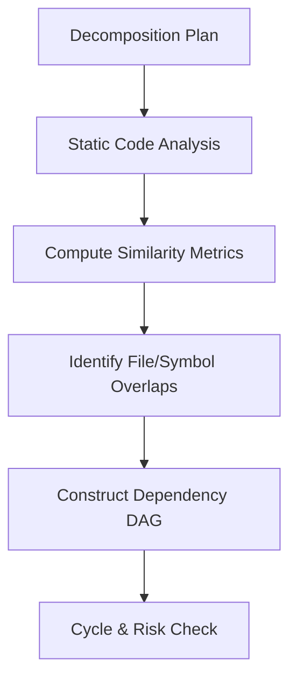
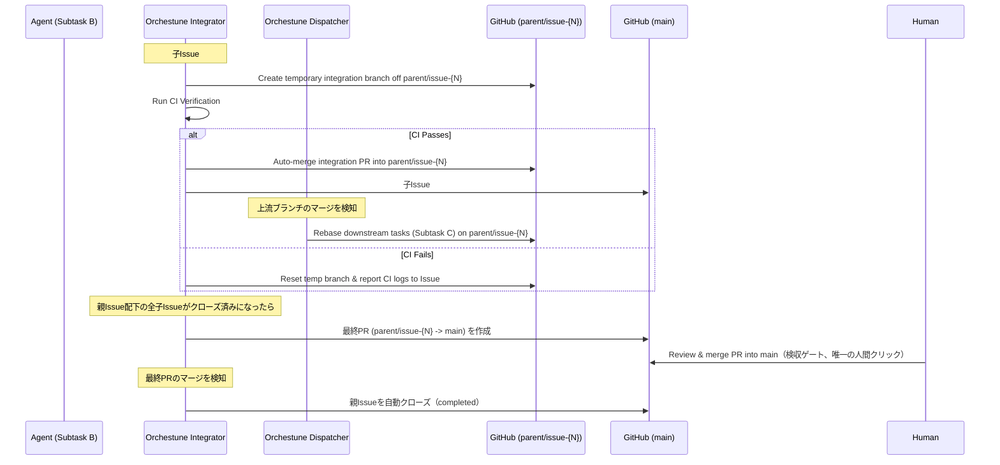

# アーキテクチャと設計思想

Orchestuneがどのように並列開発タスクを競合なく構築し、エージェントを自律駆動させ、最終的に安全にマージするのか、その内部設計とアーキテクチャについて説明します。

---

## 1. DAG構築とコンフリクト回避（DAG Construction & Conflict Prevention）

Orchestuneは、各サブタスク間の依存関係を単なる宣言（`depends_on`）だけでなく、変更を加える予定のファイルパス（`footprint`）やコードシンボル（`symbols`）の情報を元に静的に分析します。



### コンフリクト回避の仕組み
* **メタデータの重複分析**:
  複数のタスクが同じファイルやクラスを同時に変更しようとすると、コンフリクト（競合）が発生します。Orchestuneは、類似度メトリクスを用いてフットプリント間の重複を計算し、競合する可能性のあるタスク間に「暗黙の依存関係」を追加して実行順序を整理します。
* **安全な並列実行**:
  これにより、競合のない独立したタスクだけが同時に実行され、マージ時のコンフリクトを最小限に抑えるトポロジカルソートされたDAGが構築されます。

### 通常のfootprint重複と「共有コントラクトゲート」の違い

上記の重複分析（`dag_similarity.py`）は、サブタスクが**宣言済み**の
footprint/symbolsの文字列が一致する（または加重コサイン類似度が閾値を超える）
場合にのみ、暗黙の依存エッジを追加します。これは、既に存在するファイルを
複数タスクが編集する通常のケースには有効ですが、グリーンフィールドな
分解計画では別の失敗モードが起こり得ます: フォーマットレジストリや
CLI配線モジュールのような**まだ存在しない共有拡張ポイント**を、
複数のサブタスクがそれぞれ異なる想定パスで暗黙的に触れてしまい、
そもそもどのサブタスクのfootprintにも一致する文字列が現れないため、
既存の重複検出では検出しようがないケースです。

これに対処するため、`orchestune`スキルのStage 1では、分解時に共有拡張
ポイント（レジストリ・CLI配線・依存関係マニフェスト・パッケージ公開APIなど）
を明示的に特定し、それらを所有する`shared-contract`/`integration-scaffold`
サブタスクを作成した上で、後続タスクに`depends_on`させることを求めます。
さらに`orchestune/dag_contracts.py`の`find_unowned_shared_contract_hotspots`は、
これらの典型的なカテゴリのファイルに複数サブタスクが（明示的depends_onも
既存の類似度エッジも無しに）触れている場合、`orchestune-dag`の出力に
`Warnings:`として警告を表示します（ブロッキングエラーにはしません）。
これは、宣言が漏れて全く一致する文字列が無いケースの完全な代替にはなり
ませんが、拡張ポイントが宣言はされたものの互いに異なる名前を想定して
いたケースを検出できる二次的なセーフティネットとして機能します。

---

## 2. 自己修復（ステートリカバリ）機能

Orchestuneのディスパッチャーは、GitHub Actionsなどの**「実行が終わるとディスク状態が完全に消去されるステートレスなCI環境」**で定期的に起動されることを前提に設計されています。

通常、開発プロセス全体の進行状況は `run_state.json` などのローカル状態ファイルに記録されますが、これが消失した場合でも以下の手順で状態を**自己修復（セルフヒーリング）**します。

```text
[Dispatcher Start]
       │
       ▼
[Read GitHub Issues & PRs]
       │
       ├─► status:in-progress の Issue は実行中と判断
       ├─► status:blocked / status:queued を再判定
       └─► オープンな PR ブランチから現在の進捗を復元
       │
       ▼
[Reconstruct DAG State & Resume]
```

* **GitHub Source of Truth**:
  現在のブランチやPR、およびGitHub Issueのラベル（`status:in-progress`, `status:blocked`, `status:queued` など）の状態を直接読み取ることで、メモリ上で全体の実行状態を復元し、途中からシームレスに処理を再開します。

---

## 3. 統合（Integration）と自動リベース

複数のエージェントが開発を進めると、下流のタスクは上流の成果物を取り込む必要があります。この工程は**Integrator**と**Dispatcher**という2つの異なる責務に分かれており、`orchestune dispatch`コマンドの1回の呼び出し内で、Dispatcherサイクルの後にIntegratorが順次実行されます（別プロセスではありません）。

`--parent-issue <N>` を指定してディスパッチした場合、統合は**親ブランチによる二層モデル**で行われます。人間が判断・クリックする必要があるのは「親ブランチ→main」の最終マージただ1箇所のみで、子Issueレベルの統合はCI通過後に完全自動で進みます。



1. **親ブランチからの分岐**:
   `--parent-issue <N>` 指定時、親Issue用の長命ブランチ`parent/issue-{N}`が`main`から作成され、各子サブタスクのブランチは`main`ではなくこの親ブランチから分岐します。
2. **マージ前CI検証（Integratorの責務）**:
   `status:done`の子Issueを検知すると、`orchestune/integrator.py`が一時統合ブランチを`parent/issue-{N}`から作成してローカルCIを走らせます。
3. **子レベルの自動マージ・自動クローズ（Integratorの責務、人間の確認なし）**:
   CI通過後、Integratorは一時統合ブランチのPRを**人間の確認を待たずに**`parent/issue-{N}`へ自動マージし、対象の子Issueを`completed`理由で自動的にクローズします。このレベルには人間のレビューゲートは存在せず、CIそのものが品質ゲートとして機能します（詳細は「4. 人間の承認ポイント」）。
4. **自動リベース（Dispatcherの責務）**:
   先行タスクのブランチが`parent/issue-{N}`へマージされると、その成果物に依存している（または関連ファイルに触れる）下流の仕掛かり中ブランチに対し、`orchestune/dispatch_rebase.py`が自動的に`git rebase`またはマージを行い、最新の`parent/issue-{N}`の変更を取り込ませます。
5. **親Issue配下の全完了検知と最終PR作成（Integratorの責務）**:
   親Issue配下の全子Issueがクローズされたことを検知すると、`orchestune/parent_completion.py`が`parent/issue-{N}` → `main`の最終PRを作成します。このPRは自動マージされません。
6. **検収マージと親Issueクローズ**:
   人間がこの最終PRをレビューしてマージします（唯一の人間クリック）。マージが検知されると、Integratorが親Issueを`completed`理由で自動的にクローズします。
7. **セマンティックレビュー（Integratorの責務）**:
   子レベルの統合PR作成時にAIが自動で変更点の整合性をレビューし、不整合（例えばインターフェースの変更が反映されていないなど）をPRへのコメントとして検出・報告します（自動マージ・自動クローズの後段のため、その結果を待って処理をブロックすることはありません）。

`--parent-issue`を指定せずにディスパッチした場合は、従来通りのフラットモード（子ブランチが直接`main`へ向けて統合される単層モデル）にフォールバックし、その唯一の統合PRのマージは常に人間が行います。

---

## 4. 人間の承認ポイント

Orchestuneは、人間が**内容を判断・レビューする**地点を「分解点」と「検収（最終受け入れ）」の2点のみに限定する設計思想を採っています。親ブランチによる二層モデルでは、この2点がそのまま「人間がクリックする箇所」とも一致します——子レベルの統合はCI通過のみを条件に完全自動で進み、人間が操作するのは親ブランチ→mainの最終PRのマージだけです（[3. 統合と自動リベース](#3-統合integrationと自動リベース)参照）。

1. **分解ゲート**: ディスパッチ開始前に、人間が `decomposition_plan.md`（サブタスクの粒度、footprint、依存関係）をレビューし承認します。
2. **検収ゲート（唯一の人間クリック）**: 親Issue配下の全子Issueが自動クローズされた後にIntegratorが作成する、`parent/issue-{N}` → `main`の最終PRを、人間がレビューしてマージします。マージが検知されると、Integratorが親Issueを自動的にクローズします——別途手動でクローズする必要はありません。

分解ゲートと検収ゲートの間では、子レベルの統合PRマージ・CI検証・リベース・Issueクローズはすべて人間の判断を介さずに進行します。`risk:flagged` ラベルはリスクのあるサブタスクを可視化するためのものであり、追加の承認ゲートとしては機能しません。

**なぜ「判断」が2点だけで十分なのか**: 各サブタスクの履歴（Issue、PR、コミット、CIログ）はすべてGitHub上に保存されるため、人間のレビュー労力は事前（分解）と事後（検収の1マージ）に集約でき、途中の子レベル統合を逐一見なくてもトレーサビリティは失われません。

**per-task承認の代替としてのCI**: セクション3で述べたマージ前CI検証は、実質的にサブタスク単位の人間レビューの代替として機能します。すべての子レベル統合PRは`parent/issue-{N}`にマージされる前にCIをパスする必要があるため、個々の差分を人間が見なくても機械的な正しさは自動的に担保されます。

これにより、人間のレビュー労力を最も判断価値の高い2点（スコーピングと最終受け入れの1マージ）に集中させつつ、その間の機械的な処理（子レベルの自動マージ・自動クローズ、リベース、依存順序制御）は完全自動化されています。
