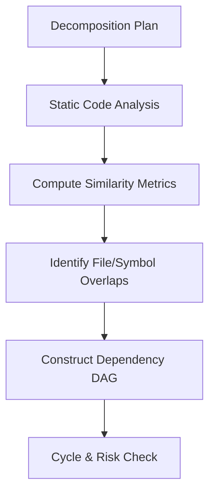
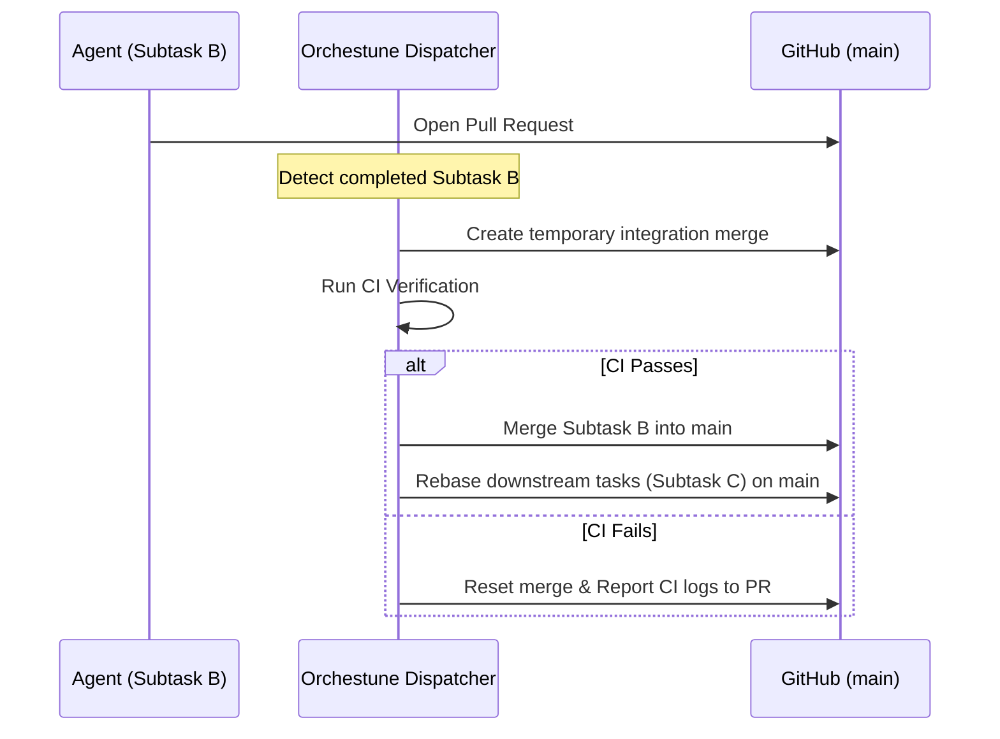

# アーキテクチャと設計思想

Orchestuneがどのように並列開発タスクを競合なく構築し、エージェントを自律駆動させ、最終的に安全にマージするのか、その内部設計とアーキテクチャについて説明します。

---

## 1. DAG構築とコンフリクト回避（DAG Construction & Conflict Prevention）

Orchestuneは、各サブタスク間の依存関係を単なる宣言（`depends_on`）だけでなく、変更を加える予定のファイルパス（`footprint`）やコードシンボル（`symbols`）の情報を元に静的に分析します。



### コンフリクト回避の仕組み
* **メタデータの重複分析**:
  複数のタスクが同じファイルやクラスを同時に変更しようとすると、コンフリクト（競合）が発生します。Orchestuneは、類似度メトリクスを用いてフットプリント間の重複を計算し、競合する可能性のあるタスク間に「暗黙の依存関係」を追加して実行順序を整理します。
* **安全な並列実行**:
  これにより、競合のない独立したタスクだけが同時に実行され、マージ時のコンフリクトを最小限に抑えるトポロジカルソートされたDAGが構築されます。

---

## 2. 自己修復（ステートリカバリ）機能

Orchestuneのディスパッチャーは、GitHub Actionsなどの**「実行が終わるとディスク状態が完全に消去されるステートレスなCI環境」**で定期的に起動されることを前提に設計されています。

通常、開発プロセス全体の進行状況は `run_state.json` などのローカル状態ファイルに記録されますが、これが消失した場合でも以下の手順で状態を**自己修復（セルフヒーリング）**します。

```text
[Dispatcher Start]
       │
       ▼
[Read GitHub Issues & PRs]
       │
       ├─► status:in-progress の Issue は実行中と判断
       ├─► status:blocked / status:queued を再判定
       └─► オープンな PR ブランチから現在の進捗を復元
       │
       ▼
[Reconstruct DAG State & Resume]
```

* **GitHub Source of Truth**:
  現在のブランチやPR、およびGitHub Issueのラベル（`status:in-progress`, `status:blocked`, `status:queued` など）の状態を直接読み取ることで、メモリ上で全体の実行状態を復元し、途中からシームレスに処理を再開します。

---

## 3. 統合（Integration）と自動リベース

複数のエージェントが開発を進めてPRを作成すると、下流のタスクは上流の成果物を取り込む必要があります。Orchestuneのインテグレーターは、この依存関係に基づいたリベースとマージの調整を自律的に行います。



1. **マージ前CI検証**:
   PRが開かれたら、単にマージするのではなく、一時統合ブランチを作成してローカルCIを走らせます。
2. **自動リベース**:
   先行タスクがマージされたら、その成果物に依存している（または関連ファイルに触れる）下流の仕掛かり中ブランチに対し、自動的に `git rebase` またはマージを行い、最新の `main` ブランチの変更を取り込ませます。これによって、個々のエージェントがコンフリクトに悩まされることなく開発を続けられます。
3. **セマンティックレビュー**:
   統合時にAIが自動で変更点の整合性をレビューし、不整合（例えばインターフェースの変更が反映されていないなど）を検出します。

---

## 4. 人間の承認ポイント

Orchestuneは、開発ライフサイクルの中で人間が意思決定を行う地点を「分解点」と「検収（最終マージ）」の2点のみに限定し、その間は完全に自律実行させる設計思想を採っています。

1. **分解ゲート**: ディスパッチ開始前に、人間が `decomposition_plan.md`（サブタスクの粒度、footprint、依存関係）をレビューし承認します。
2. **検収ゲート**: 全サブタスクが `main` に統合された後、人間が「大きな石」全体の最終成果をレビューし受け入れます（親Issueをクローズ）。

この2つのゲートの間では、個々のサブタスクPRのマージ、CI検証、リベース、コンフリクト解消はすべて人間の承認を介さずに進行します。`risk:flagged` ラベルはリスクのあるサブタスクを可視化するためのものであり、追加の承認ゲートとしては機能しません。

**なぜ2点だけで十分なのか**: 各サブタスクの履歴（Issue、PR、コミット、CIログ）はすべてGitHub上に保存されるため、マージのたびに人間がインラインでレビューしなくても、トレーサビリティを失うことなく事前（分解）と事後（検収）にレビュー労力を集約できます。

**per-task承認の代替としてのCI**: セクション3で述べたマージ前CI検証は、実質的にサブタスク単位の人間レビューの代替として機能します。すべてのサブタスクPRは `main` にマージされる前にCIをパスする必要があるため、個々の差分を人間が見なくても機械的な正しさは自動的に担保されます。

これにより、人間のレビュー労力を最も判断価値の高い2点（スコーピングと最終受け入れ）に集中させつつ、その間の機械的な処理（CIゲート付きマージ、リベース、依存順序制御）は完全自動化されています。
