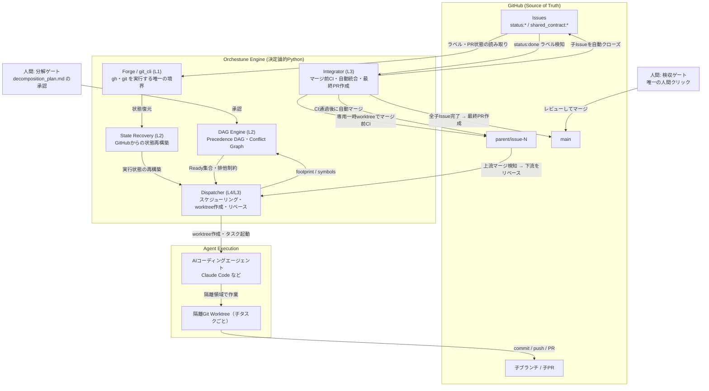

# アーキテクチャと設計思想

Orchestuneがどのように並列開発タスクを競合なく構築し、エージェントを自律駆動させ、最終的に安全にマージするのか、その内部設計とアーキテクチャについて説明します。

---

## 1. システム全体像

Orchestuneは、GitHubを「唯一の信頼できる情報源（Single Source of Truth）」とし、決定論的なPython制御エンジンがLLM実装エージェントをオーケストレーションするアーキテクチャを採用しています。人間が関与するのは前段の「分解ゲート」と後段の「検収ゲート」の2点のみで、その間はすべて自律的に進行します。

```mermaid
graph TD
    HU1["人間: 分解ゲート<br/>decomposition_plan.md の承認"]
    HU2["人間: 検収ゲート<br/>唯一の人間クリック"]

    subgraph GH ["GitHub (Source of Truth)"]
        GI["Issues<br/>status:* / shared_contract:*"]
        GP["子ブランチ / 子PR"]
        PB["parent/issue-N"]
        MB["main"]
    end

    subgraph ENG ["Orchestune Engine (決定論的Python)"]
        L1["Forge / git_cli (L1)<br/>gh・git を実行する唯一の境界"]
        REC["State Recovery (L2)<br/>GitHubからの状態再構築"]
        DAG["DAG Engine (L2)<br/>Precedence DAG・Conflict Graph"]
        DP["Dispatcher (L4/L3)<br/>スケジューリング・worktree作成・リベース"]
        IG["Integrator (L3)<br/>マージ前CI・自動統合・最終PR作成"]
    end

    subgraph EX ["Agent Execution"]
        WT["隔離Git Worktree（子タスクごと）"]
        AG["AIコーディングエージェント<br/>Claude Code など"]
    end

    HU1 -->|承認| DAG
    GI -->|ラベル・PR状態の読み取り| L1
    L1 -->|状態復元| REC
    REC -->|実行状態の再構築| DP
    DAG -->|Ready集合・排他制約| DP
    DP -->|footprint / symbols| DAG
    DP -->|worktree作成・タスク起動| AG
    AG -->|隔離領域で作業| WT
    WT -->|commit / push / PR| GP
    GI -->|status:done ラベル検知| IG
    IG -->|専用一時worktreeでマージ前CI| PB
    IG -->|CI通過後に自動マージ| PB
    IG -->|子Issueを自動クローズ| GI
    PB -->|上流マージ検知 → 下流をリベース| DP
    IG -->|全子Issue完了 → 最終PR作成| MB
    HU2 -->|レビューしてマージ| MB
```

エンジン側からGitHubへの読み書きは、すべてL1アダプタ（`forge` / `git_cli`）を経由します。この封じ込めは[4.2節](#42-ciで機械的に検証される不変条件)でCIによって機械的に検証されます。また、Integratorのトリガーは子PRではなく子Issueの`status:done`ラベルであり、マージ前CIに使う一時worktreeはエージェントの隔離worktreeとは別に確保されます（エンジンがエージェントの作業領域へ書き込むことはありません）。

---

## 2. コア設計思想

### 0. 設計目標: クオーター効率

Orchestuneは個人開発者と少人数チームのためのオーケストレーターです。AI利用クオーター（サブスクリプションのセッション/週次の使用枠）は固定で、人間が席にいられる時間も限られています。以下のすべての設計判断は、ただ1つの最適化目標——**消費したクオーター1単位あたりに生み出される「完成した、マージ可能な成果物」を最大化すること**——から導かれており、個々のタスクの実時間を最短化することは目標では**ありません**。小さなタスクであれば、分解・Issue起票・ディスパッチを経るより、エージェントに直接依頼するほうが速く、消費クオーターも少なくて済みます。

この目標は、全体に3つの形で貫かれています。

* **最大の無駄は手戻りである**: マージコンフリクト、粒度を誤ったサブタスク、実装の重複は、いずれもクオーターを二重に消費させます。競合分析と共有コントラクトゲートはわずかな事前計画コストと引き換えに手戻りを回避し、マージ前CIは機械的な破綻が下流へ波及する前に捕捉します。
* **並列実行は目的ではなく手段である**: 独立したサブタスクがあれば、1つのエージェントが順番に消費するのではなく、複数のエージェントが同時にクオーターを消費できます。DAG構築は、そのタスクが許す限りの**安全な**並列度を見つけ出すために存在します。
* **並列実行をクオーター効率へ変換するのは「無人運転」である**: この利得は、人間が席を外している間——夜間や、ステートレスなCIランナー上——でも処理が進んで初めて実現します。状態をGitHubから自己修復する設計、子レベルの統合を人間を待たずに自動マージする設計、人間の判断を2点へ限定する設計は、すべてこのためです。サブタスクごとに人間のクリックを要求する設計では、パイプラインが人間の在席状況で停滞します。

### 0.1 決定論: LLMは判断、共有状態の自動遷移はPython

LLM呼び出しはクオーターを消費する希少な操作です。したがってOrchestuneは、**判断が代替不能な箇所——分解、実装、統合diffの意味的レビュー、`status:not-needed`の判定——にのみLLMを使い、それ以外はすべて決定論的なPythonで処理します**。ラベルのポーリング、DAGの再計算、ローカル状態の再構築、GC、エスカレーションは、いずれも「エージェントに考えさせる」ことも可能ですが、その都度クオーターを支払うことになります。

この方針は二重に効きます。決定論的に処理した分だけ直接の消費が減り、加えて非決定的な挙動が生む手戻り——冒頭で述べた最大の無駄——も減ります。

分割線は「LLMが何をしないか」ではなく、**スコープ**——誰の領域へ書き込むか——で引かれています。

| | 書き込み先 |
|---|---|
| **LLM** | 自分に割り当てられた隔離領域（worktreeと自分のブランチ）、および判断の表明（Outcome Record・コメント・PR。Cloud Routineにおける独立検証レビュアーの判定ラベル付与を含む） |
| **Python** | **共有状態のうち自動で進む部分**——子PRから親ブランチへの統合マージ、Issueの生死、通常サイクルのラベル遷移、依存関係の解決、クオーター台帳の更新 |
| **人間** | **検収マージ**——親ブランチから`main`への最終PR。「唯一の人間クリック」 |

通常の実装ワーカーエージェントが共有のGitHubラベルを直接操作することはありません。実装エージェントは要件が既に満たされていると判断した場合、ラベルを直接書き換えるのではなくOutcome Record（`<!-- orchestune:outcome -->`、`result: not-needed`）をコメントとして投稿しますし、commit・push・PR作成も自分のブランチの中だけで完結します（唯一の例外は、Cloud Routineにおける独立検証レビュアーセッションであり、`integration_coordinator`の指示に従って合否判定ラベルを付与します）。**その成果を共有状態へ取り込むかどうかを決めるのは、エージェント自身ではありません。**

#### 前提: LLMもインフラも間違える

決定論だけでは足りません。LLMの出力もインフラも失敗しうるため、Orchestuneは**逸脱点を個別に列挙し、それぞれに決定論的な検知と回復を用意します**。

| 逸脱 | 検知 | 決定論的な処理 |
|---|---|---|
| 分解の誤り（未確立の共有拡張ポイント） | [共有コントラクトゲート (dag-and-scheduling.md)](architecture/dag-and-scheduling.md#5-通常のfootprint重複と共有コントラクトゲートの違い) | 警告 |
| 計画の陳腐化（`symbols`が実在しない） | [ASTによるシンボル検証 (dag-and-scheduling.md)](architecture/dag-and-scheduling.md#6-分解計画とコードベースの突合陳腐化検知) | Issue本文へ中立な注記 |
| 宣言の誤り（footprint外への変更） | 実行時の逸脱検知（`dispatch.locks.check_footprint_deviation`） | Conflict Graph再計算（除外規則と回数上限つき） |
| インフラの失敗（ローカル状態の消失） | — | [GitHubを真実とする再構築 (state-recovery.md)](architecture/state-recovery.md#2-github-as-single-source-of-truth) |
| エージェントの自己申告（`result: not-needed`） | 記憶を持たない独立セッションによる再検証（Cloud Routineターゲット使用時のみ） | Outcome Recordとラベル遷移経由でPython側が決定論的にクローズ |

そして、**ループには上限があり、終端があります**——ただし現状では全経路ではありません。実行時Conflict Graph再計算の回数、ウィンドウあたりの起動数、そしてゾンビ／タイムアウト回収による再投入回数（`--max-task-reclaims`、既定3回）は既定で有界ですが、タスクのタイムアウトとトークン消費の上限は**既定では無効**で、無人で長時間走らせる場合は明示的な設定が要ります（[使い方とコマンドリファレンス](usage.md)参照）。自動的に収束できない場合、対象Issueは`status:blocked-human-review`へ遷移して停止します。`tests/test_architecture.py`は、有限なリトライ／回収／レビュータイムアウト設定と宣言済み終端動作の対応を機械的に検証します。この検査は意図的に明示的なレジストリ方式です。回収ループの命名規約に一致する新設定に終端対応がなければ失敗させる一方、無関係な有界制御は個別機能のテストに委ねます。

> **既知の欠落**: 現時点で、終端へ到達しない経路が1つあります。
> - **トークン消費の観測不可**。`max_tokens_per_window`は、クラウドのディスパッチターゲット（`ClaudeCodeCloudRoutineDispatchTarget`・`CodexCloudDispatchTarget`）では発火しません。`collect_usage`の既定実装が`None`を返し、両ターゲットとも上書きしていないためです——クラウドセッションの消費量を問い合わせるポーリングAPIが公開されておらず、`is_complete`すらPR作成をプロキシシグナルにしています。したがって**無人運転の主経路ではトークン上限が効きません**。これは永続化以前の問題（そもそも記録すべきデータが生成されない）で、APIが公開され次第の再検討となります。なお`recompute_count`/`forced_serial`（子Issue本文）と`launch_history`（親Issue本文）は永続化済みで、この欠落の対象外です。

Orchestuneが**目指す**のは「常に自動で解決すること」ではなく、**収束するか、人間が対処可能な状態で停止するかのいずれかであること**です。上記の通りこれは設計目標であって、現時点で全経路が満たしているわけではありません。

### 0.2 人間の承認ポイント

Orchestuneは、人間が**内容を判断・レビューする**地点を「分解点」と「検収（最終受け入れ）」の2点のみに限定する設計思想を採っています。親ブランチによる二層モデルでは、この2点がそのまま「人間がクリックする箇所」とも一致します——子レベルの統合はCI通過のみを条件に完全自動で進み、人間が操作するのは親ブランチ→mainの最終PRのマージだけです。

1. **分解ゲート**: ディスパッチ開始前に、人間が `decomposition_plan.md`（サブタスクの粒度、footprint、依存関係）をレビューし承認します。
2. **検収ゲート（唯一の人間クリック）**: 親Issue配下の全子Issueが自動クローズされた後にIntegratorが作成する、`parent/issue-{N}` → `main`の最終PRを、人間がレビューしてマージします。マージが検知されると、Integratorが親Issueを自動的にクローズします——別途手動でクローズする必要はありません。

分解ゲートと検収ゲートの間では、子レベルの統合PRマージ・CI検証・リベース・Issueクローズはすべて人間の判断を介さずに進行します。`risk:flagged` ラベルはリスクのあるサブタスクを可視化するためのものであり、追加の承認ゲートとしては機能しません。

**なぜ「判断」が2点だけで十分なのか**:
各サブタスクの履歴（Issue、PR、コミット、CIログ）はすべてGitHub上に保存されます。そのため、人間のレビュー労力を事前（分解）と事後（検収の1マージ）に集約しても、途中の子レベル統合を逐一見ることなくトレーサビリティを維持できます。

**per-task承認の代替としてのCI**:
子レベルの統合におけるマージ前CI検証は、実質的にサブタスク単位の人間レビューの代替として機能します。すべての子レベル統合PRは`parent/issue-{N}`にマージされる前にCIをパスする必要があるため、個々の差分を人間が見なくても機械的な正しさは自動的に担保されます。

**トレーサビリティの補完: ディスパッチサイクルレポートの親Issueコメント投稿**:
`orchestune-dispatch`のサイクル毎イベントログ（`events.jsonl`）は`.gitignore`対象であり、CI実行のたびに揮発するため、それ単独では恒久的な履歴になりません。このログに頼らずディスパッチサイクルの意思決定を追跡可能にするため、**apply（`--no-apply`ではない）モードの**各ディスパッチサイクル終了時に、設定された親Issue（`--parent-issue`、#396）へ`## 🤖 Orchestune Dispatch Cycle Report`という見出しのコメントを投稿します。なお`--no-apply`はpost-cycleブロック全体をスキップするため、このレポート投稿も実行されません。

コメントの内容は、そのサイクルで選定されたタスク・注目すべき`footprint`逸脱イベント・完了イベント・昇格イベントの要約です。状態が変化しない定常的な逸脱イベント（例: 既に強制直列化済みのworktreeについての再通知）は、スキップ判定・コメント本文の両方から除外されます。そのため、同一内容のコメントが毎サイクル親Issueに積み上がることはありません。また、報告すべき内容が無いサイクル、または親Issueが未設定の場合はコメントを投稿しません。

投稿に失敗した場合の扱いは、他のpost-cycleフェーズと同様です。例外は送出せず、サイクル自体は常に最後まで実行されます。ただし失敗は`orchestune-dispatch`の非ゼロ終了ステータスとして表面化し、CIのステップとしては失敗扱いになります。通常の投稿エラー（一時的なネットワークエラー等）は警告ログを出したうえで終了コード2に、GitHub認証エラーはエラーログを出したうえで終了コード1にマップされます。

これにより、人間のレビュー労力を最も判断価値の高い2点（スコーピングと最終受け入れの1マージ）に集中させつつ、その間の機械的な処理（子レベルの自動マージ・自動クローズ、リベース、依存順序制御）は完全自動化されています。

---

## 3. 主要サブシステム概要

各サブシステムの詳細な仕様・計算式・制御フローは、以下の個別ドキュメントに分割・記載されています。

### 3.1 DAG構築・スケジューリング・競合制御
詳細: [DAG構築・スケジューリング・競合制御 (dag-and-scheduling.md)](architecture/dag-and-scheduling.md)

* **二重グラフモデル**: 因果関係（`depends_on`）を管理する**Precedence DAG**と、排他関係（`footprint`/`symbols`/`shared_contract`の重複）を管理する**Conflict Graph**を分離。
* **類似度計算と競合分析**: IDF重み付きOtsuka-Ochiai類似度によるメタデータ重複分析（Co-Coder論文適応）。
* **スケジューリングアルゴリズム (#660)**: クリティカルパス（bottom level）、後続解放数、完了履歴に基づく推定コスト・手戻りリスク、時間窓トークン予算（Token Budget）、飢餓回避agingによる多角的なスコアリング。
* **Execution Profiles & モデル選定 (#670)**: タスクの抽象プロファイル（`deep-reasoning`, `fast-code`等）を設定ファイルに基づいて具体的なLLMモデル・推論強度へ決定論的に解決（`resolve_execution_profile` / `ExecutionSelection`）。#660 スケジューラ（「いつ・どのタスクを起動するか」）とExecution Profiles（「どのように実行するか」）の明確な責務境界。
* **共有コントラクトゲート & ASTシンボル検証**: 未確立の共有拡張ポイントに対する並列書き込みのhotspot検出、および計画とコードベースのAST突合による陳腐化検知。

### 3.2 自己修復（ステートリカバリ）機能
詳細: [ステートレスCIと自己修復 (state-recovery.md)](architecture/state-recovery.md)

* **ステートレス実行モデル**: GitHub Actions等の揮発性CI環境前提で、ディスク上のローカル状態消失時もGitHub上のIssue/PR状態からシームレスに再構築。
* **GitHub as Single Source of Truth**: `status:*` ラベルおよびPRブランチからの状態再構築と、ゾンビ／タイムアウト回収（`task_reclaim_counts`、#512）の終端保護。
* **リポジトリ整合性control loop**: `ConsistencySupervisor`が修復判断、実行順序、有界な再試行、authoritativeな再観測、結果集約を単一所有し、typed ExecutorがForge、Git、process、worktree、`run_state.json`への変更をlive preconditionの背後へ閉じ込めます。off/shadow/repair設定が段階化するのは追加のrepository-wide loopだけであり、既存の安全なstatus、recovery、GC自己修復境界はdefaultで有効なままです。詳細は[ステートレスCIと自己修復](architecture/state-recovery.md#3-リポジトリ整合性control-loop)を参照してください。

### 3.3 統合（Integration）と自動リベース
詳細: [統合パイプライン・二層モデル・自動リベース (integration.md)](architecture/integration.md)

* **親ブランチによる二層モデル**: `parent/issue-{N}` による長命ブランチを活用し、子タスクの統合はCI通過後に完全自動でマージ・クローズ。
* **自動リベース**: 先行タスクのマージを検知し、下流の仕掛かり中ブランチへ最新変更を自動反映。
* **検収ゲート**: 全子タスク完了後にIntegratorが作成する `parent/issue-{N}` → `main` の最終PRを人間がレビュー・マージ（唯一の人間クリック）。
* **排他制御と設計前提**: 同一マシンファイルロック前提（#377）、GitHub Actionsでの `concurrency` グループ推奨、およびCAS多層防御（#435）。

---

## 4. モジュール層構造とパッケージ境界

`orchestune/__init__.py` は、パッケージの公開APIを `__all__` で宣言します。
そこに列挙されていないものはすべて内部実装であり、非推奨期間を置かずに
改名・削除される可能性があります。

### 4.1 5つの層

`orchestune/` のすべてのモジュールは、ちょうど1つの層に属します。モジュールは
自分と同じ層、または下位の層からのみimportでき、上位の層からはimportできません。

| 層 | 役割 | モジュール |
| --- | --- | --- |
| **L4** | **エントリポイント** `main()` を持つモジュール | `bootstrap`, `cli`, `dag.cli`, `dispatch.dispatcher`, `monitor`, `provisioning.cli`, `replan.cli` |
| **L3** | **ワークフロー** ディスパッチサイクルと統合パイプライン | `dispatch.cycle`, `dispatch.cycle_context`, `dispatch.cycle_report`, `dispatch.phase_gc`, `dispatch.phase_reconciliation`, `dispatch.phase_rebase`, `dispatch.phase_scheduling`, `dispatch.postcycle`, `dispatch.report`, `integrator`, `integrator.coordinator`, `integrator.parent_completion`, `integrator.steps`, `integrator.types`, `provisioning.flow`, `replan.apply` |
| **L2** | **ドメイン** DAG構築・スコアリング・ディスパッチ機構 | `consistency`, `consistency.desired`, `consistency.engine`, `consistency.invariants`, `consistency.invariants.execution`, `consistency.invariants.status`, `consistency.intents`, `consistency.observation`, `consistency.repairs`, `consistency.repairs.execution`, `consistency.repairs.status`, `consistency.supervisor`, `dag.contracts`, `dag.graph`, `dag.parsing`, `dag.similarity`, `dispatch.actor_verification`, `dispatch.config`, `dispatch.conflicts`, `dispatch.cost_model`, `dispatch.critical_path`, `dispatch.escalation`, `dispatch.execution_profiles`, `dispatch.execution_repair`, `dispatch.filters`, `dispatch.gc`, `dispatch.gc.completion`, `dispatch.gc.git`, `dispatch.gc.zombies`, `dispatch.labels`, `dispatch.launch`, `dispatch.locks`, `dispatch.rebase`, `dispatch.reconciliation`, `dispatch.recovery`, `dispatch.reviewer`, `dispatch.rules`, `dispatch.scoring`, `dispatch.state`, `dispatch.status_repair`, `dispatch.summary`, `dispatch.targets`, `dispatch.worktree`, `infra.not_needed_review_state`, `integrator.final_pr_body`, `integrator.git_ops`, `integrator.pr`, `integrator.tasks`, `integrator.worktree`, `issue_notice`, `issue_parsing`, `pr_link_notice`, `provisioning.parent`, `provisioning.plan`, `provisioning.plan_loading`, `provisioning.rendering`, `provisioning.subtasks`, `replan.audit`, `replan.operations`, `replan.plan`, `replan.preview`, `replan.snapshot`, `status_snapshot`, `symbol_verification` |
| **L1** | **アダプタ** `git` / `gh` を実行する唯一のモジュール群 | `forge`, `forge.admin`, `forge.issues`, `forge.prs`, `infra.git_cli` |
| **L0** | **インフラ** 純粋なDTOと依存を持たないヘルパ | `bounded_limit`, `branch_naming`, `consistency.contracts`, `consistency.models`, `consistency.vocabulary`, `dag`, `dag.models`, `dispatch`, `dispatch.result`, `infra`, `infra.json_state`, `infra.process_utils`, `labels`, `models`, `outcome_record`, `plan_writer`, `provisioning`, `replan`, `replan.models`, `setup_skills`, `validation`, `version` |

純粋なデータ転送モジュール（`models`, `dag.models`, `dispatch.result`）を
アダプタより下の **L0** に置いているのは、`GitHubForge` が `IssueRecord` /
`PrRecord` を返すためです。DTOを、それを生成するアダプタより上位に置くと、
この依存が上向きになってしまいます。

L4の定義は「`main()` を持ち、`cli` 以外からはimportされない」ことであって、「argparse配線しか含まない」ことではありません。`cli` が例外なのは、残り5つへ処理を振り分ける役割だからです（ガード側では `ALLOWED_L4_DEPENDENTS` として表現されています）。

新規のコードは常にその振る舞いを所有する層に配置する必要があり、境界は引き続きこの節と`tests/test_architecture.py`で機械的に検証されます。

### 4.2 CIで機械的に検証される不変条件

`tests/test_architecture.py` が毎回以下をすべて検証するため、上記の表が
コードから静かに乖離することはありません。

1. **依存は下向きのみ**:
   厳密に上位の層に属するモジュールをimportすることはできません。特にL4のエントリポイントをimportしてよいのは、それらを合成する `cli` だけです。
2. **`git` / `gh` の実行はL1に閉じ込める**:
   いずれかのコマンドを指定する `subprocess` 呼び出しは以下のとおり厳密に分割されており、他のモジュールが新たに持つことは許されません。

   | コマンド | 実行を許可されるモジュール |
   | --- | --- |
   | `gh` | `forge.admin` |
   | `git` | `infra.git_cli` |

   対象はVCS・GitHubクライアントの表面のみです。それ以外の外部プロセス起動は意図的に対象外としており、ガードもしていません。具体的には、`dispatch.targets` はエージェントのCLIを起動し、`dispatch.rebase` と `integrator.git_ops` はCIスクリプトや `poetry` を実行します。これらは呼び出し側がフェイクを用意すべきクライアントではなく単発のプロセス起動であるため、使用箇所に置いたままにしています。

   **この検査の範囲**:
   ガードはソースからコマンドを読み取るため、検出できるのはリテラルのリストに限られます（直接渡す場合と、スコープ内のいずれかの代入がリテラルを束縛した変数を渡す場合です）。通常のコードに対して信頼できる程度にはPythonのスコープ規則を模しており、分岐とループを追い、クラス本体をメソッドから切り離し、`global` / `nonlocal` を尊重し、第1位置引数だけでなく `args=` キーワードも読みます。

   ただし評価は一切行いません。そのため、実行時に組み立てたコマンド、設定から読み込んだコマンド、他モジュールから渡されたコマンドは、まったく検出できません。

   この線引きは意図的なものです。この不変条件が存在する目的は、L2のモジュールで `run_git` ではなく `subprocess` に手を伸ばしてしまうといった**事故を捕まえること**であって、意図的な回避を防ぐことではありません。`git_cli` の外で `git` を実行したい人はそうできますし、テストファイル内の静的検査でそれを止めることはできません。それを止めるのはコードレビューです。したがって `git` / `gh` のargvはリテラルで書き、ここでの失敗は「これはL1に属する」という合図として扱ってください。回避すべきパズルではありません。

3. **循環インポートはゼロ**:
   循環インポートは禁止されています。また、循環検知をすり抜ける関数内import（内部モジュールに対するもの）も禁止です。起動時間短縮のためにエントリポイントのimportを遅延させる `cli` のみが例外となります。
4. **表は網羅的である**:
   `orchestune/` 配下のすべての `.py` ファイルが、英語版・日本語版の両ドキュメントでちょうど1つの層に現れる必要があります。ただし `orchestune/__init__.py` 自身のみ意図的な例外です。パッケージルートは境界の**中にいる**のではなく境界を**宣言する**側であるため、層を持たずルール1の対象にもなりません。何をimportしてよいかは別途検査しており、L4のエントリポイントを取り込んでいないことを専用のテストが表明します（これが例外化によって失われうる性質であるためです）。

### 4.3 なぜ `Forge` はクラスではなくプロトコルなのか

L1の境界は、単一の具象クライアントではなく3つの `Protocol` クラスとして
表現されています。これにより、呼び出し側は実際に使うGitHubの機能だけに
依存できます。

- `IssueForge` — Issueの読み取りとラベル操作
- `PullRequestForge` — PRの列挙・作成・マージ
- `RepoAdminForge` — 認証確認と必須ラベルの初期化

`Forge` はこれらの合成であり、`GitHubForge` が唯一の `gh` 実装です。ラベルの
初期化しか行わない呼び出し側（`run_bootstrap`）は `RepoAdminForge` を受け取る
ため、誤ってPR系APIへ手を伸ばすことができず、テストダブルも20個ではなく
2個のメソッドで済みます。

抽象がプロトコルであるため、テストはモジュール属性をパッチする代わりに
フェイクを注入できます。`IntegratorConfig(forge=...)` や
`DispatcherConfig(forge=...)` はプロトコルを満たす任意のオブジェクトを
受け付け、共有フィクスチャ `fake_forge` がその実体を提供します。
