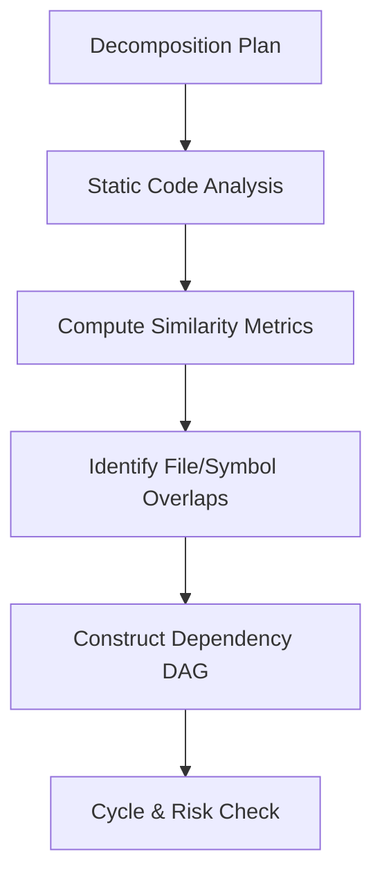
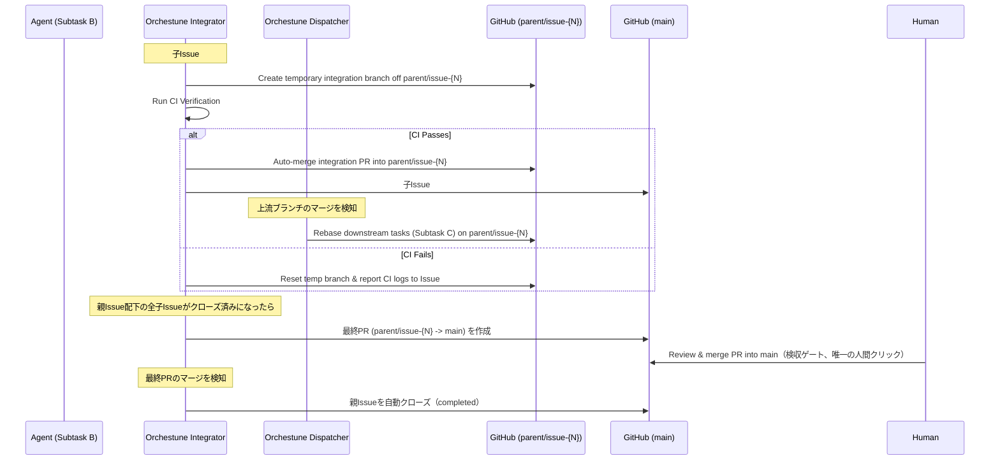

# アーキテクチャと設計思想

Orchestuneがどのように並列開発タスクを競合なく構築し、エージェントを自律駆動させ、最終的に安全にマージするのか、その内部設計とアーキテクチャについて説明します。

---

## 0. 設計目標: クオーター効率

Orchestuneは個人開発者と少人数チームのためのオーケストレーターです。AI利用クオーター（サブスクリプションのセッション/週次の使用枠）は固定で、人間が席にいられる時間も限られています。以下のすべての設計判断は、ただ1つの最適化目標——**消費したクオーター1単位あたりに生み出される「完成した、マージ可能な成果物」を最大化すること**——から導かれており、個々のタスクの実時間を最短化することは目標では**ありません**。小さなタスクであれば、分解・Issue起票・ディスパッチを経るより、エージェントに直接依頼するほうが速く、消費クオーターも少なくて済みます。

この目標は、以降の各セクションに3つの形で貫かれています。

* **最大の無駄は手戻りである**: マージコンフリクト、粒度を誤ったサブタスク、実装の重複は、いずれもクオーターを二重に消費させます。競合分析と共有コントラクトゲート（セクション1）はわずかな事前計画コストと引き換えに手戻りを回避し、マージ前CI（セクション3）は機械的な破綻が下流へ波及する前に捕捉します。
* **並列実行は目的ではなく手段である**: 独立したサブタスクがあれば、1つのエージェントが順番に消費するのではなく、複数のエージェントが同時にクオーターを消費できます。DAG構築（セクション1）は、そのタスクが許す限りの**安全な**並列度を見つけ出すために存在します。
* **並列実行をクオーター効率へ変換するのは「無人運転」である**: この利得は、人間が席を外している間——夜間や、ステートレスなCIランナー上——でも処理が進んで初めて実現します。状態をGitHubから自己修復する設計（セクション2）、子レベルの統合を人間を待たずに自動マージする設計（セクション3）、人間の判断を2点へ限定する設計（セクション4）は、すべてこのためです。サブタスクごとに人間のクリックを要求する設計では、パイプラインが人間の在席状況で停滞します。

### 0.1 決定論: LLMは判断のみ、状態遷移はPython

LLM呼び出しはクオーターを消費する希少な操作です。したがってOrchestuneは、**判断が代替不能な箇所——分解、実装、統合diffの意味的レビュー、`status:not-needed`の判定——にのみLLMを使い、それ以外はすべて決定論的なPythonで処理します**。ラベルのポーリング、DAGの再計算、ローカル状態の再構築、GC、エスカレーションは、いずれも「エージェントに考えさせる」ことも可能ですが、その都度クオーターを支払うことになります。

この方針は二重に効きます。決定論的に処理した分だけ直接の消費が減り、加えて非決定的な挙動が生む手戻り——冒頭で述べた最大の無駄——も減ります。

**状態遷移のほぼすべてはPython側が行います。** 例えば統合コーディネーター（セクション3）が起動する意味的レビューのセッションは、統合PRへ所見をコメントするだけで完結し、ラベル付与・マージ・Issueのクローズは一切行いません。Python側がラベルをポーリングし、決定論的に次の状態へ遷移させます。

唯一の例外が`status:not-needed`です。要件が既に満たされていると判断した実装エージェントは、`status:in-progress`を外して`status:not-needed`を付与するよう各スキル（`skills/local-ci-developer`・`skills/workflow-template`）で指示されています——コミットもPRも作らないため、通常の完了検知（PRの存在をシグナルとする仕組み）では永遠に完了と判定されず、ラベル付与自体が完了シグナルになるためです。Cloud Routineターゲットでの再検証セッションも同様で、検証に通らなかった場合はラベルを`status:not-needed`から`status:queued`へ付け替え、`not-needed-review:failed`を付与するようプロンプトで指示されています（`build_not_needed_review_prompt`）。

つまり**ラベル遷移そのものは、一部がLLM側にあります**。分割線は「不可逆かどうか」でもありません——実装エージェントは自分のブランチへcommitし、pushし、PRを作ります（`skills/local-ci-developer`のワークフロー）。いずれも不可逆です。

実際の線は**スコープ**、すなわち「誰の領域へ書き込むか」で引かれています。

| | 書き込み先 |
|---|---|
| **LLM** | 自分に割り当てられた隔離領域（worktreeと自分のブランチ）、および判断の表明（ラベル・コメント・PR） |
| **Python** | **共有状態のうち自動で進む部分**——子PRから親ブランチへの統合マージ、Issueの生死、依存関係の解決、クオーター台帳の更新 |
| **人間** | **検収マージ**——親ブランチから`main`への最終PR。セクション4の「唯一の人間クリック」 |

エージェントは隔離された作業領域の書き手であり、その成果を共有状態へ取り込むかどうかを決めるのはエージェント自身ではありません。子レベルの統合はCI通過のみを条件にPythonが自動で進め、`main`へ取り込む最終判断だけが人間に残ります。検証セッションのプロンプトがこの制約を明示しています——「あなたはラベル付与・コメント・（不当時の）ラベル付け替えのみを行い、実際のクローズは、あなたが付与したラベルを検知した別のシステムが行う」。

#### 前提: LLMもインフラも間違える

決定論だけでは足りません。LLMの出力もインフラも失敗しうるため、Orchestuneは**逸脱点を個別に列挙し、それぞれに決定論的な検知と回復を用意します**。

| 逸脱 | 検知 | 決定論的な処理 |
|---|---|---|
| 分解の誤り（未確立の共有拡張ポイント） | 共有コントラクトゲート（セクション1） | 警告 |
| 計画の陳腐化（`symbols`が実在しない） | ASTによるシンボル検証（セクション1） | Issue本文へ中立な注記 |
| 宣言の誤り（footprint外への変更） | 逸脱検知（セクション3） | DAG再計算（除外規則と回数上限つき） |
| インフラの失敗（ローカル状態の消失） | — | GitHubを真実とする再構築（セクション2） |
| エージェントの自己申告（`status:not-needed`） | 記憶を持たない独立セッションによる再検証（Cloud Routineターゲット使用時のみ） | ラベル経由でPython側が決定論的にクローズ |

この再検証は、`ClaudeCodeCloudRoutineDispatchTarget`を使う場合にのみ起動されます。既定の`LocalProcessDispatchTarget`では、`status:not-needed`のIssueは再検証を挟まずそのままクローズされます（`_finalize_not_needed_worktree`）。

逸脱検知には2つの除外があります。ひとつは変更行数のデッドバンド（既定5行以下）で、チャーンによるライブロックを防ぐためのもの。もうひとつは**ホットスポットファイルの除外**で、`package.json`・各種lockfile・`src/routes.py`といった「ほぼ全タスクが触れうるファイル」は、**変更量にかかわらず**逸脱として扱いません（`_is_hotspot`）。宣言外のlockfile更新はDAG再計算を引き起こさない、ということです。

そして、**ループには上限があり、終端があります**（ただし後述の制約つき）。DAG再計算の回数（既定2回）とウィンドウあたりの起動数（既定1回）は既定で有界であり、微小な逸脱はデッドバンドで無視することでライブロックを防ぎます。一方、タスクのタイムアウト（`--task-timeout-seconds`）とトークン消費の上限（`--max-tokens-per-window` / `--max-tokens-per-task`）は**既定では無効**です。無人で長時間走らせる場合は明示的に設定してください。自動的に収束できない場合、対象Issueは`status:blocked-human-review`へ遷移して停止します。

> **既知の欠落**: 現時点で、終端へ到達しない経路が3つあります。
> - Cloud Routineターゲットでの`status:not-needed`検証レビュー。レビューセッションが結果ラベルを付けないまま消失した場合、保留エントリは毎サイクル保持され続けます（`dispatched_at`は記録されていますがタイムアウト判定に使われていません）。[#511](https://github.com/Saltmu/orchestune/issues/511)
> - **上限カウンタの永続化境界**。`recompute_count`・`forced_serial`・`launch_history`・トークン消費はいずれも`run_state.json`にのみ存在し、GitHub側には持たれていません。自己修復はこれらを初期値で復元するため（`dispatch_recovery.py`）、第0章が主要な運用形態として挙げる**ステートレスなCIランナー**のように毎回`run_state.json`が失われる構成では、上記の上限が実質的に機能しません。[#513](https://github.com/Saltmu/orchestune/issues/513)
> - タイムアウト回収されたタスクの再投入。`--task-timeout-seconds`に正の値を設定していても、`_apply_zombie_or_timeout_reclaim`はタスクごとの回収回数を保持しないため、繰り返しタイムアウトするタスクは`status:queued`へ無限に戻され続けます（`max_launches_per_window`は次回起動を遅延させるだけで累計試行回数を拘束しません）。[#512](https://github.com/Saltmu/orchestune/issues/512)

Orchestuneが**目指す**のは「常に自動で解決すること」ではなく、**収束するか、人間が対処可能な状態で停止するかのいずれかであること**です。ただしこれは設計目標であって、現時点で全経路が満たしているわけではありません——上記「既知の欠落」の3経路に加え、`--task-timeout-seconds`を既定の0のままハングした通常タスクも、まだこの目標の外にあります。

---

## 1. DAG構築とコンフリクト回避（DAG Construction & Conflict Prevention）

Orchestuneは、各サブタスク間の依存関係を単なる宣言（`depends_on`）だけでなく、変更を加える予定のファイルパス（`footprint`）やコードシンボル（`symbols`）の情報を元に静的に分析します。


```mermaid
graph TD
    A[Decomposition Plan] --> B[Static Code Analysis]
    B --> C[Compute Similarity Metrics]
    C --> D[Identify File/Symbol Overlaps]
    D --> E[Construct Dependency DAG]
    E --> F[Cycle & Risk Check]
```

> このセクションの類似度ベースのタスク分割は、Co-Coder論文
> （Xu Yang, Lunyiu Nie, Ethan Chandra, Stanislav Gannutin, Fangru Lin,
> Swarat Chaudhuri. "When Parallelism Pays Off: Cohesion-Aware Task
> Partitioning for Multi-Agent Coding." arXiv:2606.00953, 2026.）を出典とする。
> 同論文は静的解析でリポジトリのinterfaceからシンボル共有グラフを構築し、
> Infomapでコミュニティ検出してファイル→エージェントの割り当てを最適化する
> （目的関数はクリティカルパス＋通信コスト）。Orchestuneはこの手法を
> 運用ツール向けに変更し、目的関数を「凝集/コスト最適化」から「競合回避」へ、
> グラフの由来をリポジトリ既存ファイルから分解計画の宣言済みfootprint/symbols
> へ変更し、IDF重み付きOtsuka-Ochiai類似度を採用している。詳細は
> `orchestune/dag_similarity.py` のdocstringを参照。

### コンフリクト回避の仕組み
* **メタデータの重複分析**:
  複数のタスクが同じファイルやクラスを同時に変更しようとすると、コンフリクト（競合）が発生します。Orchestuneは、類似度メトリクスを用いてフットプリント間の重複を計算し、競合する可能性のあるタスク間に「暗黙の依存関係」を追加して実行順序を整理します。
* **安全な並列実行**:
  これにより、競合のない独立したタスクだけが同時に実行され、マージ時のコンフリクトを最小限に抑えるトポロジカルソートされたDAGが構築されます。

### 通常のfootprint重複と「共有コントラクトゲート」の違い

上記の重複分析（`dag_similarity.py`）は、サブタスクが**宣言済み**の
footprint/symbolsの文字列が一致する（または加重コサイン類似度が閾値を超える）
場合にのみ、暗黙の依存エッジを追加します。これは、既に存在するファイルを
複数タスクが編集する通常のケースには有効ですが、グリーンフィールドな
分解計画では別の失敗モードが起こり得ます: フォーマットレジストリや
CLI配線モジュールのような**まだ存在しない共有拡張ポイント**を、
複数のサブタスクがそれぞれ異なる想定パスで暗黙的に触れてしまい、
そもそもどのサブタスクのfootprintにも一致する文字列が現れないため、
既存の重複検出では検出しようがないケースです。

これに対処するため、`orchestune`スキルのStage 1では、分解時に共有拡張
ポイント（レジストリ・CLI配線・依存関係マニフェスト・パッケージ公開APIなど）
を明示的に特定し、それらを所有する`shared-contract`/`integration-scaffold`
サブタスクを作成した上で、関与する全サブタスクに共通の`shared_contract: <id>`
タグを付与することを求めます。これは文字列一致に頼らない、最も信頼できる
シグナルです。

さらに`orchestune/dag_contracts.py`の`find_unowned_shared_contract_hotspots`は、
2段階でこれを補強します。(1) `shared_contract`タグが同じサブタスク群、
(2) タグの有無に関わらず**全サブタスク**を対象に、footprintが同一カテゴリ
**かつ同一ディレクトリ**（`packages/auth/__init__.py`と
`packages/payments/__init__.py`のような無関係な別パッケージまで誤って
同一ホットスポット扱いしないためのスコープ限定）に該当するサブタスク群 —
のそれぞれについて、**DAG上で互いに到達可能でない（一方が他方の祖先に
なっていない）ペアが存在する場合**に`orchestune-dag`の出力へ`Warnings:`
として警告を表示します（ブロッキングエラーにはしません）。判定基準が
「連結成分が同じか」ではなく「到達可能性があるか」である点が重要です —
`shared -> csv`、`shared -> yaml`のように共通の祖先タスクに`depends_on`
しているだけの2タスクは、互いには到達不能であり実際には並列実行され得る
ため、警告対象のままになります。

段階(2)が**タグの有無を問わず全サブタスクを対象にする**のは重要です。
`shared_contract`タグ付きのサブタスクだけを対象にしてしまうと、片方の
サブタスクだけタグ付けを忘れた（宣言漏れ）場合に、両者ともどちらの段階でも
比較対象に含まれず、まさに検出したい並列書き込みを見逃してしまいます
（#175再々レビュー指摘）。段階(1)で既に警告済みのペアは、段階(2)で二重に
報告されないよう記録・抑止します。

ディレクトリスコープの限定により、ヒューリスティック（2番目の段階）は
レジストリのように想定パスのディレクトリごと異なるケースまでは捕捉
できません。そうしたケースを確実に検出したい場合は、`shared_contract`
タグ（1番目の段階）を明示的に付与することが推奨されます。

**書き込み者と消費者の区別**: `shared_contract`タグは「同一の契約に関与
している」ことしか意味せず、「その共有ファイルに書き込む」ことまでは
意味しません。所有タスクにdepends_onするだけで自身のfootprintが共有
ファイルに触れない（読み取り・importのみの）消費者サブタスクも、同じ
タグを持つことがあります。そのため`find_unowned_shared_contract_hotspots`
は、タグが同じサブタスクのうち実際に「書き込み者」と判定されるサブタスク
同士のみを比較対象とします（判定基準: footprintがいずれかの共有拡張
ポイントカテゴリに一致するか、または明示的な`writes_shared_contract: true`
フラグ）。消費者同士・書き込み者と消費者の組み合わせは、共有ファイルへの
同時書き込みが発生しないため警告されません。

### 分解計画とコードベースの突合（陳腐化検知）

前の2項がいずれも**サブタスク同士**の衝突を扱うのに対し、ここで扱うのは**分解計画と現在のリポジトリ**の突合です。軸が異なります。

リファクタ（ファイル分割・関数の移動・リネーム）を経た分解計画は、既に存在しないコードスナップショットを指していることがあります。`orchestune/symbol_verification.py`はIssue生成時に、宣言された`symbols`が`footprint`に挙げられたPythonファイル群の中に見つかるかをASTで検証します（`provisioning.py`が`find_missing_symbols`を呼びます）。footprintのパス自体が実在するかは、`orchestune-dag`をリポジトリルート付きで実行したときに`find_missing_footprint_paths`がファイルシステム上で別途確認します——ASTではなく、Issue生成時でもありません。

シンボルの収集は、**目的の異なる2つの走査**を組み合わせます。

ひとつは定義名の全体集合で、`ast.walk`により木全体を走査します（`_collect_all_names`）。クラス名、`Class.method`形式の限定名、そしてネストした関数（クロージャのヘルパ等）まで含めるためで、計画に裸のメソッド名を書いても照合できます。

もうひとつは、モジュール修飾記法（`db.get_connection`など）を末尾セグメントだけで緩く照合する際の候補集合です（`_collect_top_level_names`）。こちらは**モジュールスコープに限定**して集めます——`ast.walk`はスコープ情報を失うため、この用途に使うと関数内のローカル変数やクラスメソッドの裸名をモジュールレベルの定義と取り違えてしまうからです。限定収集では、`if`/`try`/`with`/ループ/`match`の内側は囲むブロックと同じスコープへ束縛されるので平坦化して取り込み（モジュール直下の条件付き関数定義や条件付き代入が典型例）、関数・クラス定義は新しいスコープを作るのでそこへは再帰しません。クラス直下の条件付きメソッド定義はこちらではなく、クラス本体を個別に平坦化する前者の全体走査が拾います。

収集対象は定義（`class`/`def`）と代入（`x = ...` / `x: T = ...`）のみで、**`import`による束縛は収集しません**。`try: import fast as impl except ImportError: import slow as impl`のようにimport経由でのみ定義される名前を`symbols`に書くと、実在していても未検出として注記されます。注記は中立で非ブロッキングなので実害は小さいものの、この検証の既知の限界です。

**この検証はブロッキングではありません。** 未検出は「リファクタで陳腐化した」とも「このサブタスクがこれから新規に追加する」とも解釈できるため、断定せずIssue本文へ中立な注記として残し、判断は実装するエージェントと人間に委ねます——[0.1](#01-決定論-llmは判断のみ状態遷移はpython)の「LLMは判断のみ、状態遷移はPython」の適用例のひとつです。

---

## 2. 自己修復（ステートリカバリ）機能

Orchestuneのディスパッチャーは、GitHub Actionsなどの**「実行が終わるとディスク状態が完全に消去されるステートレスなCI環境」**で定期的に起動されることを前提に設計されています。

通常、開発プロセス全体の進行状況は `run_state.json` などのローカル状態ファイルに記録されますが、これが消失した場合でも以下の手順で状態を**自己修復（セルフヒーリング）**します。

```text
[Dispatcher Start]
       │
       ▼
[Read GitHub Issues & PRs]
       │
       ├─► status:in-progress の Issue は実行中と判断
       ├─► status:blocked / status:queued を再判定
       └─► オープンな PR ブランチから現在の進捗を復元
       │
       ▼
[Reconstruct DAG State & Resume]
```

* **GitHub Source of Truth**:
  現在のブランチやPR、およびGitHub Issueのラベル（`status:in-progress`, `status:blocked`, `status:queued` など）の状態を直接読み取ることで、メモリ上で全体の実行状態を復元し、途中からシームレスに処理を再開します。

---

## 3. 統合（Integration）と自動リベース

複数のエージェントが開発を進めると、下流のタスクは上流の成果物を取り込む必要があります。この工程は**Integrator**と**Dispatcher**という2つの異なる責務に分かれており、`orchestune dispatch`コマンドの1回の呼び出し内で、Dispatcherサイクルの後にIntegratorが順次実行されます（別プロセスではありません）。

`--parent-issue <N>` を指定してディスパッチした場合、統合は**親ブランチによる二層モデル**で行われます。人間が判断・クリックする必要があるのは「親ブランチ→main」の最終マージただ1箇所のみで、子Issueレベルの統合はCI通過後に完全自動で進みます。


```mermaid
sequenceDiagram
    participant AG as Agent (Subtask B)
    participant IG as Orchestune Integrator
    participant DP as Orchestune Dispatcher
    participant PB as GitHub (parent/issue-{N})
    participant GH as GitHub (main)
    participant HU as Human

    Note over IG: 子Issue #B が status:done に
    IG->>PB: Create temporary integration branch off parent/issue-{N}
    IG->>IG: Run CI Verification
    alt CI Passes
        IG->>PB: Auto-merge integration PR into parent/issue-{N}
        IG->>GH: 子Issue #B を自動クローズ（completed）
        Note over DP: 上流ブランチのマージを検知
        DP->>PB: Rebase downstream tasks (Subtask C) on parent/issue-{N}
    else CI Fails
        IG->>PB: Reset temp branch & report CI logs to Issue #B
    end
    Note over IG: 親Issue配下の全子Issueがクローズ済みになったら
    IG->>GH: 最終PR (parent/issue-{N} -> main) を作成
    HU->>GH: Review & merge PR into main（検収ゲート、唯一の人間クリック）
    Note over IG: 最終PRのマージを検知
    IG->>GH: 親Issueを自動クローズ（completed）
```

1. **親ブランチからの分岐**:
   `--parent-issue <N>` 指定時、親Issue用の長命ブランチ`parent/issue-{N}`が`main`から作成され、各子サブタスクのブランチは`main`ではなくこの親ブランチから分岐します。
2. **マージ前CI検証（Integratorの責務）**:
   `status:done`の子Issueを検知すると、`orchestune/integrator.py`が一時統合ブランチを`parent/issue-{N}`から作成してローカルCIを走らせます。
3. **子レベルの自動マージ・自動クローズ（Integratorの責務、人間の確認なし）**:
   CI通過後、Integratorは一時統合ブランチのPRを**人間の確認を待たずに**`parent/issue-{N}`へ自動マージし、対象の子Issueを`completed`理由で自動的にクローズします。このレベルには人間のレビューゲートは存在せず、CIそのものが品質ゲートとして機能します（詳細は「4. 人間の承認ポイント」）。
4. **自動リベース（Dispatcherの責務）**:
   先行タスクのブランチが`parent/issue-{N}`へマージされると、その成果物に依存している（または関連ファイルに触れる）下流の仕掛かり中ブランチに対し、`orchestune/dispatch_rebase.py`が自動的に`git rebase`またはマージを行い、最新の`parent/issue-{N}`の変更を取り込ませます。
5. **親Issue配下の全完了検知と最終PR作成（Integratorの責務）**:
   親Issue配下の全子Issueがクローズされたことを検知すると、`orchestune/parent_completion.py`が`parent/issue-{N}` → `main`の最終PRを作成します。このPRは自動マージされません。
6. **検収マージと親Issueクローズ**:
   人間がこの最終PRをレビューしてマージします（唯一の人間クリック）。マージが検知されると、Integratorが親Issueを`completed`理由で自動的にクローズします。
7. **セマンティックレビュー（Integratorの責務）**:
   子レベルの統合PR作成時にAIが自動で変更点の整合性をレビューし、不整合（例えばインターフェースの変更が反映されていないなど）をPRへのコメントとして検出・報告します（自動マージ・自動クローズの後段のため、その結果を待って処理をブロックすることはありません）。

`--parent-issue`を指定せずにディスパッチした場合は、従来通りのフラットモード（子ブランチが直接`main`へ向けて統合される単層モデル）にフォールバックし、その唯一の統合PRのマージは常に人間が行います。

> **設計前提（#377）**: Integratorが一時統合ブランチへ書き込む処理（`git push --force`を含む）は、同一マシン上のファイルロック（`orchestune/integrator_worktree.py`の`file_lock`）でのみ排他制御されています。このロックはプロセス間ロックであり、複数のCIランナー/マシンをまたいだ同時実行には効きません。Integratorは常に単一ランナー上でシリアル実行される前提であり、マトリクス並列化等で同一の`temp_branch`に対して複数ランナーから同時実行する構成には対応していません。
>
> この制約に対する推奨の緩和策として、`orchestune dispatch`をGitHub Actions上で定期実行する場合は`concurrency`グループの設定を強く推奨します（設定例は[セットアップガイド §6](setup.md#6-github-actions上での定期実行とcross-runner直列化)を参照）。`concurrency`グループはコード変更を伴わない予防策であり、これとは独立に、temp branchのラン別化と親branch更新のcompare-and-swap化（#435）により、この制約下でも衝突が無言のデータレースにならず必ずpush失敗として検出可能になっている（多層防御）。

---

## 4. 人間の承認ポイント

Orchestuneは、人間が**内容を判断・レビューする**地点を「分解点」と「検収（最終受け入れ）」の2点のみに限定する設計思想を採っています。親ブランチによる二層モデルでは、この2点がそのまま「人間がクリックする箇所」とも一致します——子レベルの統合はCI通過のみを条件に完全自動で進み、人間が操作するのは親ブランチ→mainの最終PRのマージだけです（[3. 統合と自動リベース](#3-統合integrationと自動リベース)参照）。

1. **分解ゲート**: ディスパッチ開始前に、人間が `decomposition_plan.md`（サブタスクの粒度、footprint、依存関係）をレビューし承認します。
2. **検収ゲート（唯一の人間クリック）**: 親Issue配下の全子Issueが自動クローズされた後にIntegratorが作成する、`parent/issue-{N}` → `main`の最終PRを、人間がレビューしてマージします。マージが検知されると、Integratorが親Issueを自動的にクローズします——別途手動でクローズする必要はありません。

分解ゲートと検収ゲートの間では、子レベルの統合PRマージ・CI検証・リベース・Issueクローズはすべて人間の判断を介さずに進行します。`risk:flagged` ラベルはリスクのあるサブタスクを可視化するためのものであり、追加の承認ゲートとしては機能しません。

**なぜ「判断」が2点だけで十分なのか**: 各サブタスクの履歴（Issue、PR、コミット、CIログ）はすべてGitHub上に保存されるため、人間のレビュー労力は事前（分解）と事後（検収の1マージ）に集約でき、途中の子レベル統合を逐一見なくてもトレーサビリティは失われません。

**per-task承認の代替としてのCI**: セクション3で述べたマージ前CI検証は、実質的にサブタスク単位の人間レビューの代替として機能します。すべての子レベル統合PRは`parent/issue-{N}`にマージされる前にCIをパスする必要があるため、個々の差分を人間が見なくても機械的な正しさは自動的に担保されます。

**トレーサビリティの補完: ディスパッチサイクルレポートの親Issueコメント投稿**: `orchestune-dispatch`のサイクル毎イベントログ（`events.jsonl`）は`.gitignore`対象であり、CI実行のたびに揮発するため、それ単独では恒久的な履歴になりません。このログに頼らずディスパッチサイクルの意思決定を追跡可能にするため、**apply（`--no-apply`ではない）モードの**各ディスパッチサイクル終了時に（`--no-apply`はpost-cycleブロック全体をスキップするため、このレポート投稿も含めて実行されません）、設定された親Issue（`--parent-issue`、#396）へ`## 🤖 Orchestune Dispatch Cycle Report`という見出しのコメントを投稿し、そのサイクルで選定されたタスク・注目すべきfootprint逸脱イベント・完了イベント・昇格イベントを要約します。状態が変化しない定常的な逸脱イベント（例: 既に強制直列化済みのworktreeについての再通知）はスキップ判定・コメント本文の両方から除外されるため、同一内容のコメントが毎サイクル親Issueに積み上がることはありません。報告すべき内容が無いサイクル、または親Issueが未設定の場合はコメントを投稿しません。他のpost-cycleフェーズと同様に、投稿に失敗しても例外は送出せず、サイクル自体は常に最後まで実行されます。ただし失敗は`orchestune-dispatch`の非ゼロ終了ステータスとして表面化し（CIのステップとしては失敗扱いになります）: 通常の投稿エラー（一時的なネットワークエラー等）は警告ログを出したうえで終了コード2にマップされ、GitHub認証エラーはエラーログを出したうえで終了コード1にマップされます。

これにより、人間のレビュー労力を最も判断価値の高い2点（スコーピングと最終受け入れの1マージ）に集中させつつ、その間の機械的な処理（子レベルの自動マージ・自動クローズ、リベース、依存順序制御）は完全自動化されています。

---

## 5. モジュール層構造とパッケージ境界

`orchestune/__init__.py` は、パッケージの公開APIを `__all__` で宣言します。
そこに列挙されていないものはすべて内部実装であり、非推奨期間を置かずに
改名・削除される可能性があります。

### 5.1 5つの層

`orchestune/` のすべてのモジュールは、ちょうど1つの層に属します。モジュールは
自分と同じ層、または下位の層からのみimportでき、上位の層からはimportできません。

| 層 | モジュール |
| --- | --- |
| **L4** エントリポイント — `main()` を持つモジュール | `bootstrap`, `cli`, `dag_cli`, `dispatcher`, `monitor`, `provisioning` |
| **L3** ワークフロー — ディスパッチサイクルと統合パイプライン | `dispatch_cycle`, `dispatch_cycle_context`, `dispatch_cycle_report`, `dispatch_phase_gc`, `dispatch_phase_reconciliation`, `dispatch_phase_rebase`, `dispatch_phase_scheduling`, `dispatch_postcycle`, `dispatch_report`, `integration_coordinator`, `integrator`, `integrator_steps`, `integrator_types`, `parent_completion` |
| **L2** ドメイン — DAG構築・スコアリング・ディスパッチ機構 | `dag_contracts`, `dag_graph`, `dag_parsing`, `dag_similarity`, `dispatch_actor_verification`, `dispatch_config`, `dispatch_escalation`, `dispatch_filters`, `dispatch_gc`, `dispatch_gc_completion`, `dispatch_gc_git`, `dispatch_gc_zombies`, `dispatch_labels`, `dispatch_launch`, `dispatch_locks`, `dispatch_rebase`, `dispatch_reconciliation`, `dispatch_recovery`, `dispatch_rules`, `dispatch_scoring`, `dispatch_state`, `dispatch_targets`, `dispatch_worktree`, `integrator_git_ops`, `integrator_pr`, `integrator_tasks`, `integrator_worktree`, `issue_parsing`, `not_needed_review_state`, `status_snapshot`, `symbol_verification` |
| **L1** アダプタ — `git` / `gh` を実行する唯一のモジュール群 | `forge`, `forge_admin`, `forge_issues`, `forge_prs`, `git_cli` |
| **L0** インフラ — 純粋なDTOと依存を持たないヘルパ | `dag_models`, `dispatch_result`, `json_state`, `models`, `plan_writer`, `process_utils`, `setup_skills`, `validation`, `version` |

純粋なデータ転送モジュール（`models`, `dag_models`, `dispatch_result`）を
アダプタより下の **L0** に置いているのは、`GitHubForge` が `IssueRecord` /
`PrRecord` を返すためです。DTOを、それを生成するアダプタより上位に置くと、
この依存が上向きになってしまいます。

L4の定義は「`main()` を持ち、`cli` 以外からはimportされない」ことであって、
「argparse配線しか含まない」ことではありません。`cli` が例外なのは、残り4つへ
処理を振り分ける役割だからです（ガード側では `ALLOWED_L4_DEPENDENTS` として
表現されています）。境界を定める前から存在するコードは、現時点ではすべて
解消済みです。かつては`dag`・`dispatcher`・`monitor`の3つに残滓が残って
いました。`dag`は`dag_*`パッケージ全体を再エクスポートする互換ファサード
でしたが、呼び出し側は具体的な`dag_*`モジュールを直接importするようになり、
実際に`main()`を持つ`dag_cli`が本来のL4エントリポイントとして扱われて
います。`dispatcher`はdispatch cycle後のベストエフォート後処理オーケスト
レーションを直接抱えていましたが、`dispatch_postcycle`（L3）へ切り出し済み
で、`dispatcher`には引数解析・設定読み込み・`main()`のみが残っています。
`monitor`は自前のステータススナップショット構築（`MonitorState`/
`build_status_snapshot`/`format_status_report`等）を直接抱えていましたが、
`status_snapshot`（L2）へ切り出し済みで、`monitor`には引数解析・
`--watch`ループ・`main()`のみが残っています。これは新規のコードを
その振る舞いを所有する層に置かなくてよいという意味ではなく、境界は
引き続きこの節と`tests/test_architecture.py`で機械的に検証されます。

### 5.2 CIで機械的に検証される不変条件

`tests/test_architecture.py` が毎回以下をすべて検証するため、上記の表が
コードから静かに乖離することはありません。

1. **依存は下向きのみ**。厳密に上位の層に属するモジュールをimportしてはならない。
   特にL4のエントリポイントをimportしてよいのは、それらを合成する `cli` だけ。
2. **`git` / `gh` の実行はL1に閉じ込める**。いずれかのコマンドを指定する
   `subprocess` 呼び出しは以下のとおり厳密に分割されており、他のモジュールが
   新たに持つことは許されない。

   | コマンド | 実行を許可されるモジュール |
   | --- | --- |
   | `gh` | `forge_admin` |
   | `git` | `git_cli` |

   対象はVCS・GitHubクライアントの表面のみです。それ以外の外部プロセス起動は
   意図的に対象外であり、ガードもしていません: `dispatch_targets` はエージェント
   のCLIを起動し、`dispatch_rebase` と `integrator_git_ops` はCIスクリプトや
   `poetry` を実行します。これらは呼び出し側がフェイクを用意すべきクライアント
   ではなく単発のプロセス起動であるため、使用箇所に置いたままにしています。

   **この検査の範囲。** ガードはソースからコマンドを読み取るため、検出できるのは
   リテラルのリスト（直接渡す場合と、スコープ内のいずれかの代入がリテラルを
   束縛した変数を渡す場合）です。通常のコードに対して信頼できる程度にはPythonの
   スコープ規則を模しています（分岐とループを追い、クラス本体をメソッドから
   切り離し、`global` / `nonlocal` を尊重し、第1位置引数だけでなく `args=`
   キーワードも読む）。ただし評価は一切行いません。実行時に組み立てたコマンド、
   設定から読み込んだコマンド、他モジュールから渡されたコマンドは、まったく
   検出できません。

   この線引きは意図的なものです。この不変条件が存在する目的は**事故を捕まえる
   こと** — L2のモジュールで `run_git` ではなく `subprocess` に手を伸ばして
   しまうこと — であって、意図的な回避を防ぐことではありません。`git_cli` の
   外で `git` を実行したい人はそうできますし、テストファイル内の静的検査で
   それを止めることはできません。それを止めるのはコードレビューです。したがって
   `git` / `gh` のargvはリテラルで書き、ここでの失敗は「これはL1に属する」の
   合図として扱ってください。回避すべきパズルではありません。

3. **循環インポートはゼロ**。また、循環検知をすり抜ける関数内import（内部
   モジュールに対するもの）も禁止。`cli` のみ、起動時間短縮のために
   エントリポイントのimportを遅延させる目的で例外扱いとする。
4. **表は網羅的である**。`orchestune/` 配下のすべての `.py` ファイルが、
   英語版・日本語版の両ドキュメントでちょうど1つの層に現れる。ただし
   `orchestune/__init__.py` 自身のみ意図的な例外とする。パッケージルートは
   境界の**中にいる**のではなく境界を**宣言する**側であるため、層を持たず
   ルール1の対象にもならない。何をimportしてよいかは別途検査しており、
   L4のエントリポイントを取り込んでいないことを専用のテストが表明する
   （これが例外化によって失われうる性質であるため）。

### 5.3 なぜ `Forge` はクラスではなくプロトコルなのか

L1の境界は、単一の具象クライアントではなく3つの `Protocol` クラスとして
表現されています。これにより、呼び出し側は実際に使うGitHubの機能だけに
依存できます。

- `IssueForge` — Issueの読み取りとラベル操作
- `PullRequestForge` — PRの列挙・作成・マージ
- `RepoAdminForge` — 認証確認と必須ラベルの初期化

`Forge` はこれらの合成であり、`GitHubForge` が唯一の `gh` 実装です。ラベルの
初期化しか行わない呼び出し側（`run_bootstrap`）は `RepoAdminForge` を受け取る
ため、誤ってPR系APIへ手を伸ばすことができず、テストダブルも20個ではなく
2個のメソッドで済みます。

抽象がプロトコルであるため、テストはモジュール属性をパッチする代わりに
フェイクを注入できます。`IntegratorConfig(forge=...)` や
`DispatcherConfig(forge=...)` はプロトコルを満たす任意のオブジェクトを
受け付け、共有フィクスチャ `fake_forge` がその実体を提供します。

ただしこの移行は途上です。`patch("orchestune.forge.GitHubForge.<メソッド>")` は
現在も約490箇所残っています（特に `test_dispatch_cycle.py` /
`test_dispatch_gc.py`）。これらはプロトコル導入以前から存在するテスト群です。
`test_parent_completion.py` / `test_integration_coordinator.py` は`fake_forge`
注入へ移行済みです。どちらの方式でも `gh` が実行されないという肝心の不変条件は
守られており、注入は「新規テストが向かうべき方向」であって、スイート全体の
現状を表したものではありません。
