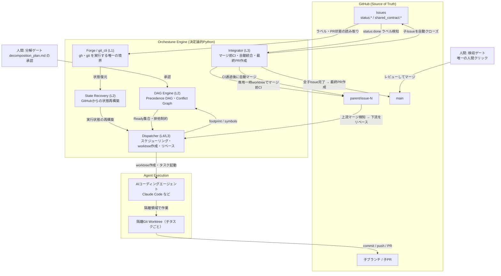
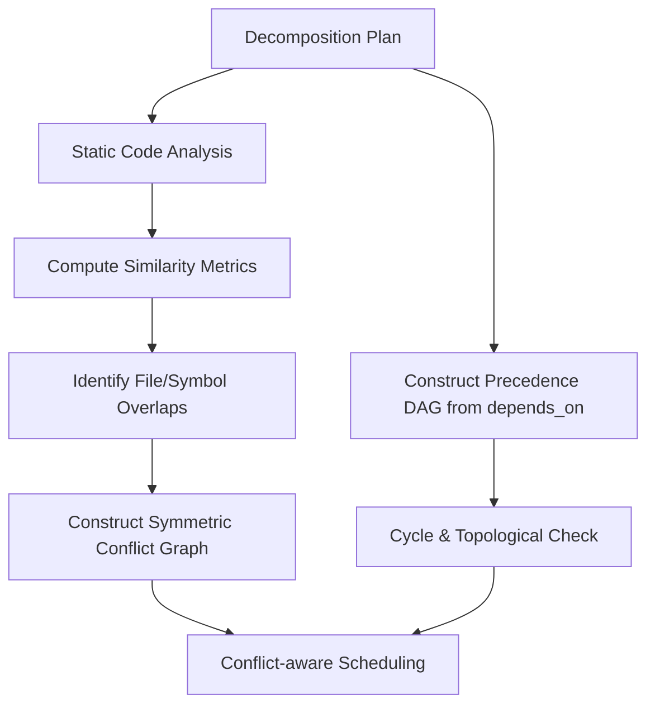
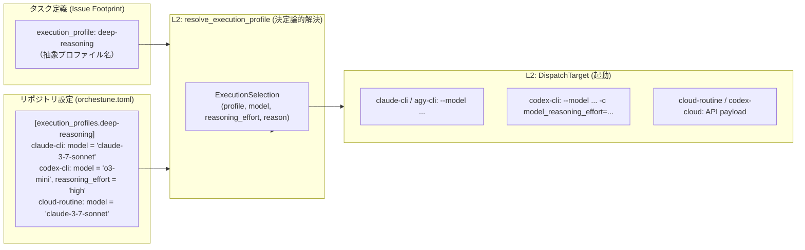
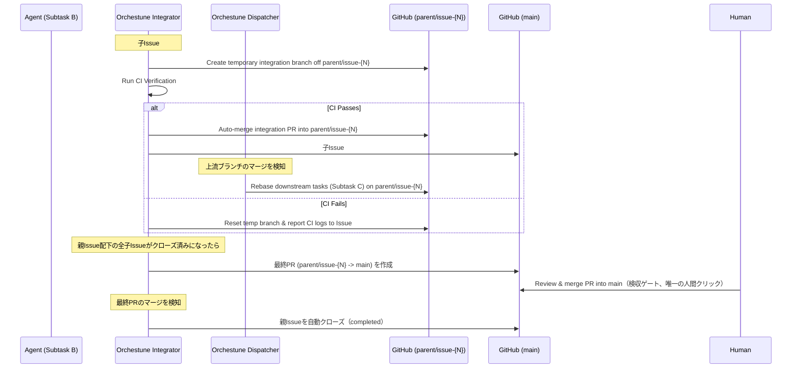

# アーキテクチャと設計思想

Orchestuneがどのように並列開発タスクを競合なく構築し、エージェントを自律駆動させ、最終的に安全にマージするのか、その内部設計とアーキテクチャについて説明します。

---

## システム全体像

Orchestuneは、GitHubを「唯一の信頼できる情報源（Single Source of Truth）」とし、決定論的なPython制御エンジンがLLM実装エージェントをオーケストレーションするアーキテクチャを採用しています。人間が関与するのは前段の「分解ゲート」と後段の「検収ゲート」の2点のみで、その間はすべて自律的に進行します。


```mermaid
graph TD
    HU1["人間: 分解ゲート<br/>decomposition_plan.md の承認"]
    HU2["人間: 検収ゲート<br/>唯一の人間クリック"]

    subgraph GH ["GitHub (Source of Truth)"]
        GI["Issues<br/>status:* / shared_contract:*"]
        GP["子ブランチ / 子PR"]
        PB["parent/issue-N"]
        MB["main"]
    end

    subgraph ENG ["Orchestune Engine (決定論的Python)"]
        L1["Forge / git_cli (L1)<br/>gh・git を実行する唯一の境界"]
        REC["State Recovery (L2)<br/>GitHubからの状態再構築"]
        DAG["DAG Engine (L2)<br/>Precedence DAG・Conflict Graph"]
        DP["Dispatcher (L4/L3)<br/>スケジューリング・worktree作成・リベース"]
        IG["Integrator (L3)<br/>マージ前CI・自動統合・最終PR作成"]
    end

    subgraph EX ["Agent Execution"]
        WT["隔離Git Worktree（子タスクごと）"]
        AG["AIコーディングエージェント<br/>Claude Code など"]
    end

    HU1 -->|承認| DAG
    GI -->|ラベル・PR状態の読み取り| L1
    L1 -->|状態復元| REC
    REC -->|実行状態の再構築| DP
    DAG -->|Ready集合・排他制約| DP
    DP -->|footprint / symbols| DAG
    DP -->|worktree作成・タスク起動| AG
    AG -->|隔離領域で作業| WT
    WT -->|commit / push / PR| GP
    GI -->|status:done ラベル検知| IG
    IG -->|専用一時worktreeでマージ前CI| PB
    IG -->|CI通過後に自動マージ| PB
    IG -->|子Issueを自動クローズ| GI
    PB -->|上流マージ検知 → 下流をリベース| DP
    IG -->|全子Issue完了 → 最終PR作成| MB
    HU2 -->|レビューしてマージ| MB
```

エンジン側からGitHubへの読み書きは、すべてL1アダプタ（`forge` / `git_cli`）を経由します。この封じ込めは[5.2節](#52-ciで機械的に検証される不変条件)でCIによって機械的に検証されます。また、Integratorのトリガーは子PRではなく子Issueの`status:done`ラベルであり、マージ前CIに使う一時worktreeはエージェントの隔離worktreeとは別に確保されます（エンジンがエージェントの作業領域へ書き込むことはありません）。

以降の各章は、この全体像の構成要素を順に掘り下げます。第0章が全体を貫く設計目標、第1章がDAG Engine、第2章がState Recovery、第3章がIntegratorとDispatcher、第4章が人間の2ゲート、第5章がエンジン内部の層構造です。

---

## 0. 設計目標: クオーター効率

Orchestuneは個人開発者と少人数チームのためのオーケストレーターです。AI利用クオーター（サブスクリプションのセッション/週次の使用枠）は固定で、人間が席にいられる時間も限られています。以下のすべての設計判断は、ただ1つの最適化目標——**消費したクオーター1単位あたりに生み出される「完成した、マージ可能な成果物」を最大化すること**——から導かれており、個々のタスクの実時間を最短化することは目標では**ありません**。小さなタスクであれば、分解・Issue起票・ディスパッチを経るより、エージェントに直接依頼するほうが速く、消費クオーターも少なくて済みます。

この目標は、以降の各セクションに3つの形で貫かれています。

* **最大の無駄は手戻りである**: マージコンフリクト、粒度を誤ったサブタスク、実装の重複は、いずれもクオーターを二重に消費させます。競合分析と共有コントラクトゲート（セクション1）はわずかな事前計画コストと引き換えに手戻りを回避し、マージ前CI（セクション3）は機械的な破綻が下流へ波及する前に捕捉します。
* **並列実行は目的ではなく手段である**: 独立したサブタスクがあれば、1つのエージェントが順番に消費するのではなく、複数のエージェントが同時にクオーターを消費できます。DAG構築（セクション1）は、そのタスクが許す限りの**安全な**並列度を見つけ出すために存在します。
* **並列実行をクオーター効率へ変換するのは「無人運転」である**: この利得は、人間が席を外している間——夜間や、ステートレスなCIランナー上——でも処理が進んで初めて実現します。状態をGitHubから自己修復する設計（セクション2）、子レベルの統合を人間を待たずに自動マージする設計（セクション3）、人間の判断を2点へ限定する設計（セクション4）は、すべてこのためです。サブタスクごとに人間のクリックを要求する設計では、パイプラインが人間の在席状況で停滞します。

### 0.1 決定論: LLMは判断、共有状態の自動遷移はPython

LLM呼び出しはクオーターを消費する希少な操作です。したがってOrchestuneは、**判断が代替不能な箇所——分解、実装、統合diffの意味的レビュー、`status:not-needed`の判定——にのみLLMを使い、それ以外はすべて決定論的なPythonで処理します**。ラベルのポーリング、DAGの再計算、ローカル状態の再構築、GC、エスカレーションは、いずれも「エージェントに考えさせる」ことも可能ですが、その都度クオーターを支払うことになります。

この方針は二重に効きます。決定論的に処理した分だけ直接の消費が減り、加えて非決定的な挙動が生む手戻り——冒頭で述べた最大の無駄——も減ります。

分割線は「LLMが何をしないか」ではなく、**スコープ**——誰の領域へ書き込むか——で引かれています。

| | 書き込み先 |
|---|---|
| **LLM** | 自分に割り当てられた隔離領域（worktreeと自分のブランチ）、および判断の表明（Outcome Record・コメント・PR。Cloud Routineにおける独立検証レビュアーの判定ラベル付与を含む） |
| **Python** | **共有状態のうち自動で進む部分**——子PRから親ブランチへの統合マージ、Issueの生死、通常サイクルのラベル遷移、依存関係の解決、クオーター台帳の更新 |
| **人間** | **検収マージ**——親ブランチから`main`への最終PR。セクション4の「唯一の人間クリック」 |

通常の実装ワーカーエージェントが共有のGitHubラベルを直接操作することはありません。実装エージェントは要件が既に満たされていると判断した場合、ラベルを直接書き換えるのではなくOutcome Record（`<!-- orchestune:outcome -->`、`result: not-needed`）をコメントとして投稿しますし、commit・push・PR作成も自分のブランチの中だけで完結します（唯一の例外は、Cloud Routineにおける独立検証レビュアーセッションであり、`integration_coordinator`の指示に従って合否判定ラベルを付与します）。**その成果を共有状態へ取り込むかどうかを決めるのは、エージェント自身ではありません。**

#### 前提: LLMもインフラも間違える

決定論だけでは足りません。LLMの出力もインフラも失敗しうるため、Orchestuneは**逸脱点を個別に列挙し、それぞれに決定論的な検知と回復を用意します**。

| 逸脱 | 検知 | 決定論的な処理 |
|---|---|---|
| 分解の誤り（未確立の共有拡張ポイント） | 共有コントラクトゲート（セクション1） | 警告 |
| 計画の陳腐化（`symbols`が実在しない） | ASTによるシンボル検証（セクション1） | Issue本文へ中立な注記 |
| 宣言の誤り（footprint外への変更） | 実行時の逸脱検知（`dispatch.locks.check_footprint_deviation`） | Conflict Graph再計算（除外規則と回数上限つき） |
| インフラの失敗（ローカル状態の消失） | — | GitHubを真実とする再構築（セクション2） |
| エージェントの自己申告（`result: not-needed`） | 記憶を持たない独立セッションによる再検証（Cloud Routineターゲット使用時のみ） | Outcome Recordとラベル遷移経由でPython側が決定論的にクローズ |

各機構の詳細な挙動——除外規則、スキップ条件、ディスパッチターゲット別の差——は、それぞれの節と実装のdocstringが持ちます。ここで述べるのは、どれも同じ原則から導かれているという点だけです。

そして、**ループには上限があり、終端があります**——ただし現状では全経路ではありません。実行時Conflict Graph再計算の回数、ウィンドウあたりの起動数、そしてゾンビ／タイムアウト回収による再投入回数（`--max-task-reclaims`、既定3回）は既定で有界ですが、タスクのタイムアウトとトークン消費の上限は**既定では無効**で、無人で長時間走らせる場合は明示的な設定が要ります（[使い方とコマンドリファレンス](usage.md)参照）。自動的に収束できない場合、対象Issueは`status:blocked-human-review`へ遷移して停止します。`tests/test_architecture.py`は、有限なリトライ／回収／レビュータイムアウト設定と宣言済み終端動作の対応を機械的に検証します。この検査は意図的に明示的なレジストリ方式です。回収ループの命名規約に一致する新設定に終端対応がなければ失敗させる一方、無関係な有界制御は個別機能のテストに委ねます。

> **既知の欠落**: 現時点で、終端へ到達しない経路が1つあります。
> - **トークン消費の観測不可**。`max_tokens_per_window`は、クラウドのディスパッチターゲット（`ClaudeCodeCloudRoutineDispatchTarget`・`CodexCloudDispatchTarget`）では発火しません。`collect_usage`の既定実装が`None`を返し、両ターゲットとも上書きしていないためです——クラウドセッションの消費量を問い合わせるポーリングAPIが公開されておらず、`is_complete`すらPR作成をプロキシシグナルにしています。したがって**無人運転の主経路ではトークン上限が効きません**。これは永続化以前の問題（そもそも記録すべきデータが生成されない）で、APIが公開され次第の再検討となります。なお`recompute_count`/`forced_serial`（子Issue本文）と`launch_history`（親Issue本文）は永続化済みで、この欠落の対象外です。

Orchestuneが**目指す**のは「常に自動で解決すること」ではなく、**収束するか、人間が対処可能な状態で停止するかのいずれかであること**です。上記の通りこれは設計目標であって、現時点で全経路が満たしているわけではありません。

---

## 1. DAG構築とコンフリクト回避（DAG Construction & Conflict Prevention）

Orchestuneは、各サブタスク間の関係を2つの独立したモデルとして静的に分析します。`depends_on`は「先行タスクが完了しなければ開始できない」因果関係として**Precedence DAG**へ、`footprint`・`symbols`・shared-contractの重複は「同時実行できない」対称な排他関係として**Conflict Graph**へ格納されます。


```mermaid
graph TD
    A[Decomposition Plan] --> B[Static Code Analysis]
    B --> C[Compute Similarity Metrics]
    C --> D[Identify File/Symbol Overlaps]
    A --> E[Construct Precedence DAG from depends_on]
    D --> F[Construct Symmetric Conflict Graph]
    E --> G[Cycle & Topological Check]
    F --> H[Conflict-aware Scheduling]
    G --> H
```

> **参考**: このセクションの類似度ベースのタスク分割は、Co-Coder論文（Xu Yang, Lunyiu Nie, Ethan Chandra, Stanislav Gannutin, Fangru Lin, Swarat Chaudhuri. "When Parallelism Pays Off: Cohesion-Aware Task Partitioning for Multi-Agent Coding." arXiv:2606.00953, 2026.）を出典としています。
>
> 同論文では、静的解析によってリポジトリのインターフェースからシンボル共有グラフを構築し、Infomapによるコミュニティ検出で「ファイル → エージェント」の割り当てを最適化しています（目的関数はクリティカルパス＋通信コスト）。
>
> Orchestuneはこの手法を運用ツール向けに適応させ、目的関数を「凝集度/コスト最適化」から「競合回避」へ、グラフの入力元をリポジトリ既存ファイルから分解計画の宣言済み`footprint`/`symbols`へと変更したうえで、IDF重み付きOtsuka-Ochiai類似度を採用しています。詳細は `orchestune/dag/similarity.py` のdocstringを参照してください。

### コンフリクト回避の仕組み

* **メタデータの重複分析**:
  複数のタスクが同じファイルやクラスを同時に変更しようとすると、コンフリクト（競合）が発生します。Orchestuneは類似度メトリクスを用いて重複を計算し、priorityやIDに左右されない対称な`ConflictEdge`として、score・理由・対象resourceとともに保持します。競合を恣意的な有向依存へ変換することはありません。
* **安全な並列実行**:
  DispatcherはPrecedence DAGから依存解決済みの`Ready`集合を求め、priority score順の決定論的な貪欲法で、active taskおよび同じサイクルですでに選んだtaskのどちらともConflict Graph上で隣接しない集合を選びます。したがって因果依存のない競合taskは一方の完了後に再び選択可能となり、固定された疑似的実行順は付与されません。

cycle検出とトポロジカルソートが参照するのはPrecedence DAGだけです。Conflict Graphは無向なのでcycleという概念を持たず、明示依存と競合が同じpairに共存しても競合情報は削除されません。`orchestune-dag --json`は`precedence_edges`と`conflict_edges`を別々に出力し、後方互換の`edges`キーはprecedence edgeだけを表します。

### スケジューリング: クリティカルパスとリソース制約

Ready集合の中からどれを起動するかは、単純なwall-clock短縮ではなく「AIクオータ1単位あたりの、完成したマージ可能な成果物」を最大化する問題として扱います（#660）。Dispatcherは候補ごとに次のスコアを求め、降順（同点はIssue番号昇順）に貪欲選択します。

```text
score = base priority
      + aging
      + critical path bonus
      + 後続解放 bonus
      + partial progress bonus
      − 推定トークン penalty
      − 手戻りリスク penalty
```

* **critical path bonus / 後続解放 bonus**: Precedence DAGから求めた**bottom level**（自身の推定所要時間＋後続チェーンの最長経路）と、到達可能な後続数を、候補集合内で正規化した`[0, 1]`の値です（`orchestune/dispatch/critical_path.py`）。bottom levelと直接後続数は辺を一度ずつ辿るだけなので`O(V + E)`で求まり、非循環である限り常に厳密です（探索上限の対象外）。到達可能な後続数は推移閉包であり最悪`O(V * E)`になるため、ノード数が`MAX_TRANSITIVE_CLOSURE_NODES`（512）を超えたら打ち切り、直接の後続数へ決定論的に縮退します。`depends_on`が手編集で循環していても例外を投げませんが、逆トポロジカル順序が存在しないため1回の走査ではrankを正しく積み上げられず過小評価になります。そのため循環時はbottom levelを0へ中立化し、到達可能後続数を直接の後続数へ縮退させ、critical-path bonusと後続解放bonusの両方を無効化して不正確な値による並べ替えを止めます。`PrecedenceRanks.exact_bottom_level`と`exact_downstream`により、この循環時の縮退と、bottom levelは厳密なまま直接後続数を使う大規模非循環グラフの縮退を区別できます。壊れたメタデータのために正確な到達可能性計算を持ち込むより、安全かつ観測可能に縮退する方針です。
* **推定コスト**: 所要時間・トークン量・手戻りリスクは、既にKPI集計用に保持している完了履歴（`RunState.completed_worktrees`）の中央値から推定します（`orchestune/dispatch/cost_model.py`）。そのタスク自身の履歴 → 全体（fleet）の履歴 → 決定論的な既定値、の順に縮退します。トークンだけは不明なら`None`のまま残します——0と推定すると「無料のタスク」として扱われ、逆に既定値を捏造すると根拠の無い数値で上限判定が動いてしまうためです。手戻りリスクは「既に`n`回試行されたのにまだキューに居る」ことを`n / (n + 1)`へ写した値で、単調増加ですが1には達しません。
* **priorityとの関係**: critical path・後続解放のbonusと、トークン・手戻りのpenaltyの重みの総和（`QUALITY_SPAN`）は、隣接するpriority段階の最小の差（`MIN_PRIORITY_GAP` = `1.0`）より小さく設定されています。ここで制限すべきは片方の候補が得られるbonusの合計ではなく、2候補**間**で開き得る差である点に注意してください。低priority側がbonusを満額得ると同時に高priority側がpenaltyを満額被り得るため、bonus側だけを1.0未満に抑えても候補間では`bonus + penalty`だけ差がつき、priorityを逆転できてしまいます（PR#665レビュー指摘）。4項の総和を制限することで、待ち時間が等しい候補同士でcritical path上の位置が`priority:*`ラベルを上書きすることはなくなり、同priorityタスク同士の決め手としてのみ働きます。この不変条件は`tests/test_dispatch_scheduling.py`で機械的に検証されます。なお`partial progress` bonus（`1.0`）はこの制限の対象外です——中断したタスクの再開を優先するという#660以前からの意図的な挙動を維持しています。

**リソース制約**: 同時実行数（`--max-concurrent`）と起動レート（`--max-launches-per-window`）の上限は従来どおり`quota_available`が守ります。`--max-tokens-per-window`が設定されている場合はさらに、同一バッチ内の推定トークン量の合計がウィンドウ残予算を超える候補を見送ります。ただしバッチの先頭1件だけはこの判定から除外します——単体で残予算を超える見積りのタスクしか無いときにキューが永久に進まなくなる（終端の無い経路になる）ためです。さらに、`remaining_token_budget`が数えるのは**完了した**worktreeの実測消費だけ（#438からの既存仕様）なので、まだ完了していない実行中タスクの推定消費を予約分として差し引きます。予約がある間は免除枠を発行しません——サイクルごとに免除を出すと、同じウィンドウ内の再実行で見込み消費が上限を超え得るためです（PR#665レビュー指摘）。予約量は起動時点で`ActiveWorktree`へ保存するため、その後の完了履歴でfleet中央値が変わっても実行中タスクの予約が遡って縮みません。旧形式の状態ファイルは互換性のため現在の見積りへ縮退します。既に何かが動いているなら、その完了自体が前進を保証するので免除は不要です。ウィンドウ上限そのものは`quota_available`のハードゲートが守り、このゲートで止めた候補は一般的な`quota-exhausted`ではなく`token-budget`として報告します。トークン情報が取得できない候補（推定が`None`）は予算判定の対象外として安全側に縮退します。同時実行できない組み合わせは、これまでどおりConflict Graphが同一バッチから排除します。

**飢餓回避**: aging項は「候補集合内の最小待ち時間との差が、起動ウィンドウ何個分か」であり非有界です。他の全成分が取り得る幅は有限（`BOUNDED_SCORE_SPAN`）なので、resourceが供給され続ける限り、継続的にeligibleなタスクはいつか必ず他のどの候補よりも高いスコアになります。これが「critical path優先だけでは低rankタスクが飢餓状態になり得る」という問題への終端保証です。

**観測性と切り戻し**: 選出されたかどうかに関わらず、全候補のスコア内訳・bottom level・解放数・推定コスト・rank精度フラグ・見送り理由（`conflict` / `quota-exhausted` / `token-budget` / `launch-failed`、およびスコアリング以前に外れた `yaml-error` / `external-lock` / `blocked-recompute` / `already-active`）がcycle report、`--json`出力、`events.jsonl`へ記録されます。スコアリング対象外となった候補（YAML不正・外部ロック・再計算ブロック・既に実行中）も、理由付きの未選出判定として残し、raw rankと推定コストにはダミーの0ではなく実値を記録します——特にYAML不正のタスクはapply時に実際に処理される（`status:blocked-*`へ落とされる）ため、レポートから消したり診断値を0で埋めたりすると有用な根拠が失われます。選出（scheduling）と実起動（launch）も別物です。起動枠の予約が取れなかった／`create_worktree_and_launch`が失敗したタスクは、`reconcile_decisions_with_launches`によって`launch-failed`へ落とされるため、レポートが`CycleReport.selected`と食い違うことはありません。`--scheduling-mode legacy`を指定すれば#660以前のスコアリングへ切り戻しつつ、これらの診断情報は維持できます。

### Execution Profiles: 抽象プロファイルとモデル選定（Execution Profiles & Model Resolution）

サブタスクの実行特性（「高精度な推論が必要」「定型的な高速コード生成」「標準的なバランス」）と、実行環境・利用可能なLLMモデル（Claude 3.7 Sonnet, GPT-4o, o3-miniなど）を疎結合に保つため、Orchestuneは**Execution Profiles**による抽象化機構を採用しています（#663 / #668 / #669 / #670）。


```mermaid
graph LR
    subgraph Plan ["タスク定義 (Issue Footprint)"]
        EP["execution_profile: deep-reasoning<br/>（抽象プロファイル名）"]
    end

    subgraph Config ["リポジトリ設定 (orchestune.toml)"]
        CFG["[execution_profiles.deep-reasoning]<br/>claude-cli: model = 'claude-3-7-sonnet'<br/>codex-cli: model = 'o3-mini', reasoning_effort = 'high'<br/>cloud-routine: model = 'claude-3-7-sonnet'"]
    end

    subgraph Resolver ["L2: resolve_execution_profile (決定論的解決)"]
        RES["ExecutionSelection<br/>(profile, model, reasoning_effort, reason)"]
    end

    subgraph Target ["L2: DispatchTarget (起動)"]
        T1["claude-cli / agy-cli: --model ..."]
        T2["codex-cli: --model ... -c model_reasoning_effort=..."]
        T3["cloud-routine / codex-cloud: API payload"]
    end

    EP --> Resolver
    CFG --> Resolver
    Resolver --> RES
    RES --> Target
```

* **設計思想（関心の分離とポータビリティ）**:
  `decomposition_plan.md` や GitHub IssueのFootprint YAMLには、特定ベンダーのモデル文字列（例: `claude-3-7-sonnet-20250219`）やCLIオプションを直接記述せず、`execution_profile: "deep-reasoning"` や `execution_profile: "fast-code"` といった抽象プロファイル名を指定します。これにより、開発者がローカル環境で `claude-cli` を使う場合でも、CI上で `cloud-routine` や `codex-cloud` へディスパッチする場合でも、Issueの再起票や計画ファイルの書き換えを行うことなく、リポジトリ設定に応じた最適なモデルへ決定論的にマッピングされます。
* **ターゲット能力マッピング（Target Capability Mapping）**:
  `orchestune/dispatch/execution_profiles.py` の `resolve_execution_profile` は純粋関数として決定論的に動作し、リポジトリの `[tool.orchestune.execution_profiles]`（または `[execution_profiles]`）定義に従って、対象ターゲットの能力に応じた具体的なモデル・推論強度を解決します。
  * `claude-cli` / `agy-cli`: `--model <model>` をコマンドに付与。推論強度（`reasoning_effort`）はCLI仕様上非対応のため、警告ログを出力した上で安全にスキップします。
  * `codex-cli`: `--model <model>` および `-c model_reasoning_effort=<effort>` を付与。
  * `cloud-routine`: APIリクエストペイロードの `model` フィールドに設定。
  * `codex-cloud`: Codex Cloudセッションのパラメータに設定。
  非対応のターゲット固有フラグが指定された場合でも、ディスパッチサイクルを中断させることなく安全に縮退（警告ログの出力＋スキップ）します。
* **#660 スケジューラとの明確な責務境界**:
  * **#660 スケジューリングエンジン**: **「いつ（WHEN）」「どの（WHICH）」** タスクを起動するかを決定します。Precedence DAGのクリティカルパス（bottom level）、後続タスク解放数、過去履歴に基づくトークン消費見積もり、手戻りリスク、同時実行数上限、および時間窓トークン予算（Token Budget）の制約下で候補を選出します。
  * **Execution Profiles**: 選出されたタスクを **「どのように（HOW）」** 実行するかを決定します。選ばれたタスクの抽象プロファイルに基づき、設定されたディスパッチターゲットに適合する具体的なLLMモデルと推論強度（`reasoning_effort`）を決定論的にマッピングして渡します。
  * スケジューラはモデル固有の文字列や推論パラメータに関知せず、Execution Profilesはタスクの優先順位付けやクオータ消費判定に関知しません。
* **フォールバックと縮退保証**:
  * `execution_profile` が未指定または `null` の場合、`default_execution_profile`（既定は `balanced`）へ解決されます。
  * 設定ファイルに存在しない未知のプロファイル名が指定された場合、警告ログを出力した上で安全に `default_execution_profile` へフォールバックします。
  * リポジトリにプロファイル設定が存在しない場合、モデル・推論強度 `None` の `default_execution_profile`（ターゲット側の既定モデルに委譲）として解決されます。
  * 選定されたプロファイル・モデル・推論強度・選定理由は `ActiveWorktree` および `CompletedWorktree`（`run_state.json`）に永続化され、CycleReport、GitHub Step Summary、イベントログ（`events.jsonl`）、親Issueコメントに記録されます。

### 通常のfootprint重複と「共有コントラクトゲート」の違い

上記の重複分析（`dag/similarity.py`）は、サブタスクが**宣言済み**の`footprint`/`symbols`の文字列が一致する（または加重コサイン類似度が閾値を超える）場合にsimilarity由来の競合辺を追加します。これは既に存在するファイルを複数タスクが編集する通常のケースには有効ですが、グリーンフィールドな分解計画では別の失敗モードが起こり得ます。

例えば、フォーマットレジストリやCLI配線モジュールのような**まだ存在しない共有拡張ポイント**に対して、複数のサブタスクがそれぞれ異なる想定パスで暗黙的に触れてしまうケースです。この場合、どのサブタスクの`footprint`にも一致する文字列が現れないため、既存の重複検出では検出しようがありません。

これに対処するため、`orchestune`スキルのStage 1では、分解時に共有拡張ポイント（レジストリ・CLI配線・依存関係マニフェスト・パッケージ公開APIなど）を明示的に特定し、それらを所有する`shared-contract`/`integration-scaffold`サブタスクを作成したうえで、関与する全サブタスクに共通の`shared_contract: <id>`タグを付与することを求めます。これは文字列一致に頼らない、最も信頼できるシグナルです。

さらに`orchestune/dag/contracts.py`の`find_unowned_shared_contract_hotspots`が、以下の2段階でこれを補強します。

1. **`shared_contract`タグが同じサブタスク群**
2. **タグの有無を問わない全サブタスク**のうち、`footprint`が同一カテゴリ**かつ同一ディレクトリ**に該当するサブタスク群（`packages/auth/__init__.py`と`packages/payments/__init__.py`のような無関係な別パッケージまで誤って同一ホットスポット扱いしないためのスコープ限定です）

いずれの段階でもwriter pairはConflict Graphの排他制約になります。さらに、**Precedence DAG上で互いに到達可能でない（一方が他方の祖先になっていない）pairが存在する場合**に、`orchestune-dag`の出力へ`Warnings:`として警告を表示します（ブロッキングエラーにはしません）。

ここで重要なのは、判定基準が「連結成分が同じか」ではなく「互いに到達可能か」である点です。`shared -> csv`、`shared -> yaml`のように共通の祖先タスクへ`depends_on`しているだけの2タスクは、互いには到達不能であり実際には並列実行され得ます。そのため、両者が同じ祖先を宣言していても警告対象のままになります。

段階(2)が**タグの有無を問わず全サブタスクを対象にする**のには理由があります。`shared_contract`タグ付きのサブタスクだけを対象にすると、片方のサブタスクだけタグ付けを忘れた（宣言漏れ）場合に、両者ともどちらの段階でも比較対象に含まれず、まさに検出したい並列書き込みを見逃してしまうためです（#175再々レビュー指摘）。なお、段階(1)で既に警告済みのペアは、段階(2)で二重に報告されないよう記録・抑止します。

ただし、ディレクトリスコープの限定により、段階(2)のヒューリスティックでは、レジストリのように想定パスのディレクトリごと異なるケースまでは捕捉できません。そうしたケースを確実に検出したい場合は、段階(1)の`shared_contract`タグを明示的に付与することが推奨されます。

**書き込み者と消費者の区別**:
`shared_contract`タグは「同一の契約に関与している」ことしか意味せず、「その共有ファイルに書き込む」ことまでは意味しません。所有タスクに`depends_on`するだけで、自身の`footprint`は共有ファイルに触れない（読み取り・importのみの）消費者サブタスクも、同じタグを持つことがあります。

そのため`find_unowned_shared_contract_hotspots`は、タグが同じサブタスクのうち実際に「書き込み者」と判定されるサブタスク同士のみを比較対象とします（判定基準は、`footprint`がいずれかの共有拡張ポイントカテゴリに一致するか、または明示的な`writes_shared_contract: true`フラグを持つかです）。消費者同士、および書き込み者と消費者の組み合わせは、共有ファイルへの同時書き込みが発生しないため警告されません。

### 分解計画とコードベースの突合（陳腐化検知）

前の2項がいずれも**サブタスク同士**の衝突を扱うのに対し、ここで扱うのは**分解計画と現在のリポジトリ**の突合です。軸が異なります。

リファクタ（ファイル分割・関数の移動・リネーム）を経た分解計画は、既に存在しないコードスナップショットを指していることがあります。`orchestune/symbol_verification.py`はIssue生成時に、宣言された`symbols`が`footprint`に挙げられたPythonファイル群の中に見つかるかをASTで検証します（`provisioning.py`が`find_missing_symbols`を呼びます）。

一方、`footprint`のパス自体が実在するかは、`orchestune-dag`をリポジトリルート付きで実行したときに`find_missing_footprint_paths`がファイルシステム上で別途確認します。ASTによる検証ではなく、Issue生成時でもない点に注意してください。

シンボルの収集は、**目的の異なる2つの走査**を組み合わせます。

1. **定義名の全体集合（`_collect_all_names`）**:
   `ast.walk`により木全体を走査します。クラス名、`Class.method`形式の限定名、そしてネストした関数（クロージャのヘルパ等）まで含めるため、計画に裸のメソッド名を書いても照合できます。
2. **モジュールスコープ限定の候補集合（`_collect_top_level_names`）**:
   モジュール修飾記法（`db.get_connection`など）を末尾セグメントだけで緩く照合する際に使います。`ast.walk`はスコープ情報を失うため、この用途に使うと関数内のローカル変数やクラスメソッドの裸名をモジュールレベルの定義と取り違えてしまいます。そこでこちらは**モジュールスコープに限定**して集めます。

2番目の限定収集の挙動は、Pythonのスコープ規則に従います。`if`/`try`/`with`/ループ/`match`の内側は囲むブロックと同じスコープへ束縛されるため平坦化して取り込みますが（モジュール直下の条件付き関数定義や条件付き代入が典型例です）、新しいスコープを作る関数・クラス定義の内部へは再帰しません。なお、クラス直下の条件付きメソッド定義はこちらでは拾われず、クラス本体を個別に平坦化する1番目の全体走査が拾います。

**検証がスキップされる条件**:
以下の2つの場合、検証はスキップされ、空の結果を返して注記も付きません。判定材料が欠けた状態で「存在しない」と断定すると、false positiveになってしまうためです。

* `footprint`に実在する`.py`ファイルが1つも無い場合
* `footprint`中のいずれかの`.py`がパース不能（構文エラー等）だった場合

ただし、**リファクタでファイルが分割・改名された直後は、まさに`footprint`のパスが実在しない状態**になり得ます。つまり、この検証が最も効いてほしい場面ほど、静かに保留されやすいということです。

また、収集対象は定義（`class`/`def`）と代入（`x = ...` / `x: T = ...`）のみで、**`import`による束縛は収集しません**。`try: import fast as impl except ImportError: import slow as impl`のようにimport経由でのみ定義される名前を`symbols`に書くと、実在していても未検出として注記されます。注記は中立で非ブロッキングなので実害は小さいものの、この検証の既知の限界です。

**この検証はブロッキングではありません。** 未検出は「リファクタで陳腐化した」とも「このサブタスクがこれから新規に追加する」とも解釈できるため、断定せずIssue本文へ中立な注記として残し、判断は実装するエージェントと人間に委ねます——[0.1](#01-決定論-llmは判断共有状態の自動遷移はpython)の「LLMは判断、共有状態の自動遷移はPython」の適用例のひとつです。

---

## 2. 自己修復（ステートリカバリ）機能

Orchestuneのディスパッチャーは、GitHub Actionsなどの**「実行が終わるとディスク状態が完全に消去されるステートレスなCI環境」**で定期的に起動されることを前提に設計されています。

通常、開発プロセス全体の進行状況は `run_state.json` などのローカル状態ファイルに記録されますが、これが消失した場合でも以下の手順で状態を**自己修復（セルフヒーリング）**します。

```text
[Dispatcher Start]
       │
       ▼
[Read GitHub Issues & PRs]
       │
       ├─► status:in-progress の Issue は実行中と判断
       ├─► status:blocked / status:queued を再判定
       └─► オープンな PR ブランチから現在の進捗を復元
       │
       ▼
[Reconstruct DAG State & Resume]
```

* **GitHub Source of Truth**:
  現在のブランチやPR、およびGitHub Issueのラベル（`status:in-progress`, `status:blocked`, `status:queued` など）の状態を直接読み取ることで、メモリ上で全体の実行状態を復元し、途中からシームレスに処理を再開します。
* **回収回数の扱い（#512）**:
  ゾンビ／タイムアウト回収の回数（`--max-task-reclaims`の判定に使う`task_reclaim_counts`台帳）は`run_state.json`にのみ保持されるため、`run_state.json`が消失すると0へ戻ります。ただし、既に上限を超えて`status:blocked-human-review`へ遷移したタスクは、GitHubのラベルが真実であるため復元後も再投入されません（上限判定がやり直しになるのは、まだ上限に達していないタスクだけです）。

---

## 3. 統合（Integration）と自動リベース

複数のエージェントが開発を進めると、下流のタスクは上流の成果物を取り込む必要があります。この工程は**Integrator**と**Dispatcher**という2つの異なる責務に分かれており、`orchestune dispatch`コマンドの1回の呼び出し内で、Dispatcherサイクルの後にIntegratorが順次実行されます（別プロセスではありません）。

`--parent-issue <N>` を指定してディスパッチした場合、統合は**親ブランチによる二層モデル**で行われます。人間が判断・クリックする必要があるのは「親ブランチ→main」の最終マージただ1箇所のみで、子Issueレベルの統合はCI通過後に完全自動で進みます。


```mermaid
sequenceDiagram
    participant AG as Agent (Subtask B)
    participant IG as Orchestune Integrator
    participant DP as Orchestune Dispatcher
    participant PB as GitHub (parent/issue-{N})
    participant GH as GitHub (main)
    participant HU as Human

    Note over IG: 子Issue #B が status:done に
    IG->>PB: Create temporary integration branch off parent/issue-{N}
    IG->>IG: Run CI Verification
    alt CI Passes
        IG->>PB: Auto-merge integration PR into parent/issue-{N}
        IG->>GH: 子Issue #B を自動クローズ（completed）
        Note over DP: 上流ブランチのマージを検知
        DP->>PB: Rebase downstream tasks (Subtask C) on parent/issue-{N}
    else CI Fails
        IG->>PB: Reset temp branch & report CI logs to Issue #B
    end
    Note over IG: 親Issue配下の全子Issueがクローズ済みになったら
    IG->>GH: 最終PR (parent/issue-{N} -> main) を作成
    HU->>GH: Review & merge PR into main（検収ゲート、唯一の人間クリック）
    Note over IG: 最終PRのマージを検知
    IG->>GH: 親Issueを自動クローズ（completed）
```

1. **親ブランチからの分岐**:
   `--parent-issue <N>` 指定時、親Issue用の長命ブランチ`parent/issue-{N}`が`main`から作成され、各子サブタスクのブランチは`main`ではなくこの親ブランチから分岐します。
2. **マージ前CI検証（Integratorの責務）**:
   `status:done`の子Issueを検知すると、`orchestune/integrator/`が一時統合ブランチを`parent/issue-{N}`から作成してローカルCIを走らせます。
3. **子レベルの自動マージ・自動クローズ（Integratorの責務、人間の確認なし）**:
   CI通過後、Integratorは一時統合ブランチのPRを**人間の確認を待たずに**`parent/issue-{N}`へ自動マージし、対象の子Issueを`completed`理由で自動的にクローズします。このレベルには人間のレビューゲートは存在せず、CIそのものが品質ゲートとして機能します（詳細は「4. 人間の承認ポイント」）。
4. **自動リベース（Dispatcherの責務）**:
   先行タスクのブランチが`parent/issue-{N}`へマージされると、その成果物に依存している（または関連ファイルに触れる）下流の仕掛かり中ブランチに対し、`orchestune/dispatch/rebase.py`が自動的に`git rebase`またはマージを行い、最新の`parent/issue-{N}`の変更を取り込ませます。
5. **親Issue配下の全完了検知と最終PR作成（Integratorの責務）**:
   親Issue配下の全子Issueがクローズされたことを検知すると、`orchestune/integrator/parent_completion.py`が`parent/issue-{N}` → `main`の最終PRを作成します。このPRは自動マージされません。
6. **検収マージと親Issueクローズ**:
   人間がこの最終PRをレビューしてマージします（唯一の人間クリック）。マージが検知されると、Integratorが親Issueを`completed`理由で自動的にクローズします。
7. **セマンティックレビュー（Integratorの責務）**:
   子レベルの統合PR作成時にAIが自動で変更点の整合性をレビューし、不整合（例えばインターフェースの変更が反映されていないなど）をPRへのコメントとして検出・報告します（自動マージ・自動クローズの後段のため、その結果を待って処理をブロックすることはありません）。
   このレビューはfire-and-forgetで、Python側が結果を追跡することもありません。**所見が検収者の目に入るかは統合モードで変わります**: フラットモードではその統合PR自体が人間のマージする検収PRなので所見は同じPR上にありますが、この二層モデルでは所見は子の統合PRに付き、検収PR（親ブランチ→`main`）へ転記もリンクもされません。非同期の所見が子PRのクローズ後に届くこともあるため、読むには子PRを個別に辿る必要があります。

`--parent-issue`を指定せずにディスパッチした場合は、従来通りのフラットモード（子ブランチが直接`main`へ向けて統合される単層モデル）にフォールバックし、その唯一の統合PRのマージは常に人間が行います。

> **設計前提（#377）**: Integratorが一時統合ブランチへ書き込む処理（`git push --force`を含む）は、同一マシン上のファイルロック（`orchestune/integrator/worktree.py`の`file_lock`）でのみ排他制御されています。このロックはプロセス間ロックであり、複数のCIランナー/マシンをまたいだ同時実行には効きません。Integratorは常に単一ランナー上でシリアル実行される前提であり、マトリクス並列化等で同一の`temp_branch`に対して複数ランナーから同時実行する構成には対応していません。
>
> この制約に対する緩和策として、`orchestune dispatch`をGitHub Actions上で定期実行する場合は`concurrency`グループの設定を強く推奨します（設定例は[セットアップガイド §6](setup.md#6-github-actions上での定期実行とcross-runner直列化)を参照）。`concurrency`グループはコード変更を伴わない予防策です。
>
> さらにこれとは独立に、一時ブランチのラン別分離と親ブランチ更新のcompare-and-swap化（#435）が施されています。そのため、万一この制約下で衝突が発生しても、無言のデータレースにはならず必ずpush失敗として検出できる多層防御構造になっています。

---

## 4. 人間の承認ポイント

Orchestuneは、人間が**内容を判断・レビューする**地点を「分解点」と「検収（最終受け入れ）」の2点のみに限定する設計思想を採っています。親ブランチによる二層モデルでは、この2点がそのまま「人間がクリックする箇所」とも一致します——子レベルの統合はCI通過のみを条件に完全自動で進み、人間が操作するのは親ブランチ→mainの最終PRのマージだけです（[3. 統合と自動リベース](#3-統合integrationと自動リベース)参照）。

1. **分解ゲート**: ディスパッチ開始前に、人間が `decomposition_plan.md`（サブタスクの粒度、footprint、依存関係）をレビューし承認します。
2. **検収ゲート（唯一の人間クリック）**: 親Issue配下の全子Issueが自動クローズされた後にIntegratorが作成する、`parent/issue-{N}` → `main`の最終PRを、人間がレビューしてマージします。マージが検知されると、Integratorが親Issueを自動的にクローズします——別途手動でクローズする必要はありません。

分解ゲートと検収ゲートの間では、子レベルの統合PRマージ・CI検証・リベース・Issueクローズはすべて人間の判断を介さずに進行します。`risk:flagged` ラベルはリスクのあるサブタスクを可視化するためのものであり、追加の承認ゲートとしては機能しません。

**なぜ「判断」が2点だけで十分なのか**:
各サブタスクの履歴（Issue、PR、コミット、CIログ）はすべてGitHub上に保存されます。そのため、人間のレビュー労力を事前（分解）と事後（検収の1マージ）に集約しても、途中の子レベル統合を逐一見ることなくトレーサビリティを維持できます。

**per-task承認の代替としてのCI**:
セクション3で述べたマージ前CI検証は、実質的にサブタスク単位の人間レビューの代替として機能します。すべての子レベル統合PRは`parent/issue-{N}`にマージされる前にCIをパスする必要があるため、個々の差分を人間が見なくても機械的な正しさは自動的に担保されます。

**トレーサビリティの補完: ディスパッチサイクルレポートの親Issueコメント投稿**:
`orchestune-dispatch`のサイクル毎イベントログ（`events.jsonl`）は`.gitignore`対象であり、CI実行のたびに揮発するため、それ単独では恒久的な履歴になりません。このログに頼らずディスパッチサイクルの意思決定を追跡可能にするため、**apply（`--no-apply`ではない）モードの**各ディスパッチサイクル終了時に、設定された親Issue（`--parent-issue`、#396）へ`## 🤖 Orchestune Dispatch Cycle Report`という見出しのコメントを投稿します。なお`--no-apply`はpost-cycleブロック全体をスキップするため、このレポート投稿も実行されません。

コメントの内容は、そのサイクルで選定されたタスク・注目すべき`footprint`逸脱イベント・完了イベント・昇格イベントの要約です。状態が変化しない定常的な逸脱イベント（例: 既に強制直列化済みのworktreeについての再通知）は、スキップ判定・コメント本文の両方から除外されます。そのため、同一内容のコメントが毎サイクル親Issueに積み上がることはありません。また、報告すべき内容が無いサイクル、または親Issueが未設定の場合はコメントを投稿しません。

投稿に失敗した場合の扱いは、他のpost-cycleフェーズと同様です。例外は送出せず、サイクル自体は常に最後まで実行されます。ただし失敗は`orchestune-dispatch`の非ゼロ終了ステータスとして表面化し、CIのステップとしては失敗扱いになります。通常の投稿エラー（一時的なネットワークエラー等）は警告ログを出したうえで終了コード2に、GitHub認証エラーはエラーログを出したうえで終了コード1にマップされます。

これにより、人間のレビュー労力を最も判断価値の高い2点（スコーピングと最終受け入れの1マージ）に集中させつつ、その間の機械的な処理（子レベルの自動マージ・自動クローズ、リベース、依存順序制御）は完全自動化されています。

---

## 5. モジュール層構造とパッケージ境界

`orchestune/__init__.py` は、パッケージの公開APIを `__all__` で宣言します。
そこに列挙されていないものはすべて内部実装であり、非推奨期間を置かずに
改名・削除される可能性があります。

### 5.1 5つの層

`orchestune/` のすべてのモジュールは、ちょうど1つの層に属します。モジュールは
自分と同じ層、または下位の層からのみimportでき、上位の層からはimportできません。

| 層 | 役割 | モジュール |
| --- | --- | --- |
| **L4** | **エントリポイント**<br/>`main()` を持つモジュール | `bootstrap`, `cli`, `dag.cli`, `dispatch.dispatcher`, `monitor`, `provisioning.cli` |
| **L3** | **ワークフロー**<br/>ディスパッチサイクルと統合パイプライン | `dispatch.cycle`, `dispatch.cycle_context`, `dispatch.cycle_report`, `dispatch.phase_gc`, `dispatch.phase_reconciliation`, `dispatch.phase_rebase`, `dispatch.phase_scheduling`, `dispatch.postcycle`, `dispatch.report`, `integrator`, `integrator.coordinator`, `integrator.parent_completion`, `integrator.steps`, `integrator.types`, `provisioning.flow` |
| **L2** | **ドメイン**<br/>DAG構築・スコアリング・ディスパッチ機構 | `consistency`, `consistency.desired`, `consistency.engine`, `consistency.invariants`, `consistency.invariants.execution`, `consistency.invariants.status`, `consistency.intents`, `consistency.observation`, `consistency.repairs`, `consistency.repairs.execution`, `consistency.repairs.status`, `dag.contracts`, `dag.graph`, `dag.parsing`, `dag.similarity`, `dispatch.actor_verification`, `dispatch.config`, `dispatch.conflicts`, `dispatch.cost_model`, `dispatch.critical_path`, `dispatch.escalation`, `dispatch.execution_profiles`, `dispatch.filters`, `dispatch.gc`, `dispatch.gc.completion`, `dispatch.gc.git`, `dispatch.gc.zombies`, `dispatch.labels`, `dispatch.launch`, `dispatch.locks`, `dispatch.rebase`, `dispatch.reconciliation`, `dispatch.recovery`, `dispatch.reviewer`, `dispatch.rules`, `dispatch.scoring`, `dispatch.state`, `dispatch.targets`, `dispatch.worktree`, `infra.not_needed_review_state`, `integrator.final_pr_body`, `integrator.git_ops`, `integrator.pr`, `integrator.tasks`, `integrator.worktree`, `issue_parsing`, `pr_link_notice`, `provisioning.parent`, `provisioning.plan`, `provisioning.rendering`, `provisioning.subtasks`, `status_snapshot`, `symbol_verification` |
| **L1** | **アダプタ**<br/>`git` / `gh` を実行する唯一のモジュール群 | `forge`, `forge.admin`, `forge.issues`, `forge.prs`, `infra.git_cli` |
| **L0** | **インフラ**<br/>純粋なDTOと依存を持たないヘルパ | `bounded_limit`, `consistency.contracts`, `consistency.models`, `dag`, `dag.models`, `dispatch`, `dispatch.result`, `infra`, `infra.json_state`, `infra.process_utils`, `models`, `outcome_record`, `plan_writer`, `provisioning`, `setup_skills`, `validation`, `version` |

純粋なデータ転送モジュール（`models`, `dag.models`, `dispatch.result`）を
アダプタより下の **L0** に置いているのは、`GitHubForge` が `IssueRecord` /
`PrRecord` を返すためです。DTOを、それを生成するアダプタより上位に置くと、
この依存が上向きになってしまいます。

L4の定義は「`main()` を持ち、`cli` 以外からはimportされない」ことであって、「argparse配線しか含まない」ことではありません。`cli` が例外なのは、残り5つへ処理を振り分ける役割だからです（ガード側では `ALLOWED_L4_DEPENDENTS` として表現されています）。

境界を定める前から存在するコードは、現時点ではすべて解消済みです。かつては`dag`・`dispatcher`・`monitor`の3つに残滓がありました。

* `dag`: `dag_*`パッケージ全体を再エクスポートする互換ファサードでした。呼び出し側が具体的な`dag_*`モジュールを直接importするようになり、実際に`main()`を持つ`dag.cli`が本来のL4エントリポイントとして扱われています。
* `dispatcher`: dispatch cycle後のベストエフォート後処理オーケストレーションを直接抱えていました。これは`dispatch.postcycle`（L3）へ切り出し済みで、現在は引数解析・設定読み込み・`main()`のみが残っています。
* `monitor`: 自前のステータススナップショット構築（`MonitorState`/`build_status_snapshot`/`format_status_report`等）を直接抱えていました。これは`status_snapshot`（L2）へ切り出し済みで、現在は引数解析・`--watch`ループ・`main()`のみが残っています。

これは新規のコードをその振る舞いを所有する層に置かなくてよいという意味ではありません。境界は引き続きこの節と`tests/test_architecture.py`で機械的に検証されます。

### 5.2 CIで機械的に検証される不変条件

`tests/test_architecture.py` が毎回以下をすべて検証するため、上記の表が
コードから静かに乖離することはありません。

1. **依存は下向きのみ**:
   厳密に上位の層に属するモジュールをimportすることはできません。特にL4のエントリポイントをimportしてよいのは、それらを合成する `cli` だけです。
2. **`git` / `gh` の実行はL1に閉じ込める**:
   いずれかのコマンドを指定する `subprocess` 呼び出しは以下のとおり厳密に分割されており、他のモジュールが新たに持つことは許されません。

   | コマンド | 実行を許可されるモジュール |
   | --- | --- |
   | `gh` | `forge.admin` |
   | `git` | `infra.git_cli` |

   対象はVCS・GitHubクライアントの表面のみです。それ以外の外部プロセス起動は意図的に対象外としており、ガードもしていません。具体的には、`dispatch.targets` はエージェントのCLIを起動し、`dispatch.rebase` と `integrator.git_ops` はCIスクリプトや `poetry` を実行します。これらは呼び出し側がフェイクを用意すべきクライアントではなく単発のプロセス起動であるため、使用箇所に置いたままにしています。

   **この検査の範囲**:
   ガードはソースからコマンドを読み取るため、検出できるのはリテラルのリストに限られます（直接渡す場合と、スコープ内のいずれかの代入がリテラルを束縛した変数を渡す場合です）。通常のコードに対して信頼できる程度にはPythonのスコープ規則を模しており、分岐とループを追い、クラス本体をメソッドから切り離し、`global` / `nonlocal` を尊重し、第1位置引数だけでなく `args=` キーワードも読みます。

   ただし評価は一切行いません。そのため、実行時に組み立てたコマンド、設定から読み込んだコマンド、他モジュールから渡されたコマンドは、まったく検出できません。

   この線引きは意図的なものです。この不変条件が存在する目的は、L2のモジュールで `run_git` ではなく `subprocess` に手を伸ばしてしまうといった**事故を捕まえること**であって、意図的な回避を防ぐことではありません。`git_cli` の外で `git` を実行したい人はそうできますし、テストファイル内の静的検査でそれを止めることはできません。それを止めるのはコードレビューです。したがって `git` / `gh` のargvはリテラルで書き、ここでの失敗は「これはL1に属する」という合図として扱ってください。回避すべきパズルではありません。

3. **循環インポートはゼロ**:
   循環インポートは禁止されています。また、循環検知をすり抜ける関数内import（内部モジュールに対するもの）も禁止です。起動時間短縮のためにエントリポイントのimportを遅延させる `cli` のみが例外となります。
4. **表は網羅的である**:
   `orchestune/` 配下のすべての `.py` ファイルが、英語版・日本語版の両ドキュメントでちょうど1つの層に現れる必要があります。ただし `orchestune/__init__.py` 自身のみ意図的な例外です。パッケージルートは境界の**中にいる**のではなく境界を**宣言する**側であるため、層を持たずルール1の対象にもなりません。何をimportしてよいかは別途検査しており、L4のエントリポイントを取り込んでいないことを専用のテストが表明します（これが例外化によって失われうる性質であるためです）。

### 5.3 なぜ `Forge` はクラスではなくプロトコルなのか

L1の境界は、単一の具象クライアントではなく3つの `Protocol` クラスとして
表現されています。これにより、呼び出し側は実際に使うGitHubの機能だけに
依存できます。

- `IssueForge` — Issueの読み取りとラベル操作
- `PullRequestForge` — PRの列挙・作成・マージ
- `RepoAdminForge` — 認証確認と必須ラベルの初期化

`Forge` はこれらの合成であり、`GitHubForge` が唯一の `gh` 実装です。ラベルの
初期化しか行わない呼び出し側（`run_bootstrap`）は `RepoAdminForge` を受け取る
ため、誤ってPR系APIへ手を伸ばすことができず、テストダブルも20個ではなく
2個のメソッドで済みます。

抽象がプロトコルであるため、テストはモジュール属性をパッチする代わりに
フェイクを注入できます。`IntegratorConfig(forge=...)` や
`DispatcherConfig(forge=...)` はプロトコルを満たす任意のオブジェクトを
受け付け、共有フィクスチャ `fake_forge` がその実体を提供します。

テストモジュールの移行は完了しています。各テストは設定または関数の境界から
`fake_forge`（あるいは用途別のインメモリForge）を注入し、具象
`GitHubForge` クラスのメソッドを直接パッチしません。
`test_tests_do_not_patch_github_forge` アーキテクチャ不変条件は、
共有fixture・支援モジュールを含む `tests/` 配下のすべてのPythonモジュールを、
`test_forge.py` だけ除外してASTで解析します。`unittest.mock.patch` または
`patch.object` による直接patchが再導入された場合、そのファイルと行を報告します。
具象アダプタ自身の契約を検証する `test_forge.py` だけが明示的な例外です。
