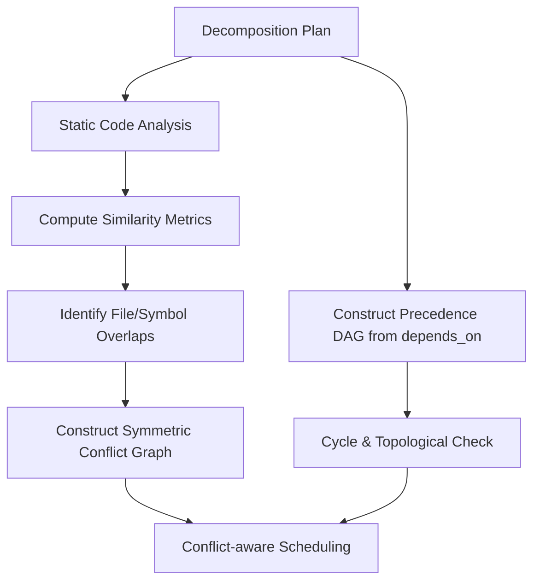
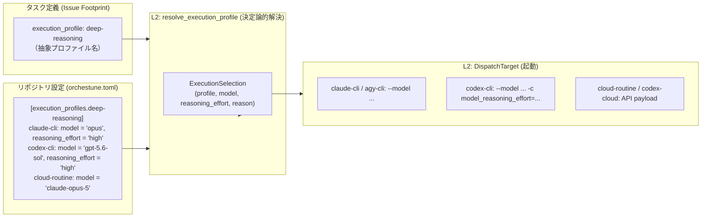

# DAG構築・スケジューリング・競合制御

本ドキュメントでは、OrchestuneにおけるPrecedence DAGとConflict Graphの二重グラフ構造、IDF類似度計算によるコンフリクト回避、クリティカルパスに基づくスケジューリングアルゴリズム、Execution Profilesによるモデル抽象化、および共有コントラクトゲートとASTシンボル検証の詳細仕様について説明します。全体像およびコア設計思想については [アーキテクチャと設計思想](../architecture.md) を参照してください。

---

## 1. 二重グラフモデル（Precedence DAG と Conflict Graph）

Orchestuneは、各サブタスク間の関係を2つの独立したモデルとして静的に分析します。`depends_on`は「先行タスクが完了しなければ開始できない」因果関係として**Precedence DAG**へ、`footprint`・`symbols`・shared-contractの重複は「同時実行できない」対称な排他関係として**Conflict Graph**へ格納されます。



> **参考**: このセクションの類似度ベースのタスク分割は、Co-Coder論文（Xu Yang, Lunyiu Nie, Ethan Chandra, Stanislav Gannutin, Fangru Lin, Swarat Chaudhuri. "When Parallelism Pays Off: Cohesion-Aware Task Partitioning for Multi-Agent Coding." arXiv:2606.00953, 2026.）を出典としています。
>
> 同論文では、静的解析によってリポジトリのインターフェースからシンボル共有グラフを構築し、Infomapによるコミュニティ検出で「ファイル → エージェント」の割り当てを最適化しています（目的関数はクリティカルパス＋通信コスト）。
>
> Orchestuneはこの手法を運用ツール向けに適応させ、目的関数を「凝集度/コスト最適化」から「競合回避」へ、グラフの入力元をリポジトリ既存ファイルから分解計画の宣言済み`footprint`/`symbols`へと変更したうえで、IDF重み付きOtsuka-Ochiai類似度を採用しています。詳細は `orchestune/dag/similarity.py` のdocstringを参照してください。

---

## 2. 競合分析と類似度計算

* **メタデータの重複分析**:
  複数のタスクが同じファイルやクラスを同時に変更しようとすると、コンフリクト（競合）が発生します。Orchestuneは類似度メトリクスを用いて重複を計算し、priorityやIDに左右されない対称な`ConflictEdge`として、score・理由・対象resourceとともに保持します。競合を恣意的な有向依存へ変換することはありません。
* **安全な並列実行**:
  DispatcherはPrecedence DAGから依存解決済みの`Ready`集合を求め、priority score順の決定論的な貪欲法で、active taskおよび同じサイクルですでに選んだtaskのどちらともConflict Graph上で隣接しない集合を選びます。したがって因果依存のない競合taskは一方の完了後に再び選択可能となり、固定された疑似的実行順は付与されません。

cycle検出とトポロジカルソートが参照するのはPrecedence DAGだけです。Conflict Graphは無向なのでcycleという概念を持たず、明示依存と競合が同じpairに共存しても競合情報は削除されません。`orchestune-dag --json`は`precedence_edges`と`conflict_edges`を別々に出力し、後方互換の`edges`キーはprecedence edgeだけを表します。

---

## 3. スケジューリングアルゴリズム: クリティカルパスとリソース制約

Ready集合の中からどれを起動するかは、単純なwall-clock短縮ではなく「AIクオータ1単位あたりの、完成したマージ可能な成果物」を最大化する問題として扱います（#660）。Dispatcherは候補ごとに次のスコアを求め、降順（同点はIssue番号昇順）に貪欲選択します。

```text
score = base priority
      + aging
      + critical path bonus
      + 後続解放 bonus
      + partial progress bonus
      − 推定トークン penalty
      − 手戻りリスク penalty
```

* **critical path bonus / 後続解放 bonus**: Precedence DAGから求めた**bottom level**（自身の推定所要時間＋後続チェーンの最長経路）と、到達可能な後続数を、候補集合内で正規化した`[0, 1]`の値です（`orchestune/dispatch/critical_path.py`）。bottom levelと直接後続数は辺を一度ずつ辿るだけなので`O(V + E)`で求まり、非循環である限り常に厳密です（探索上限の対象外）。到達可能な後続数は推移閉包であり最悪`O(V * E)`になるため、ノード数が`MAX_TRANSITIVE_CLOSURE_NODES`（512）を超えたら打ち切り、直接の後続数へ決定論的に縮退します。`depends_on`が手編集で循環していても例外を投げませんが、逆トポロジカル順序が存在しないため1回の走査ではrankを正しく積み上げられず過小評価になります。そのため循環時はbottom levelを0へ中立化し、到達可能後続数を直接の後続数へ縮退させ、critical-path bonusと後続解放bonusの両方を無効化して不正確な値による並べ替えを止めます。`PrecedenceRanks.exact_bottom_level`と`exact_downstream`により、この循環時の縮退と、bottom levelは厳密なまま直接後続数を使う大規模非循環グラフの縮退を区別できます。壊れたメタデータのために正確な到達可能性計算を持ち込むより、安全かつ観測可能に縮退する方針です。
* **推定コスト**: 所要時間・トークン量・手戻りリスクは、既にKPI集計用に保持している完了履歴（`RunState.completed_worktrees`）の中央値から推定します（`orchestune/dispatch/cost_model.py`）。そのタスク自身の履歴 → 全体（fleet）の履歴 → 決定論的な既定値、の順に縮退します。トークンだけは不明なら`None`のまま残します——0と推定すると「無料のタスク」として扱われ、逆に既定値を捏造すると根拠の無い数値で上限判定が動いてしまうためです。手戻りリスクは「既に`n`回試行されたのにまだキューに居る」ことを`n / (n + 1)`へ写した値で、単調増加ですが1には達しません。
* **priorityとの関係**: critical path・後続解放のbonusと、トークン・手戻りのpenaltyの重みの総和（`QUALITY_SPAN`）は、隣接するpriority段階の最小の差（`MIN_PRIORITY_GAP` = `1.0`）より小さく設定されています。ここで制限すべきは片方の候補が得られるbonusの合計ではなく、2候補**間**で開き得る差である点に注意してください。低priority側がbonusを満額得ると同時に高priority側がpenaltyを満額被り得るため、bonus側だけを1.0未満に抑えても候補間では`bonus + penalty`だけ差がつき、priorityを逆転できてしまいます（PR#665レビュー指摘）。4項の総和を制限することで、待ち時間が等しい候補同士でcritical path上の位置が`priority:*`ラベルを上書きすることはなくなり、同priorityタスク同士の決め手としてのみ働きます。この不変条件は`tests/test_dispatch_scheduling.py`で機械的に検証されます。なお`partial progress` bonus（`1.0`）はこの制限の対象外です——中断したタスクの再開を優先するという#660以前からの意図的な挙動を維持しています。

### リソース制約
同時実行数（`--max-concurrent`）と起動レート（`--max-launches-per-window`）の上限は従来どおり`quota_available`が守ります。`--max-tokens-per-window`が設定されている場合はさらに、同一バッチ内の推定トークン量の合計がウィンドウ残予算を超える候補を見送ります。ただしバッチの先頭1件だけはこの判定から除外します——単体で残予算を超える見積りのタスクしか無いときにキューが永久に進まなくなる（終端の無い経路になる）ためです。さらに、`remaining_token_budget`が数えるのは**完了した**worktreeの実測消費だけ（#438からの既存仕様）なので、まだ完了していない実行中タスクの推定消費を予約分として差し引きます。予約がある間は免除枠を発行しません——サイクルごとに免除を出すと、同じウィンドウ内の再実行で見込み消費が上限を超え得るためです（PR#665レビュー指摘）。予約量は起動時点で`ActiveWorktree`へ保存するため、その後の完了履歴でfleet中央値が変わっても実行中タスクの予約が遡って縮みません。旧形式の状態ファイルは互換性のため現在の見積りへ縮退します。既に何かが動いているなら、その完了自体が前進を保証するので免除は不要です。ウィンドウ上限そのものは`quota_available`のハードゲートが守り、このゲートで止めた候補は一般的な`quota-exhausted`ではなく`token-budget`として報告します。トークン情報が取得できない候補（推定が`None`）は予算判定の対象外として安全側に縮退します。同時実行できない組み合わせは、これまでどおりConflict Graphが同一バッチから排除します。

### 飢餓回避
aging項は「候補集合内の最小待ち時間との差が、起動ウィンドウ何個分か」であり非有界です。他の全成分が取り得る幅は有限（`BOUNDED_SCORE_SPAN`）なので、resourceが供給され続ける限り、継続的にeligibleなタスクはいつか必ず他のどの候補よりも高いスコアになります。これが「critical path優先だけでは低rankタスクが飢餓状態になり得る」という問題への終端保証です。

### 観測性
選出されたかどうかに関わらず、全候補のスコア内訳・bottom level・解放数・推定コスト・rank精度フラグ・見送り理由（`conflict` / `quota-exhausted` / `token-budget` / `launch-failed`、およびスコアリング以前に外れた `yaml-error` / `external-lock` / `blocked-recompute` / `already-active`）がcycle report、`--json`出力、`events.jsonl`へ記録されます。スコアリング対象外となった候補（YAML不正・外部ロック・再計算ブロック・既に実行中）も、理由付きの未選出判定として残し、raw rankと推定コストにはダミーの0ではなく実値を記録します——特にYAML不正のタスクはapply時に実際に処理される（`status:blocked-*`へ落とされる）ため、レポートから消したり診断値を0で埋めたりすると有用な根拠が失われます。選出（scheduling）と実起動（launch）も別物です。起動枠の予約が取れなかった／`create_worktree_and_launch`が失敗したタスクは、`reconcile_decisions_with_launches`によって`launch-failed`へ落とされるため、レポートが`CycleReport.selected`と食い違うことはありません。

---

## 4. Execution Profiles: 抽象プロファイルとモデル選定

サブタスクの実行特性（「高精度な推論が必要」「定型的な高速コード生成」「標準的なバランス」）と、実行環境・利用可能なLLMモデル（Claude Opus/Sonnet/Haiku、GPT-5.6 Sol/Terra/Lunaなど）を疎結合に保つため、Orchestuneは**Execution Profiles**による抽象化機構を採用しています（#663 / #668 / #669 / #670）。



* **設計思想（関心の分離とポータビリティ）**:
  `decomposition_plan.md` や GitHub IssueのFootprint YAMLには、特定ベンダーのモデル文字列（例: `claude-opus-5`）やCLIオプションを直接記述せず、`execution_profile: "deep-reasoning"` や `execution_profile: "fast-code"` といった抽象プロファイル名を指定します。これにより、開発者がローカル環境で `claude-cli` を使う場合でも、CI上で `cloud-routine` や `codex-cloud` へディスパッチする場合でも、Issueの再起票や計画ファイルの書き換えを行うことなく、リポジトリ設定に応じた最適なモデルへ決定論的にマッピングされます。
* **ターゲット能力マッピング（Target Capability Mapping）**:
  `orchestune/dispatch/execution_profiles.py` の `resolve_execution_profile` は純粋関数として決定論的に動作し、リポジトリの `[tool.orchestune.execution_profiles]`（または `[execution_profiles]`）定義に従って、対象ターゲットの能力に応じた具体的なモデル・推論強度を解決します。
  * `claude-cli` / `agy-cli`: `--model <model>` をコマンドに付与。推論強度（`reasoning_effort`）はCLI仕様上非対応のため、警告ログを出力した上で安全にスキップします。
  * `codex-cli`: `--model <model>` および `-c model_reasoning_effort=<effort>` を付与。
  * `cloud-routine`: APIリクエストペイロードの `model` フィールドに設定。
  * `codex-cloud`: Codex Cloudセッションのパラメータに設定。
  非対応のターゲット固有フラグが指定された場合でも、ディスパッチサイクルを中断させることなく安全に縮退（警告ログの出力＋スキップ）します。
* **#660 スケジューラとの明確な責務境界**:
  * **#660 スケジューリングエンジン**: **「いつ（WHEN）」「どの（WHICH）」** タスクを起動するかを決定します。Precedence DAGのクリティカルパス（bottom level）、後続タスク解放数、過去履歴に基づくトークン消費見積もり、手戻りリスク、同時実行数上限、および時間窓トークン予算（Token Budget）の制約下で候補を選出します。
  * **Execution Profiles**: 選出されたタスクを **「どのように（HOW）」** 実行するかを決定します。選ばれたタスクの抽象プロファイルに基づき、設定されたディスパッチターゲットに適合する具体的なLLMモデルと推論強度（`reasoning_effort`）を決定論的にマッピングして渡します。
  * スケジューラはモデル固有の文字列や推論パラメータに関知せず、Execution Profilesはタスクの優先順位付けやクオータ消費判定に関知しません。
* **フォールバックと縮退保証**:
  * `execution_profile` が未指定または `null` の場合、`default_execution_profile`（既定は `balanced`）へ解決されます。
  * 設定ファイルに存在しない未知のプロファイル名が指定された場合、警告ログを出力した上で安全に `default_execution_profile` へフォールバックします。
  * リポジトリにプロファイル設定が存在しない場合、モデル・推論強度 `None` の `default_execution_profile`（ターゲット側の既定モデルに委譲）として解決されます。
  * 選定されたプロファイル・モデル・推論強度・選定理由は `ActiveWorktree` および `CompletedWorktree`（`run_state.json`）に永続化され、CycleReport、GitHub Step Summary、イベントログ（`events.jsonl`）、親Issueコメントに記録されます。

---

## 5. 通常のfootprint重複と「共有コントラクトゲート」の違い

重複分析（`dag/similarity.py`）は、サブタスクが**宣言済み**の`footprint`/`symbols`の文字列が一致する（または加重コサイン類似度が閾値を超える）場合にsimilarity由来の競合辺を追加します。これは既に存在するファイルを複数タスクが編集する通常のケースには有効ですが、グリーンフィールドな分解計画では別の失敗モードが起こり得ます。

例えば、フォーマットレジストリやCLI配線モジュールのような**まだ存在しない共有拡張ポイント**に対して、複数のサブタスクがそれぞれ異なる想定パスで暗黙的に触れてしまうケースです。この場合、どのサブタスクの`footprint`にも一致する文字列が現れないため、既存の重複検出では検出しようがありません。

これに対処するため、`orchestune`スキルのStage 1では、分解時に共有拡張ポイント（レジストリ・CLI配線・依存関係マニフェスト・パッケージ公開APIなど）を明示的に特定し、それらを所有する`shared-contract`/`integration-scaffold`サブタスクを作成したうえで、関与する全サブタスクに共通の`shared_contract: <id>`タグを付与することを求めます。これは文字列一致に頼らない、最も信頼できるシグナルです。

さらに`orchestune/dag/contracts.py`の`find_unowned_shared_contract_hotspots`が、以下の2段階でこれを補強します。

1. **`shared_contract`タグが同じサブタスク群**
2. **タグの有無を問わない全サブタスク**のうち、`footprint`が同一カテゴリ**かつ同一ディレクトリ**に該当するサブタスク群（`packages/auth/__init__.py`と`packages/payments/__init__.py`のような無関係な別パッケージまで誤って同一ホットスポット扱いしないためのスコープ限定です）

いずれの段階でもwriter pairはConflict Graphの排他制約になります。さらに、**Precedence DAG上で互いに到達可能でない（一方が他方の祖先になっていない）pairが存在する場合**に、`orchestune-dag`の出力へ`Warnings:`として警告を表示します（ブロッキングエラーにはしません）。

ここで重要なのは、判定基準が「連結成分が同じか」ではなく「互いに到達可能か」である点です。`shared -> csv`、`shared -> yaml`のように共通の祖先タスクへ`depends_on`しているだけの2タスクは、互いには到達不能であり実際には並列実行され得ます。そのため、両者が同じ祖先を宣言していても警告対象のままになります。

段階(2)が**タグの有無を問わず全サブタスクを対象にする**のには理由があります。`shared_contract`タグ付きのサブタスクだけを対象にすると、片方のサブタスクだけタグ付けを忘れた（宣言漏れ）場合に、両者ともどちらの段階でも比較対象に含まれず、まさに検出したい並列書き込みを見逃してしまうためです（#175再々レビュー指摘）。なお、段階(1)で既に警告済みのペアは、段階(2)で二重に報告されないよう記録・抑止します。

ただし、ディレクトリスコープの限定により、段階(2)のヒューリスティックでは、レジストリのように想定パスのディレクトリごと異なるケースまでは捕捉できません。そうしたケースを確実に検出したい場合は、段階(1)の`shared_contract`タグを明示的に付与することが推奨されます。

**書き込み者と消費者の区別**:
`shared_contract`タグは「同一の契約に関与している」ことしか意味せず、「その共有ファイルに書き込む」ことまでは意味しません。所有タスクに`depends_on`するだけで、自身の`footprint`は共有ファイルに触れない（読み取り・importのみの）消費者サブタスクも、同じタグを持つことがあります。

そのため`find_unowned_shared_contract_hotspots`は、タグが同じサブタスクのうち実際に「書き込み者」と判定されるサブタスク同士のみを比較対象とします（判定基準は、`footprint`がいずれかの共有拡張ポイントカテゴリに一致するか、または明示的な`writes_shared_contract: true`フラグを持つかです）。消費者同士、および書き込み者と消費者の組み合わせは、共有ファイルへの同時書き込みが発生しないため警告されません。

---

## 6. 分解計画とコードベースの突合（陳腐化検知）

前の2項がいずれも**サブタスク同士**の衝突を扱うのに対し、ここで扱うのは**分解計画と現在のリポジトリ**の突合です。軸が異なります。

リファクタ（ファイル分割・関数の移動・リネーム）を経た分解計画は、既に存在しないコードスナップショットを指していることがあります。`orchestune/symbol_verification.py`はIssue生成時に、宣言された`symbols`が`footprint`に挙げられたPythonファイル群の中に見つかるかをASTで検証します（`provisioning.py`が`find_missing_symbols`を呼びます）。

一方、`footprint`のパス自体が実在するかは、`orchestune-dag`をリポジトリルート付きで実行したときに`find_missing_footprint_paths`がファイルシステム上で別途確認します。ASTによる検証ではなく、Issue生成時でもない点に注意してください。

シンボルの収集は、**目的の異なる2つの走査**を組み合わせます。

1. **定義名の全体集合（`_collect_all_names`）**:
   `ast.walk`により木全体を走査します。クラス名、`Class.method`形式の限定名、そしてネストした関数（クロージャのヘルパ等）まで含めるため、計画に裸のメソッド名を書いても照合できます。
2. **モジュールスコープ限定の候補集合（`_collect_top_level_names`）**:
   モジュール修飾記法（`db.get_connection`など）を末尾セグメントだけで緩く照合する際に使います。`ast.walk`はスコープ情報を失うため、この用途に使うと関数内のローカル変数やクラスメソッドの裸名をモジュールレベルの定義と取り違えてしまいます。そこでこちらは**モジュールスコープに限定**して集めます。

2番目の限定収集の挙動は、Pythonのスコープ規則に従います。`if`/`try`/`with`/ループ/`match`の内側は囲むブロックと同じスコープへ束縛されるため平坦化して取り込みますが（モジュール直下の条件付き関数定義や条件付き代入が典型例です）、新しいスコープを作る関数・クラス定義の内部へは再帰しません。なお、クラス直下の条件付きメソッド定義はこちらでは拾われず、クラス本体を個別に平坦化する1番目の全体走査が拾います。

**検証がスキップされる条件**:
以下の2つの場合、検証はスキップされ、空の結果を返して注記も付きません。判定材料が欠けた状態で「存在しない」と断定すると、false positiveになってしまうためです。

* `footprint`に実在する`.py`ファイルが1つも無い場合
* `footprint`中のいずれかの`.py`がパース不能（構文エラー等）だった場合

ただし、**リファクタでファイルが分割・改名された直後は、まさに`footprint`のパスが実在しない状態**になり得ます。つまり、この検証が最も効いてほしい場面ほど、静かに保留されやすいということです。

また、収集対象は定義（`class`/`def`）と代入（`x = ...` / `x: T = ...`）のみで、**`import`による束縛は収集しません**。`try: import fast as impl except ImportError: import slow as impl`のようにimport経由でのみ定義される名前を`symbols`に書くと、実在していても未検出として注記されます。注記は中立で非ブロッキングなので実害は小さいものの、この検証の既知の限界です。

**この検証はブロッキングではありません。** 未検出は「リファクタで陳腐化した」とも「このサブタスクがこれから新規に追加する」とも解釈できるため、断定せずIssue本文へ中立な注記として残し、判断は実装するエージェントと人間に委ねます——[0.1 決定論](../architecture.md#01-決定論-llmは判断共有状態の自動遷移はpython)の「LLMは判断、共有状態の自動遷移はPython」の適用例のひとつです。
