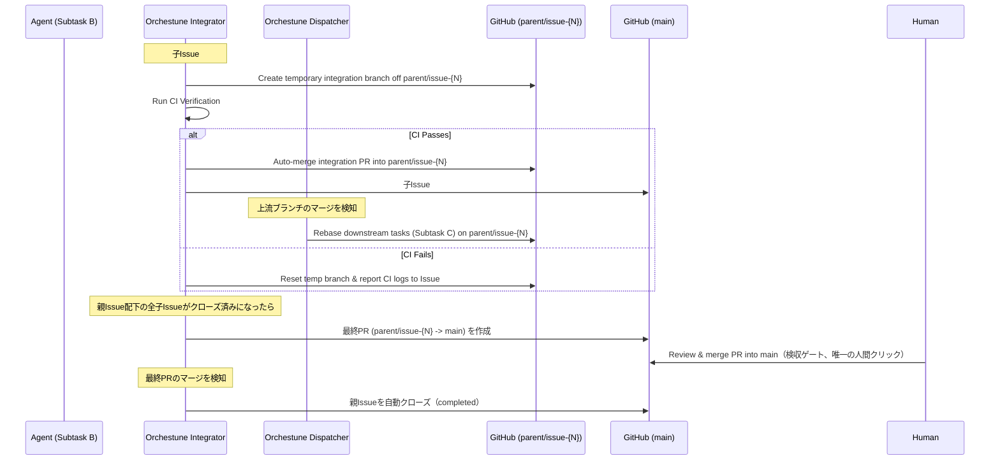

# 統合パイプライン・二層モデル・自動リベース

本ドキュメントでは、Orchestuneにおける親ブランチを活用した二層統合モデル、マージ前CIと子Issueの完全自動マージ・クローズ、Dispatcherによる自動リベース、親Issue完了検知と最終PR、セマンティックレビュー、および排他制御と設計前提の詳細仕様について説明します。全体像およびコア設計思想については [アーキテクチャと設計思想](../architecture.md) を参照してください。

---

## 1. 親ブランチによる二層モデル

複数のエージェントが開発を進めると、下流のタスクは上流の成果物を取り込む必要があります。この工程は**Integrator**と**Dispatcher**という2つの異なる責務に分かれており、`orchestune dispatch`コマンドの1回の呼び出し内で、Dispatcherサイクルの後にIntegratorが順次実行されます（別プロセスではありません）。

`--parent-issue <N>` を指定してディスパッチした場合、統合は**親ブランチによる二層モデル**で行われます。人間が判断・クリックする必要があるのは「親ブランチ→main」の最終マージただ1箇所のみで、子Issueレベルの統合はCI通過後に完全自動で進みます。

---

## 2. 統合パイプラインのフェーズ詳細

1. **親ブランチからの分岐**:
   `--parent-issue <N>` 指定時、親Issue用の長命ブランチ`parent/issue-{N}`が`main`から作成され、各子サブタスクのブランチは`main`ではなくこの親ブランチから分岐します。
2. **マージ前CI検証（Integratorの責務）**:
   `status:done`の子Issueを検知すると、`orchestune/integrator/`が一時統合ブランチを`parent/issue-{N}`から作成してローカルCIを走らせます。
3. **子レベルの自動マージ・自動クローズ（Integratorの責務、人間の確認なし）**:
   CI通過後、Integratorは一時統合ブランチのPRを**人間の確認を待たずに**`parent/issue-{N}`へ自動マージし、対象の子Issueを`completed`理由で自動的にクローズします。このレベルには人間のレビューゲートは存在せず、CIそのものが品質ゲートとして機能します（詳細は [アーキテクチャと設計思想 §2.4](../architecture.md#24-人間の承認ポイント)）。
4. **自動リベース（Dispatcherの責務）**:
   先行タスクのブランチが`parent/issue-{N}`へマージされると、その成果物に依存している（または関連ファイルに触れる）下流の仕掛かり中ブランチに対し、`orchestune/dispatch/rebase.py`が自動的に`git rebase`またはマージを行い、最新の`parent/issue-{N}`の変更を取り込ませます。
5. **親Issue配下の全完了検知と最終PR作成（Integratorの責務）**:
   親Issue配下の全子Issueがクローズされたことを検知すると、`orchestune/integrator/parent_completion.py`が`parent/issue-{N}` → `main`の最終PRを作成します。このPRは自動マージされません。
6. **検収マージと親Issueクローズ**:
   人間がこの最終PRをレビューしてマージします（唯一の人間クリック）。マージが検知されると、Integratorが親Issueを`completed`理由で自動的にクローズします。
7. **セマンティックレビュー（Integratorの責務）**:
   子レベルの統合PR作成時にAIが自動で変更点の整合性をレビューし、不整合（例えばインターフェースの変更が反映されていないなど）をPRへのコメントとして検出・報告します（自動マージ・自動クローズの後段のため、その結果を待って処理をブロックすることはありません）。
   このレビューはfire-and-forgetで、Python側が結果を追跡することもありません。**所見が検収者の目に入るかは統合モードで変わります**: フラットモードではその統合PR自体が人間のマージする検収PRなので所見は同じPR上にありますが、この二層モデルでは所見は子の統合PRに付き、検収PR（親ブランチ→`main`）へ転記もリンクもされません。非同期の所見が子PRのクローズ後に届くこともあるため、読むには子PRを個別に辿る必要があります。

### フラットモード（フォールバック）
`--parent-issue`を指定せずにディスパッチした場合は、従来通りのフラットモード（子ブランチが直接`main`へ向けて統合される単層モデル）にフォールバックし、その唯一の統合PRのマージは常に人間が行います。

---

## 3. 排他制御と設計前提

> **設計前提（#377）**: Integratorが一時統合ブランチへ書き込む処理（`git push --force`を含む）は、同一マシン上のファイルロック（`orchestune/integrator/worktree.py`の`file_lock`）でのみ排他制御されています。このロックはプロセス間ロックであり、複数のCIランナー/マシンをまたいだ同時実行には効きません。Integratorは常に単一ランナー上でシリアル実行される前提であり、マトリクス並列化等で同一の`temp_branch`に対して複数ランナーから同時実行する構成には対応していません。
>
> この制約に対する緩和策として、`orchestune dispatch`をGitHub Actions上で定期実行する場合は`concurrency`グループの設定を強く推奨します（設定例は[セットアップガイド §6](../setup.md#6-github-actions上での定期実行とcross-runner直列化)を参照）。`concurrency`グループはコード変更を伴わない予防策です。
>
> さらにこれとは独立に、一時ブランチのラン別分離と親ブランチ更新のcompare-and-swap化（#435）が施されています。そのため、万一この制約下で衝突が発生しても、無言のデータレースにはならず必ずpush失敗として検出できる多層防御構造になっています。
