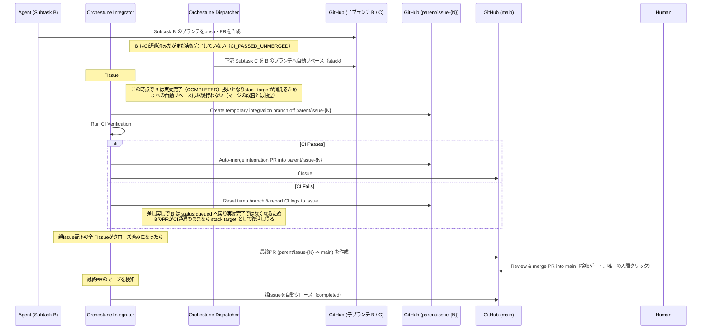

# 統合パイプライン・二層モデル・自動リベース

本ドキュメントでは、Orchestuneにおける親ブランチを活用した二層統合モデル、マージ前CIと子Issueの完全自動マージ・クローズ、Dispatcherによる自動リベース、親Issue完了検知と最終PR、セマンティックレビュー、および排他制御と設計前提の詳細仕様について説明します。全体像およびコア設計思想については [アーキテクチャと設計思想](../architecture.md) を参照してください。

---

## 1. 親ブランチによる二層モデル

複数のエージェントが開発を進めると、下流のタスクは上流の成果物を取り込む必要があります。この工程は**Integrator**と**Dispatcher**という2つの異なる責務に分かれており、`orchestune dispatch`コマンドの1回の呼び出し内で、Dispatcherサイクルの後にIntegratorが順次実行されます（別プロセスではありません）。

`--parent-issue <N>` を指定してディスパッチした場合、統合は**親ブランチによる二層モデル**で行われます。人間が判断・クリックする必要があるのは「親ブランチ→main」の最終マージただ1箇所のみで、子Issueレベルの統合はCI通過後に完全自動で進みます。

---

## 2. 統合パイプラインのフェーズ詳細

1. **親ブランチからの分岐**:
   `--parent-issue <N>` 指定時、親Issue用の長命ブランチ`parent/issue-{N}`が`main`から作成され、各子サブタスクのブランチは`main`ではなくこの親ブランチから分岐します。
2. **マージ前CI検証（Integratorの責務）**:
   `status:done`の子Issueを検知すると、`orchestune/integrator/`が一時統合ブランチを`parent/issue-{N}`から作成してローカルCIを走らせます。
3. **子レベルの自動マージ・自動クローズ（Integratorの責務、人間の確認なし）**:
   CI通過後、Integratorは一時統合ブランチのPRを**人間の確認を待たずに**`parent/issue-{N}`へ自動マージし、対象の子Issueを`completed`理由で自動的にクローズします。このレベルには人間のレビューゲートは存在せず、CIそのものが品質ゲートとして機能します（詳細は [アーキテクチャと設計思想 §0.2](../architecture.md#02-人間の承認ポイント)）。
4. **自動リベース（Dispatcherの責務、統合パイプラインとは別系統）**:
   このフェーズはIntegratorのマージ列の一部ではなく、`parent/issue-{N}`へのマージを起点ともしません。Dispatcherは毎サイクル、プロセスが生存し、かつ先行するactive worktree rule（`status:not-needed`検知・stale entryのhold・完了検知・`CHANGES_REQUESTED`エスカレーション）で終端しなかったworktreeについてだけ[共通stack target policy](#dependency-target-fallback)へ問い合わせ、**CIを通過済みでまだ実効完了していない単一の依存先タスクのブランチ**がtargetとして返った場合にだけ、`orchestune/dispatch/rebase.py`が下流の仕掛かり中ブランチをそのtargetへ`git rebase`します（マージは行いません）。targetが返らない場合——依存先がまだCI未通過（`WAITING`）、CI通過済みで未完了の依存先が複数、依存先自身の依存が未完了、branch名が不明、あるいは依存先が実効完了して`COMPLETED`——は自動リベースを見送ります。依存先が`CHANGES_REQUESTED`と**分類された**ときは、この問い合わせ自体に到達しません（分類はCOMPLETED優先の短絡評価なので、`status:done`等で実効完了した依存先はPRがCHANGES_REQUESTEDでも`COMPLETED`となり、この経路には入らず`no-stack-dependency`としてpolicyに拒否されます）。先行ruleの`_rule_changes_requested`（`orchestune/dispatch/escalation.py`）が当該worktreeを人間レビューへエスカレーションして終端するため、「rebaseの見送り」ではなくそちらが適用されます。ここでの実効完了は`status:done`（`status:queued`との併記時を除く）や`status:not-needed`、および同一サイクルで確定した完了を含み、`parent/issue-{N}`への実マージを条件としません。そのため、子Issueが`status:done`になった時点でstack targetは消えます。統合が単に遅延しているだけ（`status:done`のまま未マージ）の間もtargetは戻りません。一方、仮マージCIが失敗してIntegratorが`status:queued`を付与し`status:done`を外す（`orchestune/integrator/pr.py`の`handle_merge_failure`）と、その依存先は実効完了ではなくなるため、自身のPRがCIを通過したままであれば次サイクル以降に再び`CI_PASSED_UNMERGED`と分類され、stack targetとして復活し得ます。リベース後はそのworktreeでローカルCIを実行し、成功すればtargetをbaseブランチとしてエージェントを再起動、コンフリクトまたはCI失敗なら`status:manual-merge-required`へ遷移させて人間に引き渡します。
   なお、依存先が`parent/issue-{N}`へマージされた後にその成果物を取り込むのは、この自動リベースではなく**後続タスク起動時のbase選択**の役割です。ただしそれが本節1の`parent/issue-{N}`からの分岐（親Issue未設定なら`origin/main`）になるのは、共通policyがtargetを返さなかった場合に限られます。targetが返った場合、起動時のbaseはその依存先ブランチになるため（`orchestune/dispatch/launch.py`の`_decide_task_launch_plan`）、`parent/issue-{N}`へマージ済みの成果物が引き継がれるかどうかは、そのstack先ブランチがそれを含んでいるかに依存します。例えばCが「マージ済みのB」と「CI通過済みで未完了のD」に依存する場合、Cのbaseは`parent/issue-{N}`ではなくDとなり、DがBのマージ前に分岐していてB自体に依存していなければ、CはBの成果物を取り込みません。この使い分けは[§4の共通stack target policy](#dependency-target-fallback)が正本です。
5. **親Issue配下の全完了検知と最終PR作成（Integratorの責務）**:
   親Issue配下の全子Issueがクローズされたことを検知すると、`orchestune/integrator/parent_completion.py`が`parent/issue-{N}` → `main`の最終PRを作成します。このPRは自動マージされません。
6. **検収マージと親Issueクローズ**:
   人間がこの最終PRをレビューしてマージします（唯一の人間クリック）。マージが検知されると、Integratorが親Issueを`completed`理由で自動的にクローズします。
7. **セマンティックレビュー（Integratorの責務）**:
   子レベルの統合PR作成時にAIが自動で変更点の整合性をレビューし、不整合（例えばインターフェースの変更が反映されていないなど）をPRへのコメントとして検出・報告します（自動マージ・自動クローズの後段のため、その結果を待って処理をブロックすることはありません）。
   このレビューはfire-and-forgetで、Python側が結果を追跡することもありません。**所見が検収者の目に入るかは統合モードで変わります**: フラットモードではその統合PR自体が人間のマージする検収PRなので所見は同じPR上にありますが、この二層モデルでは所見は子の統合PRに付き、検収PR（親ブランチ→`main`）へ転記もリンクもされません。非同期の所見が子PRのクローズ後に届くこともあるため、読むには子PRを個別に辿る必要があります。

### フラットモード（フォールバック）
`--parent-issue`を指定せずにディスパッチした場合は、従来通りのフラットモード（子ブランチが直接`main`へ向けて統合される単層モデル）にフォールバックし、その唯一の統合PRのマージは常に人間が行います。

---

## 3. 排他制御と設計前提

> **設計前提（#377）**: Integratorが一時統合ブランチへ書き込む処理（`git push --force`を含む）は、同一マシン上のファイルロック（`orchestune/infra/process_utils.py`の`file_lock`）でのみ排他制御されています。このロックはプロセス間ロックであり、複数のCIランナー/マシンをまたいだ同時実行には効きません。Integratorは常に単一ランナー上でシリアル実行される前提であり、マトリクス並列化等で同一の`temp_branch`に対して複数ランナーから同時実行する構成には対応していません。
>
> この制約に対する緩和策として、`orchestune dispatch`をGitHub Actions上で定期実行する場合は`concurrency`グループの設定を強く推奨します（設定例は[セットアップガイド §6](../setup.md#6-github-actions上での定期実行とcross-runner直列化)を参照）。`concurrency`グループはコード変更を伴わない予防策です。
>
> さらにこれとは独立に、一時ブランチのラン別分離と親ブランチ更新のcompare-and-swap化（#435）が施されています。そのため、万一この制約下で衝突が発生しても、無言のデータレースにはならず必ずpush失敗として検出できる多層防御構造になっています。

---

## 4. 共通stack target policyとfallback

launch、auto-rebase、base-branch-red recoveryは、いずれも
`dependency_policy.decide_stack_target`へ同じ`DependencyAssessment` viewを渡します。
安全なtargetがある場合だけ、その依存先のcanonical branchを使います。consumer別の
targetなしの扱いは次の表が正本です。

| 安定ID | 経路 | targetなしの意味 |
| --- | --- | --- |
| `dependency-fallback-launch` | launch | **no stack launch**: 依存先ブランチへstackしない。依存待ちタスクをfallback baseで起動可能にする意味ではない |
| `dependency-fallback-rebase` | rebase | **no stack rebase**: auto-rebaseを見送る |
| `dependency-fallback-base` | base selection | 親Issueがあれば`parent/issue-{N}`、なければ`origin/main`へfallbackする |

base selectionのfallbackは、起動許可や依存充足の証明ではありません。launch候補化は
AssessmentとUse-case Policyが別途許可する必要があります。またcanonical branch名は
Contextが保持する意味付き識別子であって、localまたはremote Git refの実在保証では
ありません。実際のGit操作境界で`resolve_local_or_remote_branch`等により存在を確認し、
不明・欠落は安全側に倒します。
