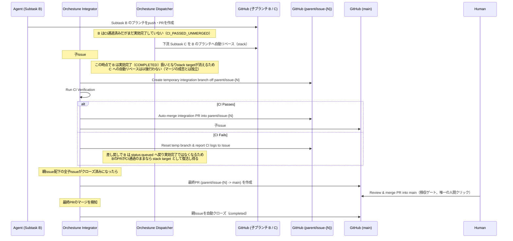

# 統合パイプライン・二層モデル・自動リベース

本ドキュメントでは、Orchestuneにおける親ブランチを活用した二層統合モデル、マージ前CIと子Issueの完全自動マージ・クローズ、Dispatcherによる自動リベース、親Issue完了検知と最終PR、セマンティックレビュー、および排他制御と設計前提の詳細仕様について説明します。全体像およびコア設計思想については [アーキテクチャと設計思想](../architecture.md) を参照してください。

---

## 1. 親ブランチによる二層モデル

複数のエージェントが開発を進めると、下流のタスクは上流の成果物を取り込む必要があります。この工程は**Integrator**と**Dispatcher**という2つの異なる責務に分かれており、`orchestune dispatch`コマンドの1回の呼び出し内で、Dispatcherサイクルの後にIntegratorが順次実行されます（別プロセスではありません）。

`--parent-issue <N>` を指定してディスパッチした場合、統合は**親ブランチによる二層モデル**で行われます。人間が判断・クリックする必要があるのは「親ブランチ→main」の最終マージただ1箇所のみで、子Issueレベルの統合はCI通過後に完全自動で進みます。

```mermaid
sequenceDiagram
    participant AG as Agent (Subtask B)
    participant IG as Orchestune Integrator
    participant DP as Orchestune Dispatcher
    participant CB as GitHub (子ブランチ B / C)
    participant PB as GitHub (parent/issue-{N})
    participant GH as GitHub (main)
    participant HU as Human

    AG->>CB: Subtask B のブランチをpush・PRを作成
    Note over DP: B はCI通過済みだがまだ実効完了していない（CI_PASSED_UNMERGED）
    DP->>CB: 下流 Subtask C を B のブランチへ自動リベース（stack）
    Note over IG: 子Issue #B が status:done に
    Note over DP: この時点で B は実効完了（COMPLETED）扱いとなりstack targetが消えるため<br/>C への自動リベースは以後行わない（マージの成否とは独立）
    IG->>PB: Create temporary integration branch off parent/issue-{N}
    IG->>IG: Run CI Verification
    alt CI Passes
        IG->>PB: Auto-merge integration PR into parent/issue-{N}
        IG->>GH: 子Issue #B を自動クローズ（completed）
    else CI Fails
        IG->>PB: Reset temp branch & report CI logs to Issue #B
        Note over DP: 差し戻しで B は status:queued へ戻り実効完了ではなくなるため<br/>BのPRがCI通過のままなら stack target として復活し得る
    end
    Note over IG: 親Issue配下の全子Issueがクローズ済みになったら
    IG->>GH: 最終PR (parent/issue-{N} -> main) を作成
    HU->>GH: Review & merge PR into main（検収ゲート、唯一の人間クリック）
    Note over IG: 最終PRのマージを検知
    IG->>GH: 親Issueを自動クローズ（completed）
```

---

## 2. 統合パイプラインのフェーズ詳細

1. **親ブランチからの分岐**:
   `--parent-issue <N>` 指定時、親Issue用の長命ブランチ`parent/issue-{N}`が`main`から作成され、各子サブタスクのブランチは`main`ではなくこの親ブランチから分岐します。
2. **マージ前CI検証（Integratorの責務）**:
   `status:done`の子Issueを検知すると、`orchestune/integrator/`が一時統合ブランチを`parent/issue-{N}`から作成してローカルCIを走らせます。
3. **子レベルの自動マージ・自動クローズ（Integratorの責務、人間の確認なし）**:
   CI通過後、Integratorは一時統合ブランチのPRを**人間の確認を待たずに**`parent/issue-{N}`へ自動マージし、対象の子Issueを`completed`理由で自動的にクローズします。このレベルには人間のレビューゲートは存在せず、CIと子レビュー証跡ゲート（本節7）が品質ゲートとして機能します。既定の`required`では、このゲートを通過した場合に限り親ブランチを更新します（詳細は [アーキテクチャと設計思想 §0.2](../architecture.md#02-人間の承認ポイント)）。
4. **自動リベース（Dispatcherの責務、統合パイプラインとは別系統）**:
   このフェーズはIntegratorのマージ列の一部ではなく、`parent/issue-{N}`へのマージを起点ともしません。Dispatcherは毎サイクル、プロセスが生存し、かつ先行するactive worktree rule（`status:not-needed`検知・stale entryのhold・完了検知・`CHANGES_REQUESTED`エスカレーション）で終端しなかったworktreeについてだけ[共通stack target policy](#dependency-target-fallback)へ問い合わせ、**CIを通過済みでまだ実効完了していない単一の依存先タスクのブランチ**がtargetとして返った場合にだけ、`orchestune/dispatch/rebase.py`が下流の仕掛かり中ブランチをそのtargetへ`git rebase`します（マージは行いません）。targetが返らない場合——依存先がまだCI未通過（`WAITING`）、CI通過済みで未完了の依存先が複数、依存先自身の依存が未完了、branch名が不明、あるいは依存先が実効完了して`COMPLETED`——は自動リベースを見送ります。依存先が`CHANGES_REQUESTED`と**分類された**ときは、この問い合わせ自体に到達しません（分類はCOMPLETED優先の短絡評価なので、`status:done`等で実効完了した依存先はPRがCHANGES_REQUESTEDでも`COMPLETED`となり、この経路には入らず`no-stack-dependency`としてpolicyに拒否されます）。先行ruleの`_rule_changes_requested`（`orchestune/dispatch/escalation.py`）が当該worktreeを人間レビューへエスカレーションして終端するため、「rebaseの見送り」ではなくそちらが適用されます。ここでの実効完了は`status:done`（`status:queued`との併記時を除く）や`status:not-needed`、および同一サイクルで確定した完了を含み、`parent/issue-{N}`への実マージを条件としません。そのため、子Issueが`status:done`になった時点でstack targetは消えます。統合が単に遅延しているだけ（`status:done`のまま未マージ）の間もtargetは戻りません。一方、仮マージCIが失敗してIntegratorが`status:queued`を付与し`status:done`を外す（`orchestune/integrator/pr.py`の`handle_merge_failure`）と、その依存先は実効完了ではなくなるため、自身のPRがCIを通過したままであれば次サイクル以降に再び`CI_PASSED_UNMERGED`と分類され、stack targetとして復活し得ます。リベース後はそのworktreeでローカルCIを実行し、成功すればtargetをbaseブランチとしてエージェントを再起動、コンフリクトまたはCI失敗なら`status:manual-merge-required`へ遷移させて人間に引き渡します。
   なお、依存先が`parent/issue-{N}`へマージされた後にその成果物を取り込むのは、この自動リベースではなく**後続タスク起動時のbase選択**の役割です。本節1の`parent/issue-{N}`から分岐するのは、共通policyがtargetを返さなかった場合に限られます。targetが返った場合、起動時のbaseはその依存先ブランチになるため（`orchestune/dispatch/launch.py`の`_decide_task_launch_plan`）、`parent/issue-{N}`へマージ済みの成果物が引き継がれるかどうかは、そのstack先ブランチがそれを含んでいるかに依存します。例えばCが「マージ済みのB」と「CI通過済みで未完了のD」に依存する場合、Cのbaseは`parent/issue-{N}`ではなくDとなり、DがBのマージ前に分岐していてB自体に依存していなければ、CはBの成果物を取り込みません。この使い分けは[§4の共通stack target policy](#dependency-target-fallback)が正本です。
5. **親Issue配下の全完了検知と最終PR作成（Integratorの責務）**:
   親Issue配下の全子Issueがクローズされたことを検知すると、`orchestune/integrator/parent_completion.py`が`parent/issue-{N}` → `main`の最終PRを作成します。このPRは自動マージされません。
6. **検収マージと親Issueクローズ**:
   人間がこの最終PRをレビューしてマージします（唯一の人間クリック）。マージが検知されると、Integratorが親Issueを`completed`理由で自動的にクローズします。
7. **子レビュー証跡ゲート（第1層・必須）とセマンティックレビュー（第2層・advisory）**: 子のレビュー自体は統合ステップの責務ではなく、Integratorは「レビューが行われたこと」だけを確認します。
   - **第1層 — 子レビュー証跡ゲート（既定`required`）**: 子PR上で開発スキルのレビューループ（`skills/local-ci-developer/references/review-loop.md`のStep 11）が実行され、LLMが指摘ごとに判断を記録します。`orchestune complete --result done`がPRのレビュー取得状態を取得し直し、判断表とレビュー対象SHAを検証して、結果をレビュー証跡としてdone Outcome Recordへ保存します。検証に失敗した場合はcompleteを拒否し、何も投稿しません。Integratorは`parent/issue-{N}`を更新する直前に、統合対象の各子についてその証跡を**検証するだけ**です。子が合格するのは、最新のOutcome Recordが`result=done`かつ`verdict=pass`で、記録されたheadとレビュー済みheadの両方がマージ対象のコミットと一致する場合に限ります。1件でも満たさなければfail-closedで、親ブランチを更新せず、子Issueのクローズも子ブランチの削除も行わず、**親Issue**を`status:blocked-human-review`へエスカレーションします（失敗の組み合わせごとにコメント1件。理由は`legacy`・`skipped`・`not_pass`・`sha_mismatch`・`absent`・`lookup_unknown`・`integration_evidence_missing`）。再開・移行の手順は[使い方 §4.5](../usage.md#45-子レビュー証跡ゲート)を参照してください。
   - **第2層 — セマンティックレビュー（advisory）**: 子レベルの統合PR作成時にAIが自動で変更点の整合性をレビューし、不整合（例えばインターフェースの変更が反映されていないなど）をPRへのコメントとして検出・報告します。子の自動マージを待たせることも取り消すこともなく、Python側が結果を追跡することもありません（fire-and-forget）。この層を必須ゲートにするのは後続Epic #1033の範囲です。
   第2層の所見は子の統合PRに付き、検収PR（親ブランチ→`main`）へ転記もリンクもされません。非同期の所見が子PRのクローズ後に届くこともあるため、読むには子PRを個別に辿る必要があります。

---

## 3. 排他制御と設計前提

> **設計前提（#377）**: Integratorが一時統合ブランチへ書き込む処理（`git push --force`を含む）は、同一マシン上のファイルロック（`orchestune/infra/process_utils.py`の`file_lock`）でのみ排他制御されています。このロックはプロセス間ロックであり、複数のCIランナー/マシンをまたいだ同時実行には効きません。Integratorは常に単一ランナー上でシリアル実行される前提であり、マトリクス並列化等で同一の`temp_branch`に対して複数ランナーから同時実行する構成には対応していません。
>
> この制約に対する緩和策として、`orchestune dispatch`をGitHub Actions上で定期実行する場合は`concurrency`グループの設定を強く推奨します（設定例は[セットアップガイド §6](../setup.md#6-github-actions上での定期実行とcross-runner直列化)を参照）。`concurrency`グループはコード変更を伴わない予防策です。
>
> さらにこれとは独立に、一時ブランチのラン別分離と親ブランチ更新のcompare-and-swap化（#435）が施されています。そのため、万一この制約下で衝突が発生しても、無言のデータレースにはならず必ずpush失敗として検出できる多層防御構造になっています。

---

## 4. 共通stack target policyとfallback

launch、auto-rebase、base-branch-red recoveryは、いずれも
`dependencies.policy.decide_stack_target`へ同じ`DependencyAssessment` viewを渡します。
安全なtargetがある場合だけ、その依存先のcanonical branchを使います。consumer別の
targetなしの扱いは次の表が正本です。

| 安定ID | 経路 | targetなしの意味 | 条件→target（安定表現） |
| --- | --- | --- | --- |
| `dependency-fallback-launch` | launch | **no stack launch**: 依存先ブランチへstackしない。依存待ちタスクをfallback baseで起動可能にする意味ではない | `no-stack-launch` |
| `dependency-fallback-rebase` | rebase | **no stack rebase**: auto-rebaseを見送る | `no-stack-rebase` |
| `dependency-fallback-base` | base selection | 親Issueがあれば`parent/issue-{N}`、なければ`origin/main`へfallbackする | `parent-configured=parent/issue-{N}; no-parent=origin/main` |

base selectionのfallbackは、起動許可や依存充足の証明ではありません。launch候補化は
AssessmentとUse-case Policyが別途許可する必要があります。またcanonical branch名は
Contextが保持する意味付き識別子であって、localまたはremote Git refの実在保証では
ありません。実際のGit操作境界で`resolve_local_or_remote_branch`等により存在を確認し、
不明・欠落は安全側に倒します。

---

## 5. 有界な実行と終端保証（#820）

Integratorのすべての待機に上限を設け、あらゆるtimeoutが人間または次サイクルが扱える状態で終わるようにしています。OS固有の処理とポリシーが混ざらないよう、モジュールを分けています。

| モジュール | 責務 |
| --- | --- |
| `infra.execution_deadline` | 親単位の`ExecutionScope`（単調時計の期限1つ、独立したcleanup予算、補助`git`/`gh`の1回あたりの上限）と`ExecutionInterrupt`系のシグナル |
| `infra.managed_process`（と`_posix`、`_windows`） | 実行口が所有するプロセスグループでコマンドを起動し、出力を有限の末尾バッファへ読み出し、グループを停止して確認し、型付き結果（`SUCCESS`・`NONZERO_EXIT`・`TIMED_OUT`・`START_FAILED`・`STOP_UNCONFIRMED`）を返す |
| `infra.python_env`、`integrator.ci_execution` | `uv sync`とCIコマンドを、`min(段階の上限, サイクルの残り時間)`で各1回だけ実行する。従来の`(ok, output)`は型付き結果から導く |
| `integrator.timeout_retry` | 親Issue上の正規イベントとして持つ再試行予算。全コメントページから復元する |
| `integrator.execution` | 親単位の状態（試行の予約・親単位の実行ロック・hold・エスカレーション・失敗記録） |
| `integrator.timeout_policy` | 7つの設定・既定値・検証と、失敗原因の語彙 |

**スコープの伝播。** `run_git`と`GitHubForge`は有効なスコープを読み、`timeout=min(1回の上限, サイクルの残り時間)`を付けます。期限後は呼び出しの開始自体を拒否し、後始末中はcleanup予算だけを使います。注入するForgeは`supports_bounded_execution = True`を宣言する必要があり、宣言がなければapplyを開始しません。実行期限のシグナルは`BaseException`から派生するため、各Stepに多数ある「ログして継続」の`except Exception`が期限を飲み込むことはなく、パイプラインまで届いて停止・後始末・原因の記録が行われます。

**timeout時の停止手順。** (1) プロセスグループを停止し、空になったことを確認する。(2) その後に限り、仮マージ直前に保存したSHAへrollbackし、`HEAD`の一致を確認する。(3) 親の残りの統合を中断する（このサイクルでCIを通過済みの結果もpushしない）。(4) 結果を記録し、再試行が残るかを判定する。(5) 停止・rollback・`HEAD`・cleanup予算のいずれかを確認できなければ、worktreeを保持してholdの記録（`worktrees/.holds/`）を書き、新しいCIを拒否し、親を人間確認へ送る。timeoutは`handle_merge_failure`へ流さないため、ハングでワーカーが再投入されることはありません。pushなどの書き込みがtimeoutした場合は`side_effect_state=unknown`となり、人間が照合するまで、再試行・完了処理・リモートの巻き戻しは行いません。

**予算。** `reserved`は依存準備の開始前に保存して読み戻し、`finished`は結果と確認状態を記録し、`terminal`は許可された最後のtimeoutを示します。結果のない予約は、プロセスの停止を証明できないため自動再実行を止めます。採用するのは認証された実行主体のイベントだけ（resetは書き込み権限を持つユーザーも可）で、親・generation・attempt IDの整合を要求し、読み取れない・競合する・不正な履歴では何も開始しません。[state-recovery.md](state-recovery.md#2-github-as-single-source-of-truth)と、運用者の手順は[使い方 §4.6](../usage.md#46-統合実行の期限とtimeoutからの復旧)を参照してください。

**保証しないこと。** OSのプロセス生成APIや割り込み不能なカーネルI/Oは待機を妨げうるため、厳密な壁時計上限は保証しません。補助`git`/`gh`の呼び出しはプロセスグループの所有ではなく直接の子のtimeoutで有界化するため、`git`のhookやSSH helperの子孫は停止しません。管理下のsession/process groupから離脱するPOSIXのプロセス（`setsid`など）は保証の対象外で、CIコマンドは子孫をその内側に保つ契約です（cgroup/sandboxは対象外）。WindowsでJob Objectへ割り当てられないコマンドは実行しません。別ホストから同じ親への同時applyは、GitHubコメントに原子的なcompare-and-swapがないため非対応です。ワーカーの`task-timeout-seconds`と回収ポリシーは別物で、Integratorを有界にはしません。OSが受け付けない停止や、照合できない書き込みの結果は、停止済みとは断定せず未確定のまま保持します。

## 6. 子ブランチ確定の有界リトライ（#827）

子ブランチの削除は、統合証跡（receipt）に記録したSHAを条件とするCAS削除です（#819）。リポジトリのルールセットなどが削除を恒久的に拒否する場合、安全側の動作は「ブランチを残し、子Issueもopenのまま残す」ですが、この試行を毎サイクル黙って繰り返すと、人間が対処できる状態に至りません。そこで、拒否を回数付きで記録し、上限で終端状態へ移します。

| 削除の結果 | 判定 | 動作 |
| --- | --- | --- |
| `DELETED` / `ALREADY_ABSENT` | 成功 | 従来どおり`integration:included`を付与してクローズする |
| `TIP_MISMATCH` | 子ブランチのtipが動いた | 従来どおり統合へ戻し、新しいtipを再統合する（拒否としては数えない） |
| `DENIED` | `git push`が`[remote rejected]`を返した（接続・認証は成功し、リモートがポリシーで拒否した） | 拒否を記録して保留する |
| `FAILED` | 上記以外（接続・認証・不明な失敗） | 数えずに保留する。恒久失敗の根拠にしない |

**保留の意味。** receiptの親への到達を確認できているため、保留した子は`RetryChildIssueCloseStep`で`active_done_tasks`から外し、そのサイクルの統合経路（worktree作成・一時ブランチのpush・統合PRの確保）へ戻しません。停滞中の子1件あたりのサイクルごとの処理は、CAS削除1回（終端後は`ls-remote`1回）だけです。

**回数の記録。** 拒否は子Issueのコメント（マーカー`<!-- orchestune:child-branch-finalization:v1 -->`）に、JSONペイロード付きで残します。ローカルの`run_state`は使いません（GitHub Actionsでは実行ごとにランナーが変わるため）。回数は、子ブランチ・証跡のSHA・親ブランチが一致するイベントのうち、最後の`terminal`より後にある、異なる`integration_run_id`の件数です。同じ実行内の再試行は1回と数え、tipが動いて別のSHAで再統合された場合は0から数え直します。認証ユーザーが投稿した正規形式のコメントだけを採用します。読み取りや書き込みに失敗した場合は回数を進めず、エスカレーションは遅れても早まりません。

**終端分類。** 回数が上限（`CHILD_BRANCH_DELETION_DENIAL_LIMIT`、3回）に達したら、(1) 子Issueへ`integration:finalization-blocked`を付与し、(2) 親Issueへコメントを1件（マーカー付き、同じ子・SHA・世代では再投稿しない）投稿し、(3) 最後に子Issueへ`terminal`イベントを記録します。`terminal`は最後に書くため、存在すれば前の手順がすべて完了していると判断でき、途中で失敗した場合は次サイクルが続きから再試行します。`status:*`ラベルは変更しません。

**終端後の見守りと復帰。** ラベル付きの子には書き込みを伴う削除を試みず、`ls-remote`でブランチを読み取るだけです。ブランチが消えていれば確定してクローズしラベルを外し、tipがreceiptのSHAと異なれば再統合へ戻し、変わらなければ保留を続けます（読み取りに失敗した場合も保留）。運用者がルールセットを緩和した場合は、`integration:finalization-blocked`を外すと次サイクルから削除を再試行し、回数は0から数え直します。

**保証しないこと。** 別ホストから同じ親への同時applyは、GitHubコメントに原子的なcompare-and-swapがないため非対応です。コメントの取得に失敗した場合は判定不能として何も進めません。
