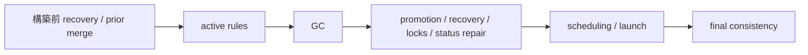

# ステートレスCIと自己修復（State Recovery）

本ドキュメントでは、Orchestuneにおけるステートレス実行モデル、GitHubを唯一の信頼できる情報源（Source of Truth）とする状態再構築、ゾンビ回収と終端保護、およびリポジトリ全体の整合性制御ループ（Consistency Control Loop）の詳細仕様について説明します。全体像およびコア設計思想については [アーキテクチャと設計思想](../architecture.md) を参照してください。

---

## 1. ステートレス実行モデルと自己修復

Orchestuneのディスパッチャーは、GitHub Actionsなどの**「実行が終わるとディスク状態が完全に消去されるステートレスなCI環境」**で定期的に起動されることを前提に設計されています。

通常、開発プロセス全体の進行状況は `run_state.json` などのローカル状態ファイルに記録されますが、これが消失した場合でも以下の手順で状態を**自己修復（セルフヒーリング）**します。

```text
[Dispatcher Start]
       │
       ▼
[Read GitHub Issues & PRs]
       │
       ├─► status:in-progress の Issue は実行中と判断
       ├─► status:blocked / status:queued を再判定
       └─► オープンな PR ブランチから現在の進捗を復元
       │
       ▼
[Reconstruct DAG State & Resume]
```

---

## 2. GitHub as Single Source of Truth

* **GitHub Source of Truth**:
  現在のブランチやPR、およびGitHub Issueのラベル（`status:in-progress`, `status:blocked`, `status:queued` など）の状態を直接読み取ることで、メモリ上で全体の実行状態を復元し、途中からシームレスに処理を再開します。
* **回収回数の扱い（#512）**:
  ゾンビ／タイムアウト回収の回数（`--max-task-reclaims`の判定に使う`task_reclaim_counts`台帳）は`run_state.json`にのみ保持されるため、`run_state.json`が消失すると0へ戻ります。ただし、既に上限を超えて`status:blocked-human-review`へ遷移したタスクは、GitHubのラベルが真実であるため復元後も再投入されません（上限判定がやり直しになるのは、まだ上限に達していないタスクだけです）。

---

## 3. リポジトリ整合性control loop

ステートリカバリを補完するため、リポジトリ全体を扱う整合性カーネルを備えています。ObserverはGitHub、Git、worktree、process、外部execution、`run_state.json`の事実を不変な`ObservedRepositoryState`へ正規化します。純粋な導出処理は、task lifecycle、依存関係、dispatch policy、保留中の`TransitionIntent` journalから`DesiredRepositoryState`を構築します。純粋なInvariantが両モデルを比較して安定したcodeと根拠を持つfindingを生成し、Plannerはknownかつautomaticなfindingだけをtyped `RepairCommand`へ変換できます。`ConsistencySupervisor`が修復判断、実行順序、有界な再試行、authoritativeな再観測、結果集約を単一所有します。typed Executorはlive preconditionを再検証した後にだけ、既存の低レベルForge、filesystem、process、state file操作へcommandをrouteします。

Supervisorはcycle開始時と終了時にauthoritativeなfull scanを実行し、process内の`StateChanged` eventにはtargeted scanを実行します。そのため終了時scanはeventを発生させないprocess外の変更も捕捉します。導入modeは意図的に段階化されています。

| Mode | 意味 |
|---|---|
| `off` | 追加のrepository-wideな開始／終了control loopを実行しない。後方互換のため、組み込みの安全なSupervisor修復境界は有効なまま。 |
| `shadow` | 追加のrepository-wideなobserve／derive／evaluate／planを行うが、新たな変更は加えない。組み込みの安全な修復は`off`と同様に`--apply`へ従う。 |
| `repair` | 組み込みの安全な修復に加え、user repair allowlistへ明示したfinding codeまたはcommand codeを実行する。user allowlistが空なら追加loopはreport-only。 |

後方互換の組み込みallowlistは、status findingの`status.blocked-with-resolved-dependencies`と`status.primary-status-conflict`、typed execution commandの`execution.requeue`、`execution.update-bookkeeping`、`execution.reclaim`です。これは`--consistency-repair-code`とは意図的に分離されています。user allowlistが空または限定的でも既存修復は無効になりません。組み込みrepair passへ到達したcodeだけを後段の追加loopから除外するため、試行済みcommandを同一cycleで再試行せず、Plannerが生成しただけの未試行候補は明示的なopt-in対象に残ります。execution commandが追加loopへ到達した場合も、組み込み境界と同じguard付きGC／recovery handlerを再利用し、未接続のplaceholderへはルーティングしません。

`--apply`では組み込み境界が変更を適用でき、`repair` modeはuser allowlistのcodeも実行できます。`--no-apply`では外部または永続的な修復副作用を発生させません。候補は`deferred`として報告され、GC eventはpreviewとなり、recovery bookkeepingはそのcycleのpreviewに使う一時的なmemory上の状態だけを更新する場合があります。移行は`off`（既存動作）→`shadow`（追加reportを確認）→空allowlistの`repair`（変更内容は同じまま明示的なrepair outcomeを確認）→限定allowlistの`repair`の順で行えます。

Repair modeのpass数は設定値（1～5）を超えません。各passはlive preconditionを再検証し、非atomicなstatus遷移の前にIntentを記録し、同じidempotency keyをcycle内で一度だけ実行して、その後に新しいfull observationを行います。unknown／staleな観測、曖昧なownership、manual／non-repairable finding、allowlist外のfindingはreport-onlyです。typed handlerが予期せず未接続のcommandはfail-closedとなり、phase所有の`SKIPPED` fallbackへ委譲されることはありません。境界reportと最終loop reportは最終cycle JSONおよび`events.jsonl`へ集約され、`resolved`、`unresolved`、`deferred`、`failed`、`observation-unknown`を区別します。失敗した試行は集約後も残り、authoritativeな再観測失敗は`resolved`ではなく`observation-unknown`になります。task／parent scopeのunknown factは同じscope／subjectのoutcomeだけに影響し、repository scopeの失敗は安全側に倒してすべてのoutcomeへ影響します。各passもcommand statusと診断を保持します。Observer、Invariant、Planner、Executorの拡張は各Protocol境界で行い、不変state modelへcallbackを追加しません。

---

<a id="dependency-record-postconditions"></a>

## 4. サイクル順序とrecord APIの成功postcondition

1サイクルの依存関連フェーズは次の順序です。矢印の後段は、前段が
`CycleContext.record_*`へ反映した成功確認済み事実を同じContextへの再queryで
観測できます。



| 操作 | 記録できる時点 | 記録しない場合 |
| --- | --- | --- |
| completion (`record_completion`) | 必要なForge処理と保存を終え、GCが通常完了または検証済み先行マージの`CompletionReceipt`を発行した後 | dry-run、dirty hold、Forge error、token上限escalationなどの非完了終了 |
| launch (`record_launch`) | process / external executionを起動し、最初の`RunState`保存に成功した後 | 予約だけ、結果不明、起動失敗、保存失敗 |
| transition (`record_transition`) | 期待する主状態をlive verificationし、必要な`TransitionIntent` journalを確定し、実行状態も既知になった後 | `SKIPPED`、`FAILED`、検証不一致、execution unknown |

戻り値`RecordResult.status`は新しい確定差分を反映した`APPLIED`、完全同値の
再試行である`NOOP`、未知Issue・古い前提・矛盾・完了巻戻しを拒否する`CONFLICT`
です。record APIはメモリ内の確定済み差分だけを更新し、外部I/O、分散transaction、
自動rollbackを行いません。起動と最初の`RunState`保存後にIssueラベル更新が失敗しても、
保存済み起動を消さず、次サイクルが回復できる情報を保持します。外部処理が成功した
後にrecordが`CONFLICT`となっても、外部変更を巻き戻したように見せません。

<a id="dependency-fresh-validation"></a>

## 5. status repairの実行直前検証例外

status repairのfresh実行直前検証（pre-execution validation）は、
`CycleContext`単一窓口原則の意図的な例外です。非atomicなForge変更の直前に
`evaluate_fresh_dependencies`が対象Issueと依存ラベルを再取得し、通常経路と同じ
Identity Resolution、Lifecycle Assessment、Use-case Policyでpreconditionを評価します。
fresh母集団から依存先が欠ける場合や再解決できない場合を空依存として許可せず、
未解決依存としてfail-closedにします。また開始時の`DONE`ラベルと、同一サイクルの
成功処理や検証済み先行マージによる確定完了証拠を区別します。live verificationと
journal確定後にだけ`record_transition`へ橋渡しし、executionの生死が不明なら記録を
保留します。
