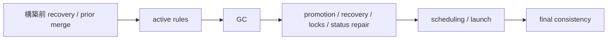

# ステートレスCIと自己修復（State Recovery）

本ドキュメントでは、Orchestuneにおけるステートレス実行モデル、GitHubを唯一の信頼できる情報源（Source of Truth）とする状態再構築、ゾンビ回収と終端保護、およびリポジトリ全体の整合性制御ループ（Consistency Control Loop）の詳細仕様について説明します。全体像およびコア設計思想については [アーキテクチャと設計思想](../architecture.md) を参照してください。

---

## 1. ステートレス実行モデルと自己修復

Orchestuneのディスパッチャーは、GitHub Actionsなどの**「実行が終わるとディスク状態が完全に消去されるステートレスなCI環境」**で定期的に起動されることを前提に設計されています。

通常、開発プロセス全体の進行状況は `run_state.json` などのローカル状態ファイルに記録されますが、これが消失した場合でも以下の手順で状態を**自己修復（セルフヒーリング）**します。

```text
[Dispatcher Start]
       │
       ▼
[Read GitHub Issues & PRs]
       │
       ├─► status:in-progress の Issue は実行中と判断
       ├─► status:blocked / status:queued を再判定
       └─► オープンな PR ブランチから現在の進捗を復元
       │
       ▼
[Reconstruct DAG State & Resume]
```

---

## 2. GitHub as Single Source of Truth

* **GitHub Source of Truth**:
  現在のブランチやPR、およびGitHub Issueのラベル（`status:in-progress`, `status:blocked`, `status:queued` など）の状態を直接読み取ることで、メモリ上で全体の実行状態を復元し、途中からシームレスに処理を再開します。
* **回収回数の扱い（#512）**:
  ゾンビ／タイムアウト回収の回数（`--max-task-reclaims`の判定に使う`task_reclaim_counts`台帳）は`run_state.json`にのみ保持されるため、`run_state.json`が消失すると0へ戻ります。ただし、既に上限を超えて`status:blocked-human-review`へ遷移したタスクは、GitHubのラベルが真実であるため復元後も再投入されません（上限判定がやり直しになるのは、まだ上限に達していないタスクだけです）。

---

## 3. リポジトリ整合性control loop

ステートリカバリを補完するため、リポジトリ全体を扱う整合性カーネルを備えています。ObserverはGitHub、Git、worktree、process、外部execution、`run_state.json`の事実を不変な`ObservedRepositoryState`へ正規化します。純粋な導出処理は、task lifecycle、依存関係、dispatch policy、保留中の`TransitionIntent` journalから`DesiredRepositoryState`を構築します。純粋なInvariantが両モデルを比較して安定したcodeと根拠を持つfindingを生成し、Plannerはknownかつautomaticなfindingだけをtyped `RepairCommand`へ変換できます。`ConsistencySupervisor`が修復判断、実行順序、有界な再試行、authoritativeな再観測、結果集約を単一所有します。typed Executorはlive preconditionを再検証した後にだけ、既存の低レベルForge、filesystem、process、state file操作へcommandをrouteします。

Supervisorはcycle開始時と終了時にauthoritativeなfull scanを実行し、process内の`StateChanged` eventにはtargeted scanを実行します。そのため終了時scanはeventを発生させないprocess外の変更も捕捉します。導入modeは意図的に段階化されています。

| Mode | 意味 |
|---|---|
| `off` | 追加のrepository-wideな開始／終了control loopを実行しない。後方互換のため、組み込みの安全なSupervisor修復境界は有効なまま。 |
| `shadow` | 追加のrepository-wideなobserve／derive／evaluate／planを行うが、新たな変更は加えない。組み込みの安全な修復は`off`と同様に`--apply`へ従う。 |
| `repair` | 組み込みの安全な修復に加え、user repair allowlistへ明示したfinding codeまたはcommand codeを実行する。user allowlistが空なら追加loopはreport-only。 |

後方互換の組み込みallowlistは、status findingの`status.blocked-with-resolved-dependencies`と`status.primary-status-conflict`、typed execution commandの`execution.requeue`、`execution.update-bookkeeping`、`execution.reclaim`です。これは`--consistency-repair-code`とは意図的に分離されています。user allowlistが空または限定的でも既存修復は無効になりません。組み込みrepair passへ到達したcodeだけを後段の追加loopから除外するため、試行済みcommandを同一cycleで再試行せず、Plannerが生成しただけの未試行候補は明示的なopt-in対象に残ります。execution commandが追加loopへ到達した場合も、組み込み境界と同じguard付きGC／recovery handlerを再利用し、未接続のplaceholderへはルーティングしません。

`--apply`では組み込み境界が変更を適用でき、`repair` modeはuser allowlistのcodeも実行できます。`--no-apply`では外部または永続的な修復副作用を発生させません。候補は`deferred`として報告され、GC eventはpreviewとなり、recovery bookkeepingはそのcycleのpreviewに使う一時的なmemory上の状態だけを更新する場合があります。移行は`off`（既存動作）→`shadow`（追加reportを確認）→空allowlistの`repair`（変更内容は同じまま明示的なrepair outcomeを確認）→限定allowlistの`repair`の順で行えます。

Repair modeのpass数は設定値（1～5）を超えません。各passはlive preconditionを再検証し、非atomicなstatus遷移の前にIntentを記録し、同じidempotency keyをcycle内で一度だけ実行して、その後に新しいfull observationを行います。unknown／staleな観測、曖昧なownership、manual／non-repairable finding、allowlist外のfindingはreport-onlyです。typed handlerが予期せず未接続のcommandはfail-closedとなり、phase所有の`SKIPPED` fallbackへ委譲されることはありません。境界reportと最終loop reportは最終cycle JSONおよび`events.jsonl`へ集約され、`resolved`、`unresolved`、`deferred`、`failed`、`observation-unknown`を区別します。失敗した試行は集約後も残り、authoritativeな再観測失敗は`resolved`ではなく`observation-unknown`になります。task／parent scopeのunknown factは同じscope／subjectのoutcomeだけに影響し、repository scopeの失敗は安全側に倒してすべてのoutcomeへ影響します。各passもcommand statusと診断を保持します。Observer、Invariant、Planner、Executorの拡張は各Protocol境界で行い、不変state modelへcallbackを追加しません。

---

<a id="dependency-record-postconditions"></a>

## 4. サイクル順序とrecord APIの成功postcondition

1サイクルの依存関連フェーズは次の順序です。矢印の後段は、前段が
`CycleContext.record_*`へ反映した成功確認済み事実を同じContextへの再queryで
観測できます。


```mermaid
flowchart LR
    A[構築前 recovery / prior merge] --> B[active rules]
    B --> C[GC]
    C --> D[promotion / recovery / locks / status repair]
    D --> E[scheduling / launch]
    E --> F[final consistency]
```

| 操作 | 記録できる時点 | 記録しない場合 |
| --- | --- | --- |
| completion (`record_completion`) | 必要なForge処理と保存を終え、GCが通常完了または検証済み先行マージの`CompletionReceipt`を発行した後 | dry-run、dirty hold、Forge error、token上限escalationなどの非完了終了 |
| launch (`record_launch`) | process / external executionを起動し、最初の`RunState`保存に成功した後 | 予約だけ、結果不明、起動失敗、保存失敗 |
| transition (`record_transition`) | 期待する主状態をlive verificationし、必要な`TransitionIntent` journalを確定し、実行状態も既知になった後 | `SKIPPED`、`FAILED`、検証不一致、execution unknown |

戻り値`RecordResult.status`は新しい確定差分を反映した`APPLIED`、完全同値の
再試行である`NOOP`、未知Issue・古い前提・矛盾・完了巻戻しを拒否する`CONFLICT`
です。record APIはメモリ内の確定済み差分だけを更新し、外部I/O、分散transaction、
自動rollbackを行いません。起動と最初の`RunState`保存後にIssueラベル更新が失敗しても、
保存済み起動を消さず、次サイクルが回復できる情報を保持します。外部処理が成功した
後にrecordが`CONFLICT`となっても、外部変更を巻き戻したように見せません。

<a id="dependency-fresh-validation"></a>

## 5. status repairの実行直前検証例外

status repairのfresh実行直前検証（pre-execution validation）は、
`CycleContext`単一窓口原則の意図的な例外です。非atomicなForge変更の直前に
`evaluate_fresh_dependencies`が対象Issueと依存ラベルを再取得し、通常経路と同じ
Identity Resolution、Lifecycle Assessment、Use-case Policyでpreconditionを評価します。
fresh母集団から依存先が欠ける場合や再解決できない場合を空依存として許可せず、
未解決依存としてfail-closedにします。また開始時の`DONE`ラベルと、同一サイクルの
成功処理や検証済み先行マージによる確定完了証拠を区別します。live verificationと
journal確定後にだけ`record_transition`へ橋渡しし、executionの生死が不明なら記録を
保留します。

## ローカルclaimの復旧（`orchestune recover`）

ローカルのclaim再開・footprint変更・completeはowner tokenファイルを読み書きしません。
呼び出し元のclaim markerにある世代、Git common dir、登録worktree、checkout中のbranchを検証します。
旧tokenファイルは残っていても支障ありません。旧state/journalの`owner_token_digest`は
互換用メタデータとして読めるため、一括移行やstate全削除は不要です。Routine API認証は従来どおりです。

primary checkoutから診断してください。既定は変更を行わないpreviewです。

```bash
orchestune recover --issue <N>
orchestune recover --issue <N> --claim-id <ID> --reason "worker停止を確認" --apply
# marker欠損時は修復し、未完了のcompleteを再開する:
orchestune recover --issue <N> --claim-id <ID> --reason "marker消失" --restore-marker --apply
```

診断で確認したclaim IDを指定します。適用時も共有state lockとworktree lock内で再検証します。
稼働中worker、不確かな起動・外部起動、世代変更、別repository、未完了のcompletion公開は保留します。
起動状況が不確かな場合はDispatcherで照合してください。公開途中ならmarkerを修復し、
元のcompletion IDでcompleteを再開します。停止確認後のinteractive / dispatch双方を扱えます。
`--state <path>`はDispatcherと同じ台帳を選択するために使用します。

解放は対象active予約だけを除去し、世代と理由を復旧receiptへ保存します。
dirtyな変更・commit・worktree・branch、他claim、回数、intent、completion証拠を保持します。
GitHubのラベルやIssue状態は変更しません。再queue・完了・closeは既存のengine / Outcome経路で行います。
Dispatcherは明示解放された旧世代を復元しません。同じ解放の再実行は冪等です。
`run_state.json`全体を削除する必要はありません。

merge済みPRも通常のcompleteコマンドで事後完了できます。Issue、claim作成時刻、head、予定base、
repository、merge commitの到達性、Issue再open時刻を照合します。親branchへのmergeも対象です。
CIとOutcome公開の要件は維持し、必要証拠が不足する場合は保留します。

---

<a id="active-worktree-lifecycle"></a>

## 6. 実行台帳モデル・ライフサイクルと所有権（ActiveWorktree & Lifecycle）

Orchestuneの実行台帳（`ledger`）は、各タスクの作業ディレクトリ（worktree）、実行状態、所有権、完了記録を不変かつ安全に管理するL2基盤です。#1106 において、従来の35フィールド混在フラット構造（および任意設定の `completion_policy_config` を含む全36フィールドのスキーマ）から、関心事・所有者ごとの明示的なサブレコード分割とライフサイクル導出モデルへと刷新されました。

### 6.1 サブレコード分割と不変構造

`ActiveWorktree` は、共通識別子を担う `core: ActiveWorktreeCore` と、関心事・所有者ごとに分離された3つの frozen dataclass サブレコード（`launch: LaunchInfo`、`claim: ClaimInfo`、`completion: ActiveCompletionJournal`）で構成されます。

- **メモリ上の唯一の正本**: `core`、`launch`、`claim`、`completion` の4つがメモリ上における状態の**唯一の正本**です。以前の後方互換フラット属性プロパティは全廃されており、`slots=True` が指定されているため、未定義属性への代入や読み出しは直ちに `AttributeError` となります。
- **深層不変性とイミュータブルペイロード**: `completion.completion_payload` および `completion.completion_policy_config` は内部関数 `_freeze_json` により `MappingProxyType` や `tuple` へ変換され、深層不変化されます。これにより、`completion_payload` に対する辞書破壊操作（`update`、`pop`、`clear`、`setdefault`）は実行時に拒絶されます。
- **不変更新境界**: サブレコードはすべて frozen であり、変更時は内部書き換えではなく、各所有者が提供する境界ヘルパー（`with_claim`、`with_launch`、`with_completion`、`with_core`）または `dataclasses.replace` による複製生成を経由します。

### 6.2 永続JSONのflat不変性と後方互換性

メモリ上の構造はサブレコードへ分割されましたが、ディスク上の永続化表現は厳格な互換性を維持しています。

- **フラットJSONの不変性**: `run_state.json` に保存されるJSON形式は、移行前（T01 baseline）と同一のフラットJSON構造（`_ACTIVE_FIELD_NAMES` の全36フィールドの固定順序、`completion_policy_config` がnullのときのキー省略により通常35キー）を完全に維持します。
- **schema_version 不導入**: 新たな `schema_version` や入れ子JSON構造は導入しないため、旧バージョンの Orchestune との間でファイル破損や相互運用性の問題が発生せず、ロールバック時も安全です。
- **明示的コーデック**: `ledger.active_codec`（`decode_active_worktree` / `encode_active_worktree`）が、メモリ上の入れ子表現とディスク上のフラットJSONとの間の双方向変換を単一所有します。
- **排他制御とロック保護**: `run_state_lock` によるファイルロック未保持での保存拒否条件やCAS多層防御は従来どおり厳格に維持されます。

### 6.3 ライフサイクル優先順位（ActiveWorktreeLifecycle）

`ledger.active_lifecycle.lifecycle(active)` は、台帳の永続フィールドから以下の厳格な優先順序（上から順に判定）に基づいて、タスクが現在位置する「**候補段階**（candidate phase）」を導出します。

| 候補段階 (`ActiveWorktreeLifecycle`) | 上から順に評価する条件 |
| --- | --- |
| `HANDOFF_READY` | `completion.completion_handoff_ready == True`、または `completion.completion_stage in ("handed_off_to_gc", "handed_off")` |
| `COMPLETING` | `completion.completion_id is not None` |
| `RUNNING` | `launch.pid is not None`、`launch.external_id is not None`、または `launch.launch_phase == "launched"` |
| `LAUNCHING` | `launch.started_at is not None`、`launch.launch_attempt_id is not None`、または別の `launch.launch_phase` が設定されている |
| `RECOVERY_REQUIRED` | `claim.claim_id` が `"recovered-"` で始まる、または `claim.owner_token_digest` が `sha256("recovered-unverifiable:...".encode()).hexdigest()` のsentinel値と一致 |
| `CLAIMED` | `claim.owner_kind == "interactive"` かつ `claim.claim_stage is not None` かつ `claim.claim_stage != "reserved"` |
| `RESERVED` | 上記いずれにも該当しない初期予約状態（in-memoryで `claim_stage` が未設定の場合を含む。永続recordでは `claim_stage` 必須） |

### 6.4 Handoff候補と検証済みReceiptの違い

- **候補段階と検証済み証拠の分離**: `lifecycle(active)` が返す `HANDOFF_READY` は、あくまでローカル台帳のフラグ・段階から導出される「候補段階（candidate phase）」に過ぎず、完了証拠が真に検証済みであることを意味しません。
- **GCとAuthoritative検証**: 物理的なGC実行やworktree削除、親ブランチ統合を実施する前に、`dispatch.gc.handoff` / `dispatch.gc.confirmed` が GitHub 上の Issue コメント（Outcome Record）、PR のマージ完了状態（`MERGED`）・ブランチ一致・マージコミット到達性、Git の未コミット変更（dirty hold）を authoritative に検証します。
- **CompletionReceiptの発行**: 検証に合格した後にのみ**検証済み**の `CompletionReceipt` が発行され、`CycleContext.record_completion` を経由して完了が記録されます。検証未了または不一致の場合は `hold` され、削除や完了記録は行われません。

### 6.5 整合性プロジェクション（Consistency Projection）

- **疎結合な整合性カーネル**: リポジトリ全体の整合性を保つ `consistency` カーネルは、ディスパッチ台帳の `ActiveWorktree` に直接依存しません。
- **ExecutionRecordへの射影**: `_DispatchConsistencyAdapter._executions()`（`orchestune.dispatch.cycle`）および `execution_repair.py`（`execution_record_from_active`）は、`ActiveWorktree` から必要最小限のフィールド（`issue_number`, `branch`, `worktree_path`, `pid`, `external_id`, `started_at`, `kind`, `owner_kind`, `claim_id`, `claim_stage`, `launch_phase`）を抽出し、不変な `ExecutionRecord` へ**射影**（projection）します。
- **境界の尊重**: `ObservationCollector` などの整合性観測処理は、この射影されたレコードのみを取り扱うため、台帳の内部サブレコード構造を侵食することなく独立したモデル突合・修復計画を遂行できます。

### 6.6 所有者境界とASTガード

- **所有者モジュールの限定**: `ActiveWorktree` の直接構築およびサブレコードの更新境界は、正規の所有者モジュールに厳格に制限されます：
  - `claim`: `orchestune.claim.ownership`, `orchestune.claim.service`, `orchestune.claim.amend` (`build_claim_info`, `with_claim`)
  - `launch`: `orchestune.dispatch.launch_state` (`build_launch_record`, `with_launch`, `with_launch_phase`)
  - `completion`: `orchestune.complete.journal` (`active_completion_from_record`, `with_completion`)
  - `core`: `orchestune.ledger.active_records` (`ActiveWorktree.from_records`, `with_core`)
  - コーデック・モデル構築: `orchestune.ledger.active_codec` (`decode_active_worktree`), `orchestune.ledger.active_records` (`ActiveWorktree`)
- **ASTガードによる機械的検証**: アーキテクチャテスト（`tests/test_active_worktree_ownership_architecture.py`）は AST 解析により以下を機械的に検査します：
  1. サブレコード属性への直接代入（`active.claim = ...`。ただし永続化直前のsentinel実体化およびrebase/recoveryイベント更新の狭い登録例外を除く）
  2. `dataclasses.replace` やそのエイリアスによる所有者外での書き換え
  3. 許可されていないモジュールでの `ActiveWorktree` / `ActiveWorktree.from_records` コンストラクタ呼び出し
  4. 不変ペイロードに対する破壊的メソッド（`update`, `pop`, `clear`, `setdefault`）の呼び出し
  5. ライフサイクル導出関数を経由しない安易な `completion_id is (not) None` 判定（明示的な狭い例外リストを除く）

### 6.7 Epic #1106 受け入れ基準と検証証拠の照合

親エピック #1106 で定義されたすべての受け入れ基準は、T01〜T13 の実装およびテストスイートによって完全に満たされています。

| #1106 受け入れ基準 | 担当タスク | 検証証拠・テストスイート |
| :--- | :--- | :--- |
| `ActiveWorktreeLifecycle` と `lifecycle()` があり、GC（`dispatch.gc.completion` / `dispatch.gc.zombies`）や claim（`claim.ownership`）の段階判定がこれを経由している（consistency は `ExecutionRecord` 射影境界、complete は所有者 API を利用）。登録された狭い予約確認例外を除き、`completion_id is (not) None` による直接の段階判定が残っていない。 | T02 (#1124), T04 (#1126), T05 (#1129), T07 (#1131), T08 (#1132), T09 (#1133), T10 (#1127), T13 (#1135) | `tests/test_active_worktree_records.py`, `tests/test_active_worktree_ownership_architecture.py`, `tests/test_dispatch_consistency_e2e.py` |
| `ActiveWorktree` が共通フィールド（`ActiveWorktreeCore`）と `LaunchInfo` / `ClaimInfo` / `ActiveCompletionJournal` の frozen サブレコードで構成され、型検証・不変構造（`slots=True`）および所有者更新境界がサブレコード単位で担保されている（詳細なセマンティック検証は永続化/コーデック層が担保）。 | T03 (#1125), T04 (#1126), T05 (#1129), T06 (#1130), T12 (#1134) | `tests/test_active_worktree_records.py`, `tests/test_active_worktree_codec.py`, `tests/test_claim_ownership.py` |
| 所有者以外のモジュールがサブレコードのフィールドを書き換えていないことを、アーキテクチャテストが検査している。違反を検出できることも合成例で実証している。 | T13 (#1135) | `tests/test_active_worktree_ownership_architecture.py` (20件の合成違反・正常系テスト), `tests/test_architecture.py` |
| 移行直前の main で有効な `run_state.json`（dispatch 起動のみ／interactive claim／completion journal 進行中／handoff-ready を含む代表例）を読み込めること、また保存結果のバイト表現（キー・値・正規化）が変わらないことを回帰テストで確認している。 | T01 (#1123), T03 (#1125), T12 (#1134) | `tests/test_active_worktree_compat_baseline.py`, `tests/test_active_worktree_codec.py` |
| ロック未保持での保存拒否と、既存の排他条件が維持されている。 | T01 (#1123), T03 (#1125), T12 (#1134) | `tests/test_ledger_run_state.py`, `tests/test_active_worktree_codec.py` |
| 日英の state-recovery 文書が更新されている。 | T14 (#1136, 本タスク) | `docs/ja/architecture/state-recovery.md`, `docs/en/architecture/state-recovery.md`, `tests/test_dependency_architecture_docs.py` |
| 実行 OS に対応するローカル CI（Linux/macOS：`./scripts/local-ci.sh`、Windows：`.\scripts\local-ci.ps1`）がグリーンである。 | T01〜T14 各 PR | 全PRで `./scripts/local-ci.sh` 合格 |
| 着手前に、全 35 フィールド（および任意設定を含む全36フィールド）の参照を列挙し、修正対象と対象外を根拠付きで分類している。 | T01 (#1123) および各タスク | T01 インベントリ、各 PR の Walkthrough / Impact Scope テーブル |
