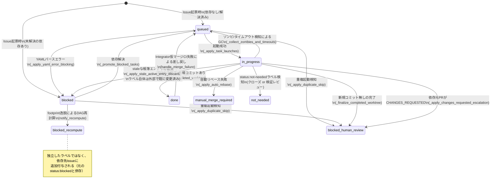

# status:* ラベルのライフサイクル

Orchestuneは、各サブタスクの進行状況をGitHub Issueの`status:*`ラベルとして
Source of Truthに保持します（[アーキテクチャ](./architecture.md)の「自己修復」で
述べた通り、`run_state.json`が消失してもこのラベルとオープンなPRから状態を
再構築できます）。本ドキュメントでは、9種類の`status:*`ラベルそれぞれが
「いつ・どのコードによって・どんな条件で」付与・解除・遷移されるかを一覧します。

対象ラベルとその定義は`orchestune/forge.py`の`REQUIRED_LABELS`（`orchestune
bootstrap`実行時にGitHub上へ自動作成される）を正としています。

## ラベル一覧

| ラベル | 意味 |
|---|---|
| `status:queued` | ディスパッチャーによる起動待ち |
| `status:blocked` | 未解決の依存関係により起動不可 |
| `status:in-progress` | エージェントが起動され作業中 |
| `status:done` | サブタスクの作業が完了 |
| `status:not-needed` | 対応不要と判定された（既にmainに実装済み等） |
| `status:blocked-human-review` | 人間の確認待ちで一時停止 |
| `status:blocked-recompute` | footprint逸脱によるDAG再計算の影響でブロック |
| `status:force-serial` | DAG再計算のリトライ上限超過により強制直列化 |
| `status:manual-merge-required` | 自動リベース失敗により手動マージが必要 |

## 状態遷移図

`status:external-lock`は上記のライフサイクルと独立して、任意のタイミングで
付与・解除される横断的な状態です（下記「外部ロック」参照）。

## 各遷移の詳細

### 1. 初期付与: `status:queued` / `status:blocked`
- 発生元: `skills/orchestune-dispatch/SKILL.md`（Issue起票時、`gh issue create`）
- 条件: 依存関係（`depends_on`）が未解決の先行タスクを持つ場合は`status:blocked`、
  依存が無い/全て解決済みの場合は`status:queued`。

### 2. `status:blocked` → `status:queued`（依存解決による昇格）
- 発生元: `orchestune/dispatch_cycle.py`の`_promote_blocked_tasks`
  （`_decide_blocked_promotions`/`_apply_blocked_promotions`）
- 条件: `depends_on`の全てが`status:done`または`status:not-needed`の
  Issueで解決済みになった場合（このサイクルで新規に完了したタスクも
  `completed_subtask_ids`として加味される）。

### 3. `status:queued` / `status:blocked` → `status:in-progress`（起動）
- 発生元: `orchestune/dispatch_launch.py`の`_apply_task_launches`
- 条件: クオータに空きがあり選出され、`create_worktree_and_launch`
  （worktree作成・エージェント起動）が成功した場合。

### 4. `status:in-progress` → `status:done`（完了）
- 発生元: `orchestune/dispatch_gc.py`の`_finalize_completed_worktree`
- 条件: エージェントプロセスが終了し、worktreeに未コミットの変更が無く、
  かつbase_branchに対して実コミットが1件以上ある場合。

### 5. `status:in-progress` → `status:blocked-human-review`（空コミット完了）
- 発生元: `orchestune/dispatch_gc.py`の`_finalize_completed_worktree`
- 条件: プロセスは終了しworktreeもcleanだが、base_branchに対する新規コミットが
  0件の場合（権限拒否等で実際には何も作業されなかった可能性があるため、
  自動的な完了・依存タスク昇格を見送る）。

### 6. `status:in-progress` → `status:blocked-human-review`（重複起動検知）
- 発生元: `orchestune/dispatch_launch.py`の`_apply_duplicate_skip`
- 条件: 起動候補のブランチに対応する既存のオープンPRが検出され、そのPRが
  過去の完了履歴と異なるコミットへ更新されている（人間が介入した可能性が
  高い）場合。`status:queued`/`status:blocked`からも同様に遷移し得る。

### 7. `status:in-progress` → `status:blocked-human-review`（CHANGES_REQUESTED）
- 発生元: `orchestune/dispatch_cycle.py`の`_apply_changes_requested_escalation`
- 条件: 依存元PRがGitHub上でCHANGES_REQUESTEDを受けた場合、スタックされた
  タスクを一時停止する。

> **注記（#109）**: 上記3つの遷移（5〜7）は、いずれも
> `orchestune/dispatch_escalation.py`の`apply_human_review_escalation`
> （現在のstatus:*ラベルを除去→`status:blocked-human-review`付与→理由コメント、
> という共通処理）へ実装を集約している。各呼び出し元（`_finalize_completed_worktree`
> /`_apply_duplicate_skip`/`_apply_changes_requested_escalation`）は、どの理由で
> エスカレーションするかを判断し、この共通関数を呼ぶだけの薄い層になっている。

### 8. `status:in-progress` → `status:manual-merge-required`（自動リベース失敗）
- 発生元: `orchestune/dispatch_rebase.py`の`_apply_auto_rebase`
- 条件: 依存先PRのCI通過を検知し自動リベースを試みたが、コンフリクトまたは
  リベース後のローカルCI失敗が発生した場合。

### 9. `status:in-progress` → `status:queued`（GC回収）
- 発生元: `orchestune/dispatch_gc.py`の`_collect_zombies_and_timeouts`
- 条件: プロセス消失かつ未コミット変更あり（ゾンビ）、またはタイムアウト
  超過の場合。未コミット変更はWIPコミットとして退避した上で再キューイングする。

### 10. `status:in-progress` → クローズ or `not-needed-review:*`待ち
- 発生元: `orchestune/dispatch_gc.py`の`_finalize_not_needed_worktree`
- 条件: セッションが`status:not-needed`ラベルを付与した場合。クラウド
  ルーチンが利用可能なら即座にクローズせず独立検証レビューを起動し
  （`orchestune/integration_coordinator.py`）、レビュー結果に応じて後続
  サイクルでクローズする。ローカル環境では従来通り即座にクローズする。

### 11. `status:done` → `status:queued`（仮マージCI失敗によるロールバック）
- 発生元: `orchestune/integrator_pr.py`の`handle_merge_failure`
- 条件: Integratorによる仮マージ後のローカルCIが失敗した場合、マージを
  取り消しタスクを差し戻す。

### 12. footprint逸脱によるDAG再計算（`status:blocked-recompute` / `status:force-serial`）
- 発生元: `orchestune/dispatch_rebase.py`の`_apply_footprint_deviation_outcome`
  （`notify_recompute`/`notify_force_serial`）
- 条件: active worktreeの実際の変更ファイルが宣言済み`footprint`から逸脱した
  場合、DAG再計算を行い、競合が検出された依存先Issueに`status:blocked-recompute`
  を付与する。再計算のリトライが上限（`max_recompute_retries`）に達した場合は、
  そのタスク自身に`status:force-serial`を付与し、以降のサイクルでは新規タスクの
  クオータを0にして単独直列実行にフォールバックする
  （[#92](https://github.com/Saltmu/orchestune/issues/92)で、無関係なタスクの
  起動まで妨げる点が課題として指摘されている）。

### 13. 外部ロック（`status:external-lock`）
- 発生元: `orchestune/dispatch_cycle.py`の`_apply_external_lock_sync`
  （判定は`orchestune/dispatch_locks.py`の`scan_external_locks`）
- 付与条件: タスクのfootprintが、Orchestune管理外のリモートブランチ・PRの
  変更ファイルと重なる場合（`status:done`のタスクは対象外）。
- 解除条件: 重なりが解消された場合。`status:done`に到達したタスクが
  まだロック中だった場合も解除する。解除時、`status:done`でなければ
  `status:queued`へ戻す。
- 他のライフサイクルとは独立に、任意のタイミングで付与・解除され得る
  横断的な状態。

## 関連ラベル（`status:*`ではないが密接に関わるもの）

- `not-needed-review:passed` / `not-needed-review:failed`:
  `status:not-needed`の独立検証レビュー結果（`orchestune/integration_coordinator.py`）。
  検証済みIssueのクローズ判定にのみ使われ、`status:*`の状態遷移には含まれない。
- `priority:high` / `priority:medium` / `priority:low`:
  起動順序の優先度付けに使われるが、ライフサイクル遷移には関与しない。
- `risk:flagged` / `progress:partial`:
  可視化目的のラベルであり、追加の承認ゲートとしては機能しない
  （[アーキテクチャ](./architecture.md#4-人間の承認ポイント)参照）。
