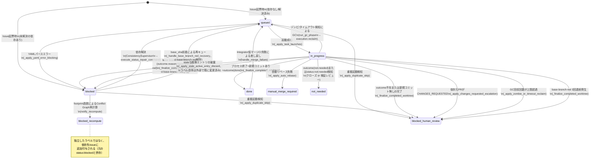

# status:* ラベルのライフサイクル

Orchestuneは、各サブタスクの進行状況をGitHub Issueの`status:*`ラベルとして
Source of Truthに保持します（[アーキテクチャ](./architecture.md)の「自己修復」で
述べた通り、`run_state.json`が消失してもこのラベルとオープンなPRから状態を
再構築できます）。本ドキュメントでは、10種類の`status:*`ラベルそれぞれが
「いつ・どのコードによって・どんな条件で」付与・解除・遷移されるかを一覧します。

対象ラベルとその定義は`orchestune/labels.py`の`StatusLabel`および`orchestune/forge/admin.py`の`REQUIRED_LABELS`（`orchestune bootstrap`実行時にGitHub上へ自動作成）を正としています。

## ラベル一覧

| ラベル | 意味 |
|---|---|
| `status:queued` | ディスパッチャーによる起動待ち |
| `status:blocked` | 未解決の依存関係により起動不可 |
| `status:in-progress` | エージェントが起動され作業中 |
| `status:done` | サブタスクの作業が完了 |
| `status:not-needed` | 対応不要と判定された（既にmainに実装済み等） |
| `status:blocked-human-review` | 人間の確認待ちで一時停止 |
| `status:blocked-recompute` | footprint逸脱によるConflict Graph再計算の影響でブロック |
| `status:force-serial` | Conflict Graph再計算のリトライ上限超過により強制直列化 |
| `status:manual-merge-required` | 自動リベース失敗により手動マージが必要 |

## 状態遷移図

```mermaid
stateDiagram-v2
    [*] --> queued: Issue起票時\n(依存なし/解決済み)
    [*] --> blocked: Issue起票時\n(未解決の依存あり)

    blocked --> queued: 依存解決\n(ConsistencySupervisor\n→ execute_status_repair_command)
    blocked --> blocked_recompute: footprint逸脱によるConflict Graph再計算\n(notify_recompute)

    queued --> in_progress: 起動成功\n(_apply_task_launches)
    queued --> blocked: YAMLパースエラー\n(_apply_yaml_error_blocking)
    queued --> blocked_human_review: 重複起動検知\n(_apply_duplicate_skip)
    blocked --> blocked_human_review: 重複起動検知\n(_apply_duplicate_skip)

    in_progress --> done: プロセス終了+新規コミットあり+outcome(done)\n(_finalize_completed_worktree)
    in_progress --> blocked_human_review: outcome不在または新規コミット無しの完了\n(_finalize_completed_worktree)
    in_progress --> blocked_human_review: 依存元PRがCHANGES_REQUESTED\n(_apply_changes_requested_escalation)
    in_progress --> manual_merge_required: 自動リベース失敗\n(_apply_auto_rebase)
    in_progress --> queued: ゾンビ/タイムアウト検知によるGC\n(run_gc_phase\n→ execution.reclaim)
    in_progress --> blocked_human_review: GC回収回数が上限超過\n(_apply_zombie_or_timeout_reclaim)
    in_progress --> not_needed: outcome(not-needed)またはstatus:not-needed検知\n(クローズ or 検証レビュー)
    in_progress --> blocked: base branch red検知 (outcome.reason=base-branch-red)\n(_finalize_completed_worktree、ci:base-branch-red付与)
    blocked --> queued: base_sha前進による再キュー\n(_handle_base_branch_red_recovery、ci:base-branch-red解除)
    in_progress --> blocked_human_review: base-branch-red 3回連続発生\n(_finalize_completed_worktree)
    in_progress --> blocked: staleな帳簿エントリの破棄\n(_apply_stale_active_entry_discard、\nラベル自体は外部で既に変更済み)

    done --> queued: Integrator仮マージCI失敗による差し戻し\n(handle_merge_failure)

    note right of blocked_recompute
        独立したラベルではなく、依存先Issueに
        追加付与される（元のstatus:blockedと併存）
    end note
```

`status:external-lock`は上記のライフサイクルと独立して、任意のタイミングで
付与・解除される横断的な状態です（下記「外部ロック」参照）。

## 各遷移の詳細

### 1. 初期付与: `status:queued` / `status:blocked`
- 発生元: `skills/orchestune-provision/SKILL.md`（Issue起票時、`gh issue create` / `orchestune provision`）
- 条件: 依存関係（`depends_on`）が未解決の先行タスクを持つ場合は`status:blocked`、
  依存が無い/全て解決済みの場合は`status:queued`。
- **actor権限検証（#119）**: `status:queued`が起動候補として実際に採用されるには、
  そのラベルを付与したユーザーのリポジトリ権限がtriage以上である必要がある
  （`orchestune/dispatch/actor_verification.py`）。権限不足の場合は自動起動を
  スキップし、`status:blocked-human-review`へ遷移させる（Issue作成時に付与された
  ラベルは`labeled`イベントを残さないため、付与者が特定できない場合はIssue
  作成者を実質的な付与者とみなす）。`status:blocked`からのスタッキング起動
  （セクション「3. 起動」参照）はこの検証の対象外。

### 2. `status:blocked` → `status:queued`（依存解決による昇格）
- 発生元: `orchestune/dispatch/cycle.py`のリポジトリ全体を対象とする
  `ConsistencySupervisor`境界。型付き`status.transition-label`コマンドを計画し、
  `orchestune/dispatch/status_repair.py`の`execute_status_repair_command`を通じて適用する。
- 条件: `depends_on`の全てが`status:done`または`status:not-needed`の
  Issueで解決済みになった場合（このサイクルで新規に完了したタスクも
  `completed_subtask_ids`として加味される）。

### 3. `status:queued` / `status:blocked` → `status:in-progress`（起動）
- 発生元: `orchestune/dispatch/launch.py`の`_apply_task_launches`
- 条件: クオータに空きがあり選出され、`create_worktree_and_launch`
  （worktree作成・エージェント起動）が成功した場合。

### 4. `status:in-progress` → `status:done`（完了）
- 発生元: `orchestune/dispatch/gc/__init__.py`の`_finalize_completed_worktree`
- 条件: エージェントプロセスが終了し、worktreeに未コミットの変更が無く、
  base_branchに対して実コミットが1件以上あり、かつ完了宣言レコード
  （`orchestune:outcome`、`result: done`）がPRまたはIssueコメントから
  確認できた場合。

### 5. `status:in-progress` → `status:blocked-human-review`（空コミット完了またはoutcome不在）
- 発生元: `orchestune/dispatch/gc/__init__.py`の`_finalize_completed_worktree`
- 条件: プロセスは終了しworktreeもcleanだが、base_branchに対する新規コミットが
  0件の場合（空コミット完了、権限拒否等で実際には何も作業されなかった可能性があるため）、
  または新規コミットが存在しても完了宣言レコード（`orchestune:outcome`）が
  検出できない場合（outcome不在終了、レビューサイクル未完了や作業途中終了の可能性があるため）。
  いずれの場合も自動的な完了・依存タスク昇格を見送り、`status:blocked-human-review`へ
  フェイルクローズに倒す。

### 6. `status:in-progress` → `status:blocked-human-review`（重複起動検知）
- 発生元: `orchestune/dispatch/launch.py`の`_apply_duplicate_skip`
- 条件: 起動候補のブランチに対応する既存のオープンPRが検出され、そのPRが
  過去の完了履歴と異なるコミットへ更新されている（人間が介入した可能性が
  高い）場合。`status:queued`/`status:blocked`からも同様に遷移し得る。

### 7. `status:in-progress` → `status:blocked-human-review`（CHANGES_REQUESTED）
- 発生元: `orchestune/dispatch/cycle.py`の`_apply_changes_requested_escalation`
- 条件: 依存元PRがGitHub上でCHANGES_REQUESTEDを受けた場合、スタックされた
  タスクを一時停止する。

> **注記（#109）**: 上記3つの遷移（5〜7）は、いずれも
> `orchestune/dispatch/escalation.py`の`apply_human_review_escalation`
> （現在のstatus:*ラベルを除去→`status:blocked-human-review`付与→理由コメント、
> という共通処理）へ実装を集約している。各呼び出し元（`_finalize_completed_worktree`
> /`_apply_duplicate_skip`/`_apply_changes_requested_escalation`）は、どの理由で
> エスカレーションするかを判断し、この共通関数を呼ぶだけの薄い層になっている。

### 8. `status:in-progress` → `status:manual-merge-required`（自動リベース失敗）
- 発生元: `orchestune/dispatch/rebase.py`の`_apply_auto_rebase`
- 条件: 依存先PRのCI通過を検知し自動リベースを試みたが、コンフリクトまたは
  リベース後のローカルCI失敗が発生した場合。

### 9. `status:in-progress` → `status:queued`（GC回収）
- 発生元: `orchestune/dispatch/phase_gc.py`の`run_gc_phase`。型付き
  `execution.reclaim`コマンドを計画し、`orchestune/dispatch/gc/zombies.py`の
  `execute_reclaim_repair_command`を通じて適用する。
- 条件: プロセス消失かつ未コミット変更あり（ゾンビ）、またはタイムアウト
  超過の場合。未コミット変更はWIPコミットとして退避した上で再キューイングする。
- 回数上限（[#512](https://github.com/Saltmu/orchestune/issues/512)）: 同一タスクを
  差し戻せるのは`max_task_reclaims`回（`--max-task-reclaims`、既定3回）まで。
  超過した場合は下記9-bへ遷移する。回数は`run_state.json`の`task_reclaim_counts`
  台帳へ、ラベル遷移より先に永続化される（ラベルだけ先に`status:queued`へ戻して
  保存前に停止すると、回数が数えられないまま再起動できてしまうため）。
  台帳の記録は、ディスパッチサイクルがGitHub上で**Issueのクローズを確認した
  時点**で破棄する（`dispatch.cycle_context.discard_reclaim_counts_for_closed_issues`）。
  `status:done`（ワーカーの完了）や`status:not-needed`の独立検証レビューへの
  送り出しでは破棄しない——前者はIntegratorの仮マージCI失敗で、後者はレビュー
  不合格で、それぞれ`status:queued`へ差し戻され得るため。クローズ済みのIssueが
  自動で再起動されることはなく、この判定は毎サイクルGitHubから導出し直すため、
  破棄の即時永続化は不要。なお、クローズ後にディスパッチサイクルが一度もその状態を
  観測しないまま再オープンされた場合は、直前の回数がそのまま引き継がれる
  （再オープンしたタスクは新規のタスクより早く人間の確認へ回り得る。回数が多い側＝
  ループせずに早く停止する方向の誤差）。

### 9-b. `status:in-progress` → `status:blocked-human-review`（GC回収の上限超過）
- 発生元: `orchestune/dispatch/gc/zombies.py`の`_apply_zombie_or_timeout_reclaim`
- 条件: ゾンビ／タイムアウト回収による再投入の累計回数が`max_task_reclaims`を
  超えた場合。`status:queued`への差し戻しを打ち切り、回収回数と最終理由を
  コメントした上で人間の確認待ちで停止する（構造的に必ずタイムアウトする
  タスクが無限に再起動され続けるのを防ぐため）。
  遷移自体は5〜7と同じ`apply_human_review_escalation`へ集約している。
- GCがタスクを自力で片付けられないまま繰り返す次の2経路も、同じ上限で本遷移を行う。
  いずれも未コミットの作業データを保全するためworktreeは削除せずに残し、そのパスを
  コメントで示す。
  - WIPバックアップコミットの作成に失敗して回収自体をスキップし続けている場合
    （`_apply_backup_failure`）
  - 未コミット変更が残るため完了処理を保留し続けている場合
    （`_apply_dirty_worktree_hold`。#212で導入された保留）

### 10. `status:in-progress` → クローズ or `not-needed-review:*`待ち
- 発生元: `orchestune/dispatch/gc/__init__.py`の`_finalize_not_needed_worktree` / `_rule_not_needed`
- 条件: セッションが完了宣言レコード（`orchestune:outcome`、`result: not-needed`）を残したか、外部自動化等により`status:not-needed`ラベルが付与された場合（ワーカー自身による直接のラベル操作は禁止）。クラウド
  ルーチンが利用可能なら即座にクローズせず独立検証レビューを起動し
  （`orchestune/integration_coordinator.py`）、レビュー結果に応じて後続
  サイクルでクローズする。ローカル環境では従来通り即座にクローズする。

### 10-b. `status:in-progress` → `status:blocked` + `ci:base-branch-red`（ベースブランチ由来のCI失敗） / base_sha前進による再キュー（#555）
- 発生元: `orchestune/dispatch/gc/__init__.py`の`_finalize_completed_worktree`（保留）、`orchestune/dispatch/reconciliation.py`の`_handle_base_branch_red_recovery`（再キュー）
- 条件:
  - **保留**: エージェントが完了宣言レコード（`orchestune:outcome`、`result: blocked` / `reason: base-branch-red`）を残して終了した場合、`status:blocked`へ遷移させ、マーカーラベル`ci:base-branch-red`を付与して保留する。通常の依存解決による昇格（`_decide_blocked_promotions`）からは除外される。
  - **再キュー**: 対象ブランチのベースコミット（`base_sha`）の前進を検知した時点で`ci:base-branch-red`マーカーを除去し、依存関係が解決済みであれば`status:queued`へ戻す。
  - **エスカレーション**: 同一タスクで`base-branch-red`が3回連続（`attempt >= 3`）発生した場合は、自動再キューを打ち切り`apply_human_review_escalation`により`status:blocked-human-review`へエスカレーションする。

### 11. `status:done` → `status:queued`（仮マージCI失敗によるロールバック）
- 発生元: `orchestune/integrator/pr.py`の`handle_merge_failure`
- 条件: Integratorによる仮マージ後のローカルCIが失敗した場合、マージを
  取り消しタスクを差し戻す。

### 12. footprint逸脱によるConflict Graph再計算（`status:blocked-recompute` / `status:force-serial`）
- 発生元: `orchestune/dispatch/rebase.py`の`_apply_footprint_deviation_outcome`
  （`notify_recompute`/`notify_force_serial`）
- 条件: active worktreeの実際の変更ファイルが宣言済み`footprint`から逸脱した
  場合、Conflict Graph再計算を行い、競合が検出されたIssueに`status:blocked-recompute`
  を付与する。再計算のリトライが上限（`max_recompute_retries`）に達した場合は、
  そのタスク自身に`status:force-serial`を付与し、以降のサイクルでは新規タスクの
  クオータを0にして単独直列実行にフォールバックする
  （[#92](https://github.com/Saltmu/orchestune/issues/92)で、無関係なタスクの
  起動まで妨げる点が課題として指摘されている）。

### 13. 外部ロック（`status:external-lock`）
- 発生元: `orchestune/dispatch/cycle.py`の`_apply_external_lock_sync`
  （判定は`orchestune/dispatch/locks.py`の`scan_external_locks`）
- 付与条件: タスクのfootprintが、Orchestune管理外のリモートブランチ・PRの
  変更ファイルと重なる場合（`status:done`のタスクは対象外）。
  - ただし、タスク自身の直接の`depends_on`が指す依存元タスクのPR・ブランチとの
    重なりは対象外（[#796](https://github.com/Saltmu/orchestune/issues/796)）。
    スタッキング起動（`orchestune/dispatch/launch.py`の
    `_get_stack_eligible_tasks`）は依存元ブランチをbaseに積むため、
    その重なりは「Orchestune管理外の衝突」ではない。祖先依存（依存元の
    さらに依存元）までは遡らない。依存元のブランチ名・PRを既存の命名規約
    （`orchestune.branch_naming`）や`Closes`参照等から同定できない場合は、
    従来通り衝突として扱う（fail closed）。
- 解除条件: 重なりが解消された場合。`status:done`に到達したタスクが
  まだロック中だった場合も解除する。解除時、`status:done`でなければ
  `status:queued`へ戻す。
- 他のライフサイクルとは独立に、任意のタイミングで付与・解除され得る
  横断的な状態。

## Issueのクローズ（子Issue・親Issue）

上記の遷移は、いずれもオープンなIssue上での`status:*`ラベルの変化を扱っている。
本節では、通常完了した（`status:not-needed`ではない）サブタスクについて、
Orchestuneが実際にIssueをクローズする2箇所を説明する。いずれも
[#170](https://github.com/Saltmu/orchestune/issues/170)で追加されたもので、
ディスパッチャーが`--parent-issue <N>`付きで実行されていることが前提となる
（[統合パイプライン (architecture/integration.md)](./architecture/integration.md)参照）。

### 子Issue: `status:done`（オープン） → クローズ（`completed`）
- 発生元: `orchestune/integrator/`の`AutoMergeChildIntegrationStep`
- 条件: 子ブランチの統合PR（一時ブランチ → `parent/issue-{N}`）がCIを
  通過し、Integratorによって自動マージされた場合。マージ直後、人間を
  介さず`reason=completed`で子Issueをクローズする。自動マージ自体が
  失敗した場合（一時ブランチのCIでは検出できなかったコンフリクト等）は、
  PRはオープンのまま残り、Issueは**クローズされない**。
- ディスパッチャーが`--parent-issue`無しで実行された場合は適用されない:
  そのフラット（単層）モードでは統合PRは引き続き`main`を直接の対象とし、
  「最終マージは常に人間が行う」という原則により、
  `AutoMergeChildIntegrationStep`は何もしない。

### 親Issue: オープン → クローズ（`completed`）
- 発生元: `orchestune/integrator/parent_completion.py`の`process_parent_completion`。
  `--parent-issue`指定時、apply モードの各ディスパッチサイクルで1回呼ばれる。
- 条件: `parent/issue-{N}`が`main`へマージされたこと
  （`github.is_branch_merged_into`で確認）——すなわち、親Issue配下の
  全子Issueがクローズされた時点で`ensure_parent_final_pr`
  （`orchestune/integrator/pr.py`）が作成した最終PRを、人間がマージした
  ことを意味する。親Issueは`reason=completed`でクローズされる。既に
  クローズ済みの親Issueは（`github.get_issue_state`で確認の上）そのまま
  にし、二重のクローズ呼び出しを避ける。
- クローズ責務の単一所有者（#699）: 最終PR本文は親Issueへの非closing参照
  `Parent issue: #{N}`を保持するが、GitHubがマージ時に親Issueを自動クローズする
  closing keywordは含めない。したがって、親Issueをクローズできるのは上記の
  `process_parent_completion`だけである。openな子Issueがある場合は、古い最終PRが
  マージ済みでも親Issueをクローズしない。旧版が作成したオープン最終PRの先頭
  `Closes #{N}`も、この非closing参照へ移行する。
- 本文には併せて、子Issue番号・タイトル・マージ済みサブタスクPR番号・
  レビュー結果（Outcome Record優先、無ければPRの`reviewDecision`）の一覧
  テーブルが自動生成される。最終レビュアーが各サブタスクの変更とAIレビュー
  結果を辿るための導線であり、収集に失敗した場合はテーブルのみ省略して
  最終PRの確保自体は継続する。

## 関連ラベル（`status:*`ではないが密接に関わるもの）

- `not-needed-review:passed` / `not-needed-review:failed`:
  `status:not-needed`の独立検証レビュー結果（`orchestune/integrator/coordinator.py`）。
  検証済みIssueのクローズ判定にのみ使われ、`status:*`の状態遷移には含まれない。
- `integration:included`:
  Integrator（`orchestune/integrator/`）が、統合ブランチへのforce pushおよび
  統合PRの確保（新規作成または既存PRの再利用）に成功した時点で付与する記帳用
  ラベル。`status:done`は変更しない（依存解決判定・外部ロック解除条件・monitor
  表示など他サブシステムが引き続き`status:done`を参照するため）。統合ブランチは
  `base_branch`の前進に追従するため毎回ベースから再構築され、既に本ラベルを持つ
  タスクもre-merge対象からは除外されない（除外すると再構築のたびに統合ブランチ
  からその変更が消えてしまう）。本ラベルは、Integrator実行結果のうち「今回新たに
  含めたタスク」（`newly_included`）と「既に統合済みのタスク」を区別するための
  シグナルとしてのみ使われる。
- `integration:parent-branch-stale`:
  Integratorが親branchへのpushでnon-fast-forward（CAS）拒否を検知した際に
  親Issueへ付与するマーカーラベル（`orchestune/integrator/steps.py`）。
  ローカルのstate fileではなくGitHub上のラベルとして持たせることで、GitHub
  Actionsのスケジュール実行のようにサイクルごとに異なるランナーが使われる
  構成でも判定が失われない（#437）。次サイクルで押下pushが成功すれば除去される。
  既に本ラベルが付いた状態でさらに陳腐化を検知した場合（＝2サイクル連続）は、
  設定または運用構成の異常の可能性が高いとみなし、対象の子Issueを
  `status:blocked-human-review`へエスカレーションしたうえで本ラベルを除去する。
- `ci:base-branch-red`:
  ベースブランチ由来のCI失敗（`outcome.result=blocked` / `reason=base-branch-red`）を検知した際に付与されるマーカーラベル（#555）。通常の依存関係解決による誤昇格（livelock）を防ぎ、ベースブランチのコミット（`base_sha`）が前進した時点でマーカーが解除され`status:queued`へ自動再キューされる。3回連続で失敗した場合は`status:blocked-human-review`へエスカレーションされる。
- `priority:high` / `priority:medium` / `priority:low`:
  起動順序の優先度付けに使われるが、ライフサイクル遷移には関与しない。
- `risk:flagged` / `progress:partial`:
  可視化目的のラベルであり、追加の承認ゲートとしては機能しない
  （[アーキテクチャ §0.2](./architecture.md#02-人間の承認ポイント)参照）。
